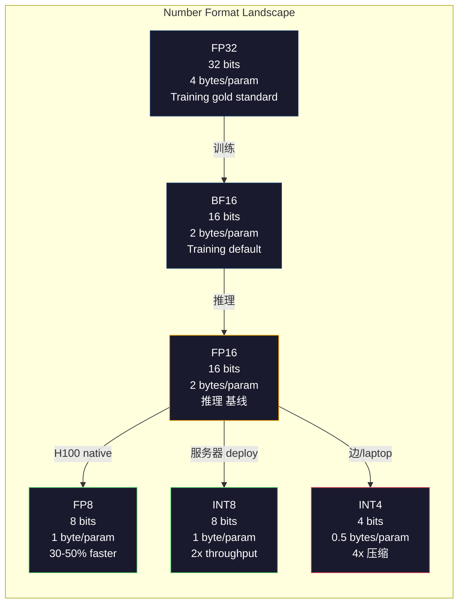
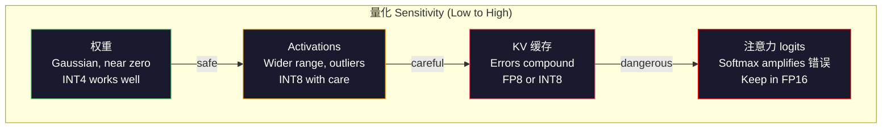
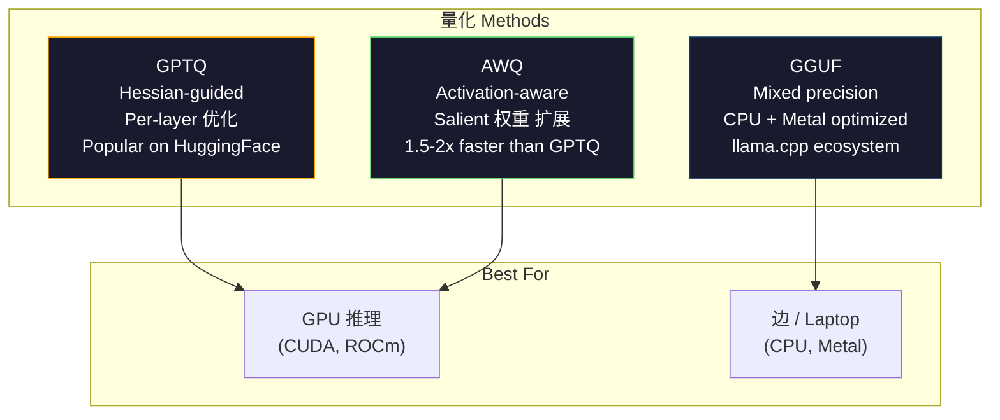

# 量化: Making 模型 Fit

> 一个70B 模型 in FP16 needs 140GB. Two A100s just for 权重. Quantize to FP8: one 80GB GPU. INT4: a MacBook.

**类型：** Build
**语言：** Python (with numpy)
**先修：** Phase 10, Lessons 01-10 (LLMs from Scratch)
**时间：** 约 120 分钟

## 学习目标

- Implement symmetric and asymmetric 量化 from FP16 to INT8 and INT4, including per-tensor and per-channel 扩展
- Calculate the 内存 savings from 量化 and determine which precision fits a given GPU's VRAM
- 解释the difference between post-training 量化 (PTQ) and 量化-aware 训练 (QAT)
- Apply GPTQ or AWQ to quantize a 真实 模型 and measure the accuracy-memory tradeoff on a 基准

## 问题

Llama 3 70B has 70 billion 参数. Each 参数 is a 16-bit floating point number. That is 140 billion bytes. 140GB. A single A100 has 80GB of VRAM. You cannot even load the 权重, let alone run 推理, on a single GPU. You need two A100s at $2/hour each just to serve one 模型.

But 16 bits per 参数 is wasteful. Most 权重 in a neural network cluster near zero. The full dynamic range of FP16 (from 0.000000059 to 65,504) is almost entirely unused. If you measure the actual 分布 of 权重 in Llama 3 70B, 95% of them fall between -0.1 and +0.1. You are burning 16 bits to represent values that could fit in 4.

量化 replaces high-precision numbers with lower-precision ones. FP16 to FP8 cuts 内存 in half. FP16 to INT4 cuts it to a quarter. That 140GB 模型 becomes 35GB. It fits on a single consumer GPU. Push to 2-bit 量化 (aggressive, lossy, but usable for some tasks) and the same 模型 runs on a 16GB laptop.

这个成本 is accuracy. Every bit you remove destroys information. The 问题 is how much accuracy you lose and where. A well-quantized INT4 模型 retains 95-99% of the original's 质量 on most benchmarks. A naive 量化 to INT4 can destroy the 模型 entirely. The difference is technique.

Community 量化s of Llama 3 to INT4 with GPTQ show roughly 1-2 perplexity points lost on WikiText. Mistral released FP8 checkpoints of Mixtral 8x22B with zero measurable 质量 损失 on MMLU. The GGUF format powers llama.cpp, running 70B 模型 on MacBooks with M-series chips. 量化 is not a hack. It is the standard deployment path for every 模型 larger than 7B.

## 概念

### Number Formats: What Each Bit Does

每个floating-point number has three parts: sign, exponent, and mantissa (also called significand). The sign is one bit. The exponent determines the range (how large or small the number can be). The mantissa determines the precision (how many decimal places you get).

```text
FP32:  [1 sign] [8 exponent] [23 mantissa]  = 32 bits
FP16:  [1 sign] [5 exponent] [10 mantissa]  = 16 bits
BF16:  [1 sign] [8 exponent] [7  mantissa]  = 16 bits
FP8:   [1 sign] [4 exponent] [3  mantissa]  = 8  bits (E4M3)
FP8:   [1 sign] [5 exponent] [2  mantissa]  = 8  bits (E5M2)
INT8:  [1 sign] [7 value]                   = 8  bits (uniform steps)
INT4:  [1 sign] [3 value]                   = 4  bits (16 levels total)
```

**FP32** is full precision. 23 mantissa bits give you about 7 decimal digits of precision. Range: roughly 1.2 x 10^-38 to 3.4 x 10^38. 训练 used to happen exclusively in FP32. It still does for accumulation (running sums during matrix multiplication).

**FP16** halves the bits. 10 mantissa bits give about 3.3 decimal digits. The exponent shrinks to 5 bits, reducing the range dramatically (max value ~65,504). This is fine for 权重 (which cluster near zero) but dangerous for activations and gradients that can spike during 训练. FP16 训练 requires 损失 扩展 to prevent underflow.

**BF16** (Brain Float 16) keeps the 8-bit exponent from FP32 but shrinks the mantissa to 7 bits. Same range as FP32, less precision than FP16. Google designed it specifically for deep 学习. The intuition: range matters more than precision for neural networks. A 梯度 of 10^-20 that underflows to zero in FP16 survives in BF16. A 权重 of 0.07342 that rounds to 0.0734 in BF16 is close enough. Every modern 训练 run uses BF16 or a BF16/FP32 mix.

**FP8** comes in two flavors. E4M3 (4 exponent, 3 mantissa) is used for 权重 and activations during 推理. E5M2 (5 exponent, 2 mantissa) is used for gradients during 训练 where range matters more than precision. FP8 推理 on H100 GPUs achieves 30-50% speedup over FP16 with negligible 质量 损失.

**INT8** is an integer format. No exponent, no mantissa. Just 256 evenly spaced values from -128 to 127. You need a 规模 factor to map floating-point 权重 into this range. The advantage: integer arithmetic is faster and more power-efficient than floating-point. INT8 matrix multiplication on an A100 runs at 624 TOPS versus 312 TFLOPS for FP16.

**INT4** pushes further. Only 16 possible values. The 规模 factor does heavy lifting. 质量 depends entirely on how you choose the 规模 and which 权重 you quantize. State-of-the-art INT4 methods (GPTQ, AWQ) retain 95%+ of original 模型 质量.



### How 量化 Works

这个core operation is simple. Take a tensor of floating-point values, find a 规模 factor, multiply, round to the nearest integer, and store the integers plus the 规模 factor.

**Quantize:**
```text
scale = max(abs(tensor)) / max_int_value
quantized = round(tensor / scale)
```

**Dequantize:**
```text
reconstructed = quantized * scale
```

For INT8 with a symmetric range (-127 to 127):
```text
scale = max(abs(tensor)) / 127
quantized = clamp(round(tensor / scale), -128, 127)
```

这个错误 is the rounding 错误. Each value can be off by at most `scale / 2`. The total 错误 across a 层 depends on how many 权重 you have and how sensitive the 模型 is to perturbations in those 权重.

**Per-tensor vs per-channel 量化.** Per-tensor uses one 规模 factor for the entire 权重 matrix. Simple but lossy: if one column has large values and another has small values, the small values lose most of their precision. Per-channel uses one 规模 factor per 输出 channel (per row or column of the 权重 matrix). More overhead (you store N 规模 factors instead of 1) but dramatically better 质量. Every 生产 量化 method uses per-channel or finer granularity.

**Asymmetric 量化** adds a zero-point offset: `quantized = round(tensor / scale) + zero_point`. This handles distributions that are not centered at zero. ReLU activations, for example, are always non-negative. Symmetric 量化 wastes half the integer range on negative values that never appear. Asymmetric 量化 maps the actual range [min, max] to the full integer range.

### Sensitivity Hierarchy

Not everything in a 模型 tolerates 量化 equally. There is a clear hierarchy.

**权重 (most robust).** 模型 权重 change slowly during 训练 and follow a roughly Gaussian 分布 centered near zero. They quantize well. INT8 权重 with per-channel scales produce nearly lossless results. INT4 requires more sophisticated methods but works.

**Activations (moderate sensitivity).** Activations are the intermediate values flowing through the network during 推理. They have wider dynamic range than 权重 and contain outliers. A single 注意力 头 might produce 激活 values 100x larger than the mean. These outliers are critical for 模型 质量. Quantizing them naively destroys information. Solutions: keep outlier channels in higher precision (LLM.int8()), use per-token or per-channel 激活 scales.

**KV 缓存 (high sensitivity).** The key-value 缓存 stores 注意力 states for all previous 词元. At long 上下文 lengths, the KV 缓存 dominates 内存. For a 70B 模型 at 32K 上下文, the KV 缓存 alone is 40GB in FP16. Quantizing the KV 缓存 to FP8 or INT8 saves massive 内存 but any 错误 compounds across all future 注意力 computations. The 质量 impact scales with 序列 length.

**注意力 logits (most sensitive).** The softmax in 注意力 is highly sensitive to small changes in its inputs. A 量化 错误 of 0.01 in a pre-softmax logit can shift the 注意力 分布 meaningfully. Most 量化 schemes keep 注意力 computation in higher precision (FP16 or BF16) even when everything else is 量化的.



### PTQ vs QAT

**Post-Training 量化 (PTQ)** quantizes an already-trained 模型. No retraining. You take the FP16 权重, 计算 规模 factors, round, and deploy. Fast (分钟 to 小时) and cheap. Works well for INT8 and FP8. For INT4, naive PTQ often fails badly because rounding 错误 accumulate. Advanced PTQ methods (GPTQ, AWQ) use calibration 数据 to minimize the 量化 错误.

**量化-Aware 训练 (QAT)** inserts 伪造 量化 operations into the forward pass during 训练. The 模型 learns to place its 权重 where rounding 错误 are small. Gradients 流 through the 伪造 量化 using the straight-through estimator (STE): pretend the rounding operation has 梯度 1. QAT produces better INT4 and INT2 模型 than PTQ but requires a full 训练 run. Google used QAT for Gemini's efficient serving. Meta used QAT for some Llama deployment 目标.

|Aspect|PTQ|QAT|
|--------|-----|-----|
|成本|分钟 to 小时|Full 训练 run|
|质量 at INT8|Excellent (< 0.1% 损失)|Excellent|
|质量 at INT4|Good with GPTQ/AWQ (1-3% 损失)|Better (< 1% 损失)|
|质量 at INT2|Poor|Usable for some tasks|
|Calibration 数据|128-1024 examples|Full 训练 数据集|
|When to use|Deployment, iteration|Maximum 质量 at low bit-width|

### GPTQ, AWQ, GGUF

**GPTQ (GPT 量化)** is a one-shot PTQ method. It quantizes 权重 one 层 at a time, using a small calibration 数据集 (128 examples is typical) to measure the Hessian (second-order information about how sensitive the 输出 is to each 权重). 权重 that the Hessian says are important get 量化的 more carefully. GPTQ was the first method to make INT4 量化 practical for LLMs. The TheBloke on Hugging Face popularized GPTQ by releasing 量化的 versions of hundreds of 模型.

**AWQ (Activation-Aware 权重 量化)** observes that a small fraction of 权重 (about 1%) are disproportionately important because they multiply with large 激活 values. AWQ identifies these salient 权重 using calibration 数据 and scales them up before 量化 (then scales the corresponding activations down). This keeps the important 权重 in a range where INT4 量化 is accurate. AWQ typically matches or slightly beats GPTQ 质量 while being 1.5-2x faster to apply.

**GGUF (GPT-Generated Unified Format)** is the file format used by llama.cpp and its ecosystem. It supports mixed 量化: different 层 get different bit widths. The first and last 层 (嵌入 and 输出 头) are typically kept at higher precision. Middle 层 get INT4 or INT3. GGUF files are self-contained: 权重, 分词器, metadata all in one file. The format is designed for CPU 推理 and Apple Silicon, where loading the entire 模型 into 内存 and running matrix multiplications on the CPU or Metal GPU is the standard path. Q4_K_M is the most popular GGUF 量化 variant, balancing 质量 and size.



### 质量 Measurement

How do you know if your 量化的 模型 is still good?

**Perplexity.** The most common 指标. Lower is better. 计算 perplexity on a held-out 数据集 (WikiText-2 is standard) for both the original and 量化的 模型. The delta tells you how much information the 量化 destroyed. Rules of thumb: delta < 0.5 is excellent, 0.5-1.0 is good, 1.0-2.0 is acceptable for most tasks, > 2.0 means something went wrong.

**Task-specific benchmarks.** Run the 量化的 模型 on MMLU, HumanEval, GSM8K, or your custom 评估 suite. Compare against the original. 量化 affects different capabilities unevenly. Math and code tasks are more sensitive to precision 损失 than general knowledge.

**输出 comparison.** 生成 响应 from both 模型 on the same prompts and compare. LLM-as-judge (Lesson 10) works well here. 计算 a win 速率: what fraction of prompts does the 量化的 模型 match or beat the original on?

**延迟 and throughput.** 量化 exists to make 模型 faster and cheaper. Measure 词元 per second, time to first 词元, and 内存 usage. A 量化的 模型 that is slower than the original is worse than useless.

|模型|Format|Size|Perplexity (WikiText-2)|MMLU|词元/sec (A100)|
|-------|--------|------|------------------------|------|-------------------|
|Llama 3 70B|FP16|140GB|3.12|79.5%|38|
|Llama 3 70B|FP8|70GB|3.14|79.3%|55|
|Llama 3 70B|GPTQ INT4|35GB|4.32|77.8%|72|
|Llama 3 70B|AWQ INT4|35GB|4.18|78.1%|75|
|Llama 3 70B|GGUF Q4_K_M|40GB|4.25|77.9%|28 (CPU)|

这个pattern: FP8 is nearly free. INT4 成本 1-2 MMLU points but doubles throughput and quarters 内存. The tradeoff is worth it for almost every deployment.

### 真实 Numbers

FP16 to FP8 on H100: 30-50% 推理 speedup, < 0.1% 质量 损失. This is the no-brainer 量化. Every H100 deployment should use it.

FP16 to INT8 (LLM.int8()): 2x 内存 reduction, < 0.5% 质量 损失. The mixed-precision approach keeps outlier 特征s in FP16 while quantizing everything else to INT8.

FP16 to INT4 (GPTQ/AWQ): 4x 内存 reduction, 1-3% 质量 损失 depending on the 模型 and method. Enables 70B 模型 on a single 48GB GPU.

FP16 to INT4 (GGUF Q4_K_M): 3.5x 内存 reduction, 1-2% 质量 损失. Optimized for CPU 推理. A 70B 模型 at Q4_K_M is about 40GB and runs at 10-15 词元/second on an M3 Max with 64GB.

FP16 to INT2: 8x 内存 reduction, 5-15% 质量 损失. Only viable for specific narrow tasks where you can tolerate degradation. Research frontier, not production-ready for general use.

```figure
quantization
```

## 动手构建

### 步骤 1: Number Format Representations

构建the bit-level representation of each format to see exactly what sign, exponent, and mantissa do.

```python
import numpy as np


def float_to_fp32_bits(value):
    bits = np.float32(value).view(np.uint32)
    sign = (bits >> 31) & 1
    exponent = (bits >> 23) & 0xFF
    mantissa = bits & 0x7FFFFF
    return {"sign": int(sign), "exponent": int(exponent), "mantissa": int(mantissa),
            "exponent_bits": format(int(exponent), '08b'),
            "mantissa_bits": format(int(mantissa), '023b'),
            "value": float(value),
            "actual_exponent": int(exponent) - 127}


def float_to_fp16_bits(value):
    fp16 = np.float16(value)
    bits = fp16.view(np.uint16)
    sign = (bits >> 15) & 1
    exponent = (bits >> 10) & 0x1F
    mantissa = bits & 0x3FF
    return {"sign": int(sign), "exponent": int(exponent), "mantissa": int(mantissa),
            "exponent_bits": format(int(exponent), '05b'),
            "mantissa_bits": format(int(mantissa), '010b'),
            "value": float(fp16),
            "actual_exponent": int(exponent) - 15}


def float_to_bf16_bits(value):
    fp32_bits = np.float32(value).view(np.uint32)
    bf16_bits = (fp32_bits >> 16).astype(np.uint16)
    sign = (bf16_bits >> 15) & 1
    exponent = (bf16_bits >> 7) & 0xFF
    mantissa = bf16_bits & 0x7F
    reconstructed = np.uint32(bf16_bits.astype(np.uint32) << 16).view(np.float32)
    return {"sign": int(sign), "exponent": int(exponent), "mantissa": int(mantissa),
            "exponent_bits": format(int(exponent), '08b'),
            "mantissa_bits": format(int(mantissa), '07b'),
            "value": float(reconstructed),
            "actual_exponent": int(exponent) - 127}


def simulate_fp8_e4m3(value):
    sign = 1 if value < 0 else 0
    abs_val = abs(value)
    max_val = 448.0
    abs_val = min(abs_val, max_val)
    if abs_val == 0:
        return {"sign": sign, "exponent": 0, "mantissa": 0, "value": 0.0,
                "exponent_bits": "0000", "mantissa_bits": "000"}
    exp = int(np.floor(np.log2(abs_val)))
    exp = max(-6, min(8, exp))
    mantissa_val = abs_val / (2.0 ** exp) - 1.0
    mantissa_quant = round(mantissa_val * 8) / 8
    mantissa_quant = max(0, min(0.875, mantissa_quant))
    reconstructed = (1.0 + mantissa_quant) * (2.0 ** exp)
    if sign:
        reconstructed = -reconstructed
    mantissa_int = int(round(mantissa_quant * 8))
    return {"sign": sign, "exponent": exp + 7, "mantissa": mantissa_int,
            "exponent_bits": format(exp + 7, '04b'),
            "mantissa_bits": format(mantissa_int, '03b'),
            "value": float(reconstructed),
            "actual_exponent": exp}


def display_format_comparison(value):
    fp32 = float_to_fp32_bits(value)
    fp16 = float_to_fp16_bits(value)
    bf16 = float_to_bf16_bits(value)
    fp8 = simulate_fp8_e4m3(value)

    print(f"\n  Value: {value}")
    print(f"  {'Format':<8} {'Stored Value':>14} {'Error':>12} {'Sign':>5} {'Exp Bits':>10} {'Man Bits':>25}")
    print(f"  {'-'*76}")
    print(f"  {'FP32':<8} {fp32['value']:>14.6f} {abs(fp32['value'] - value):>12.8f} {fp32['sign']:>5} {fp32['exponent_bits']:>10} {fp32['mantissa_bits']:>25}")
    print(f"  {'FP16':<8} {fp16['value']:>14.6f} {abs(fp16['value'] - value):>12.8f} {fp16['sign']:>5} {fp16['exponent_bits']:>10} {fp16['mantissa_bits']:>25}")
    print(f"  {'BF16':<8} {bf16['value']:>14.6f} {abs(bf16['value'] - value):>12.8f} {bf16['sign']:>5} {bf16['exponent_bits']:>10} {bf16['mantissa_bits']:>25}")
    print(f"  {'FP8e4m3':<8} {fp8['value']:>14.6f} {abs(fp8['value'] - value):>12.8f} {fp8['sign']:>5} {fp8['exponent_bits']:>10} {fp8['mantissa_bits']:>25}")
```

### 步骤 2: Symmetric 量化 (Per-Tensor and Per-Channel)

这个fundamental 量化 operations. Per-tensor uses one 规模 for the whole matrix. Per-channel uses one 规模 per row or column.

```python
def quantize_symmetric(tensor, num_bits=8):
    qmin = -(2 ** (num_bits - 1))
    qmax = 2 ** (num_bits - 1) - 1
    abs_max = np.max(np.abs(tensor))
    if abs_max == 0:
        return np.zeros_like(tensor, dtype=np.int32), 1.0
    scale = abs_max / qmax
    quantized = np.clip(np.round(tensor / scale), qmin, qmax).astype(np.int32)
    return quantized, float(scale)


def dequantize_symmetric(quantized, scale):
    return quantized.astype(np.float64) * scale


def quantize_per_channel(tensor, num_bits=8, axis=0):
    qmin = -(2 ** (num_bits - 1))
    qmax = 2 ** (num_bits - 1) - 1

    if axis == 0:
        abs_max = np.max(np.abs(tensor), axis=1, keepdims=True)
    else:
        abs_max = np.max(np.abs(tensor), axis=0, keepdims=True)

    abs_max = np.where(abs_max == 0, 1.0, abs_max)
    scales = abs_max / qmax
    quantized = np.clip(np.round(tensor / scales), qmin, qmax).astype(np.int32)
    return quantized, scales.squeeze()


def dequantize_per_channel(quantized, scales, axis=0):
    if axis == 0:
        return quantized.astype(np.float64) * scales.reshape(-1, 1)
    else:
        return quantized.astype(np.float64) * scales.reshape(1, -1)


def quantize_asymmetric(tensor, num_bits=8):
    qmin = 0
    qmax = 2 ** num_bits - 1
    t_min = np.min(tensor)
    t_max = np.max(tensor)
    if t_max == t_min:
        return np.zeros_like(tensor, dtype=np.int32), 1.0, 0
    scale = (t_max - t_min) / (qmax - qmin)
    zero_point = int(np.round(qmin - t_min / scale))
    zero_point = max(qmin, min(qmax, zero_point))
    quantized = np.clip(np.round(tensor / scale + zero_point), qmin, qmax).astype(np.int32)
    return quantized, float(scale), int(zero_point)


def dequantize_asymmetric(quantized, scale, zero_point):
    return (quantized.astype(np.float64) - zero_point) * scale
```

### 步骤 3: 质量 Measurement

Measure how much information 量化 destroys. Mean squared 错误, signal-to-noise 比例, and cosine 相似度 between original and reconstructed tensors.

```python
def quantization_error(original, reconstructed):
    diff = original - reconstructed
    mse = float(np.mean(diff ** 2))
    rmse = float(np.sqrt(mse))
    max_error = float(np.max(np.abs(diff)))
    signal_power = float(np.mean(original ** 2))
    snr_db = 10 * np.log10(signal_power / max(mse, 1e-20))

    orig_flat = original.flatten()
    recon_flat = reconstructed.flatten()
    norm_orig = np.linalg.norm(orig_flat)
    norm_recon = np.linalg.norm(recon_flat)
    if norm_orig == 0 or norm_recon == 0:
        cosine_sim = 0.0
    else:
        cosine_sim = float(np.dot(orig_flat, recon_flat) / (norm_orig * norm_recon))

    return {"mse": mse, "rmse": rmse, "max_error": max_error,
            "snr_db": float(snr_db), "cosine_similarity": cosine_sim}


def compare_quantization_methods(tensor, num_bits=8):
    q_pt, s_pt = quantize_symmetric(tensor, num_bits)
    recon_pt = dequantize_symmetric(q_pt, s_pt)
    err_pt = quantization_error(tensor, recon_pt)

    q_pc, s_pc = quantize_per_channel(tensor, num_bits, axis=0)
    recon_pc = dequantize_per_channel(q_pc, s_pc, axis=0)
    err_pc = quantization_error(tensor, recon_pc)

    q_asym, s_asym, zp = quantize_asymmetric(tensor, num_bits)
    recon_asym = dequantize_asymmetric(q_asym, s_asym, zp)
    err_asym = quantization_error(tensor, recon_asym)

    print(f"\n  Quantization Comparison ({num_bits}-bit, tensor shape {tensor.shape}):")
    print(f"  {'Method':<20} {'MSE':>12} {'SNR (dB)':>10} {'Cosine Sim':>12} {'Max Error':>12}")
    print(f"  {'-'*68}")
    print(f"  {'Per-tensor sym':<20} {err_pt['mse']:>12.8f} {err_pt['snr_db']:>10.2f} {err_pt['cosine_similarity']:>12.8f} {err_pt['max_error']:>12.8f}")
    print(f"  {'Per-channel sym':<20} {err_pc['mse']:>12.8f} {err_pc['snr_db']:>10.2f} {err_pc['cosine_similarity']:>12.8f} {err_pc['max_error']:>12.8f}")
    print(f"  {'Asymmetric':<20} {err_asym['mse']:>12.8f} {err_asym['snr_db']:>10.2f} {err_asym['cosine_similarity']:>12.8f} {err_asym['max_error']:>12.8f}")

    return {"per_tensor": err_pt, "per_channel": err_pc, "asymmetric": err_asym}
```

### 步骤 4: Bit-Width Sweep

Quantize the same tensor at different bit widths (2, 3, 4, 8, 16) and measure 质量 at each level. This shows exactly where the 质量 cliff is.

```python
def bit_width_sweep(tensor):
    print(f"\n  Bit-Width Sweep (tensor shape {tensor.shape}):")
    print(f"  {'Bits':>6} {'Levels':>8} {'MSE':>14} {'SNR (dB)':>10} {'Cosine Sim':>12} {'Compression':>12}")
    print(f"  {'-'*64}")

    results = []
    for bits in [2, 3, 4, 8, 16]:
        q, s = quantize_per_channel(tensor, bits, axis=0)
        recon = dequantize_per_channel(q, s, axis=0)
        err = quantization_error(tensor, recon)
        levels = 2 ** bits
        compression = 32.0 / bits

        print(f"  {bits:>6} {levels:>8} {err['mse']:>14.8f} {err['snr_db']:>10.2f} {err['cosine_similarity']:>12.8f} {compression:>11.1f}x")
        results.append({"bits": bits, "levels": levels, "error": err, "compression": compression})

    return results
```

### 步骤 5: Sensitivity Experiment

Simulate quantizing different parts of a transformer and measure which components are most sensitive. This demonstrates the sensitivity hierarchy: 权重 < activations < KV 缓存 < 注意力.

```python
def simulate_transformer_layer(input_data, weights, kv_scale=1.0):
    hidden = input_data @ weights["qkv"]
    seq_len = hidden.shape[1]
    d_model = weights["qkv"].shape[1] // 3
    q, k, v = hidden[:, :, :d_model], hidden[:, :, d_model:2*d_model], hidden[:, :, 2*d_model:]

    attn_scores = (q @ k.transpose(0, 2, 1)) / np.sqrt(d_model) * kv_scale
    attn_max = np.max(attn_scores, axis=-1, keepdims=True)
    attn_exp = np.exp(attn_scores - attn_max)
    attn_weights = attn_exp / np.sum(attn_exp, axis=-1, keepdims=True)

    attn_output = attn_weights @ v
    output = attn_output @ weights["out"]
    return output, {"q": q, "k": k, "v": v, "attn_scores": attn_scores,
                    "attn_weights": attn_weights, "attn_output": attn_output}


def sensitivity_experiment(batch_size=2, seq_len=16, d_model=64, num_bits=8):
    np.random.seed(42)
    input_data = np.random.randn(batch_size, seq_len, d_model) * 0.1

    weights = {
        "qkv": np.random.randn(d_model, 3 * d_model) * (2.0 / d_model) ** 0.5,
        "out": np.random.randn(d_model, d_model) * (2.0 / d_model) ** 0.5,
    }

    baseline_output, baseline_internals = simulate_transformer_layer(input_data, weights)

    experiments = {}

    q_qkv, s_qkv = quantize_per_channel(weights["qkv"], num_bits, axis=0)
    q_out, s_out = quantize_per_channel(weights["out"], num_bits, axis=0)
    quantized_weights = {
        "qkv": dequantize_per_channel(q_qkv, s_qkv, axis=0),
        "out": dequantize_per_channel(q_out, s_out, axis=0),
    }
    weight_quant_output, _ = simulate_transformer_layer(input_data, quantized_weights)
    experiments["Weights only"] = quantization_error(baseline_output, weight_quant_output)

    _, fresh_internals = simulate_transformer_layer(input_data, weights)
    q_act, s_act = quantize_per_channel(
        fresh_internals["attn_output"].reshape(-1, d_model), num_bits, axis=0
    )
    quant_attn_out = dequantize_per_channel(q_act, s_act, axis=0).reshape(batch_size, seq_len, d_model)
    act_quant_output = quant_attn_out @ weights["out"]
    experiments["Activations only"] = quantization_error(baseline_output, act_quant_output)

    q_k, s_k = quantize_per_channel(fresh_internals["k"].reshape(-1, d_model), num_bits, axis=0)
    q_v, s_v = quantize_per_channel(fresh_internals["v"].reshape(-1, d_model), num_bits, axis=0)
    quant_k = dequantize_per_channel(q_k, s_k, axis=0).reshape(batch_size, seq_len, d_model)
    quant_v = dequantize_per_channel(q_v, s_v, axis=0).reshape(batch_size, seq_len, d_model)
    attn_scores_kv = (fresh_internals["q"] @ quant_k.transpose(0, 2, 1)) / np.sqrt(d_model)
    attn_max_kv = np.max(attn_scores_kv, axis=-1, keepdims=True)
    attn_exp_kv = np.exp(attn_scores_kv - attn_max_kv)
    attn_weights_kv = attn_exp_kv / np.sum(attn_exp_kv, axis=-1, keepdims=True)
    kv_quant_output = (attn_weights_kv @ quant_v) @ weights["out"]
    experiments["KV cache only"] = quantization_error(baseline_output, kv_quant_output)

    noise_scale = np.std(fresh_internals["attn_scores"]) * 0.05
    noisy_scores = fresh_internals["attn_scores"] + np.random.randn(*fresh_internals["attn_scores"].shape) * noise_scale
    noisy_max = np.max(noisy_scores, axis=-1, keepdims=True)
    noisy_exp = np.exp(noisy_scores - noisy_max)
    noisy_weights = noisy_exp / np.sum(noisy_exp, axis=-1, keepdims=True)
    attn_quant_output = (noisy_weights @ fresh_internals["v"]) @ weights["out"]
    experiments["Attention logits (5% noise)"] = quantization_error(baseline_output, attn_quant_output)

    print(f"\n  Sensitivity Experiment ({num_bits}-bit quantization):")
    print(f"  {'Component':<30} {'MSE':>14} {'SNR (dB)':>10} {'Cosine Sim':>12}")
    print(f"  {'-'*68}")
    for name, err in sorted(experiments.items(), key=lambda x: x[1]["mse"]):
        print(f"  {name:<30} {err['mse']:>14.8f} {err['snr_db']:>10.2f} {err['cosine_similarity']:>12.8f}")

    return experiments
```

### 步骤 6: Simulated GPTQ

GPTQ quantizes one column at a time, using the Hessian to decide how to distribute the rounding 错误. This is a simplified version that captures the core idea: use calibration 数据 to measure 权重 importance, then quantize the least important 权重 more aggressively.

```python
def simulated_gptq(weight_matrix, calibration_inputs, num_bits=4):
    n_in, n_out = weight_matrix.shape
    qmin = -(2 ** (num_bits - 1))
    qmax = 2 ** (num_bits - 1) - 1

    H = np.zeros((n_in, n_in))
    for x in calibration_inputs:
        x = x.reshape(-1, 1) if x.ndim == 1 else x
        for row in range(x.shape[0]):
            xi = x[row].reshape(-1, 1)
            H += xi @ xi.T
    H /= len(calibration_inputs)
    H += np.eye(n_in) * 1e-4

    weight_importance = np.diag(H)

    quantized = np.zeros_like(weight_matrix, dtype=np.int32)
    scales = np.zeros(n_out)
    errors = np.zeros(n_out)

    W = weight_matrix.copy()

    for col in range(n_out):
        w_col = W[:, col]
        abs_max = np.max(np.abs(w_col))
        if abs_max == 0:
            scales[col] = 1.0
            continue
        scale = abs_max / qmax
        scales[col] = scale

        q_col = np.clip(np.round(w_col / scale), qmin, qmax).astype(np.int32)
        quantized[:, col] = q_col

        quant_error = w_col - q_col * scale
        errors[col] = np.sqrt(np.mean(quant_error ** 2))

        if col < n_out - 1:
            importance_weights = weight_importance / (np.max(weight_importance) + 1e-10)
            for next_col in range(col + 1, min(col + 4, n_out)):
                compensation = quant_error * importance_weights * 0.1
                W[:, next_col] += compensation

    return quantized, scales, {"column_errors": errors,
                               "mean_error": float(np.mean(errors)),
                               "max_error": float(np.max(errors))}


def dequantize_gptq(quantized, scales):
    result = np.zeros_like(quantized, dtype=np.float64)
    for col in range(quantized.shape[1]):
        result[:, col] = quantized[:, col] * scales[col]
    return result
```

### 步骤 7: AWQ Simulation

AWQ identifies salient 权重 (those that multiply with large activations) and protects them by 扩展 before 量化.

```python
def simulated_awq(weight_matrix, calibration_inputs, num_bits=4, salient_fraction=0.01):
    n_in, n_out = weight_matrix.shape
    qmin = -(2 ** (num_bits - 1))
    qmax = 2 ** (num_bits - 1) - 1

    activation_magnitudes = np.zeros(n_in)
    for x in calibration_inputs:
        if x.ndim == 1:
            activation_magnitudes += np.abs(x)
        else:
            activation_magnitudes += np.mean(np.abs(x), axis=0)
    activation_magnitudes /= len(calibration_inputs)

    n_salient = max(1, int(n_in * salient_fraction))
    salient_indices = np.argsort(activation_magnitudes)[-n_salient:]

    scale_factors = np.ones(n_in)
    for idx in salient_indices:
        col_max = np.max(np.abs(weight_matrix[idx, :]))
        if col_max > 0:
            scale_factors[idx] = min(4.0, 1.0 / (col_max + 1e-8) * np.mean(np.abs(weight_matrix)))

    scaled_weights = weight_matrix * scale_factors.reshape(-1, 1)

    quantized, scales = quantize_per_channel(scaled_weights, num_bits, axis=0)
    dequantized = dequantize_per_channel(quantized, scales, axis=0)

    result = dequantized / scale_factors.reshape(-1, 1)

    err = quantization_error(weight_matrix, result)

    return result, {"salient_indices": salient_indices,
                    "scale_factors": scale_factors[salient_indices],
                    "error": err,
                    "n_salient": n_salient}
```

### 步骤 8: Full 流水线

Wire everything together. Compare naive 量化, per-channel, GPTQ, and AWQ on the same 权重 matrix.

```python
def full_quantization_comparison(d_in=256, d_out=512, num_bits=4, n_calibration=32):
    np.random.seed(42)

    weight = np.random.randn(d_in, d_out) * 0.02
    outlier_rows = np.random.choice(d_in, size=5, replace=False)
    weight[outlier_rows] *= 10

    calibration = [np.random.randn(8, d_in) * 0.1 for _ in range(n_calibration)]

    q_naive, s_naive = quantize_symmetric(weight, num_bits)
    recon_naive = dequantize_symmetric(q_naive, s_naive)
    err_naive = quantization_error(weight, recon_naive)

    q_pc, s_pc = quantize_per_channel(weight, num_bits, axis=0)
    recon_pc = dequantize_per_channel(q_pc, s_pc, axis=0)
    err_pc = quantization_error(weight, recon_pc)

    q_gptq, s_gptq, gptq_info = simulated_gptq(weight, calibration, num_bits)
    recon_gptq = dequantize_gptq(q_gptq, s_gptq)
    err_gptq = quantization_error(weight, recon_gptq)

    recon_awq, awq_info = simulated_awq(weight, calibration, num_bits)
    err_awq = awq_info["error"]

    print(f"\n  Full Quantization Comparison ({num_bits}-bit, {d_in}x{d_out} matrix)")
    print(f"  Matrix has {len(outlier_rows)} outlier rows (10x scale)")
    print()
    print(f"  {'Method':<20} {'MSE':>14} {'SNR (dB)':>10} {'Cosine Sim':>12}")
    print(f"  {'-'*58}")
    print(f"  {'Naive per-tensor':<20} {err_naive['mse']:>14.8f} {err_naive['snr_db']:>10.2f} {err_naive['cosine_similarity']:>12.8f}")
    print(f"  {'Per-channel':<20} {err_pc['mse']:>14.8f} {err_pc['snr_db']:>10.2f} {err_pc['cosine_similarity']:>12.8f}")
    print(f"  {'Simulated GPTQ':<20} {err_gptq['mse']:>14.8f} {err_gptq['snr_db']:>10.2f} {err_gptq['cosine_similarity']:>12.8f}")
    print(f"  {'Simulated AWQ':<20} {err_awq['mse']:>14.8f} {err_awq['snr_db']:>10.2f} {err_awq['cosine_similarity']:>12.8f}")

    test_input = np.random.randn(4, d_in) * 0.1
    baseline = test_input @ weight
    output_naive = test_input @ recon_naive
    output_pc = test_input @ recon_pc
    output_gptq = test_input @ recon_gptq
    output_awq = test_input @ recon_awq

    print(f"\n  End-to-End Output Error (matmul with test input):")
    print(f"  {'Method':<20} {'Output MSE':>14} {'Output Cosine':>14}")
    print(f"  {'-'*50}")
    for name, output in [("Naive", output_naive), ("Per-channel", output_pc),
                          ("GPTQ", output_gptq), ("AWQ", output_awq)]:
        out_err = quantization_error(baseline, output)
        print(f"  {name:<20} {out_err['mse']:>14.8f} {out_err['cosine_similarity']:>14.8f}")

    return {"naive": err_naive, "per_channel": err_pc, "gptq": err_gptq, "awq": err_awq}


def memory_calculator(num_params_billions, bits_per_param):
    bytes_per_param = bits_per_param / 8
    total_bytes = num_params_billions * 1e9 * bytes_per_param
    total_gb = total_bytes / (1024 ** 3)
    return total_gb


def print_memory_table():
    print("\n  Memory Requirements by Model and Precision:")
    print(f"  {'Model':<15} {'FP32':>8} {'FP16':>8} {'FP8':>8} {'INT8':>8} {'INT4':>8} {'INT2':>8}")
    print(f"  {'-'*64}")
    for name, params in [("7B", 7), ("13B", 13), ("34B", 34), ("70B", 70), ("405B", 405)]:
        fp32 = memory_calculator(params, 32)
        fp16 = memory_calculator(params, 16)
        fp8 = memory_calculator(params, 8)
        int8 = memory_calculator(params, 8)
        int4 = memory_calculator(params, 4)
        int2 = memory_calculator(params, 2)
        print(f"  {name:<15} {fp32:>7.1f}G {fp16:>7.1f}G {fp8:>7.1f}G {int8:>7.1f}G {int4:>7.1f}G {int2:>7.1f}G")


if __name__ == "__main__":
    np.random.seed(42)

    print("=" * 70)
    print("QUANTIZATION: MAKING MODELS FIT")
    print("=" * 70)

    print("\nSTEP 1: Number Format Comparison")
    print("-" * 50)
    for val in [0.1, 3.14159, -0.00073, 42.5, 0.0000012]:
        display_format_comparison(val)

    print("\n\nSTEP 2: Memory Requirements")
    print("-" * 50)
    print_memory_table()

    print("\n\nSTEP 3: Quantization Methods Comparison")
    print("-" * 50)
    weight_matrix = np.random.randn(128, 256) * 0.02
    weight_matrix[0] *= 15
    weight_matrix[42] *= 8
    compare_quantization_methods(weight_matrix, num_bits=8)
    compare_quantization_methods(weight_matrix, num_bits=4)

    print("\n\nSTEP 4: Bit-Width Sweep")
    print("-" * 50)
    sweep_tensor = np.random.randn(64, 128) * 0.05
    bit_width_sweep(sweep_tensor)

    print("\n\nSTEP 5: Sensitivity Experiment")
    print("-" * 50)
    print("\n  INT8:")
    sensitivity_experiment(num_bits=8)
    print("\n  INT4:")
    sensitivity_experiment(num_bits=4)

    print("\n\nSTEP 6: GPTQ vs AWQ vs Naive (INT4)")
    print("-" * 50)
    full_quantization_comparison(d_in=256, d_out=512, num_bits=4)

    print("\n\nSTEP 7: Distribution Analysis")
    print("-" * 50)
    np.random.seed(0)
    simulated_weights = np.random.randn(1000) * 0.02
    abs_vals = np.abs(simulated_weights)
    pct_in_range = np.mean(abs_vals < 0.1) * 100
    print(f"\n  Simulated weight distribution (1000 params, std=0.02):")
    print(f"  Weights in [-0.1, 0.1]: {pct_in_range:.1f}%")
    print(f"  Weights in [-0.05, 0.05]: {np.mean(abs_vals < 0.05) * 100:.1f}%")
    print(f"  Weights in [-0.01, 0.01]: {np.mean(abs_vals < 0.01) * 100:.1f}%")
    print(f"  Max absolute value: {np.max(abs_vals):.6f}")
    print(f"  Mean absolute value: {np.mean(abs_vals):.6f}")

    histogram = np.histogram(simulated_weights, bins=20)
    print(f"\n  Weight histogram:")
    max_count = max(histogram[0])
    for i in range(len(histogram[0])):
        bar_len = int(histogram[0][i] / max_count * 40)
        lo = histogram[1][i]
        hi = histogram[1][i + 1]
        print(f"  [{lo:>7.4f}, {hi:>7.4f}] {'#' * bar_len} ({histogram[0][i]})")

    print("\n\n" + "=" * 70)
    print("DONE")
    print("=" * 70)
```

## 实际使用

### Quantizing with AutoGPTQ

```python
# pip install auto-gptq transformers
# from auto_gptq import AutoGPTQForCausalLM, BaseQuantizeConfig
# from transformers import AutoTokenizer
#
# model_id = "meta-llama/Llama-3.1-8B"
# quantize_config = BaseQuantizeConfig(
#     bits=4,
#     group_size=128,
#     desc_act=False,
# )
#
# tokenizer = AutoTokenizer.from_pretrained(model_id)
# model = AutoGPTQForCausalLM.from_pretrained(model_id, quantize_config)
#
# calibration = [tokenizer(t, return_tensors="pt") for t in calibration_texts[:128]]
# model.quantize(calibration)
# model.save_quantized("llama-8b-gptq-int4")
```

### Quantizing with AutoAWQ

```python
# pip install autoawq
# from awq import AutoAWQForCausalLM
# from transformers import AutoTokenizer
#
# model_id = "meta-llama/Llama-3.1-8B"
# model = AutoAWQForCausalLM.from_pretrained(model_id)
# tokenizer = AutoTokenizer.from_pretrained(model_id)
#
# model.quantize(tokenizer, quant_config={"zero_point": True, "q_group_size": 128, "w_bit": 4})
# model.save_quantized("llama-8b-awq-int4")
```

### Converting to GGUF

```bash
# pip install llama-cpp-python
# python convert_hf_to_gguf.py meta-llama/Llama-3.1-8B --outtype q4_k_m --outfile llama-8b-q4km.gguf
# llama-server -m llama-8b-q4km.gguf -c 4096 -ngl 99
```

### Serving with vLLM

```python
# pip install vllm
# vllm serve model-awq --quantization awq --dtype half --max-model-len 8192
```

vLLM natively supports AWQ and GPTQ 模型. It handles the de量化 during matrix multiplication and uses paged 注意力 for the KV 缓存. For FP8 on H100, add `--dtype float8_e4m3fn`.

## 交付成果

这lesson produces `outputs/skill-quantization.md`, a decision framework for choosing the right 量化 strategy. Given your 模型 size, 目标 hardware, and 质量 requirements, it tells you which format, method, and 验证 步骤 to use. It includes 内存 预算 calculations, per-component precision recommendations, and deployment recipes for vLLM, llama.cpp, and TensorRT-LLM.

## 练习

1. Implement group 量化. Instead of one 规模 per channel, use one 规模 per group of 128 权重 within a channel. This is what GPTQ and AWQ actually use. Compare group sizes of 32, 64, 128, and 256 on the same 权重 matrix. Smaller groups give better 质量 but more storage overhead for 规模 factors.

2. 构建a mixed-precision quantizer. Quantize the first and last 层 of a multi-layer network at INT8 while quantizing middle 层 at INT4. Compare end-to-end 输出 质量 against uniform INT4 and uniform INT8. Measure the 内存 savings compared to all-INT8.

3. Implement the straight-through estimator (STE) for 量化-aware 训练. Insert 伪造 quantize/dequantize operations in the forward pass of a simple two-layer network 训练后的 on a 回归 任务. Compare final 损失 between a 模型 训练后的 normally (then PTQ to INT4) versus a 模型 训练后的 with QAT from the start.

4. 构建an outlier-aware quantizer inspired by LLM.int8(). Detect channels where the 激活 magnitude exceeds 6x the mean. Keep those channels in FP16 and quantize everything else to INT8. Measure end-to-end 质量 on the transformer 层 from 步骤 5 with varying outlier thresholds (3x, 6x, 10x).

5. Implement a 量化 质量 dashboard. Given a 权重 matrix, 计算 and display: the 权重 分布 histogram, the 量化 错误 分布, per-channel 规模 factors, the worst-quantized channels (highest reconstruction 错误), and the cosine 相似度 between original and 量化的 outputs across 100 random inputs. Identify which channels should be kept at higher precision.

## Key Terms

|Term|What people say|What it actually means|
|------|----------------|----------------------|
|FP16|"Half precision"|16-bit float with 5 exponent bits and 10 mantissa bits, max value 65,504, standard 推理 format|
|BF16|"Brain float"|16-bit float with 8 exponent bits (same range as FP32) and 7 mantissa bits, designed by Google for 训练|
|FP8|"Eight-bit float"|Two variants: E4M3 (推理, more precision) and E5M2 (训练, more range), native on H100|
|INT8|"Eight-bit integer"|256 uniformly spaced values from -128 to 127, needs a 规模 factor to map from floats|
|INT4|"Four-bit integer"|16 levels total, requires sophisticated methods (GPTQ, AWQ) to maintain 质量|
|Per-channel 量化|"One 规模 per row"|Uses a separate 规模 factor for each 输出 channel instead of one for the whole tensor, dramatically reduces 错误|
|GPTQ|"The Hessian method"|Post-training 量化 using second-order information to minimize 输出 错误, one 层 at a time|
|AWQ|"Activation-aware"|Scales salient 权重 (those multiplied by large activations) before 量化 to protect them|
|GGUF|"The llama.cpp format"|Self-contained 模型 file with mixed-precision 层, optimized for CPU and Apple Silicon 推理|
|PTQ|"Quantize after 训练"|Convert a 训练后的 模型's 权重 to lower precision without retraining, fast but limited at extreme 压缩|
|QAT|"Quantize during 训练"|Insert 伪造 量化 into the forward pass so the 模型 learns to tolerate rounding, better at INT4/INT2|
|Calibration 数据|"The 128 examples"|A small 数据集 run through the 模型 to 计算 激活 statistics for setting 规模 factors|
|规模 factor|"The multiplier"|Converts between floating-point range and integer range: `float_val = int_val * scale`|
|Perplexity delta|"How much worse"|Difference in perplexity between original and 量化的 模型, < 0.5 is excellent, > 2.0 is a problem|

## 延伸阅读

- [Frantar et al., 2022 -- "GPTQ: Accurate Post-Training Quantization for Generative Pre-trained Transformers"](https://arxiv.org/abs/2210.17323) -- the paper that made INT4 量化 practical for LLMs using Hessian-guided 权重 rounding
- [Lin et al., 2023 -- "AWQ: Activation-aware Weight Quantization for LLM Compression and Acceleration"](https://arxiv.org/abs/2306.00978) -- protecting salient 权重 by 扩展 before 量化, 匹配 or beating GPTQ
- [Dettmers et al., 2022 -- "LLM.int8(): 8-bit Matrix Multiplication for Transformers at Scale"](https://arxiv.org/abs/2208.07339) -- mixed-precision INT8 that keeps outlier 特征s in FP16, enabling INT8 推理 without 质量 损失
- [Xiao et al., 2023 -- "SmoothQuant: Accurate and Efficient Post-Training Quantization for Large Language Models"](https://arxiv.org/abs/2211.10438) -- migrating 量化 difficulty from activations to 权重 for W8A8 deployment
- [Micikevicius et al., 2022 -- "FP8 Formats for Deep Learning"](https://arxiv.org/abs/2209.05433) -- the NVIDIA/ARM/Intel paper defining E4M3 and E5M2 formats now native on H100
