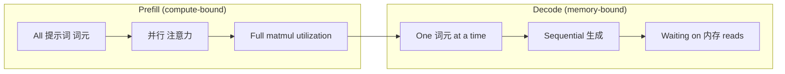
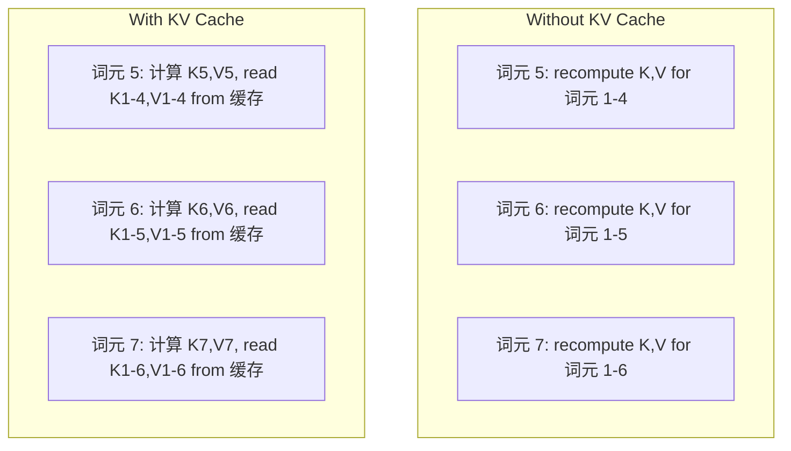
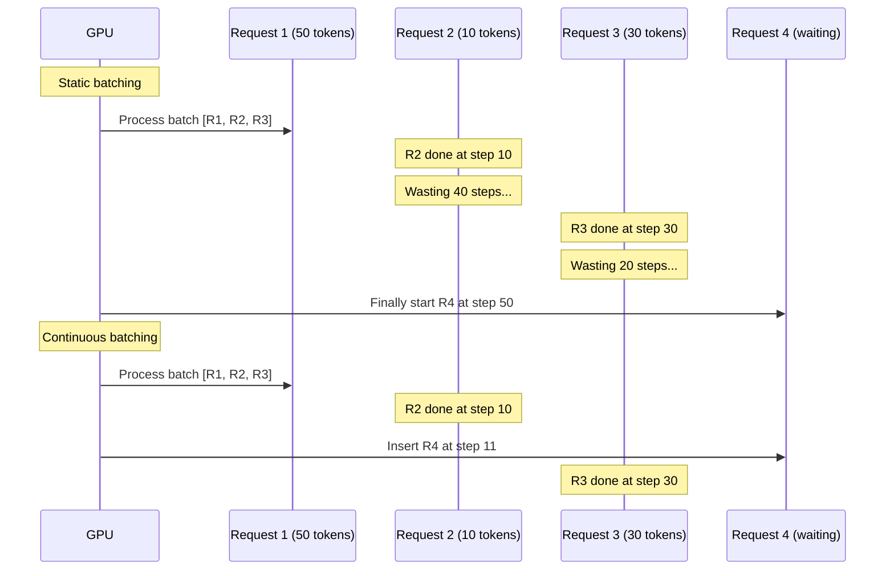
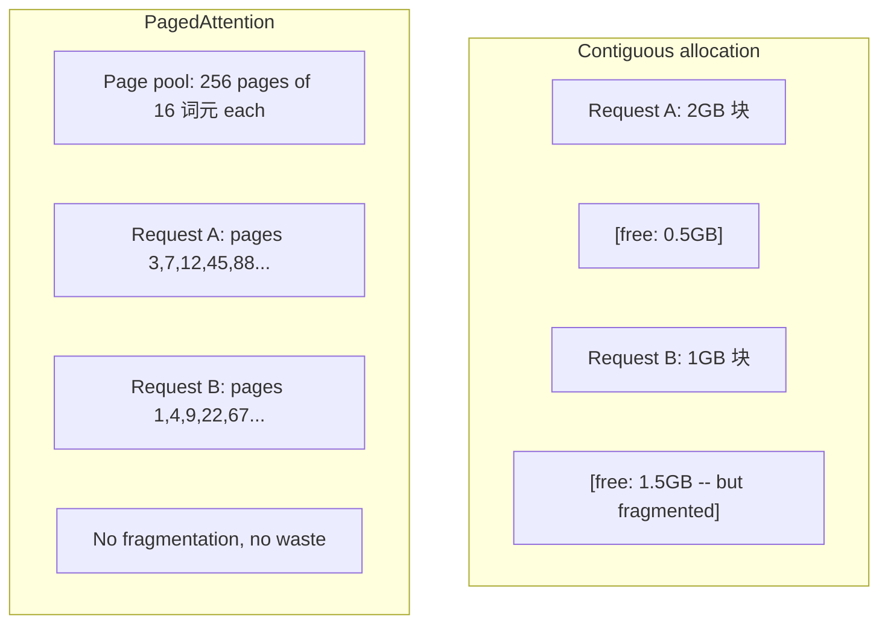
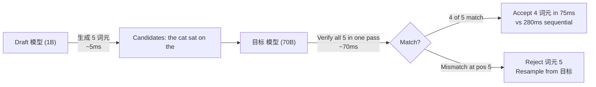

# 推理 优化

> Two phases define LLM 推理. Prefill processes your 提示词 in 并行 -- compute-bound. Decode generates 词元 one at a time -- memory-bound. Every 优化 目标 one or both.

**类型：** Build
**语言：** Python
**先修：** Phase 10, Lessons 01-08 (Transformer 架构, 注意力)
**时间：** 约 120 分钟

## 学习目标

- Implement KV-cache to eliminate redundant computation during autoregressive 词元 生成
- 解释the prefill vs decode phases of LLM 推理 and why each has different bottlenecks (compute-bound vs memory-bound)
- Implement continuous batching and PagedAttention concepts to maximize GPU utilization under concurrent requests
- 比较推理 优化 techniques (KV-cache, 推测解码, flash 注意力) and their throughput/延迟 取舍

## 问题

你deploy Llama 3 70B on 4xA100 GPUs. A single 用户 gets ~50 词元 per second. Feels fast. Then 100 users hit the endpoint simultaneously. Throughput drops to 3 词元/second/用户. Your $25,000/month GPU bill is serving 响应 slower than a human types.

这个模型 itself does not change between 1 用户 and 100 users. Same 权重, same 架构, same math. What changes is how you 调度 the work. Naive 推理 wastes 90%+ of available GPU 计算. A 用户 waiting for 词元 47 holds an entire 批次 slot 开放 while the GPU 内存 bus sits idle between matmuls. Meanwhile, a new 用户's 2,000-词元 提示词 could fill that dead time with useful 计算.

这is not a 扩展 problem. It is a scheduling problem. The techniques in this lesson -- KV 缓存, continuous batching, PagedAttention, 推测解码, prefix 缓存 -- are what separate a $25k/month 推理 bill from a $5k/month one serving the same traffic.

vLLM serving Llama 3 70B on 4xA100-80GB achieves ~50 词元/second/用户 at low concurrency, and sustains 15-25 TPS/用户 at 100 concurrent requests through continuous batching and PagedAttention. Without these optimizations, the same hardware serves 5 TPS/用户 at that concurrency. Same GPUs, same 模型, 4x the throughput.

## 概念

### Prefill vs Decode

每个LLM 推理 request has two distinct phases.

**Prefill** processes the entire 输入 提示词. All 词元 are known, so 注意力 can be computed in 并行 across the full 序列. This is a large matrix multiplication -- GPU cores stay busy. The bottleneck is 计算: how many FLOPS your hardware can deliver per second. An A100 does 312 TFLOPS (BF16). Prefill for a 4,096-词元 提示词 on a 70B 模型 takes ~400ms on a single A100.

**Decode** generates 输出 词元 one at a time. Each new 词元 attends to all previous 词元, but only one 词元 is produced per forward pass. The 权重 matrices are the same size as during prefill, but you are multiplying them by a single vector instead of a matrix. The GPU cores finish in microseconds, then wait for the next 批次 of 权重 to arrive from 内存. The bottleneck is 内存 bandwidth: how fast you can stream 模型 权重 from HBM to the 计算 units. An A100 has 2 TB/s bandwidth. A 70B 模型 in FP16 is 140 GB. Reading the full 模型 once takes 70ms -- that is your floor for a single decode 步骤.



这个**ops:byte 比例** (also called arithmetic intensity) captures this tradeoff. It measures how many operations you perform per byte loaded from 内存.

```text
ops:byte ratio = FLOPs per token / bytes read from memory
```

During prefill with a 批次 of 4,096 词元, you perform ~4,096 multiply-accumulate operations per 权重 loaded. The 比例 is high -- you are compute-bound. During decode with 批次 size 1, you perform ~1 operation per 权重 loaded. The 比例 is low -- you are memory-bound.

这个fundamental insight: *decode is memory-bound because you read the entire 模型 to produce a single 词元*. Every 优化 below either reduces what you read, increases the 批次 of 词元 processed per read, or avoids reads entirely.

### KV 缓存

During 注意力, each 词元's 查询 attends to every previous 词元's key and value vectors. Without 缓存, generating 词元 N requires recomputing the key and value projections for all N-1 preceding 词元. 词元 1 gets projected when generating 词元 2, then again for 词元 3, then again for 词元 4. By 词元 1,000, you have projected 词元 1 a total of 999 times.

这个KV 缓存 stores the key and value projections from all previous 词元. When generating 词元 N, you only 计算 the key and value for 词元 N, then concatenate them with the cached K/V from 词元 1 through N-1.



**内存 formula for KV 缓存:**

```text
KV cache size = 2 * num_layers * num_kv_heads * head_dim * seq_len * bytes_per_param
```

For Llama 3 70B (80 层, 8 KV 头 with GQA, head_dim=128, BF16):

```text
per token: 2 * 80 * 8 * 128 * 2 bytes = 327,680 bytes = 320 KB
at 4,096 tokens: 320 KB * 4,096 = 1.28 GB
at 128K tokens: 320 KB * 131,072 = 40 GB
```

一个single 128K-上下文 conversation for Llama 3 70B consumes 40 GB of KV 缓存 -- half an A100's 内存. With 100 concurrent users at 4K 词元 each, KV 缓存 alone requires 128 GB. This is why KV 缓存 management is the central challenge of 推理 优化.

### Continuous Batching

Static batching waits until a 批次 of N requests arrives, processes them together, and waits until *all* finish before accepting new requests. If one request needs 500 词元 and another needs 10, the short request sits idle for 490 decode 步骤 after it finishes.

Continuous batching (also called iteration-level batching) inserts new requests into the 批次 as soon as any request completes. The 批次 is reevaluated at every decode 步骤. A request that finishes after 10 词元 is immediately replaced by a waiting request.



这个throughput improvement depends on how much 输出 lengths vary. With uniform lengths, continuous batching matches static batching. With variable lengths (the common case), continuous batching can deliver 2-5x higher throughput because GPU slots never sit empty.

### PagedAttention

这个KV 缓存 for each request is a contiguous 块 of 内存. As requests arrive and depart, 内存 fragments -- exactly like RAM fragmentation in operating systems. A 4K-词元 request needs 1.28 GB contiguous. Even if you have 2 GB free total, you might not have 1.28 GB *contiguous*. You either waste 内存 or reject the request.

PagedAttention (from vLLM) applies OS-style virtual 内存 to KV 缓存. Instead of allocating one contiguous 块 per request, it allocates fixed-size "pages" (typically 16 词元 each). Pages can be anywhere in physical GPU 内存. A page table maps each request's logical 序列 positions to physical page locations.



PagedAttention also enables **copy-on-write** for shared prefixes. If 50 requests share the same 系统 提示词, the KV 缓存 pages for that 系统 提示词 are stored once and referenced by all 50 requests. Only when a request diverges (different 用户 消息) does it get its own pages. This cuts 内存 usage dramatically for applications with shared 系统 prompts.

vLLM reports near-zero 内存 waste (~4% vs ~60-80% in naive allocation) through PagedAttention.

### 推测解码

Decode is slow because it is sequential -- you 生成 one 词元, feed it back, 生成 the next. But what if you could guess the next 5 词元 cheaply, then verify them all at once?

Speculative decoding uses a small, fast **draft 模型** to 生成 K candidate 词元. The large **目标 模型** then processes all K candidates in a single forward pass (which looks like a prefill -- 并行, compute-bound, efficient). If the 目标 模型 agrees with the draft 模型's predictions, you accept all K 词元 in the time of one 目标 forward pass. If it disagrees at position j, you accept 词元 1 through j-1 and discard the rest.



这个speedup depends on the **acceptance 速率** -- how often the draft 模型's predictions match the 目标. For a Llama 3 8B drafting for Llama 3 70B, acceptance rates of 70-85% are typical on natural language. This translates to 2-3x decode speedup.

Three approaches to 推测解码:

|Method|Draft 来源|Acceptance 速率|Overhead|
|--------|-------------|-----------------|----------|
|Draft-target (Leviathan et al.)|Separate small 模型|70-85%|Draft 模型 内存|
|EAGLE (Li et al.)|Lightweight 头 on 目标|75-90%|~1% extra 参数|
|N-gram lookup|词元 n-gram table|40-60%|Negligible|

**EAGLE** trains a small autoregressive 头 on top of the 目标 模型's 隐藏 states. It predicts the next 词元's 嵌入 using the 目标 模型's second-to-last 层 特征s. Because it operates on the 目标 模型's own representations (not a separate 模型's), it achieves higher acceptance rates with minimal extra 内存. EAGLE-2 adds a dynamic draft tree that adjusts candidate count based on 上下文.

**N-gram 推测解码** maintains a table of n-gram continuations from the current 上下文 or a prebuilt 语料库. If the draft matches what appeared before in the same conversation (repetitive patterns, code, 结构化 输出), it fires with zero neural network overhead. Acceptance rates are lower on average but the 成本 per speculation is essentially free.

Speculative decoding is *mathematically exact* -- the 输出 分布 is identical to the 目标 模型's 分布. It is not an approximation. The verification 步骤 ensures that every accepted 词元 has exactly the 概率 the 目标 模型 would have assigned.

### Prefix 缓存

Many requests share the same prefix. A chatbot 系统 提示词. A RAG 上下文 块. A 少样本 example set. Without prefix 缓存, every request recomputes the KV 缓存 for these shared 词元 from scratch.

Prefix 缓存 stores the KV 缓存 for common prefixes and reuses it across requests. When a new request arrives with a known prefix, the 系统 copies (or references) the cached KV entries and only computes the KV for the unique suffix.

For a 2,000-词元 系统 提示词 shared across all requests, prefix 缓存 eliminates ~400ms of prefill per request. At 100 requests/second, that saves 40 seconds of GPU 计算 per second -- more than one GPU's worth of work.

SGLang's RadixAttention implements prefix 缓存 with a radix tree (trie) that indexes prefixes by their 词元 content. Any request 匹配 a stored prefix gets its KV 缓存 for free. The tree enables partial prefix matches -- if you share 1,500 of 2,000 prefix 词元 with a cached entry, you reuse those 1,500 and recompute only 500.

### 推理 Engines

Three engines dominate 生产 LLM serving:

|Engine|Key innovation|Best for|
|--------|---------------|----------|
|vLLM|PagedAttention, continuous batching|General-purpose serving, highest compatibility|
|SGLang|RadixAttention (prefix 缓存), 结构化 生成|Multi-turn chatbots, constrained decoding|
|TensorRT-LLM|NVIDIA kernel fusion, FP8 量化|Maximum single-GPU throughput on NVIDIA hardware|

**vLLM** is the default starting point. It supports the widest range of 模型, runs on any GPU vendor (NVIDIA, AMD, Intel), and achieves strong throughput through PagedAttention + continuous batching. The OpenAI-compatible API means you can drop it in as a replacement for any OpenAI API call.

**SGLang** builds on the same foundations as vLLM but adds RadixAttention for prefix 缓存 and a domain-specific language for 结构化 LLM programs. If your workload involves multi-turn conversations, 工具使用, or constrained decoding (JSON 输出, regex-guided 生成), SGLang often outperforms vLLM by 2-5x through prefix reuse.

**TensorRT-LLM** compiles 模型 into optimized NVIDIA GPU kernels. It fuses operations (注意力 + linear + 激活 in one kernel), uses FP8 on H100 GPUs, and integrates with NVIDIA Triton 推理 服务器 for 生产 deployment. It achieves the highest single-GPU throughput on NVIDIA hardware but requires more setup and only works on NVIDIA GPUs.

Real-world numbers for Llama 3 70B (4xA100-80GB, BF16):

|指标|vLLM|SGLang|TensorRT-LLM|
|--------|------|--------|---------------|
|Throughput (1 用户)|~50 TPS|~55 TPS|~65 TPS|
|Throughput (100 users)|~2,500 total TPS|~3,200 total TPS|~3,000 total TPS|
|时间 to first 词元|~400ms|~300ms (prefix hit)|~350ms|
|Max 上下文|128K|128K|128K|

### The Ops:Byte Framework

你cannot 优化 what you do not measure. The ops:byte 比例 tells you whether you are compute-bound or memory-bound, which determines which optimizations matter.

```text
Compute roof: peak FLOPS of the GPU
Memory roof:  peak bandwidth * ops:byte ratio
```

当ops:byte is low (decode, small batches), you hit the 内存 bandwidth roof. Adding more 计算 (higher clock, more cores) does not help. You need to reduce 内存 reads (量化, KV 缓存 压缩) or increase the 批次 size to amortize reads across more useful work.

当ops:byte is high (prefill, large batches), you hit the 计算 roof. 内存 bandwidth 优化 does not help. You need faster GPUs, kernel fusion, or reduced precision to squeeze more FLOPS.

|Scenario|ops:byte|Bound|优化 with|
|----------|----------|-------|---------------|
|Prefill, 批次=1|~4,096|计算|Kernel fusion, FP8|
|Decode, 批次=1|~1|内存|量化, KV 压缩|
|Decode, 批次=32|~32|内存|Larger 批次, continuous batching|
|Decode, 批次=256|~256|Transitioning|Both matter|
|Decode, 批次=1024|~1,024|计算|Kernel fusion, tensor parallelism|

这个crossover point on A100 is around ops:byte = 156 (312 TFLOPS / 2 TB/s). Below 156, you are memory-bound. Above 156, you are compute-bound. Continuous batching pushes decode toward this crossover by packing more 词元 per iteration.

```figure
context-window-slide
```

## 动手构建

### 步骤 1: KV 缓存 from Scratch

We build a multi-head KV 缓存 that stores key and value projections per 层, per 头, and demonstrates the 内存 growth pattern.

```python
import numpy as np

class KVCache:
    def __init__(self, num_layers, num_heads, head_dim, max_seq_len, dtype=np.float16):
        self.num_layers = num_layers
        self.num_heads = num_heads
        self.head_dim = head_dim
        self.max_seq_len = max_seq_len
        self.dtype = dtype

        self.k_cache = np.zeros(
            (num_layers, num_heads, max_seq_len, head_dim), dtype=dtype
        )
        self.v_cache = np.zeros(
            (num_layers, num_heads, max_seq_len, head_dim), dtype=dtype
        )
        self.seq_len = 0

    def update(self, layer_idx, new_keys, new_values):
        num_new = new_keys.shape[1]
        end = self.seq_len + num_new
        self.k_cache[layer_idx, :, self.seq_len:end, :] = new_keys
        self.v_cache[layer_idx, :, self.seq_len:end, :] = new_values
        return (
            self.k_cache[layer_idx, :, :end, :],
            self.v_cache[layer_idx, :, :end, :]
        )

    def advance(self, num_tokens):
        self.seq_len += num_tokens

    def memory_bytes(self):
        return self.k_cache.nbytes + self.v_cache.nbytes

    def used_bytes(self):
        per_token = 2 * self.num_layers * self.num_heads * self.head_dim * np.dtype(self.dtype).itemsize
        return per_token * self.seq_len
```

### 步骤 2: 注意力 with KV 缓存

一个simplified multi-head 注意力 that uses the KV 缓存 for decode 步骤.

```python
def scaled_dot_product_attention(query, keys, values):
    head_dim = query.shape[-1]
    scores = np.matmul(query, keys.transpose(0, 1, 3, 2)) / np.sqrt(head_dim)
    seq_len_q = scores.shape[-2]
    seq_len_k = scores.shape[-1]
    if seq_len_q > 1:
        mask = np.triu(np.ones((seq_len_q, seq_len_k), dtype=np.float32), k=seq_len_k - seq_len_q + 1)
        scores = scores + mask * (-1e9)
    max_scores = np.max(scores, axis=-1, keepdims=True)
    exp_scores = np.exp(scores - max_scores)
    attn_weights = exp_scores / np.sum(exp_scores, axis=-1, keepdims=True)
    return np.matmul(attn_weights, values)


class MultiHeadAttention:
    def __init__(self, d_model, num_heads):
        self.num_heads = num_heads
        self.head_dim = d_model // num_heads
        scale = np.sqrt(2.0 / d_model)
        self.W_q = np.random.randn(d_model, d_model).astype(np.float32) * scale
        self.W_k = np.random.randn(d_model, d_model).astype(np.float32) * scale
        self.W_v = np.random.randn(d_model, d_model).astype(np.float32) * scale
        self.W_o = np.random.randn(d_model, d_model).astype(np.float32) * scale

    def forward(self, x, kv_cache=None, layer_idx=0):
        batch, seq_len, d_model = x.shape
        Q = np.matmul(x, self.W_q).reshape(batch, seq_len, self.num_heads, self.head_dim).transpose(0, 2, 1, 3)
        K = np.matmul(x, self.W_k).reshape(batch, seq_len, self.num_heads, self.head_dim).transpose(0, 2, 1, 3)
        V = np.matmul(x, self.W_v).reshape(batch, seq_len, self.num_heads, self.head_dim).transpose(0, 2, 1, 3)

        if kv_cache is not None:
            K_full, V_full = kv_cache.update(layer_idx, K[0], V[0])
            K = K_full[np.newaxis, :, :, :]
            V = V_full[np.newaxis, :, :, :]
            if seq_len == 1:
                kv_cache.advance(1)

        attn_out = scaled_dot_product_attention(Q, K, V)
        attn_out = attn_out.transpose(0, 2, 1, 3).reshape(batch, -1, d_model)
        return np.matmul(attn_out, self.W_o)
```

### 步骤 3: Continuous Batching Simulator

这simulates the scheduling difference between static and continuous batching.

```python
import heapq

class Request:
    def __init__(self, request_id, prompt_tokens, output_tokens, arrival_step):
        self.request_id = request_id
        self.prompt_tokens = prompt_tokens
        self.output_tokens = output_tokens
        self.arrival_step = arrival_step
        self.tokens_generated = 0
        self.start_step = None
        self.end_step = None

    def is_done(self):
        return self.tokens_generated >= self.output_tokens


def simulate_static_batching(requests, batch_size):
    step = 0
    completed = []
    queue = list(requests)
    queue.sort(key=lambda r: r.arrival_step)

    while queue:
        batch = []
        while queue and len(batch) < batch_size:
            r = queue.pop(0)
            r.start_step = max(step, r.arrival_step)
            batch.append(r)

        if batch:
            step = max(step, max(r.start_step for r in batch))
            max_output = max(r.output_tokens for r in batch)
            for r in batch:
                r.tokens_generated = r.output_tokens
                r.end_step = step + max_output
            step += max_output
            completed.extend(batch)

    return completed


def simulate_continuous_batching(requests, batch_size):
    step = 0
    completed = []
    queue = sorted(requests, key=lambda r: r.arrival_step)
    queue_idx = 0
    active = []
    waiting = []

    while queue_idx < len(queue) or active or waiting:
        while queue_idx < len(queue) and queue[queue_idx].arrival_step <= step:
            waiting.append(queue[queue_idx])
            queue_idx += 1

        while waiting and len(active) < batch_size:
            r = waiting.pop(0)
            r.start_step = step
            active.append(r)

        if not active:
            if waiting:
                step += 1
                continue
            elif queue_idx < len(queue):
                step = queue[queue_idx].arrival_step
                continue
            else:
                break

        for r in active:
            r.tokens_generated += 1

        done = [r for r in active if r.is_done()]
        for r in done:
            r.end_step = step + 1
            completed.append(r)
        active = [r for r in active if not r.is_done()]

        step += 1

    return completed


def batching_stats(completed):
    latencies = [r.end_step - r.arrival_step for r in completed]
    total_time = max(r.end_step for r in completed) - min(r.arrival_step for r in completed)
    total_tokens = sum(r.output_tokens for r in completed)
    return {
        "avg_latency": np.mean(latencies),
        "p50_latency": np.median(latencies),
        "p99_latency": np.percentile(latencies, 99),
        "total_time": total_time,
        "throughput": total_tokens / total_time if total_time > 0 else 0,
    }
```

### 步骤 4: Prefix 缓存

一个trie-based prefix 缓存 that stores KV entries for shared prefixes.

```python
class TrieNode:
    def __init__(self):
        self.children = {}
        self.kv_data = None
        self.hit_count = 0


class PrefixCache:
    def __init__(self, max_entries=1000):
        self.root = TrieNode()
        self.max_entries = max_entries
        self.total_entries = 0
        self.hits = 0
        self.misses = 0

    def _walk(self, token_ids):
        node = self.root
        depth = 0
        for tid in token_ids:
            if tid not in node.children:
                break
            node = node.children[tid]
            depth += 1
        return node, depth

    def lookup(self, token_ids):
        node, depth = self._walk(token_ids)
        if depth > 0:
            self.hits += 1
            current = self.root
            for tid in token_ids[:depth]:
                current = current.children[tid]
                current.hit_count += 1
            kv_entries = []
            current = self.root
            for tid in token_ids[:depth]:
                current = current.children[tid]
                if current.kv_data is not None:
                    kv_entries.append(current.kv_data)
            return depth, kv_entries
        self.misses += 1
        return 0, []

    def insert(self, token_ids, kv_per_token):
        node = self.root
        for i, tid in enumerate(token_ids):
            if tid not in node.children:
                if self.total_entries >= self.max_entries:
                    return i
                node.children[tid] = TrieNode()
                self.total_entries += 1
            node = node.children[tid]
            if i < len(kv_per_token):
                node.kv_data = kv_per_token[i]
        return len(token_ids)

    def hit_rate(self):
        total = self.hits + self.misses
        return self.hits / total if total > 0 else 0.0
```

### 步骤 5: 推测解码 Simulator

We simulate draft-target 推测解码 with configurable acceptance rates.

```python
class DraftModel:
    def __init__(self, vocab_size, acceptance_rate=0.8):
        self.vocab_size = vocab_size
        self.acceptance_rate = acceptance_rate

    def generate(self, context, num_tokens):
        tokens = np.random.randint(0, self.vocab_size, size=num_tokens)
        return tokens

    def get_probs(self, context, token):
        probs = np.random.dirichlet(np.ones(self.vocab_size))
        return probs


class TargetModel:
    def __init__(self, vocab_size):
        self.vocab_size = vocab_size

    def get_probs(self, context, tokens=None):
        if tokens is not None:
            return [np.random.dirichlet(np.ones(self.vocab_size)) for _ in tokens]
        return np.random.dirichlet(np.ones(self.vocab_size))


def speculative_decode(draft_model, target_model, context, num_speculative=5,
                       draft_cost=1.0, target_cost=10.0, verify_cost=12.0):
    total_tokens = 0
    total_cost = 0.0
    accepted_counts = []
    context = list(context)

    max_tokens = 100

    while total_tokens < max_tokens:
        draft_tokens = draft_model.generate(context, num_speculative)
        total_cost += draft_cost * num_speculative

        target_probs = target_model.get_probs(context, draft_tokens)
        total_cost += verify_cost

        accepted = 0
        for i, token in enumerate(draft_tokens):
            draft_p = draft_model.get_probs(context + list(draft_tokens[:i]), token)
            target_p = target_probs[i]

            r = np.random.random()
            acceptance_prob = min(1.0, target_p[token] / (draft_p[token] + 1e-10))

            if r < draft_model.acceptance_rate:
                accepted += 1
                context.append(token)
                total_tokens += 1
            else:
                new_token = np.random.choice(draft_model.vocab_size, p=target_p)
                context.append(new_token)
                total_tokens += 1
                break

        accepted_counts.append(accepted)

        if accepted == num_speculative:
            bonus_probs = target_model.get_probs(context)
            bonus_token = np.random.choice(draft_model.vocab_size, p=bonus_probs)
            context.append(bonus_token)
            total_tokens += 1

    sequential_cost = total_tokens * target_cost
    return {
        "total_tokens": total_tokens,
        "speculative_cost": total_cost,
        "sequential_cost": sequential_cost,
        "speedup": sequential_cost / total_cost if total_cost > 0 else 1.0,
        "avg_accepted": np.mean(accepted_counts),
        "acceptance_rate": np.mean(accepted_counts) / num_speculative,
    }


def compare_speculation_strategies(vocab_size=1000, num_trials=20):
    results = {}

    for name, acceptance_rate, spec_tokens in [
        ("Draft-target (8B->70B)", 0.78, 5),
        ("EAGLE", 0.85, 6),
        ("N-gram", 0.50, 4),
        ("No speculation", 0.0, 0),
    ]:
        if spec_tokens == 0:
            results[name] = {
                "speedup": 1.0,
                "acceptance_rate": 0.0,
                "avg_accepted": 0.0,
            }
            continue

        trial_results = []
        for _ in range(num_trials):
            draft = DraftModel(vocab_size, acceptance_rate=acceptance_rate)
            target = TargetModel(vocab_size)
            context = list(np.random.randint(0, vocab_size, size=10))
            result = speculative_decode(draft, target, context, num_speculative=spec_tokens)
            trial_results.append(result)

        results[name] = {
            "speedup": np.mean([r["speedup"] for r in trial_results]),
            "acceptance_rate": np.mean([r["acceptance_rate"] for r in trial_results]),
            "avg_accepted": np.mean([r["avg_accepted"] for r in trial_results]),
        }

    return results
```

### 步骤 6: KV 缓存 内存 Profiler

计算 KV 缓存 内存 requirements for 真实 模型 configurations.

```python
MODEL_CONFIGS = {
    "Llama-3-8B": {
        "num_layers": 32, "num_kv_heads": 8, "head_dim": 128,
        "model_params_b": 8, "gqa": True,
    },
    "Llama-3-70B": {
        "num_layers": 80, "num_kv_heads": 8, "head_dim": 128,
        "model_params_b": 70, "gqa": True,
    },
    "Llama-3-405B": {
        "num_layers": 126, "num_kv_heads": 8, "head_dim": 128,
        "model_params_b": 405, "gqa": True,
    },
    "Mistral-7B": {
        "num_layers": 32, "num_kv_heads": 8, "head_dim": 128,
        "model_params_b": 7, "gqa": True,
    },
    "GPT-4-est": {
        "num_layers": 120, "num_kv_heads": 96, "head_dim": 128,
        "model_params_b": 1800, "gqa": False,
    },
}


def kv_cache_memory(config, seq_len, dtype_bytes=2):
    per_token = 2 * config["num_layers"] * config["num_kv_heads"] * config["head_dim"] * dtype_bytes
    total = per_token * seq_len
    return {
        "per_token_bytes": per_token,
        "per_token_kb": per_token / 1024,
        "total_bytes": total,
        "total_mb": total / (1024 ** 2),
        "total_gb": total / (1024 ** 3),
    }


def memory_budget(config, gpu_memory_gb, model_dtype_bytes=2, kv_dtype_bytes=2):
    model_memory_gb = config["model_params_b"] * 1e9 * model_dtype_bytes / (1024 ** 3)
    overhead_gb = gpu_memory_gb * 0.1
    available_for_kv = gpu_memory_gb - model_memory_gb - overhead_gb

    if available_for_kv <= 0:
        return {"error": "Model does not fit in GPU memory", "model_memory_gb": model_memory_gb}

    per_token = 2 * config["num_layers"] * config["num_kv_heads"] * config["head_dim"] * kv_dtype_bytes
    max_tokens = int(available_for_kv * (1024 ** 3) / per_token)

    return {
        "gpu_memory_gb": gpu_memory_gb,
        "model_memory_gb": round(model_memory_gb, 1),
        "overhead_gb": round(overhead_gb, 1),
        "available_for_kv_gb": round(available_for_kv, 1),
        "max_total_tokens": max_tokens,
        "max_users_at_2k": max_tokens // 2048,
        "max_users_at_4k": max_tokens // 4096,
        "max_users_at_32k": max_tokens // 32768,
    }
```

## 实际使用

With vLLM:

```python
from vllm import LLM, SamplingParams

llm = LLM(
    model="meta-llama/Llama-3-70B-Instruct",
    tensor_parallel_size=4,
    enable_prefix_caching=True,
    max_model_len=8192,
    gpu_memory_utilization=0.9,
)

params = SamplingParams(temperature=0.7, max_tokens=256)
outputs = llm.generate(["Explain inference optimization in one paragraph."], params)
```

With SGLang for prefix 缓存 + 结构化 输出：

```python
import sglang as sgl

@sgl.function
def classify(s, text):
    s += sgl.system("You are a classifier. Output JSON only.")
    s += sgl.user(f"Classify this text: {text}")
    s += sgl.assistant(sgl.gen("result", regex=r'\{"label": "(positive|negative|neutral)"\}'))

runtime = sgl.Runtime(model_path="meta-llama/Llama-3-70B-Instruct", tp_size=4)
sgl.set_default_backend(runtime)

results = classify.run_batch([
    {"text": "This product is amazing!"},
    {"text": "Terrible experience."},
    {"text": "It was okay I guess."},
])
```

With TensorRT-LLM:

```python
import tensorrt_llm
from tensorrt_llm.runtime import ModelRunner

runner = ModelRunner.from_dir("./llama-70b-trt-engine/", rank=0)

outputs = runner.generate(
    batch_input_ids=[tokenizer.encode("Explain KV caching.")],
    max_new_tokens=256,
    temperature=0.7,
)
```

## 交付成果

这lesson produces:
- `outputs/skill-inference-optimization.md` -- a skill for diagnosing and optimizing LLM 推理 serving

## 练习

1. Modify the KV 缓存 profiler to compare FP16 vs FP8 vs INT4 KV 缓存 量化. For Llama 3 70B at 4K 上下文, 计算 the max concurrent users for each on 4xA100-80GB. KV 量化 to INT4 should roughly 4x the 用户 capacity.

2. Extend the continuous batching simulator to track GPU utilization (fraction of 批次 slots filled per 步骤). Plot utilization over time for both static and continuous batching with 50 requests whose 输出 lengths follow a Pareto 分布 (shape=1.5, 规模=20). Continuous batching should maintain >80% utilization.

3. Implement a grouped-query 注意力 (GQA) version of the KV 缓存 where `num_kv_heads < num_query_heads`. Llama 3 70B uses 64 查询 头 but only 8 KV 头. 计算 the 内存 savings vs full multi-head 注意力 (8x reduction in KV 缓存 size).

4. 构建a prefix 缓存 that uses LRU eviction. Set max_entries to 500 and 生成 1,000 requests where 60% share one of 5 common prefixes. Measure hit 速率 and compare to unlimited 缓存. With good eviction, hit 速率 should stay above 55%.

5. Extend the 推测解码 simulator to implement tree-based speculation (EAGLE-2 风格). Instead of a single 链 of K draft 词元, 生成 a tree of candidates (e.g., 2 branches at each of 3 levels = 8 leaf candidates). Compare total 词元 accepted per verification round vs linear speculation.

## Key Terms

|Term|What people say|What it actually means|
|------|----------------|----------------------|
|Prefill|"Processing the 提示词"|Computing 注意力 over all 输入 词元 in 并行 -- compute-bound because the full matrix multiplication keeps GPU cores busy|
|Decode|"Generating 词元"|Producing one 词元 per forward pass, reading the full 模型 权重 each time -- memory-bound because 计算 finishes before the next 权重 arrive|
|KV 缓存|"缓存 注意力 states"|Storing the key and value projections for all previous 词元 so they are not recomputed at each decode 步骤 -- trades 内存 for 计算|
|Continuous batching|"Dynamic batching"|Inserting new requests into the running 批次 as soon as any request finishes, evaluated at every decode iteration rather than waiting for the whole 批次|
|PagedAttention|"Virtual 内存 for KV 缓存"|Allocating KV 缓存 in fixed-size pages instead of contiguous 块, eliminating 内存 fragmentation and enabling copy-on-write for shared prefixes|
|Speculative decoding|"Draft and verify"|Using a fast draft 模型 to propose multiple 词元, then verifying them all in one 目标 模型 forward pass -- mathematically exact, 2-3x speedup|
|EAGLE|"Self-推测解码"|A 推测解码 variant that trains a lightweight 头 on the 目标 模型's own 隐藏 states, achieving higher acceptance rates than a separate draft 模型|
|Prefix 缓存|"Reusing 系统 提示词 KV"|Storing computed KV 缓存 entries for common prefixes (系统 prompts, 少样本 examples) and reusing them across requests to skip redundant prefill|
|Ops:byte 比例|"Arithmetic intensity"|The 比例 of 计算 operations to 内存 bytes read -- determines whether a workload is compute-bound (high 比例) or memory-bound (low 比例)|
|时间 to first 词元|"TTFT"|延迟 from receiving a request to producing the first 输出 词元 -- dominated by prefill time for long prompts|

## 延伸阅读

- Kwon et al., "Efficient 内存 Management for Large Language 模型 Serving with PagedAttention" (2023) -- the vLLM paper that introduced paged KV 缓存 management, now the industry standard for 推理 serving
- Leviathan et al., "Fast 推理 from Transformers via 推测解码" (2023) -- the foundational paper proving that draft-verify speculation produces exact 目标 模型 distributions while achieving 2-3x speedup
- Li et al., "EAGLE: Speculative 采样 Requires Rethinking 特征 Uncertainty" (2024) -- achieves higher acceptance rates by 训练 a 头 on the 目标 模型's own 特征s instead of using a separate draft 模型
- Zheng et al., "SGLang: Efficient Execution of 结构化 Language 模型 Programs" (2024) -- introduces RadixAttention for prefix 缓存 and a programming 模型 for multi-call LLM programs
- Williams et al., "Roofline: An Insightful Visual Performance 模型 for Multicore 架构s" (2009) -- the original roofline paper that formalized the ops:byte framework for 推理 about 计算 vs 内存 bottlenecks
