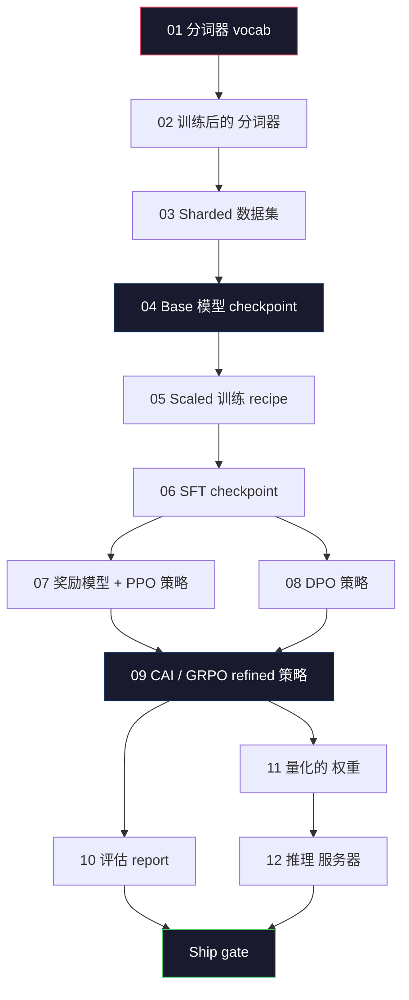
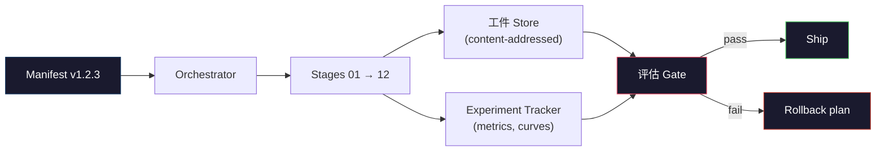

# Building a Complete LLM 流水线

> Everything from Lessons 01 to 12 is one stage of one 流水线. This lesson is the scaffold that turns those stages into a single end-to-end run: tokenize, pre-train, 规模, SFT, align, evaluate, quantize, serve. You will not 训练 a 70B 模型 on a laptop. You will produce the orchestration 层, the manifest, the 评估 gate, and the rollback plan that a 2026 frontier team uses to decide what gets shipped. This is the capstone.

**类型：** Build
**语言：** Python (stdlib)
**先修：** All Phase 10 lessons 01-12
**时间：** 约 120 分钟

## 学习目标

- Compose the eleven 先验 lessons (分词器, 数据, 预训练, 扩展, SFT, RLHF, DPO, CAI, 评估, 量化, 推理) into a single reproducible 流水线 spec
- Define the 工件 contract between stages: what each stage consumes, what it produces, and how the next stage verifies the 输入
- 构建an orchestrator that tracks experiments, hashes 工件, and gates ship decisions on 评估 thresholds
- Design the rollback plan: which 工件 are cheap to re-run, which are expensive, and what a corrupted checkpoint 成本

## 问题

这个previous lessons each work. 分词器 训练后的. Tiny GPT pre-trained. SFT 数据集 assembled. 奖励模型 训练后的. DPO run. Evals measured. 量化的 权重 exported. 推理 服务器 spun up. Each one is a notebook. Each one has its own conventions, its own 输出 paths, its own 种子.

一个frontier 训练 run is not a notebook. Llama 3 405B took 30 million H100 小时 over roughly 54 days. DeepSeek-V3 used around 2.8 million H800 小时. During that time, one corrupted checkpoint, one 数据 contamination, one 评估 回归 can 成本 a team a week of wall-clock and a month of GPU 预算. The way teams survive this is through 流水线 hygiene: every stage has a deterministic 输入, a deterministic 输出, a manifest, a hash, and a gate.

这is the capstone. You will not run the 流水线 end-to-end on a laptop. You will write the orchestrator that coordinates the stages, the manifest that describes the run, the verifier that gates ship decisions, and the replay plan that lets a third party re-run your work from a single file. The code is small; the discipline is large.

这个pattern scales from 100M to 1T 参数 unchanged. The same four components -- manifest, orchestrator, 评估 gate, 工件 store -- run Llama 3 and also run your hobby GPT. The difference is the size of the numbers inside each stage's 配置, not the shape of the 流水线.

## 概念

### The Twelve Stages

每个Phase 10 lesson is a stage. Here is the full dependency 图.



Stages 07 and 08 can run in 并行. Everything else is a hard dependency. A change in stage 02 (分词器) invalidates every downstream 工件. A change in stage 10 (评估) invalidates only the ship decision.

### The Manifest

一个manifest is a single file that describes a run completely enough to replay it. Nothing the 流水线 produces should depend on 状态 that is not in the manifest. The fields are boring and mandatory.

```text
pipeline_version: 1.2.3
seed: 42
git_commit: a1b2c3d4
stages:
  01_tokenizer:
    recipe: bpe_32k
    input_hash: sha256:...
    output_hash: sha256:...
    wall_clock_sec: 3600
    cost_usd: 12
```

这个输出 hash of stage N is the 输入 hash of stage N+1. Any deviation and the 流水线 halts. This is how you catch 数据 corruption early. It is also how a teammate on a different continent verifies that their replay produced the same 工件 as yours.

In practice teams use a small YAML 模式 plus a manifest checker that diffs against the previous successful run. Any delta outside the expected fields (成本, wall clock) is a red flag.

### 工件 Typing

Each stage's 输出 is a typed 工件. Not a directory blob, not a pickle, but a named type with a known 模式.

|Stage|工件 类型|Key Fields|
|-------|--------------|-----------|
|01-02|分词器|vocab.json, merges.txt, config.json, hash|
|03|数据集|shards[], row count, 词元 count, dedup stats|
|04-05|Checkpoint|weights.safetensors, config.json, 优化器 状态, 步骤 count|
|06|SFT 模型|checkpoint + SFT recipe + 数据 mix|
|07|奖励 模型|RM checkpoint + preference 数据 hash|
|08-09|策略|checkpoint + 参考 hash + beta + KL 预算 consumed|
|10|评估 Report|基准 scores + 回归 diffs + 评估 数据 hash|
|11|量化的 模型|量化的 权重 + calibration 数据 + accuracy delta vs FP16|
|12|服务器 Spec|endpoint + 模型 hash + 配置 + observability hooks|

这个typing prevents the most common failure mode: using a stage 08 输出 as a stage 06 输入, shipping a DPO-trained 模型 through the SFT path. 类型d 工件 and typed stage signatures make these 错误 compile-time failures, not day-five failures.

### The 评估 Gate

Shipping is not "训练 finished." Shipping is "训练 finished and the 评估 gate passed." The gate is defined before the run starts.

```text
gates:
  mmlu:      >= baseline + 0.5   # no regression
  humaneval: >= baseline + 1.0
  truthfulqa: >= baseline         # no drop
  safety_refusal_rate: <= 0.05
  kl_from_reference: <= 25.0
  cost_total_usd: <= 50000
```

每个gate is a numeric 阈值. No "looks good" gates. No subjective sign-offs. If every gate passes, the 工件 is marked shippable. If any gate fails, the run is held pending explicit override by a named reviewer, which itself is logged in the manifest.

Two gates catch most disasters. A *回归* gate (the new 模型 must be at least as good as the previous on core benchmarks) catches 训练 bugs. A *KL 预算* gate (the aligned 策略 must not have drifted further than X from its 参考) catches 对齐 overcooking. Every 生产 流水线 has both.

### The Orchestrator

一个small piece of code that reads the manifest, dispatches stages, tracks 工件, and halts on any contract violation. This is not Airflow. This is not Kubeflow. For 流水线 hygiene you want something boring that you wrote.

这个orchestrator's job is narrow:

1. Resolve the DAG from the manifest.
2. For each stage, check if the expected 输出 already exists at the correct hash (skip if so).
3. 运行the stage, capture stdout/stderr, measure wall clock and 成本.
4. Verify the 输出 hash against the downstream stage's expected 输入 hash.
5. On failure, write a partial manifest with the exact failing stage and exit nonzero.

那is 200 lines of Python. It will look like the file `code/main.py` in this lesson. Under the hood, the 真实 流水线 uses `torchrun` or `ray` to execute individual stages on clusters, but the orchestrator itself runs on a single box.

### Experiment Tracking and 工件 Storage

Two external systems anchor the 流水线.

**Experiment tracker (wandb, neptune, mlflow).** Logs 损失 曲线, 评估 指标, 系统 telemetry per stage. The tracker is where you go when you need to compare run A against run B three weeks later. Teams almost always use a 托管 tracker for this -- writing your own loses time that should go into 训练.

**工件 store (S3, R2, GCS).** Immutable object store for checkpoints, datasets, 分词器s, 评估 reports. 工件 are addressed by hash, not by filename. A filename like `latest.pt` is a foot-gun; `ckpt-7b-step-20000-sha256:abc123.safetensors` is a contract.

这个orchestrator writes to both. The tracker is for humans looking at charts. The 工件 store is for the next stage looking up inputs.

### Costing

一个frontier run has a dollar number attached. 预算 discipline happens in two places.

**Pre-run estimate.** From the manifest, 计算 expected FLOPs (for 预训练: 6 x params x 词元), expected GPU 小时 (FLOPs / peak throughput / utilization), and dollar 成本 at the current rental 速率. If the estimate exceeds the 预算 gate, the 流水线 refuses to start.

**In-run tracking.** Stage-by-stage wall clock and 成本 are logged to the manifest. After every stage, the remaining 预算 is checked. If a stage overran, the next stage's gate is evaluated with the new remaining 预算. You do not find out you are out of money when the VC calls.

Llama 3's reported 成本 was $61M. DeepSeek-V3 reported $5.6M for the main 预训练 run. The 比例 is mostly hardware efficiency plus mixture-of-experts -- but the specific 成本 is visible because both teams tracked it per stage, not per run.

### Reproducibility vs Determinism

These are not the same. *Reproducible* means the same manifest plus the same code plus the same infrastructure produces a checkpoint with equivalent downstream 指标. *Deterministic* means bit-identical 输出.

Modern LLM 训练 is reproducible but not deterministic. 分布式 训练's reduce-order, GPU kernel non-determinism (cuBLAS, flash-attn), and mixed precision rounding combine to produce floats that differ at the 1e-5 level between runs. This is fine for the final 指标, which do not move. It is fatal if you are trying to 调试 with bit-level diffs. The cure is to log every stage's 输入 hash, 输出 hash, and headline 指标 -- if those match, the run is "reproduced" even if the 权重 are not bit-identical.



### Rollback Plan

Before the run starts, write down what happens on failure of each stage. Three categories.

- **Cheap to re-run** (小时): 分词器, 评估, 量化, 推理 服务器. Just re-run.
- **Medium** (days): SFT, DPO, CAI. Keep the base 模型; re-run only the 对齐 stages.
- **Expensive** (weeks and millions of dollars): 预训练. The rollback plan here is not "re-run." It is "use the last good checkpoint and re-run the cheaper downstream stages with revised 数据."

Because stage dependencies are typed and hashed, the orchestrator can 计算 the rollback set automatically: invalidate the failed stage plus every descendant. A failure at stage 06 (SFT) invalidates 06, 07, 08, 09, 10, 11, 12. A failure at stage 11 (量化) invalidates only 11 and 12. Naming this up front avoids improvising while the team is exhausted at 4am.

### 生产 Recipes Observed in 2026

Most frontier teams converged on the same skeleton.

- 分词器: 128k BPE with byte 备选方案. 训练后的 on a small, balanced multilingual slice.
- Pre-training: 10-20T 词元, mostly web plus code plus synthetic. Muon or AdamW 优化器. FSDP2 or DeepSpeed ZeRO-3. 梯度 checkpointing. BF16 权重, FP32 master.
- SFT: 500k-2M instruction pairs, mixed human and synthetic, with strict dedup against the 评估 set.
- 对齐: DPO or CAI + GRPO. RLHF only where the preference 信号 is too multidimensional for DPO.
- 评估: MMLU-Pro, MATH, HumanEval+, GPQA, SWE-Bench Verified, LiveBench, plus a private held-out set the public never sees.
- 量化: 4-bit GPTQ or AWQ for serving, 8-bit for 安全 evals where accuracy deltas matter.
- Serving: vLLM, TensorRT-LLM, or in-house. Continuous batching. Speculative decoding. KV 缓存 eviction.

这个numbers change every six months. The skeleton does not.

```figure
beam-search
```

## 动手构建

这个lesson's code is an orchestrator and a manifest checker, not twelve 训练 scripts. Each stage is simulated with a placeholder that produces an 输出 工件 with the correct shape and hash. Running the orchestrator end-to-end proves the 流水线's plumbing works before you burn GPU money on the 真实 stages.

See `code/main.py` for the full implementation. The key pieces:

- `Manifest` dataclass: 流水线 version, 种子, git commit, stages, gates.
- `Stage` dataclass: name, type, inputs (hashes), 输出 (hash), wall clock, 成本.
- `Orchestrator.run()`: resolves DAG, dispatches stages, verifies hashes, updates manifest.
- `EvalGate.check()`: reads thresholds, compares against latest 评估 report, returns pass/fail.
- `ArtifactStore` (in-memory stub): put/get by hash, simulates S3.
- `CostTracker`: per-stage and cumulative, halts when cap exceeded.

这个流水线 in `main.py` runs twelve placeholder stages, produces a manifest, and exercises a failing 评估 gate to show what a held run looks like. Swap each placeholder for the 真实 训练 script from the corresponding lesson and you have the skeleton a 真实 frontier 流水线 uses.

## 实际使用

这个canonical 工作流 has three commands.

```text
python code/main.py plan    # validate manifest, compute cost estimate, print DAG
python code/main.py run     # execute stages, writing to manifest.out.yaml
python code/main.py gate    # read manifest.out.yaml, apply eval gates, ship-or-hold
```

运行`plan` first every time. Most 流水线 bugs show up at plan time -- missing gate thresholds, stale hashes, 预算 overruns. Running `plan` is free. Running `run` is expensive. Save money by catching bugs on the cheap side.

这个输出 of `gate` is either `SHIP` or `HOLD: <reason>`. A held run is not a failure; it is a decision point. A named reviewer either overrides (and the override is logged), or they approve the rollback.

## 交付成果

这lesson produces `outputs/skill-llm-pipeline-reviewer.md`. Feed it a proposed 流水线 manifest and it checks all the contracts: stage typing, hash 链, gates, rollback plan, 成本 estimate. It refuses to approve a manifest with a missing 评估 gate, an unbounded KL 预算, or a run that mixes 评估 and 训练 数据.

## 练习

1. Extend the orchestrator to support 并行 execution of stages 07 and 08. Use the stdlib `concurrent.futures` module. Confirm the final manifest records both stages' outputs and that stage 09's 输入 hash is a deterministic combination of both.

2. Add a "contamination check" gate. Given the 评估 数据集 hash and the 训练 数据集 shards, 计算 the overlap (exact string match or 13-gram match). The gate fails if overlap exceeds 0.1%. Feed it a contaminated 训练集 and confirm the gate holds the run.

3. Implement a 成本 estimator from first principles. For stage 04 (预训练), estimate FLOPs as 6 x params x 词元, assume 40% MFU (模型 FLOPs utilization) on H100 at 989 TFLOPs BF16, at $2.50/GPU-hour. Report the estimate for a 7B 模型 训练后的 on 2T 词元. Compare to published Llama 2 numbers.

4. 构建a partial rollback. Simulate a failure at stage 09 (CAI), then re-run stages 09 through 12 while leaving 01-08 cached. The orchestrator should detect the cached 工件 by hash and skip them. Measure wall-clock saved versus full re-run.

5. Add observability. Emit OpenTelemetry spans for each stage, with attributes for params, 词元 seen, 损失, and 成本. Pipe the spans to a local collector. The point is not dashboards; the point is that every stage's health is traceable from a single trace ID.

## Key Terms

|Term|What people say|What it actually means|
|------|----------------|----------------------|
|Manifest|"The recipe file"|YAML or JSON describing 流水线 version, 种子, per-stage 配置, and gate thresholds — sufficient to replay a run|
|Content-addressed|"By hash not name"|工件 stored by SHA-256 of their contents, so you can never confuse version A with version B|
|评估 gate|"The ship criteria"|Numeric thresholds on 基准 指标 and 安全 scores that must pass before an 工件 is marked shippable|
|KL 预算|"How far 对齐 drifted"|A cap on cumulative KL(策略||参考) across 对齐 stages, enforced as a gate|
|MFU|"How much of the GPU you used"|模型 FLOPs Utilization — achieved FLOPs divided by theoretical peak. 40% is typical at 70B 规模, 55% at 7B|
|Rollback plan|"What we do when it breaks"|Pre-written set of actions per stage on failure: re-run, fall back, retrain with revised inputs|
|Orchestrator|"The conductor"|The process that reads the manifest, dispatches stages, verifies hashes, halts on any contract violation|
|工件 store|"Versioned S3 for 权重"|Immutable content-addressed object store — single 来源 of truth for checkpoints, datasets, 评估 reports|
|Reproducible|"Same 指标 on replay"|Different bit-level 权重 but equivalent downstream 指标 — the realistic 目标 for 分布式 LLM 训练|
|成本 gate|"You cannot exceed X"|Pre-run 成本 estimate plus in-run tracker — the 流水线 refuses to start if the estimate exceeds 预算|

## 延伸阅读

- [Dubey et al., 2024 -- "The Llama 3 Herd of Models"](https://arxiv.org/abs/2407.21783) -- the most detailed public 描述 of a frontier 流水线 including 数据, 训练, 对齐, 评估
- [DeepSeek-AI, 2024 -- "DeepSeek-V3 Technical Report"](https://arxiv.org/abs/2412.19437) -- efficiency-first 流水线 at roughly 1/10th the 成本 of Llama 3 class 训练
- [Kaplan et al., 2020 -- "Scaling Laws for Neural Language Models"](https://arxiv.org/abs/2001.08361) -- the original compute-data-params 扩展 relationship
- [Hoffmann et al., 2022 -- "Training Compute-Optimal Large Language Models (Chinchilla)"](https://arxiv.org/abs/2203.15556) -- the correction to Kaplan that recalibrated modern 数据 budgets
- [PyTorch FSDP2 documentation](https://pytorch.org/docs/stable/fsdp.html) -- the 分布式 训练 primitive replacing FSDP1 in PyTorch 2.4+
- [Weights & Biases LLM Reports](https://wandb.ai/site/llms) -- 真实 manifests and experiment tracker 输出 for open-source LLM runs, useful as plagiarizable templates
