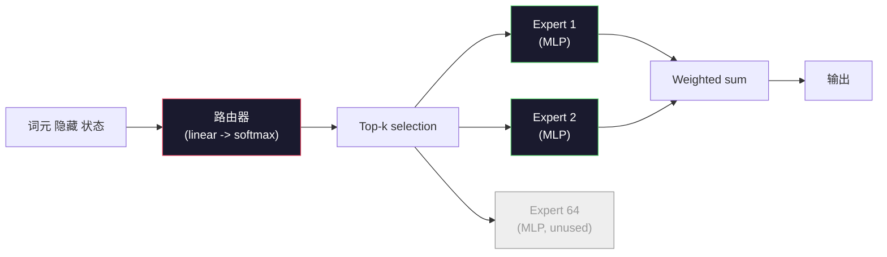

# 开放 模型: 架构 Walkthroughs

> 你built a GPT-2 Small from scratch in Lesson 04. Frontier 开放 模型 in 2026 are the same family with five or six concrete changes. RMSNorm instead of LayerNorm. SwiGLU instead of GELU. RoPE instead of learned positions. GQA or MLA instead of full MHA. Mixture-of-Experts at 规模. The math you already know covers 95% of them. This lesson reads Llama 3, DeepSeek-V3, Mixtral, Qwen, and Gemma side by side and names the exact line where each 架构 diverges.

**类型：** Learn
**语言：** Python (stdlib)
**先修：** Phase 10, Lessons 04, 05, 12 (Pre-training, 扩展, 推理)
**时间：** 约 45 分钟

## 学习目标

- Read the config.json of Llama 3, Mistral, Mixtral, Gemma 2, Qwen 2.5, and DeepSeek-V3 and explain every field
- Name the specific architectural change each 模型 made versus GPT-2 Small and justify it from first principles
- 计算 参数 count, KV 缓存 size, and 激活 内存 for any 开放 模型 from its 配置 alone
- 选择the right 开放 模型 for a deployment 目标 given 延迟, 内存, and capability constraints

## 问题

In Lesson 04 you wrote 350 lines of numpy and had a GPT-2-shaped 模型. Llama 3 405B has a 200-page technical report. Your instinct is that these are different beasts. They are not. The 200 pages describe the same object with five or six well-motivated modifications, plus a thousand implementation details about 扩展. The skeleton -- 嵌入, transformer 块, 注意力, MLP, norm, 头 -- is unchanged.

这lesson is a diff. For each major 开放 模型 family, we list exactly what changed from GPT-2, why, and what it 成本. When you are done you can read a fresh 模型 card and mentally translate it back to the GPT-2 基线.

这个practical payoff is that when Meta releases Llama 5 or DeepSeek releases V4, you will not need a new mental 模型. You will look at the 配置, see which of the well-known knobs moved, and know what the downstream implications are. The 2026 architectures are a finite toolbox. Each new 模型 picks a different subset.

## 概念

### The Invariant Core

All autoregressive 开放 模型 share:

- 词元 嵌入 matrix (vocab_size x hidden_dim).
- Stack of N 解码器 块: norm, self-attention, residual, norm, MLP, residual.
- Final norm and linear 头 projecting to vocab_size (often weight-tied with 嵌入s).
- 因果 掩码, next-token cross-entropy 损失.

那is the shape. The rest is knobs.

### The Six Knobs That Actually Move

Across every 2024-2026 frontier 开放 模型, the same six design choices get picked over and over:

1. **归一化.** LayerNorm -> RMSNorm.
2. **Positional encoding.** Learned absolute -> RoPE (plus variants: YaRN, NTK).
3. **激活.** GELU -> SwiGLU (or GeGLU).
4. **注意力 头 sharing.** MHA -> GQA -> MQA -> MLA.
5. **稠密 vs 稀疏 MLP.** 稠密 -> Mixture-of-Experts.
6. **Pre-norm placement.** Pre-norm stays. Post-norm is gone.

Everything else (学习 速率 调度, 数据 mix, 批次 size, 上下文 length) lives in the 训练 配置, not the 架构. Six knobs.

### Knob 1: RMSNorm

LayerNorm subtracts mean, divides by std, scales, and shifts. RMSNorm keeps only the 规模:

```text
RMSNorm(x) = x / sqrt(mean(x^2) + eps) * gamma
```

No mean subtraction. No 偏差. One matmul fewer per 词元. Zhang and Sennrich (2019) argued it matched LayerNorm on machine translation while being 10% faster. Every modern 开放 模型 runs it.

成本: none. Benefit: small throughput win, simpler code.

### Knob 2: RoPE

Learned position 嵌入s were a 1024-slot lookup table in GPT-2. 上下文 1025 is off the end of the table. 模型 cannot extrapolate beyond their 训练 length.

Rotary Position 嵌入 (RoPE, Su et al. 2021) injects position by rotating each Q and K vector in pairs before the 注意力 dot product. The angle of rotation is a deterministic 函数 of position, so there is nothing learned and nothing to run out of. With 扩展 tricks (NTK-aware interpolation, YaRN), a 模型 训练后的 on 8k 上下文 can stretch to 128k at 推理 with modest accuracy 损失.

```text
q_rotated = rotate(q, angle(pos))
k_rotated = rotate(k, angle(pos))
score = q_rotated . k_rotated
```

每个Llama, Mistral, Qwen, DeepSeek, and Gemma uses RoPE. Gemma 2 uses a hybrid (RoPE on most 层, local sliding-window 注意力 on others).

### Knob 3: SwiGLU

GPT-2's MLP is `x -> gelu(xW1 + b1) -> (...)W2 + b2`. SwiGLU (Shazeer 2020) replaces the 激活 with a gated product:

```text
SwiGLU(x) = (xW1) * sigmoid(xW1) * xV
```

Two projections in 并行 instead of one, gated by the Swish 激活. Empirically stronger on perplexity per 参数. Llama 2 adopted it, everyone followed. The MLP's 隐藏 size is usually set so that total 参数 count matches the original 稠密 MLP: if GPT-2 used `ff_dim = 4 * hidden`, SwiGLU uses `ff_dim = (2/3) * 4 * hidden = 8/3 * hidden`.

### Knob 4: 注意力 头 Sharing

GPT-2 used **Multi-Head 注意力 (MHA)**: every 头 has its own Q, K, V projection.

**Multi-Query 注意力 (MQA, Shazeer 2019)** shares one K and one V across all 头. Cuts the KV 缓存 by num_heads, which is a 12x to 32x reduction on a typical 模型. Accuracy drops slightly on hard benchmarks.

**Grouped-Query 注意力 (GQA, Ainslie et al. 2023)** is the middle ground: G groups of Q 头 share one K and one V. Llama 3 8B uses GQA with 32 Q 头 and 8 KV 头 (G=8), so the KV 缓存 shrinks 4x versus full MHA.

**Multi-Head 潜变量 注意力 (MLA, DeepSeek 2024)** compresses K and V into a shared low-rank 潜变量, projecting them back up per 头. Further reduces KV 缓存 while preserving per-head expressiveness. DeepSeek-V2 and V3 rely on this for their long-context performance.

|Scheme|KV 头|KV 缓存|Accuracy|
|--------|----------|----------|----------|
|MHA|num_heads|full|best|
|GQA|num_groups (G < num_heads)|num_heads / G reduction|near-MHA|
|MQA|1|num_heads reduction|small hit|
|MLA|潜变量, per-head decompression|smaller than MQA|near-MHA|

For any 模型 above ~13B 参数, GQA or MLA is effectively mandatory. Full MHA at 规模 is a KV 缓存 disaster.

### Knob 5: Mixture of Experts

一个稠密 MLP activates all its 参数 for every 词元. An MoE MLP has K experts per 块 and a 路由器 that picks the top-k experts per 词元 (typically top-2). Only those experts' 权重 see a forward pass for that 词元.

```text
router_logits = xW_r
indices, weights = top_k(router_logits, k=2)
output = sum_i weights[i] * expert[indices[i]](x)
```

这个appeal: you can have 64 experts of size 7B each (so total param count is huge) while only running 2 of them per 词元 (so per-token 计算 matches a 稠密 7B 模型). Mixtral 8x7B has 47B total 参数 but activates only 13B per 词元. DeepSeek-V3 has 671B total 参数 but activates only 37B per 词元.



Pros: same 计算, more 参数, better capacity. Cons: the expert 内存 still has to live somewhere (so serving needs more VRAM than a 稠密 equivalent), load-balancing the 路由器 is hard, and 微调 the 路由器 during 对齐 is its own research area.

### Knob 6: Pre-norm stays

这个original transformer applied 层 norm after each sublayer. Every 开放 模型 since GPT-2 puts it *before* each sublayer. Pre-norm is strictly easier to 训练 at 深度. Nothing to argue about.

### Model-by-Model Diff

Here is the table that makes all of this concrete.

|模型|Year|Total Params|Active Params|Norm|激活|Position|注意力|MoE|上下文|
|-------|------|-------------|---------------|------|-----------|----------|-----------|-----|---------|
|GPT-2 Small|2019|124M|124M|LayerNorm|GELU|Learned|MHA (12 头)|no|1k|
|Llama 3 8B|2024|8B|8B|RMSNorm|SwiGLU|RoPE|GQA (32/8)|no|128k|
|Llama 3 70B|2024|70B|70B|RMSNorm|SwiGLU|RoPE|GQA (64/8)|no|128k|
|Llama 3 405B|2024|405B|405B|RMSNorm|SwiGLU|RoPE|GQA (128/16)|no|128k|
|Mistral 7B|2023|7.2B|7.2B|RMSNorm|SwiGLU|RoPE|GQA|no|32k|
|Mixtral 8x7B|2023|47B|13B|RMSNorm|SwiGLU|RoPE|GQA|yes (8 experts, top-2)|32k|
|Gemma 2 9B|2024|9B|9B|RMSNorm (pre+post)|GeGLU|RoPE + sliding|GQA|no|8k|
|Qwen 2.5 72B|2024|72B|72B|RMSNorm|SwiGLU|RoPE (YaRN)|GQA (64/8)|no|128k|
|DeepSeek V2 236B|2024|236B|21B|RMSNorm|SwiGLU|RoPE|MLA|yes (160 experts, top-6)|128k|
|DeepSeek V3|2024|671B|37B|RMSNorm|SwiGLU|RoPE|MLA|yes (256 experts, top-8)|128k|

Scan the columns. RMSNorm is universal. SwiGLU or its GeGLU cousin is universal. RoPE is universal. GQA is universal above 7B except when replaced by MLA. MoE is the differentiator at the top end.

### Reading a config.json

Llama 3 8B 配置:

```text
{
  "hidden_size": 4096,
  "intermediate_size": 14336,
  "num_hidden_layers": 32,
  "num_attention_heads": 32,
  "num_key_value_heads": 8,
  "max_position_embeddings": 131072,
  "rope_theta": 500000.0,
  "rms_norm_eps": 1e-5,
  "vocab_size": 128256
}
```

每个field corresponds to something you have already implemented.

- `hidden_size`: 嵌入 维度.
- `intermediate_size`: MLP 隐藏 size (3.5x 隐藏 -- SwiGLU math).
- `num_hidden_layers`: stack 深度.
- `num_attention_heads`: Q 头.
- `num_key_value_heads`: KV 头 (GQA).
- `max_position_embeddings`: 训练 上下文 length.
- `rope_theta`: RoPE base frequency. Meta scaled it from the default 10k to 500k for long-context extrapolation.
- `rms_norm_eps`: numerical stability.
- `vocab_size`: 词元.

From these alone you 计算 total 参数, KV 缓存, and peak 激活 内存. See `code/main.py` for the exact formulas.

### 激活 内存 预算

Activations dominate 训练 内存 above a few billion 参数. The rule of thumb for 预训练 (with 梯度 checkpointing):

```text
activation_mem ~ batch_size * seq_len * hidden_size * num_layers * bytes_per_element
```

For Llama 3 8B at 批次 1, seq 8192, BF16, 32 层, 隐藏 4096: roughly 8 GB just for activations with checkpointing, 40 GB without. This is why flash-attention and ring-attention matter -- they rewrite the 注意力 computation so activations fit.

### KV 缓存 预算

For 推理 at max 上下文:

```text
kv_cache = 2 * num_layers * num_kv_heads * head_dim * max_seq_len * bytes_per_element
```

Llama 3 8B at 128k 上下文, BF16, head_dim = 隐藏 / num_heads = 128:
`2 * 32 * 8 * 128 * 131072 * 2 = 17.2 GB` per 序列.

这个8B 权重 are 16 GB in BF16. The KV 缓存 for a single 128k 序列 is larger than the 权重. This is the 内存 pressure driving GQA, MLA, and KV 缓存 量化 research.

### When Each 模型 Wins

- **Single 80GB GPU, no MoE**: Llama 3 8B, Mistral 7B, Gemma 2 9B. Easy to serve, wide tooling.
- **Single 节点 (8x80GB), big capacity**: Llama 3 70B, Qwen 2.5 72B. Highest 稠密 开放 capability.
- **Biggest 开放 capability, accept MoE complexity**: DeepSeek V3, Mixtral 8x22B. Best capability per active FLOP.
- **Long-context needs**: Llama 3 (128k with RoPE 扩展), DeepSeek (MLA advantage).
- **Low-latency serving**: Gemma 2 9B (sliding window cuts long-context 计算).

```figure
rmsnorm-vs-layernorm
```

## 动手构建

这个lesson's code is a calculator. Given any config.json, it prints 参数 count by component, KV 缓存 at max 上下文, SwiGLU MLP 比例, and a short verdict on the 架构 (稠密 / GQA / MLA / MoE).

```python
config = {
    "hidden_size": 4096, "intermediate_size": 14336,
    "num_hidden_layers": 32, "num_attention_heads": 32,
    "num_key_value_heads": 8, "vocab_size": 128256,
    "max_position_embeddings": 131072,
}
```

这个script walks the 架构 field by field, computes param counts for 嵌入, 注意力 (with GQA reduction), MLP (with SwiGLU expansion), layernorms, and the 头. It then computes the KV 缓存 at the stated 上下文 length and prints a summary.

See `code/main.py` for the implementation.

## 实际使用

运行the calculator on Llama 3 8B, Mistral 7B, Mixtral 8x7B, and DeepSeek V3 configs bundled in the script. Compare the 参数 breakdowns. Notice that the MoE 模型 have a total param count that dwarfs the 稠密 模型 but an active param count that is often smaller. Notice that DeepSeek V3's KV 缓存 is smaller than Llama 3 405B's despite having more total 参数 -- that is MLA in 动作.

Then plug in a 配置 for any 模型 you have locally, read the summary, and decide whether it fits your GPU.

## 交付成果

这lesson produces `outputs/skill-open-model-picker.md`. Given a deployment 目标 (GPU type, VRAM, 上下文 length, 延迟 预算) and a 任务 profile (chat, code, 推理, long-context), it recommends an 开放 模型, a 量化 scheme from Lesson 11, and an 推理 stack from Lesson 12, with explicit 推理 about the six architectural knobs.

## 练习

1. Read the Qwen 2.5 72B 配置 from HuggingFace. 计算 total 参数 from scratch. Compare to the HF-reported value and identify where any delta comes from (头 dim rounding, KV sharing factor, etc.).

2. DeepSeek V3 uses 256 experts with top-8 路由. 计算 the 比例 of activated experts to total experts and compare to Mixtral 8x7B's top-2 of 8. What does the shift from 稀疏 (25%) to denser 稀疏 (3%) imply about capacity per FLOP?

3. 计算 the KV 缓存 for Llama 3 405B at 128k 上下文 in FP8 and BF16. At FP8 it is half the BF16 number. How many 并行 sequences can you serve on a single 8xH100 节点 (80GB each = 640GB total, minus 权重 内存)?

4. Gemma 2 alternates full-attention and sliding-window-attention 层. Write the math for the KV 缓存 when half the 层 use a 4096-词元 sliding window instead of full 上下文. How much 内存 does that save at 8k total 上下文?

5. Find a recent frontier 开放 模型 that was released after this lesson was written. Identify which of the six knobs it picked and whether it introduced a seventh knob. The curriculum will feel out of date the moment a new 架构 ships -- the goal is to update your table without rebuilding your mental 模型.

## Key Terms

|Term|What people say|What it actually means|
|------|----------------|----------------------|
|RMSNorm|"LayerNorm without the mean"|Normalize by root mean square only, with a learned 规模 — cheaper and comparable to LayerNorm|
|RoPE|"Rotary positions"|Rotate each Q and K vector in 2D pairs by an angle that depends on position — extrapolates beyond 训练 length with 扩展 tricks|
|SwiGLU|"The new MLP 激活"|Gated linear unit with Swish: `(xW1) * sigmoid(xW1) * xV` — standard in every 2024+ 开放 模型|
|GQA|"Middle ground 注意力"|Grouped-Query 注意力: G groups of Q 头 share one K and one V 头 — shrinks KV 缓存 without MQA's accuracy hit|
|MLA|"DeepSeek's 注意力"|Multi-Head 潜变量 注意力: compress K/V into a shared low-rank 潜变量, decompress per 头 — smallest KV 缓存 for large 模型|
|MoE|"稀疏 experts"|Mixture of Experts: N MLPs per 块, 路由器 picks top-k per 词元 — huge total params, small active params|
|Top-k 路由|"Pick k experts per 词元"|The 路由器 computes a 分数 per expert and activates the k highest — typical k is 2 (Mixtral) to 8 (DeepSeek)|
|YaRN|"Stretch RoPE"|Yet another RoPE extension — interpolates rotary angles to extend 上下文 from 8k to 128k+ at 推理 time|
|Sliding-window 注意力|"Don't attend to everything"|Each 词元 attends only to the last W 词元 — caps 注意力 成本 at O(W) per 词元, used in Gemma 2 and early Mistral|
|Active params|"What runs per 词元"|For MoE 模型, the 参数 count that sees a forward pass per 词元 (much smaller than total params) — governs per-token FLOPs|

## 延伸阅读

- [Dubey et al., 2024 -- "The Llama 3 Herd of Models"](https://arxiv.org/abs/2407.21783) -- the architectural and 训练 参考 for the 稠密 Llama 3 family
- [DeepSeek-AI, 2024 -- "DeepSeek-V3 Technical Report"](https://arxiv.org/abs/2412.19437) -- MLA plus auxiliary-loss-free load balancing plus 671B MoE
- [Jiang et al., 2024 -- "Mixtral of Experts"](https://arxiv.org/abs/2401.04088) -- the canonical MoE 开放 模型 paper
- [Su et al., 2021 -- "RoFormer: Enhanced Transformer with Rotary Position Embedding"](https://arxiv.org/abs/2104.09864) -- the RoPE paper
- [Shazeer, 2020 -- "GLU Variants Improve Transformer"](https://arxiv.org/abs/2002.05202) -- SwiGLU, GeGLU, and friends
- [Ainslie et al., 2023 -- "GQA: Training Generalized Multi-Query Transformer Models"](https://arxiv.org/abs/2305.13245) -- the GQA paper
- [Gemma 2 Team, 2024 -- "Gemma 2: Improving Open Language Models at a Practical Size"](https://arxiv.org/abs/2408.00118) -- hybrid full+sliding 注意力, pre+post-norm
- [Qwen Team, 2024 -- "Qwen 2.5 Technical Report"](https://arxiv.org/abs/2412.15115) -- YaRN 上下文 extension and long-context 训练 recipes
