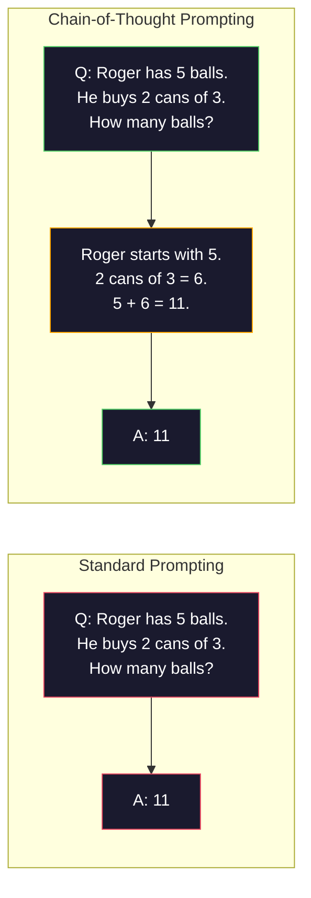
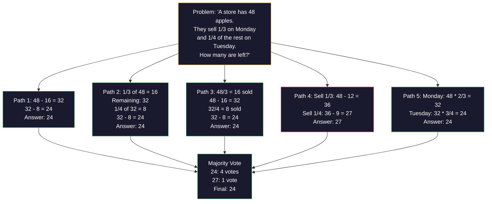
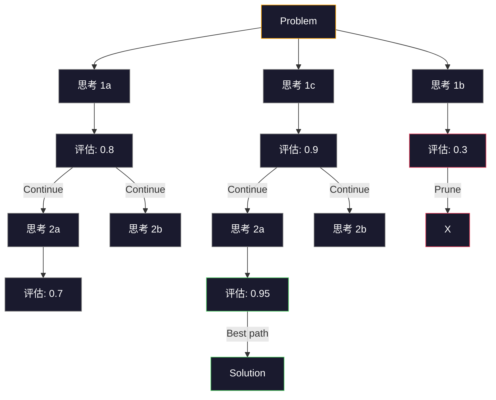

# 少样本, Chain-of-Thought, Tree-of-Thought

> Telling a 模型 what to do is prompting. Showing it how to think is engineering. The gap between 78% and 91% accuracy on the same 模型, same 任务, same 数据 is not a better 模型. It is a better 推理 strategy.

**类型：** Build
**语言：** Python
**先修：** Lesson 11.01 (提示词工程)
**时间：** 约 45 分钟

## 学习目标

- Implement 少样本 prompting by selecting and formatting example demonstrations that maximize 任务 accuracy
- Apply chain-of-thought (CoT) 推理 to improve accuracy on multi-step problems like math word problems
- 构建a tree-of-thought 提示词 that explores multiple 推理 paths and selects the best one
- Measure the accuracy improvement from 零样本 vs 少样本 vs CoT on a standard 基准

## 问题

你build a math tutoring app. Your 提示词 says: "Solve this word problem." GPT-5 gets it right 94% of the time on GSM8K, the standard grade-school math 基准. You think you already peaked. You do not — chain-of-thought still adds 3-4 points.

Add five words -- "Let's think 步骤 by 步骤" -- and accuracy jumps to 91%. Add a few worked examples and it reaches 95%. Same 模型. Same temperature. Same API 成本. The only difference is that you gave the 模型 scratch paper.

这is not a hack. It is how 推理 works. Humans do not solve multi-step problems in one mental leap. Neither do transformers. When you force a 模型 to 生成 intermediate 词元, those 词元 become part of the 上下文 for the next 词元. Each 推理 步骤 feeds the next. The 模型 literally computes its way to the 答案.

But "think 步骤 by 步骤" is the beginning, not the end. What if you sampled five 推理 paths and took a majority vote? What if you let the 模型 explore a tree of possibilities, evaluating and pruning branches? What if you interleaved 推理 with 工具使用? These are not hypotheticals. They are published techniques with measured improvements, and you will build all of them in this lesson.

## 概念

### 零样本 vs 少样本: When Examples Beat Instructions

零样本 prompting gives the 模型 a 任务 and nothing else. 少样本 prompting gives it examples first.

Wei et al. (2022) measured this across 8 benchmarks. For simple tasks like sentiment 分类, 零样本 and 少样本 performed within 2% of each other. For complex tasks like multi-step arithmetic and symbolic 推理, 少样本 improved accuracy by 10-25%.

这个intuition: examples are compressed instructions. Instead of describing the 输出 format, you show it. Instead of explaining the 推理 process, you demonstrate it. The 模型 pattern-matches on the examples more reliably than it interprets abstract instructions.


**When 少样本 wins:** format-sensitive tasks, 分类, 结构化 extraction, domain-specific jargon, any 任务 where the 模型 needs to match a specific pattern.

**When 零样本 wins:** simple factual 问题, creative tasks where examples constrain creativity, tasks where finding good examples is harder than writing good instructions.

### Example Selection: Similar Beats Random

Not all examples are equal. Choosing examples similar to the 目标 输入 outperforms random selection by 5-15% on 分类 tasks (Liu et al., 2022). Three principles:

1. **语义 相似度**: pick examples closest to the 输入 in 嵌入 space
2. **标签 diversity**: cover all 输出 categories in your examples
3. **Difficulty 匹配**: match the complexity level of the 目标 problem

这个optimal number of examples for most tasks is 3-5. Below 3, the 模型 does not have enough 信号 to extract the pattern. Above 5, you hit diminishing returns and waste 上下文 window 词元. For 分类 with many 标签s, use one example per 标签.

### Chain-of-Thought: Giving 模型 Scratch Paper

Chain-of-Thought (CoT) prompting was introduced by Wei et al. (2022) at Google Brain. The idea is simple: instead of asking the 模型 for just the 答案, ask it to show its 推理 步骤 first.



Why does this work mechanically? Each 词元 a transformer generates becomes 上下文 for the next 词元. Without CoT, the 模型 must compress all 推理 into the 隐藏 状态 of a single forward pass. With CoT, the 模型 externalizes intermediate computations as 词元. Each 推理 词元 extends the effective computation 深度.

**GSM8K benchmarks (grade-school math, 8.5K problems):**

|模型|零样本|零样本 CoT|少样本 CoT|
|-------|-----------|---------------|--------------|
|GPT-4o|78%|91%|95%|
|GPT-5|94%|97%|98%|
|o4-mini (推理)|97%|—|—|
|Claude Opus 4.7|93%|97%|98%|
|Gemini 3 Pro|92%|96%|98%|
|Llama 4 70B|80%|89%|94%|
|DeepSeek-V3.1|89%|94%|96%|

**Note on 推理 模型.** 模型 like OpenAI's o-series (o3, o4-mini) and DeepSeek-R1 run chain-of-thought internally before emitting their 答案. Adding "Let's think 步骤 by 步骤" to a 推理 模型 is redundant and sometimes counterproductive — they have already done it.

Two flavors of CoT:

**零样本 CoT**: append "Let's think 步骤 by 步骤" to the 提示词. No examples needed. Kojima et al. (2022) showed this single sentence improves accuracy across arithmetic, commonsense, and symbolic 推理 tasks.

**少样本 CoT**: provide examples that include 推理 步骤. More effective than 零样本 CoT because the 模型 sees the exact 推理 format you expect.

**When CoT hurts**: simple factual recall ("What is the capital of France?"), single-step 分类, tasks where speed matters more than accuracy. CoT adds 50-200 词元 of 推理 overhead per 查询. For high-throughput, low-complexity tasks, that is wasted 成本.

### Self-Consistency: 样本 Many, Vote Once

Wang et al. (2023) introduced self-consistency. The insight: a single CoT path might contain 推理 错误. But if you 样本 N independent 推理 paths (using temperature > 0) and take the majority vote on the final 答案, 错误 cancel out.



Self-consistency improved GSM8K accuracy from 56.5% (single CoT) to 74.4% with N=40 on the original PaLM 540B experiments. On GPT-5 the improvement is small (97% to 98%) because base accuracy is already saturated. The technique shines most on 模型 with 60-85% base CoT accuracy -- the sweet spot where single-path 错误 are frequent but not systematic. For 推理 模型 (o-series, R1) self-consistency is subsumed by the built-in internal 采样.

这个tradeoff: N 样本 means Nx the API 成本 and 延迟. In practice, N=5 captures most of the benefit. N=3 is the minimum for a meaningful vote. N > 10 has diminishing returns for most tasks.

### Tree-of-Thought: Branching Exploration

Yao et al. (2023) introduced Tree-of-Thought (ToT). Where CoT follows one linear 推理 path, ToT explores multiple branches and evaluates which are most promising before continuing.



ToT has three components:

1. **思考 生成**: produce multiple candidate next-steps
2. **状态 评估**: 分数 each candidate (can use the LLM itself as evaluator)
3. **Search algorithm**: BFS or DFS through the tree, pruning low-scoring branches

On the Game of 24 任务 (combine 4 numbers using arithmetic to make 24), GPT-4 with standard prompting solves 7.3% of problems. With CoT, 4.0% (CoT actually hurts here because the search space is wide). With ToT, 74%.

ToT is expensive. Each 节点 in the tree requires an LLM call. A tree with branching factor 3 and 深度 3 requires up to 39 LLM calls. Use it only for problems where the search space is large but evaluatable -- planning, puzzle solving, creative problem-solving with constraints.

### ReAct: Thinking + Doing

Yao et al. (2022) combined 推理 traces with actions. The 模型 alternates between thinking (generating 推理) and acting (calling 工具, searching, computing).

```mermaid
graph LR
    Q["问题:\nWhat is the\npopulation of the\ncountry where\nthe Eiffel Tower\nis located?"]
    T1["思考: I need to\nfind which country\nhas the Eiffel Tower"]
    A1["动作: search\n'Eiffel Tower location'"]
    O1["Observation:\nParis, France"]
    T2["思考: Now I need\nFrance's population"]
    A2["动作: search\n'France population 2024'"]
    O2["Observation:\n68.4 million"]
    T3["思考: I have\nthe 答案"]
    F["答案:\n68.4 million"]

    Q --> T1 --> A1 --> O1 --> T2 --> A2 --> O2 --> T3 --> F

    style Q fill:#1a1a2e,stroke:#ffa500,color:#fff
    style T1 fill:#1a1a2e,stroke:#51cf66,color:#fff
    style A1 fill:#1a1a2e,stroke:#e94560,color:#fff
    style O1 fill:#1a1a2e,stroke:#808080,color:#fff
    style T2 fill:#1a1a2e,stroke:#51cf66,color:#fff
    style A2 fill:#1a1a2e,stroke:#e94560,color:#fff
    style O2 fill:#1a1a2e,stroke:#808080,color:#fff
    style T3 fill:#1a1a2e,stroke:#51cf66,color:#fff
    style F fill:#1a1a2e,stroke:#51cf66,color:#fff
```



ReAct outperforms pure CoT on knowledge-intensive tasks because it can ground its 推理 in 真实 数据. On HotpotQA (multi-hop 问题 回答), ReAct with GPT-4 achieves 35.1% exact match vs 29.4% for CoT alone. The 真实 power is that 推理 错误 get corrected by observations -- the 模型 can update its plan mid-execution.

ReAct is the foundation of modern AI agents. Every 智能体 framework (LangChain, CrewAI, AutoGen) implements some variant of the Thought-Action-Observation 循环. You will build full agents in Phase 14. This lesson covers the prompting pattern.

### 结构化 Prompting: XML Tags, Delimiters, Headers

As prompts get complex, structure prevents the 模型 from confusing sections. Three approaches:

**XML tags** (works best with Claude, solid everywhere):
```text
<context>
You are reviewing a pull request.
The codebase uses TypeScript and React.
</context>

<task>
Review the following diff for bugs, security issues, and style violations.
</task>

<diff>
{diff_content}
</diff>

<output_format>
List each issue with: file, line, severity (critical/warning/info), description.
</output_format>
```

**Markdown headers** (universal):
```text
## Role
Senior security engineer at a fintech company.

## Task
Analyze this API endpoint for vulnerabilities.

## Input
{api_code}

## Rules
- Focus on OWASP Top 10
- Rate each finding: critical, high, medium, low
- Include remediation steps
```

**Delimiters** (minimal but effective):
```text
---INPUT---
{user_text}
---END INPUT---

---INSTRUCTIONS---
Summarize the above in 3 bullet points.
---END INSTRUCTIONS---
```

### 提示词 Chaining: Sequential Decomposition

Some tasks are too complex for a single 提示词. 提示词 chaining breaks them into 步骤, where the 输出 of one 提示词 becomes the 输入 of the next.


Chaining beats single-prompt for three reasons:

1. **Each 步骤 is simpler**: the 模型 handles one focused 任务 instead of juggling everything
2. **Intermediate outputs are inspectable**: you can 验证 and correct between 步骤
3. **Different 步骤 can use different 模型**: use a cheap 模型 for extraction, an expensive one for 推理

### Performance Comparison

|Technique|Best For|GSM8K Accuracy (GPT-5)|API Calls|词元 Overhead|Complexity|
|-----------|----------|------------------------|-----------|----------------|------------|
|零样本|Simple tasks|94%|1|None|Trivial|
|少样本|Format 匹配|96%|1|200-500 词元|Low|
|零样本 CoT|Quick 推理 boost|97%|1|50-200 词元|Trivial|
|少样本 CoT|Maximum single-call accuracy|98%|1|300-600 词元|Low|
|Self-Consistency (N=5)|High-stakes 推理|98.5%|5|5x 词元 成本|Medium|
|推理 模型 (o4-mini)|Drop-in CoT replacement|97%|1|隐藏 (2-10x internal)|Trivial|
|Tree-of-Thought|Search/planning problems|N/A (74% on Game of 24)|10-40+|10-40x 词元 成本|High|
|ReAct|Knowledge-grounded 推理|N/A (35.1% on HotpotQA)|3-10+|Variable|High|
|提示词 Chaining|Complex multi-step tasks|96% (流水线)|2-5|2-5x 词元 成本|Medium|

这个right technique depends on three factors: accuracy requirement, 延迟 预算, and 成本 tolerance. For most 生产 systems, 少样本 CoT with a 3-样本 self-consistency 备选方案 covers 90% of use cases.

## 动手构建

We will build a math problem solver that combines 少样本 prompting, chain-of-thought 推理, and self-consistency voting into a single 流水线. Then we will add tree-of-thought for hard problems.

这个full implementation is in `code/advanced_prompting.py`. Here are the key components.

### 步骤 1: 少样本 Example Store

这个first component manages 少样本 examples and selects the most relevant ones for a given problem.

```python
GSM8K_EXAMPLES = [
    {
        "question": "Janet's ducks lay 16 eggs per day. She eats three for breakfast every morning and bakes muffins for her friends every day with four. She sells every egg at the farmers' market for $2. How much does she make every day at the farmers' market?",
        "reasoning": "Janet's ducks lay 16 eggs per day. She eats 3 and bakes 4, using 3 + 4 = 7 eggs. So she has 16 - 7 = 9 eggs left. She sells each for $2, so she makes 9 * 2 = $18 per day.",
        "answer": "18"
    },
    ...
]
```

Each example has three parts: the 问题, the 推理 链, and the final 答案. The 推理 链 is what transforms a regular 少样本 example into a CoT 少样本 example.

### 步骤 2: Chain-of-Thought 提示词 Builder

这个提示词 builder assembles a 系统 消息, 少样本 examples with 推理 chains, and the 目标 问题 into a single 提示词.

```python
def build_cot_prompt(question, examples, num_examples=3):
    system = (
        "You are a math problem solver. "
        "For each problem, show your step-by-step reasoning, "
        "then give the final numerical answer on the last line "
        "in the format: 'The answer is [number]'."
    )

    example_text = ""
    for ex in examples[:num_examples]:
        example_text += f"Q: {ex['question']}\n"
        example_text += f"A: {ex['reasoning']} The answer is {ex['answer']}.\n\n"

    user = f"{example_text}Q: {question}\nA:"
    return system, user
```

这个format constraint ("The 答案 is [number]") is critical. Without it, self-consistency cannot extract and compare answers across 样本.

### 步骤 3: Self-Consistency Voting

样本 N 推理 paths and take the majority 答案.

```python
def self_consistency_solve(question, examples, client, model, n_samples=5):
    system, user = build_cot_prompt(question, examples)

    answers = []
    reasonings = []
    for _ in range(n_samples):
        response = client.chat.completions.create(
            model=model,
            messages=[
                {"role": "system", "content": system},
                {"role": "user", "content": user}
            ],
            temperature=0.7
        )
        text = response.choices[0].message.content
        reasonings.append(text)
        answer = extract_answer(text)
        if answer is not None:
            answers.append(answer)

    vote_counts = Counter(answers)
    best_answer = vote_counts.most_common(1)[0][0] if vote_counts else None
    confidence = vote_counts[best_answer] / len(answers) if best_answer else 0

    return best_answer, confidence, reasonings, vote_counts
```

Temperature 0.7 is important. At temperature 0.0, all N 样本 would be identical, defeating the purpose. You need enough randomness for diverse 推理 paths but not so much that the 模型 produces gibberish.

### 步骤 4: Tree-of-Thought Solver

For problems where linear 推理 fails, ToT explores multiple approaches and evaluates which direction is most promising.

```python
def tree_of_thought_solve(question, client, model, breadth=3, depth=3):
    thoughts = generate_initial_thoughts(question, client, model, breadth)
    scored = [(t, evaluate_thought(t, question, client, model)) for t in thoughts]
    scored.sort(key=lambda x: x[1], reverse=True)

    for current_depth in range(1, depth):
        next_thoughts = []
        for thought, score in scored[:2]:
            extensions = extend_thought(thought, question, client, model, breadth)
            for ext in extensions:
                ext_score = evaluate_thought(ext, question, client, model)
                next_thoughts.append((ext, ext_score))
        scored = sorted(next_thoughts, key=lambda x: x[1], reverse=True)

    best_thought = scored[0][0] if scored else ""
    return extract_answer(best_thought), best_thought
```

这个evaluator is itself an LLM call. You ask the 模型: "On a 规模 of 0.0 to 1.0, how promising is this 推理 path for solving the problem?" This is the key insight of ToT -- the 模型 evaluates its own partial solutions.

### 步骤 5: Full 流水线

这个流水线 combines all techniques with an escalation strategy.

```python
def solve_with_escalation(question, examples, client, model):
    system, user = build_cot_prompt(question, examples)
    single_response = call_llm(client, model, system, user, temperature=0.0)
    single_answer = extract_answer(single_response)

    sc_answer, confidence, _, _ = self_consistency_solve(
        question, examples, client, model, n_samples=5
    )

    if confidence >= 0.8:
        return sc_answer, "self_consistency", confidence

    tot_answer, _ = tree_of_thought_solve(question, client, model)
    return tot_answer, "tree_of_thought", None
```

这个escalation logic: try cheap (single CoT) first. If self-consistency confidence is below 0.8 (less than 4 of 5 样本 agree), escalate to ToT. This balances 成本 and accuracy -- most problems are solved cheaply, hard problems get more 计算.

## 实际使用

### With LangChain

LangChain provides built-in support for 提示词 templates and 输出 parsing that simplify 少样本 and CoT patterns:

```python
from langchain_core.prompts import FewShotPromptTemplate, PromptTemplate
from langchain_openai import ChatOpenAI

example_prompt = PromptTemplate(
    input_variables=["question", "reasoning", "answer"],
    template="Q: {question}\nA: {reasoning} The answer is {answer}."
)

few_shot_prompt = FewShotPromptTemplate(
    examples=examples,
    example_prompt=example_prompt,
    suffix="Q: {input}\nA: Let's think step by step.",
    input_variables=["input"]
)

llm = ChatOpenAI(model="gpt-4o", temperature=0.7)
chain = few_shot_prompt | llm
result = chain.invoke({"input": "If a train travels 120 km in 2 hours..."})
```

LangChain also has `ExampleSelector` classes for 语义 相似度 selection:

```python
from langchain_core.example_selectors import SemanticSimilarityExampleSelector
from langchain_openai import OpenAIEmbeddings

selector = SemanticSimilarityExampleSelector.from_examples(
    examples,
    OpenAIEmbeddings(),
    k=3
)
```

### With DSPy

DSPy treats prompting strategies as optimizable modules. Instead of handcrafting CoT prompts, you define a signature and let DSPy 优化 the 提示词:

```python
import dspy

dspy.configure(lm=dspy.LM("openai/gpt-4o", temperature=0.7))

class MathSolver(dspy.Module):
    def __init__(self):
        self.solve = dspy.ChainOfThought("question -> answer")

    def forward(self, question):
        return self.solve(question=question)

solver = MathSolver()
result = solver(question="Janet's ducks lay 16 eggs per day...")
```

DSPy's `ChainOfThought` automatically adds 推理 traces. `dspy.majority` implements self-consistency:

```python
result = dspy.majority(
    [solver(question=q) for _ in range(5)],
    field="answer"
)
```

### Comparison: From-Scratch vs Frameworks

|特征|From-Scratch (this lesson)|LangChain|DSPy|
|---------|--------------------------|-----------|------|
|Control over 提示词 format|Full|Template-based|Automatic|
|Self-consistency|Manual voting|Manual|Built-in (`dspy.majority`)|
|Example selection|Custom logic|`ExampleSelector`|`dspy.BootstrapFewShot`|
|Tree-of-Thought|Custom tree search|Community chains|Not built-in|
|提示词 优化|Manual iteration|Manual|Automatic compilation|
|Best for|学习, custom pipelines|Standard workflows|Research, 优化|

## 交付成果

这lesson produces two 工件.

**1. 推理 链 提示词** (`outputs/prompt-reasoning-chain.md`): a production-ready 提示词 template for 少样本 CoT with self-consistency. Plug in your examples and problem 领域.

**2. CoT Pattern Selection Skill** (`outputs/skill-cot-patterns.md`): a decision framework for choosing the right 推理 technique based on 任务 type, accuracy requirements, and 成本 constraints.

## 练习

1. **Measure the gap**: Take 10 GSM8K problems. Solve each with 零样本, 少样本, 零样本 CoT, and 少样本 CoT. Record accuracy for each. Which technique gives the biggest lift on your 模型?

2. **Example selection experiment**: For the same 10 problems, compare random example selection vs hand-picked similar examples. Measure accuracy difference. At what point does example 质量 matter more than example quantity?

3. **Self-consistency 成本 曲线**: Run self-consistency with N=1, 3, 5, 7, 10 on 20 GSM8K problems. Plot accuracy vs 成本 (total 词元). Where is the knee of the 曲线 for your 模型?

4. **Build a ReAct 循环**: Extend the 流水线 with a calculator 工具. When the 模型 generates a math expression, execute it with Python's `eval()` (in a sandbox) and feed the result back. Measure if tool-grounded 推理 outperforms pure CoT.

5. **ToT for creative tasks**: Adapt the Tree-of-Thought solver for a creative writing 任务: "Write a 6-word story that is both funny and sad." Use the LLM as evaluator. Does branching exploration produce better creative outputs than single-shot 生成?

## Key Terms

|Term|What people say|What it actually means|
|------|----------------|----------------------|
|少样本 prompting|"Give it some examples"|Including input-output demonstrations in the 提示词 to anchor the 模型's 输出 format and behavior|
|Chain-of-Thought|"Make it think 步骤 by 步骤"|Eliciting intermediate 推理 词元 that extend the 模型's effective computation before producing a final 答案|
|Self-Consistency|"Run it multiple times"|采样 N diverse 推理 paths at temperature > 0 and selecting the most common final 答案 by majority vote|
|Tree-of-Thought|"Let it explore options"|结构化 search over 推理 branches where each partial solution is evaluated and only promising paths are expanded|
|ReAct|"Thinking + 工具使用"|Interleaving 推理 traces with external actions (search, 计算, API calls) in a Thought-Action-Observation 循环|
|提示词 chaining|"Break it into 步骤"|Decomposing a complex 任务 into sequential prompts where each 输出 feeds the next 输入|
|零样本 CoT|"Just add 'think 步骤 by 步骤'"|Appending a 推理 trigger phrase to a 提示词 without any examples, relying on the 模型's 潜变量 推理 capability|

## 延伸阅读

- [Chain-of-Thought Prompting Elicits Reasoning in Large Language Models](https://arxiv.org/abs/2201.11903) -- Wei et al. 2022. The original CoT paper from Google Brain. Read sections 2-3 for the core results.
- [Self-Consistency Improves Chain of Thought Reasoning in Language Models](https://arxiv.org/abs/2203.11171) -- Wang et al. 2023. The self-consistency paper. Table 1 has all the numbers you need.
- [Tree of Thoughts: Deliberate Problem Solving with Large Language Models](https://arxiv.org/abs/2305.10601) -- Yao et al. 2023. ToT paper. The Game of 24 results in section 4 are the highlight.
- [ReAct: Synergizing Reasoning and Acting in Language Models](https://arxiv.org/abs/2210.03629) -- Yao et al. 2022. The foundation of modern AI agents. Section 3 explains the Thought-Action-Observation 循环.
- [Large Language Models are Zero-Shot Reasoners](https://arxiv.org/abs/2205.11916) -- Kojima et al. 2022. The "Let's think 步骤 by 步骤" paper. Surprisingly effective for how simple it is.
- [DSPy: Compiling Declarative Language Model Calls into Self-Improving Pipelines](https://arxiv.org/abs/2310.03714) -- Khattab et al. 2023. Treats prompting as a compilation problem. Read if you want to move beyond manual 提示词工程.
- [OpenAI — Reasoning models guide](https://platform.openai.com/docs/guides/reasoning) -- vendor guidance on when chain-of-thought becomes an internal, priced-per-token "推理" mode versus a prompt-level trick.
- [Lightman et al., "Let's Verify Step by Step" (2023)](https://arxiv.org/abs/2305.20050) -- process 奖励模型s (PRM) that grade each 步骤 of a 链; the 推理 supervision 信号 that succeeds outcome-only rewards.
- [Snell et al., "Scaling LLM Test-Time Compute Optimally" (2024)](https://arxiv.org/abs/2408.03314) -- systematic study of CoT length, self-consistency 采样, and MCTS; where "think 步骤 by 步骤" goes when accuracy matters more than 延迟.
