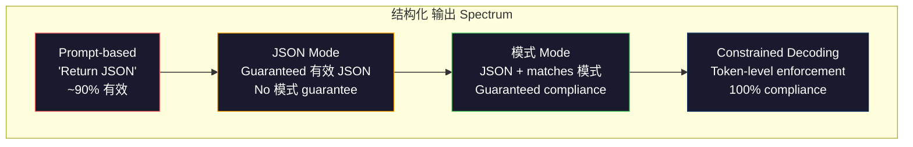
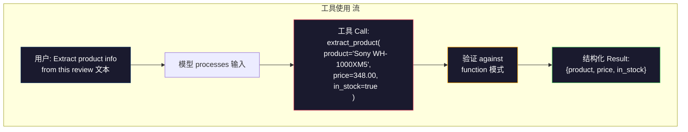

# 结构化输出: JSON, 模式 验证, Constrained Decoding

> 你的LLM returns a string. Your 应用 needs JSON. That gap has crashed more 生产 systems than any 模型 幻觉. 结构化 输出 is the bridge between natural language and typed 数据. Get it right and your LLM becomes a reliable API. Get it wrong and you're parsing free-text with regex at 3am.

**类型：** Build
**语言：** Python
**先修：** Phase 10, Lessons 01-05 (LLMs from Scratch)
**时间：** 约 90 分钟
**Related:** Phase 5 · 20 (结构化输出 & Constrained Decoding) covers the decoder-level theory (FSM/CFG logit processors, Outlines, XGrammar). This lesson focuses on the 生产 SDK surface (OpenAI `response_format`, Anthropic 工具使用, Instructor) — read Phase 5 · 20 first if you want to understand what is happening below the API.

## 学习目标

- Implement JSON-mode and schema-constrained outputs using OpenAI and Anthropic API 参数
- 构建a Pydantic 验证 层 that rejects malformed LLM outputs and retries with 错误 feedback
- 解释how constrained decoding forces 有效 JSON at the 词元 level without post-processing
- Design robust extraction prompts that reliably convert unstructured 文本 into typed 数据 structures

## 问题

你ask an LLM: "Extract the product name, price, and availability from this 文本." It responds:

```text
The product is the Sony WH-1000XM5 headphones, which cost $348.00 and are currently in stock.
```

那is a perfectly correct 答案. It is also completely useless to your 应用. Your inventory 系统 needs `{"product": "Sony WH-1000XM5", "price": 348.00, "in_stock": true}`. You need a JSON object with specific keys, specific types, and specific value constraints. You do not need a sentence.

这个naive solution: add "Respond in JSON" to your 提示词. This works 90% of the time. The other 10% the 模型 wraps the JSON in markdown code fences, or adds a preamble like "Here's the JSON:", or produces syntactically 无效 JSON because it closed a bracket early. Your JSON parser crashes. Your 流水线 breaks. You add try/except and a retry 循环. The retry sometimes produces different 数据. Now you have a consistency problem on top of a parsing problem.

这is not a 提示词工程 problem. It is a decoding problem. The 模型 generates 词元 left to right. At each position, it picks the most likely next 词元 from a 词表 of 100K+ options. Most of those options would produce 无效 JSON at any given position. If the 模型 just emitted `{"price":`, the next 词元 must be a digit, a quote (for string), `null`, `true`, `false`, or a negative sign. Anything else produces 无效 JSON. Without constraints, the 模型 might pick a perfectly reasonable English word that is catastrophically wrong syntactically.

## 概念

### The 结构化 输出 Spectrum

There are four levels of 结构化 输出 control, each more reliable than the last.



**Prompt-based** ("Respond in 有效 JSON"): no enforcement. The 模型 usually complies but sometimes does not. Reliability: ~90%. 失败模式: markdown fences, preamble 文本, truncated 输出, wrong structure.

**JSON mode**: the API guarantees the 输出 is 有效 JSON. OpenAI's `response_format: { type: "json_object" }` enables this. The 输出 will parse without 错误. But it may not match your expected 模式 -- extra keys, wrong types, missing fields.

**模式 mode**: the API takes a JSON 模式 and guarantees the 输出 matches it. In 2026 every major provider supports this natively: OpenAI's `response_format: { type: "json_schema", json_schema: {...} }` (also as `tool_choice="required"`), Anthropic's 工具使用 with `input_schema`, and Gemini's `response_schema` + `response_mime_type: "application/json"`. The 输出 has the exact keys, types, and constraints you specified.

**Constrained decoding**: at each 词元 position during 生成, the 解码器 masks out all 词元 that would produce 无效 输出. If the 模式 requires a number and the 模型 is about to emit a letter, that 词元 is set to 概率 zero. The 模型 can only produce 词元 that lead to 有效 输出. This is what OpenAI's 结构化 输出 mode and libraries like Outlines and Guidance implement under the hood.

### JSON 模式: The Contract Language

JSON 模式 is how you tell the 模型 (or 验证 层) what shape the 输出 must have. Every major 结构化 输出 系统 uses it.

```json
{
  "type": "object",
  "properties": {
    "product": { "type": "string" },
    "price": { "type": "number", "minimum": 0 },
    "in_stock": { "type": "boolean" },
    "categories": {
      "type": "array",
      "items": { "type": "string" }
    }
  },
  "required": ["product", "price", "in_stock"]
}
```

这模式 says: the 输出 must be an object with a string `product`, a non-negative number `price`, a boolean `in_stock`, and an optional array of string `categories`. Any 输出 that does not match gets rejected.

Schemas handle the hard cases: nested objects, arrays with typed items, enums (constrain a string to specific values), pattern 匹配 (regex on strings), and combinators (oneOf, anyOf, allOf for polymorphic outputs).

### The Pydantic Pattern

In Python, you do not write JSON 模式 by hand. You define a Pydantic 模型 and it generates the 模式 for you.

```python
from pydantic import BaseModel

class Product(BaseModel):
    product: str
    price: float
    in_stock: bool
    categories: list[str] = []
```

这produces the same JSON 模式 as above. The Instructor library (and OpenAI's SDK) accept Pydantic 模型 directly: pass the 模型 class, get back a validated instance. If the LLM 输出 does not match, Instructor retries automatically.

### 函数调用 / 工具使用

一个替代方案 interface for the same problem. Instead of asking the 模型 to produce JSON directly, you define "工具" (函数) with typed 参数. The 模型 outputs a 函数 call with 结构化 arguments. OpenAI calls this "函数调用." Anthropic calls it "工具使用." The result is the same: 结构化 数据.



工具 use is preferred when the 模型 needs to choose which 函数 to call, not just fill in 参数. If you have 10 different extraction schemas and the 模型 must pick the right one based on the 输入, 工具使用 gives you both the 模式 selection and the 结构化 输出.

### Common Failure Modes

Even with 模式 enforcement, 结构化输出 can fail in subtle ways.

**Hallucinated values**: the 输出 matches the 模式 but contains invented 数据. The 模型 produces `{"price": 299.99}` when the 文本 says $348. 模式 验证 cannot catch this -- the type is correct, the value is wrong.

**Enum confusion**: you constrain a field to `["in_stock", "out_of_stock", "preorder"]`. The 模型 outputs `"available"` -- semantically correct, but not in the allowed set. Good constrained decoding prevents this. Prompt-based approaches do not.

**Nested object 深度**: deeply nested schemas (4+ levels) produce more 错误. Each level of nesting is another place where the 模型 can lose track of structure.

**Array length**: the 模型 may produce too many or too few items in an array. Schemas support `minItems` and `maxItems` but not all providers enforce them at the decoding level.

**Optional field omission**: the 模型 omits fields that are technically optional but semantically important for your use case. Set them as required in the 模式 even if the 数据 is sometimes missing -- force the 模型 to produce `null` explicitly.

## 动手构建

### 步骤 1: JSON 模式 Validator

构建a validator from scratch that checks whether a Python object matches a JSON 模式. This is what runs on the 输出 side to verify compliance.

```python
import json

def validate_schema(data, schema):
    errors = []
    _validate(data, schema, "", errors)
    return errors

def _validate(data, schema, path, errors):
    schema_type = schema.get("type")

    if schema_type == "object":
        if not isinstance(data, dict):
            errors.append(f"{path}: expected object, got {type(data).__name__}")
            return
        for key in schema.get("required", []):
            if key not in data:
                errors.append(f"{path}.{key}: required field missing")
        properties = schema.get("properties", {})
        for key, value in data.items():
            if key in properties:
                _validate(value, properties[key], f"{path}.{key}", errors)

    elif schema_type == "array":
        if not isinstance(data, list):
            errors.append(f"{path}: expected array, got {type(data).__name__}")
            return
        min_items = schema.get("minItems", 0)
        max_items = schema.get("maxItems", float("inf"))
        if len(data) < min_items:
            errors.append(f"{path}: array has {len(data)} items, minimum is {min_items}")
        if len(data) > max_items:
            errors.append(f"{path}: array has {len(data)} items, maximum is {max_items}")
        items_schema = schema.get("items", {})
        for i, item in enumerate(data):
            _validate(item, items_schema, f"{path}[{i}]", errors)

    elif schema_type == "string":
        if not isinstance(data, str):
            errors.append(f"{path}: expected string, got {type(data).__name__}")
            return
        enum_values = schema.get("enum")
        if enum_values and data not in enum_values:
            errors.append(f"{path}: '{data}' not in allowed values {enum_values}")

    elif schema_type == "number":
        if not isinstance(data, (int, float)):
            errors.append(f"{path}: expected number, got {type(data).__name__}")
            return
        minimum = schema.get("minimum")
        maximum = schema.get("maximum")
        if minimum is not None and data < minimum:
            errors.append(f"{path}: {data} is less than minimum {minimum}")
        if maximum is not None and data > maximum:
            errors.append(f"{path}: {data} is greater than maximum {maximum}")

    elif schema_type == "boolean":
        if not isinstance(data, bool):
            errors.append(f"{path}: expected boolean, got {type(data).__name__}")

    elif schema_type == "integer":
        if not isinstance(data, int) or isinstance(data, bool):
            errors.append(f"{path}: expected integer, got {type(data).__name__}")
```

### 步骤 2: Pydantic-Style 模型 to 模式

构建a minimal class-to-schema converter. Define a Python class and 生成 its JSON 模式 automatically.

```python
class SchemaField:
    def __init__(self, field_type, required=True, default=None, enum=None, minimum=None, maximum=None):
        self.field_type = field_type
        self.required = required
        self.default = default
        self.enum = enum
        self.minimum = minimum
        self.maximum = maximum

def python_type_to_schema(field):
    type_map = {
        str: "string",
        int: "integer",
        float: "number",
        bool: "boolean",
    }

    schema = {}

    if field.field_type in type_map:
        schema["type"] = type_map[field.field_type]
    elif field.field_type == list:
        schema["type"] = "array"
        schema["items"] = {"type": "string"}
    elif isinstance(field.field_type, dict):
        schema = field.field_type

    if field.enum:
        schema["enum"] = field.enum
    if field.minimum is not None:
        schema["minimum"] = field.minimum
    if field.maximum is not None:
        schema["maximum"] = field.maximum

    return schema

def model_to_schema(name, fields):
    properties = {}
    required = []

    for field_name, field in fields.items():
        properties[field_name] = python_type_to_schema(field)
        if field.required:
            required.append(field_name)

    return {
        "type": "object",
        "properties": properties,
        "required": required,
    }
```

### 步骤 3: Constrained 词元 Filter

Simulate constrained decoding. Given a partial JSON string and a 模式, determine which 词元 categories are 有效 at the current position.

```python
def next_valid_tokens(partial_json, schema):
    stripped = partial_json.strip()

    if not stripped:
        return ["{"]

    try:
        json.loads(stripped)
        return ["<EOS>"]
    except json.JSONDecodeError:
        pass

    last_char = stripped[-1] if stripped else ""

    if last_char == "{":
        return ['"', "}"]
    elif last_char == '"':
        if stripped.endswith('":'):
            return ['"', "0-9", "true", "false", "null", "[", "{"]
        return ["a-z", '"']
    elif last_char == ":":
        return [" ", '"', "0-9", "true", "false", "null", "[", "{"]
    elif last_char == ",":
        return [" ", '"', "{", "["]
    elif last_char in "0123456789":
        return ["0-9", ".", ",", "}", "]"]
    elif last_char == "}":
        return [",", "}", "]", "<EOS>"]
    elif last_char == "]":
        return [",", "}", "<EOS>"]
    elif last_char == "[":
        return ['"', "0-9", "true", "false", "null", "{", "[", "]"]
    else:
        return ["any"]

def demonstrate_constrained_decoding():
    partial_states = [
        '',
        '{',
        '{"product"',
        '{"product":',
        '{"product": "Sony"',
        '{"product": "Sony",',
        '{"product": "Sony", "price":',
        '{"product": "Sony", "price": 348',
        '{"product": "Sony", "price": 348}',
    ]

    print(f"{'Partial JSON':<45} {'Valid Next Tokens'}")
    print("-" * 80)
    for state in partial_states:
        valid = next_valid_tokens(state, {})
        display = state if state else "(empty)"
        print(f"{display:<45} {valid}")
```

### 步骤 4: Extraction 流水线

Combine everything into an extraction 流水线: define a 模式, simulate an LLM producing 结构化 输出, 验证 the 输出, and handle retries.

```python
def simulate_llm_extraction(text, schema, attempt=0):
    if "headphones" in text.lower() or "sony" in text.lower():
        if attempt == 0:
            return '{"product": "Sony WH-1000XM5", "price": 348.00, "in_stock": true, "categories": ["audio", "headphones"]}'
        return '{"product": "Sony WH-1000XM5", "price": 348.00, "in_stock": true}'

    if "laptop" in text.lower():
        return '{"product": "MacBook Pro 16", "price": 2499.00, "in_stock": false, "categories": ["computers"]}'

    return '{"product": "Unknown", "price": 0, "in_stock": false}'

def extract_with_retry(text, schema, max_retries=3):
    for attempt in range(max_retries):
        raw = simulate_llm_extraction(text, schema, attempt)

        try:
            data = json.loads(raw)
        except json.JSONDecodeError as e:
            print(f"  Attempt {attempt + 1}: JSON parse error -- {e}")
            continue

        errors = validate_schema(data, schema)
        if not errors:
            return data

        print(f"  Attempt {attempt + 1}: Schema validation errors -- {errors}")

    return None

product_schema = {
    "type": "object",
    "properties": {
        "product": {"type": "string"},
        "price": {"type": "number", "minimum": 0},
        "in_stock": {"type": "boolean"},
        "categories": {"type": "array", "items": {"type": "string"}},
    },
    "required": ["product", "price", "in_stock"],
}
```

### 步骤 5: Run the Full 流水线

```python
def run_demo():
    print("=" * 60)
    print("  Structured Output Pipeline Demo")
    print("=" * 60)

    print("\n--- Schema Definition ---")
    product_fields = {
        "product": SchemaField(str),
        "price": SchemaField(float, minimum=0),
        "in_stock": SchemaField(bool),
        "categories": SchemaField(list, required=False),
    }
    generated_schema = model_to_schema("Product", product_fields)
    print(json.dumps(generated_schema, indent=2))

    print("\n--- Schema Validation ---")
    test_cases = [
        ({"product": "Test", "price": 10.0, "in_stock": True}, "Valid object"),
        ({"product": "Test", "price": -5.0, "in_stock": True}, "Negative price"),
        ({"product": "Test", "in_stock": True}, "Missing price"),
        ({"product": "Test", "price": "ten", "in_stock": True}, "String as price"),
        ("not an object", "String instead of object"),
    ]

    for data, label in test_cases:
        errors = validate_schema(data, product_schema)
        status = "PASS" if not errors else f"FAIL: {errors}"
        print(f"  {label}: {status}")

    print("\n--- Constrained Decoding Simulation ---")
    demonstrate_constrained_decoding()

    print("\n--- Extraction Pipeline ---")
    texts = [
        "The Sony WH-1000XM5 headphones are priced at $348 and currently available.",
        "The new MacBook Pro 16-inch laptop costs $2499 but is sold out.",
        "This is a random sentence with no product info.",
    ]

    for text in texts:
        print(f"\n  Input: {text[:60]}...")
        result = extract_with_retry(text, product_schema)
        if result:
            print(f"  Output: {json.dumps(result)}")
        else:
            print(f"  Output: FAILED after retries")
```

## 实际使用

### OpenAI 结构化输出

```python
# from openai import OpenAI
# from pydantic import BaseModel
#
# client = OpenAI()
#
# class Product(BaseModel):
#     product: str
#     price: float
#     in_stock: bool
#
# response = client.beta.chat.completions.parse(
#     model="gpt-5-mini",
#     messages=[
#         {"role": "system", "content": "Extract product information."},
#         {"role": "user", "content": "Sony WH-1000XM5, $348, in stock"},
#     ],
#     response_format=Product,
# )
#
# product = response.choices[0].message.parsed
# print(product.product, product.price, product.in_stock)
```

OpenAI's 结构化 输出 mode uses constrained decoding internally. Every 词元 the 模型 generates is guaranteed to produce 输出 匹配 the Pydantic 模式. No retries needed. No 验证 needed. The constraint is baked into the decoding process.

### Anthropic 工具使用

```python
# import anthropic
#
# client = anthropic.Anthropic()
#
# response = client.messages.create(
#     model="claude-opus-4-7",
#     max_tokens=1024,
#     tools=[{
#         "name": "extract_product",
#         "description": "Extract product information from text",
#         "input_schema": {
#             "type": "object",
#             "properties": {
#                 "product": {"type": "string"},
#                 "price": {"type": "number"},
#                 "in_stock": {"type": "boolean"},
#             },
#             "required": ["product", "price", "in_stock"],
#         },
#     }],
#     messages=[{"role": "user", "content": "Extract: Sony WH-1000XM5, $348, in stock"}],
# )
```

Anthropic achieves 结构化 输出 through 工具使用. The 模型 emits a 工具 call with 结构化 arguments that match the input_schema. Same result, different API surface.

### Instructor Library

```python
# pip install instructor
# import instructor
# from openai import OpenAI
# from pydantic import BaseModel
#
# client = instructor.from_openai(OpenAI())
#
# class Product(BaseModel):
#     product: str
#     price: float
#     in_stock: bool
#
# product = client.chat.completions.create(
#     model="gpt-5-mini",
#     response_model=Product,
#     messages=[{"role": "user", "content": "Sony WH-1000XM5, $348, in stock"}],
# )
```

Instructor wraps any LLM 客户端 and adds automatic retries with 验证. If the first attempt fails 验证, it sends the 错误 back to the 模型 as 上下文 and asks it to fix the 输出. This works with any provider, not just OpenAI.

## 交付成果

这lesson produces `outputs/prompt-structured-extractor.md` -- a 可复用 提示词 template that extracts 结构化 数据 from any 文本 given a 模式 definition. Feed it a JSON 模式 and unstructured 文本, and it returns validated JSON.

It also produces `outputs/skill-structured-outputs.md` -- a decision framework for choosing the right 结构化 输出 strategy based on your provider, reliability requirements, and 模式 complexity.

## 练习

1. Extend the 模式 validator to support `oneOf` (the 数据 must match exactly one of several schemas). This handles polymorphic outputs -- for example, a field that can be either a `Product` or a `Service` object with different shapes.

2. 构建a "模式 diff" 工具 that compares two schemas and identifies breaking changes (removed required fields, changed types) versus non-breaking changes (added optional fields, relaxed constraints). This is essential for versioning your extraction schemas in 生产.

3. Implement a more realistic constrained decoding simulator. Given a JSON 模式 and a 词表 of 100 词元 (letters, digits, punctuation, keywords), walk through 生成 步骤 by 步骤, masking 无效 词元 at each position. Measure what percentage of the 词表 is 有效 at each 步骤.

4. 构建an extraction 评估 suite. Create 50 product descriptions with hand-标签ed JSON outputs. Run your extraction 流水线 on all 50 and measure exact match, field-level accuracy, and type compliance. Identify which fields are hardest to extract correctly.

5. Add "confidence scores" to your extraction 流水线. For each extracted field, estimate how confident the 模型 is (based on 词元 概率, or by running extraction 3 times and measuring consistency). Flag low-confidence fields for human review.

## Key Terms

|Term|What people say|What it actually means|
|------|----------------|----------------------|
|JSON mode|"Returns JSON"|API flag that guarantees syntactically 有效 JSON 输出, but does not enforce any particular 模式|
|结构化 输出|"类型d JSON"|输出 that matches a specific JSON 模式 with correct keys, types, and constraints|
|Constrained decoding|"Guided 生成"|At each 词元 position, 掩码 out 词元 that would produce 无效 输出 -- guarantees 100% 模式 compliance|
|JSON 模式|"A JSON template"|A declarative language for describing the structure, types, and constraints of JSON 数据 (used by OpenAPI, JSON Forms, etc.)|
|Pydantic|"Python dataclasses+"|Python library that defines 数据 模型 with type 验证, used by FastAPI and Instructor to 生成 JSON Schemas|
|函数 calling|"工具 use"|LLM outputs a 结构化 函数 invocation (name + typed arguments) instead of free 文本 -- OpenAI and Anthropic both support this|
|Instructor|"Pydantic for LLMs"|Python library that wraps LLM clients to return validated Pydantic instances, with automatic retry on 验证 failure|
|词元 masking|"Filtering the 词表"|Setting specific 词元 概率 to zero during 生成 so the 模型 cannot produce them|
|模式 compliance|"Matches the shape"|The 输出 has every required field, correct types, values within constraints, and no extra disallowed fields|
|Retry 循环|"Try again until it works"|Send 验证 错误 back to the 模型 and ask it to fix the 输出 -- Instructor does this automatically, up to a configurable max|

## 延伸阅读

- [OpenAI Structured Outputs Guide](https://platform.openai.com/docs/guides/structured-outputs) -- official documentation for JSON Schema-based constrained decoding in the OpenAI API
- [Willard & Louf, 2023 -- "Efficient Guided Generation for Large Language Models"](https://arxiv.org/abs/2307.09702) -- the Outlines paper, describing how to compile JSON Schemas into finite 状态 machines for token-level constraints
- [Instructor documentation](https://python.useinstructor.com/) -- the standard library for getting 结构化输出 from any LLM with Pydantic 验证 and retries
- [Anthropic Tool Use Guide](https://docs.anthropic.com/en/docs/tool-use) -- how Claude implements 结构化 输出 via 工具使用 with JSON 模式 input_schema
- [JSON Schema specification](https://json-schema.org/) -- the full spec for the 模式 language used by every major 结构化 输出 系统
- [Outlines library](https://github.com/outlines-dev/outlines) -- open-source constrained 生成 using regex and JSON 模式 compiled to finite 状态 machines
- [Dong et al., "XGrammar: Flexible and Efficient Structured Generation Engine for Large Language Models" (MLSys 2025)](https://arxiv.org/abs/2411.15100) -- the current state-of-the-art grammar engine; pushdown-automaton compilation that masks 词元 at ~100 ns / 词元.
- [Beurer-Kellner et al., "Prompting Is Programming: A Query Language for Large Language Models" (LMQL)](https://arxiv.org/abs/2212.06094) -- the LMQL paper framing constrained decoding as a 查询 language with type and value constraints.
- [Microsoft Guidance (framework docs)](https://github.com/guidance-ai/guidance) -- template-driven constrained 生成; vendor-agnostic complement to Outlines and XGrammar.
