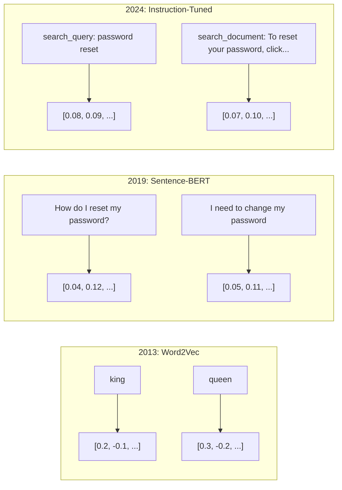
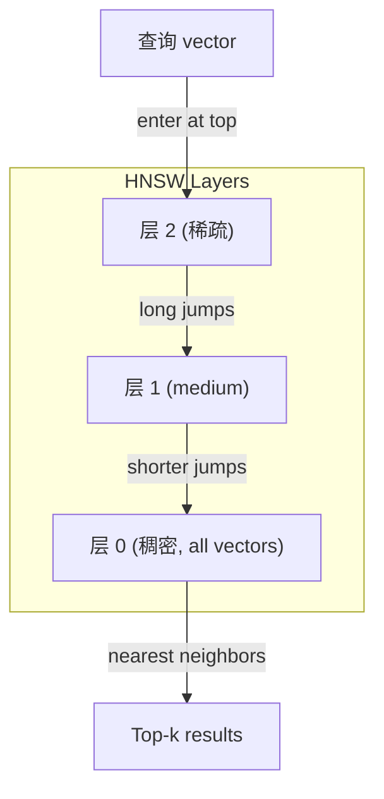

# 嵌入s & 向量表示s

> 文本 is discrete. Math is continuous. Every time you ask an LLM to find "similar" 文档, compare meanings, or search beyond keywords, you're relying on a bridge between these two worlds. That bridge is an 嵌入. If you don't understand 嵌入s, you don't understand modern AI. You just use it.

**类型：** Build
**语言：** Python
**先修：** Phase 11, Lesson 01 (提示词工程)
**时间：** 约 75 分钟
**Related:** Phase 5 · 22 (嵌入 模型 Deep Dive) covers 稠密 vs 稀疏 vs multi-vector, Matryoshka truncation, and per-axis 模型 selection. This lesson focuses on the 生产 流水线 (vector DBs, HNSW, 相似度 math). Read Phase 5 · 22 before picking a 模型.

## 学习目标

- 生成 文本 嵌入s using API providers and open-source 模型, and 计算 cosine 相似度 between them
- 解释why 嵌入s solve the 词表 mismatch problem that keyword search cannot handle
- 构建a 语义 search index that retrieves 文档 by meaning rather than exact keyword match
- Evaluate 嵌入 质量 using 检索 benchmarks (precision@k, recall) and choose the right 嵌入 模型 for your 任务

## 问题

你have 10,000 support tickets. A customer writes "my payment didn't go through." You need to find similar past tickets. Keyword search finds tickets containing "payment" and "didn't go through." It misses "transaction failed," "charge was declined," and "billing 错误." These tickets describe the exact same problem with completely different words.

这is the 词表 mismatch problem. Human language has dozens of ways to say the same thing. Keyword search treats each word as an independent symbol with no meaning. It cannot know that "declined" and "didn't go through" refer to the same concept.

你need a representation of 文本 where meaning, not spelling, determines 相似度. You need a way to place "my payment didn't go through" and "transaction was declined" close together in some mathematical space, while pushing "my payment arrived on time" far away despite sharing the word "payment."

那representation is an 嵌入.

## 概念

### What Is an 嵌入?

一个嵌入 is a 稠密 vector of floating-point numbers that represents the meaning of 文本. The word "稠密" matters -- every 维度 carries information, unlike 稀疏 representations (bag-of-words, TF-IDF) where most 维度 are zero.

"The cat sat on the mat" becomes something like `[0.023, -0.041, 0.087, ..., 0.012]` -- a list of 768 to 3072 numbers depending on the 模型. These numbers encode meaning. You never inspect them directly. You compare them.

### The Word2Vec Breakthrough

In 2013, Tomas Mikolov and colleagues at Google published Word2Vec. The core insight: 训练 a neural network to 预测 a word from its neighbors (or neighbors from a word), and the 隐藏 层 权重 become meaningful 向量表示s.

这个famous result:

```text
king - man + woman = queen
```

Vector arithmetic on word 嵌入s captures 语义 relationships. The direction from "man" to "woman" is roughly the same as the direction from "king" to "queen." This was the moment the field realized that geometry could encode meaning.

Word2Vec produced 300-dimensional vectors. Each word got one vector regardless of 上下文. "Bank" in "river bank" and "bank account" had the same 嵌入. This limitation drove the next decade of research.

### From Words to Sentences

Word 嵌入s represent single 词元. 生产 systems need to embed entire sentences, paragraphs, or 文档. Four approaches emerged:

**Averaging**: take the mean of all word vectors in the sentence. Cheap, lossy, surprisingly decent for short 文本. Loses word order entirely -- "dog bites man" and "man bites dog" get identical 嵌入s.

**CLS 词元**: transformer 模型 (BERT, 2018) 输出 a special [CLS] 词元 嵌入 that represents the entire 输入. Better than averaging but the [CLS] 词元 was 训练后的 for next-sentence 预测, not 相似度.

**Contrastive 学习**: 训练 the 模型 explicitly to push similar pairs together and dissimilar pairs apart. Sentence-BERT (Reimers & Gurevych, 2019) used this approach and became the foundation for modern 嵌入 模型. Given "How do I reset my password?" and "I need to change my password," the 模型 learns these should have nearly identical vectors.

**Instruction-tuned 嵌入s**: the latest approach. 模型 like E5 and GTE accept a 任务 prefix ("search_query:", "search_document:") that tells the 模型 what kind of 嵌入 to produce. This lets one 模型 serve multiple tasks.



### Modern 嵌入 模型

这个market has settled into a handful of production-grade options (MTEB scores as of early 2026, MTEB v2):

|模型|Provider|维度|MTEB|上下文|成本 / 1M 词元|
|-------|----------|-----------|------|---------|------------------|
|Gemini 嵌入 2|Google|3072 (Matryoshka)|67.7 (检索)|8192|$0.15|
|embed-v4|Cohere|1024 (Matryoshka)|65.2|128K|$0.12|
|voyage-4|Voyage AI|1024/2048 (Matryoshka)|66.8|32K|$0.12|
|text-嵌入-3-large|OpenAI|3072 (Matryoshka)|64.6|8192|$0.13|
|text-嵌入-3-small|OpenAI|1536 (Matryoshka)|62.3|8192|$0.02|
|BGE-M3|BAAI|1024 (稠密+稀疏+ColBERT)|63.0 multilingual|8192|Open-weight|
|Qwen3-嵌入|Alibaba|4096 (Matryoshka)|66.9|32K|Open-weight|
|Nomic-embed-v2|Nomic|768 (Matryoshka)|63.1|8192|Open-weight|

MTEB (Massive 文本 嵌入 基准) v2 covers 100+ tasks across 检索, 分类, clustering, 重排, and summarization. Higher is better. By 2026, open-weight 模型 (Qwen3-嵌入, BGE-M3) match or beat closed 托管 模型 on most axes. Gemini 嵌入 2 leads pure 检索; Voyage/Cohere lead specific domains (finance, law, code). Always 基准 on your own 查询 before committing.

### 相似度 指标

给定two 嵌入 vectors, three ways to measure how similar they are:

**Cosine 相似度**: the cosine of the angle between two vectors. Ranges from -1 (opposite) to 1 (identical direction). Ignores magnitude -- a 10-word sentence and a 500-word 文档 can 分数 1.0 if they point the same direction. This is the default for 90% of use cases.

```text
cosine_sim(a, b) = dot(a, b) / (||a|| * ||b||)
```

**Dot product**: the raw inner product of two vectors. Identical to cosine 相似度 when vectors are normalized (unit length). Faster to 计算. OpenAI's 嵌入s are normalized, so dot product and cosine give the same 排序.

```text
dot(a, b) = sum(a_i * b_i)
```

**Euclidean (L2) distance**: straight-line distance in the vector space. Smaller = more similar. Sensitive to magnitude differences. Use when the absolute position in space matters, not just the direction.

```text
L2(a, b) = sqrt(sum((a_i - b_i)^2))
```

当to use which:

|指标|Use when|Avoid when|
|--------|----------|------------|
|Cosine 相似度|Comparing texts of different lengths; most 检索 tasks|Magnitude carries information|
|Dot product|嵌入s are already normalized; maximum speed|Vectors have varying magnitudes|
|Euclidean distance|Clustering; spatial nearest-neighbor problems|Comparing 文档 of wildly different lengths|

### Vector Databases and HNSW

一个brute-force 相似度 search compares the 查询 against every stored vector. At 1 million vectors with 1536 维度, that is 1.5 billion multiply-add operations per 查询. Too slow.

Vector databases solve this with Approximate Nearest Neighbor (ANN) algorithms. The dominant algorithm is HNSW (Hierarchical Navigable Small World):

1. 构建a multi-layer 图 of vectors
2. Top 层 are 稀疏 -- long-range connections between distant clusters
3. Bottom 层 are 稠密 -- fine-grained connections between nearby vectors
4. Search starts at the top 层, greedily descending to refine
5. Returns approximate top-k results in O(log n) time instead of O(n)

HNSW trades a small accuracy 损失 (typically 95-99% recall) for massive speed gains. At 10 million vectors, brute force takes seconds. HNSW takes milliseconds.



生产 options:

|Database|类型|Best for|Max 规模|
|----------|------|----------|-----------|
|Pinecone|Managed SaaS|Zero-ops 生产|Billions|
|Weaviate|开放 来源|Self-hosted, hybrid search|100M+|
|Qdrant|开放 来源|High performance, filtering|100M+|
|ChromaDB|Embedded|Prototyping, local dev|1M|
|pgvector|Postgres extension|Already using Postgres|10M|
|FAISS|Library|In-process, research|1B+|

### 分块 Strategies

文档 are too long to embed as single vectors. A 50-page PDF covers dozens of topics -- its 嵌入 becomes an average of everything, similar to nothing specific. You split 文档 into chunks and embed each one.

**修复ed-size 分块**: split every N 词元 with M-token overlap. Simple and predictable. Works well when 文档 have no clear structure. A 512-词元 分块 with 50-词元 overlap: 分块 1 is 词元 0-511, 分块 2 is 词元 462-973.

**Sentence-based 分块**: split at sentence boundaries, grouping sentences until reaching the 词元 限制. Each 分块 is at least one complete sentence. Better than fixed-size because you never cut a 思考 in half.

**Recursive 分块**: try splitting at the largest boundary first (section headers). If still too large, try paragraph boundaries. Then sentence boundaries. Then character limits. This is LangChain's `RecursiveCharacterTextSplitter` and it works well for mixed-format corpora.

**语义 分块**: embed each sentence, then group consecutive sentences whose 嵌入s are similar. When the 嵌入 相似度 drops below a 阈值, start a new 分块. Expensive (requires 嵌入 every sentence individually) but produces the most coherent chunks.

|Strategy|Complexity|质量|Best for|
|----------|-----------|---------|----------|
|修复ed-size|Low|Decent|Unstructured 文本, logs|
|Sentence-based|Low|Good|Articles, emails|
|Recursive|Medium|Good|Markdown, HTML, mixed docs|
|语义|High|Best|Critical 检索 质量|

这个sweet spot for most systems: 256-512 词元 chunks with 50-词元 overlap.

### Bi-Encoders vs Cross-Encoders

一个bi-encoder embeds the 查询 and 文档 independently, then compares vectors. Fast -- you embed the 查询 once and compare against pre-computed 文档 嵌入s. This is what you use for 检索.

一个cross-encoder takes the 查询 and a 文档 as a single 输入 and outputs a relevance 分数. Slow -- it processes each query-document pair through the full 模型. But far more accurate because it can attend across 查询 and 文档 词元 simultaneously.

这个生产 pattern: bi-encoder retrieves top-100 candidates, cross-encoder reranks them to top-10. This is the retrieve-then-rerank 流水线.


重排 模型: Cohere Rerank 3.5 ($2 per 1000 查询), BGE-reranker-v2 (free, 开放 来源), Jina Reranker v2 (free, 开放 来源).

### Matryoshka 嵌入s

Traditional 嵌入s are all-or-nothing. A 1536-dimensional vector uses 1536 floats. You cannot truncate to 256 维度 without retraining.

Matryoshka Representation 学习 (Kusupati et al., 2022) fixes this. The 模型 is 训练后的 so that the first N 维度 capture the most important information, like a Russian nesting doll. Truncating a 1536-d Matryoshka 嵌入 to 256 维度 loses some accuracy but remains functional.

OpenAI's text-嵌入-3-small and text-嵌入-3-large support Matryoshka truncation via the `dimensions` 参数. Requesting 256 维度 instead of 1536 cuts storage by 6x with roughly 3-5% accuracy 损失 on MTEB benchmarks.

### Binary 量化

一个1536-dimensional 嵌入 stored as float32 uses 6,144 bytes. Multiply by 10 million 文档: 61 GB just for vectors.

Binary 量化 converts each float to a single bit: positive values become 1, negative values become 0. Storage drops from 6,144 bytes to 192 bytes -- a 32x reduction. 相似度 is computed using Hamming distance (count differing bits), which CPUs can do in a single instruction.

这个accuracy hit is around 5-10% on 检索 recall. The common pattern: binary 量化 for the first-pass search over millions of vectors, then rescore the top-1000 with full-precision vectors. This gets you 95%+ of full-precision accuracy at 32x less 内存.

```figure
cosine-similarity
```

## 动手构建

We build a 语义 search engine from scratch. No vector database. No external 嵌入 API. Pure Python with numpy for the math.

### 步骤 1: 文本 分块

```python
def chunk_text(text, chunk_size=200, overlap=50):
    words = text.split()
    chunks = []
    start = 0
    while start < len(words):
        end = start + chunk_size
        chunk = " ".join(words[start:end])
        chunks.append(chunk)
        start += chunk_size - overlap
    return chunks


def chunk_by_sentences(text, max_chunk_tokens=200):
    sentences = text.replace("\n", " ").split(".")
    sentences = [s.strip() + "." for s in sentences if s.strip()]
    chunks = []
    current_chunk = []
    current_length = 0
    for sentence in sentences:
        sentence_length = len(sentence.split())
        if current_length + sentence_length > max_chunk_tokens and current_chunk:
            chunks.append(" ".join(current_chunk))
            current_chunk = []
            current_length = 0
        current_chunk.append(sentence)
        current_length += sentence_length
    if current_chunk:
        chunks.append(" ".join(current_chunk))
    return chunks
```

### 步骤 2: Building 嵌入s from Scratch

We implement a simple 稠密 嵌入 using TF-IDF with L2 归一化. This is not a neural 嵌入, but it follows the same contract: 文本 in, fixed-size vector out, similar texts produce similar vectors.

```python
import math
import numpy as np
from collections import Counter

class SimpleEmbedder:
    def __init__(self):
        self.vocab = []
        self.idf = []
        self.word_to_idx = {}

    def fit(self, documents):
        vocab_set = set()
        for doc in documents:
            vocab_set.update(doc.lower().split())
        self.vocab = sorted(vocab_set)
        self.word_to_idx = {w: i for i, w in enumerate(self.vocab)}
        n = len(documents)
        self.idf = np.zeros(len(self.vocab))
        for i, word in enumerate(self.vocab):
            doc_count = sum(1 for doc in documents if word in doc.lower().split())
            self.idf[i] = math.log((n + 1) / (doc_count + 1)) + 1

    def embed(self, text):
        words = text.lower().split()
        count = Counter(words)
        total = len(words) if words else 1
        vec = np.zeros(len(self.vocab))
        for word, freq in count.items():
            if word in self.word_to_idx:
                tf = freq / total
                vec[self.word_to_idx[word]] = tf * self.idf[self.word_to_idx[word]]
        norm = np.linalg.norm(vec)
        if norm > 0:
            vec = vec / norm
        return vec
```

### 步骤 3: 相似度 函数

```python
def cosine_similarity(a, b):
    dot = np.dot(a, b)
    norm_a = np.linalg.norm(a)
    norm_b = np.linalg.norm(b)
    if norm_a == 0 or norm_b == 0:
        return 0.0
    return float(dot / (norm_a * norm_b))


def dot_product(a, b):
    return float(np.dot(a, b))


def euclidean_distance(a, b):
    return float(np.linalg.norm(a - b))
```

### 步骤 4: Vector Index with Brute-Force Search

```python
class VectorIndex:
    def __init__(self):
        self.vectors = []
        self.texts = []
        self.metadata = []

    def add(self, vector, text, meta=None):
        self.vectors.append(vector)
        self.texts.append(text)
        self.metadata.append(meta or {})

    def search(self, query_vector, top_k=5, metric="cosine"):
        scores = []
        for i, vec in enumerate(self.vectors):
            if metric == "cosine":
                score = cosine_similarity(query_vector, vec)
            elif metric == "dot":
                score = dot_product(query_vector, vec)
            elif metric == "euclidean":
                score = -euclidean_distance(query_vector, vec)
            else:
                raise ValueError(f"Unknown metric: {metric}")
            scores.append((i, score))
        scores.sort(key=lambda x: x[1], reverse=True)
        results = []
        for idx, score in scores[:top_k]:
            results.append({
                "text": self.texts[idx],
                "score": score,
                "metadata": self.metadata[idx],
                "index": idx
            })
        return results

    def size(self):
        return len(self.vectors)
```

### 步骤 5: The 语义 Search Engine

```python
class SemanticSearchEngine:
    def __init__(self, chunk_size=200, overlap=50):
        self.embedder = SimpleEmbedder()
        self.index = VectorIndex()
        self.chunk_size = chunk_size
        self.overlap = overlap

    def index_documents(self, documents, source_names=None):
        all_chunks = []
        all_sources = []
        for i, doc in enumerate(documents):
            chunks = chunk_text(doc, self.chunk_size, self.overlap)
            all_chunks.extend(chunks)
            name = source_names[i] if source_names else f"doc_{i}"
            all_sources.extend([name] * len(chunks))
        self.embedder.fit(all_chunks)
        for chunk, source in zip(all_chunks, all_sources):
            vec = self.embedder.embed(chunk)
            self.index.add(vec, chunk, {"source": source})
        return len(all_chunks)

    def search(self, query, top_k=5, metric="cosine"):
        query_vec = self.embedder.embed(query)
        return self.index.search(query_vec, top_k, metric)

    def search_with_scores(self, query, top_k=5):
        results = self.search(query, top_k)
        return [
            {
                "text": r["text"][:200],
                "source": r["metadata"].get("source", "unknown"),
                "score": round(r["score"], 4)
            }
            for r in results
        ]
```

### 步骤 6: Comparing 相似度 指标

```python
def compare_metrics(engine, query, top_k=3):
    results = {}
    for metric in ["cosine", "dot", "euclidean"]:
        hits = engine.search(query, top_k=top_k, metric=metric)
        results[metric] = [
            {"score": round(h["score"], 4), "preview": h["text"][:80]}
            for h in hits
        ]
    return results
```

## 实际使用

With a 生产 嵌入 API, the 架构 stays identical. Only the embedder changes:

```python
from openai import OpenAI

client = OpenAI()

def openai_embed(texts, model="text-embedding-3-small", dimensions=None):
    kwargs = {"model": model, "input": texts}
    if dimensions:
        kwargs["dimensions"] = dimensions
    response = client.embeddings.create(**kwargs)
    return [item.embedding for item in response.data]
```

Matryoshka truncation with OpenAI -- same 模型, fewer 维度, lower storage:

```python
full = openai_embed(["semantic search query"], dimensions=1536)
compact = openai_embed(["semantic search query"], dimensions=256)
```

这个256-d vector uses 6x less storage. For 10 million 文档, that is 10 GB vs 61 GB. The accuracy 损失 is roughly 3-5% on standard benchmarks.

For 重排 with Cohere:

```python
import cohere

co = cohere.ClientV2()

results = co.rerank(
    model="rerank-v3.5",
    query="What is the refund policy?",
    documents=["Full refund within 30 days...", "No refunds after 90 days..."],
    top_n=3
)
```

For local 嵌入s with no API dependency:

```python
from sentence_transformers import SentenceTransformer

model = SentenceTransformer("BAAI/bge-small-en-v1.5")
embeddings = model.encode(["semantic search query", "another document"])
```

这个VectorIndex class from our build works with any of these. Swap the 嵌入 函数, keep the search logic.

## 交付成果

这lesson produces:
- `outputs/prompt-embedding-advisor.md` -- a 提示词 for choosing 嵌入 模型 and strategies for specific use cases
- `outputs/skill-embedding-patterns.md` -- a skill that teaches agents how to use 嵌入s effectively in 生产

## 练习

1. **指标 comparison**: run the same 5 查询 against the 样本 文档 using cosine 相似度, dot product, and euclidean distance. Record the top-3 results for each. For which 查询 do the 指标 disagree? Why?

2. **分块 size experiment**: index the 样本 文档 with 分块 sizes of 50, 100, 200, and 500 words. For each, run 5 查询 and record the top-1 相似度 分数. Plot the relationship between 分块 size and 检索 质量. Find the point where larger chunks start hurting.

3. **Matryoshka simulation**: build a SimpleEmbedder that produces 500-d vectors. Truncate to 50, 100, 200, and 500 维度. Measure how 检索 recall degrades at each truncation. This simulates Matryoshka behavior without needing the 真实 训练 trick.

4. **Binary 量化**: take the 嵌入s from the search engine, convert them to binary (1 if positive, 0 if negative), and implement Hamming distance search. Compare the top-10 results against full-precision cosine 相似度. Measure the overlap percentage.

5. **Sentence-based 分块**: replace fixed-size 分块 with `chunk_by_sentences`. Run the same 查询 and compare 检索 scores. Does respecting sentence boundaries improve the results?

## Key Terms

|Term|What people say|What it actually means|
|------|----------------|----------------------|
|嵌入|"文本 to numbers"|A 稠密 vector where geometric proximity encodes 语义 相似度|
|Word2Vec|"The OG 嵌入"|2013 模型 that learned word vectors by predicting 上下文 words; proved vector arithmetic encodes meaning|
|Cosine 相似度|"How similar are two vectors"|Cosine of the angle between vectors; 1 = identical direction, 0 = orthogonal, -1 = opposite|
|HNSW|"Fast vector search"|Hierarchical Navigable Small World 图 -- multi-layer structure enabling O(log n) approximate nearest neighbor search|
|Bi-encoder|"Embed separately, compare fast"|Encodes 查询 and 文档 independently into vectors; enables pre-computation and fast 检索|
|Cross-encoder|"Slow but accurate reranker"|Processes query-document pair jointly through the full 模型; higher accuracy, no pre-computation|
|Matryoshka 嵌入s|"Truncatable vectors"|嵌入s 训练后的 so the first N 维度 capture the most important information, enabling variable-size storage|
|Binary 量化|"1-bit 嵌入s"|Converting float vectors to binary (sign bit only) for 32x storage reduction with Hamming distance search|
|分块|"Split docs for 嵌入"|Breaking 文档 into 256-512 词元 segments so each can be independently embedded and 检索到的|
|Vector database|"Search engine for 嵌入s"|数据 store optimized for storing vectors and performing approximate nearest neighbor search at 规模|
|Contrastive 学习|"训练 by comparison"|训练 approach that pushes similar pair 嵌入s together and dissimilar pair 嵌入s apart|
|MTEB|"The 嵌入 基准"|Massive 文本 嵌入 基准 -- 56 datasets across 8 tasks; standard for comparing 嵌入 模型|

## 延伸阅读

- Mikolov et al., "Efficient Estimation of Word Representations in Vector Space" (2013) -- the Word2Vec paper that started the 嵌入 revolution with the king-queen analogy
- Reimers & Gurevych, "Sentence-BERT: Sentence 嵌入s using Siamese BERT-Networks" (2019) -- how to 训练 bi-encoders for sentence-level 相似度, foundation of modern 嵌入 模型
- Kusupati et al., "Matryoshka Representation 学习" (2022) -- the technique behind variable-dimension 嵌入s that OpenAI adopted for text-嵌入-3
- Malkov & Yashunin, "Efficient and Robust Approximate Nearest Neighbor using Hierarchical Navigable Small World Graphs" (2018) -- the HNSW paper, the algorithm behind most 生产 vector search
- OpenAI 嵌入s Guide (platform.openai.com/docs/guides/嵌入s) -- practical 参考 for text-嵌入-3 模型 including Matryoshka 维度 reduction
- MTEB Leaderboard (huggingface.co/spaces/mteb/leaderboard) -- live 基准 comparing all 嵌入 模型 across tasks and languages
- [Muennighoff et al., "MTEB: Massive Text Embedding Benchmark" (EACL 2023)](https://arxiv.org/abs/2210.07316) -- the 基准 defining 8 任务 categories (分类, clustering, pair 分类, 重排, 检索, STS, summarization, bitext mining) that the leaderboard reports; read before trusting any single MTEB 分数.
- [Sentence Transformers documentation](https://www.sbert.net/) -- canonical 参考 for bi-encoder vs cross-encoder, pooling strategies, and the ingest-split-embed-store RAG 流水线 this lesson implements.
