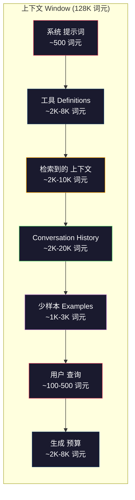
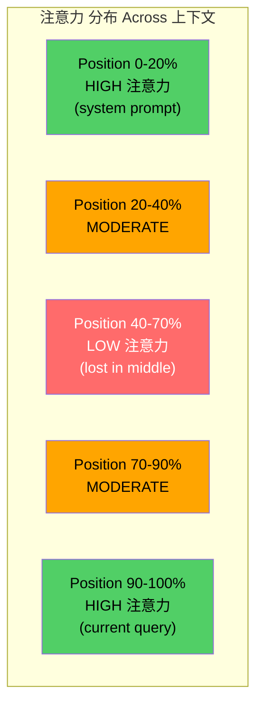
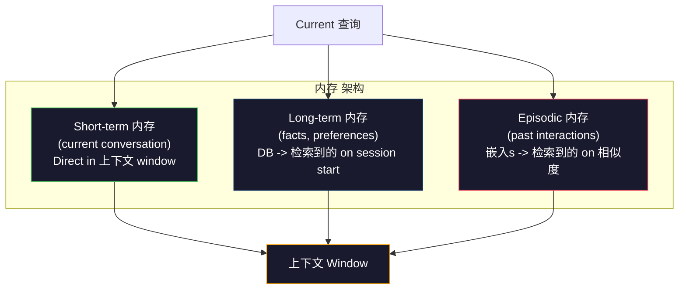

# 上下文工程: Windows, 预算s, 内存, and 检索

> 提示词 engineering is a subset. 上下文 engineering is the whole game. A 提示词 is a string you type. 上下文 is everything that goes into the 模型's window: 系统 instructions, 检索到的 文档, 工具 definitions, conversation history, 少样本 examples, and the 提示词 itself. The best AI engineers in 2026 are 上下文 engineers. They decide what goes in, what stays out, and in what order.

**类型：** Build
**语言：** Python
**先修：** Phase 10 (LLMs from Scratch), Phase 11 Lesson 01-02
**时间：** 约 90 分钟
**Related:** Phase 11 · 15 (提示词 缓存) — the cache-friendly layout is an extension of 上下文工程. Phase 5 · 28 (Long-Context 评估) for how to measure lost-in-the-middle with NIAH/RULER.

## 学习目标

- Calculate 词元 budgets across all 上下文 window components (系统 提示词, 工具, history, 检索到的 docs, 生成 headroom)
- Implement 上下文 window management strategies: truncation, summarization, and sliding window for conversation history
- Prioritize and order 上下文 components to maximize the 模型's 注意力 on the most relevant information
- 构建a 上下文 assembler that dynamically allocates 词元 based on 查询 type and available window space

## 问题

Claude Opus 4.7 has a 200K 词元 window (1M in beta). GPT-5 has 400K. Gemini 3 Pro has 2M. Llama 4 claims 10M. These numbers sound enormous until you fill them.

Here is a 真实 breakdown for a coding 助手. 系统 提示词: 500 词元. 工具 definitions for 50 工具: 8,000 词元. 检索到的 documentation: 4,000 词元. Conversation history (10 turns): 6,000 词元. Current 用户 查询: 200 词元. 生成 预算 (max 输出): 4,000 词元. Total: 22,700 词元. That is only 18% of a 128K window.

But 注意力 does not 规模 linearly with 上下文 length. A 模型 with 128K 词元 of 上下文 pays quadratic 注意力 成本 (O(n^2) in vanilla transformers, though most 生产 模型 use efficient 注意力 variants). More importantly, 检索 accuracy degrades. The "Needle in a Haystack" test shows that 模型 struggle to find information placed in the middle of long contexts. Research by Liu et al. (2023) showed that LLMs retrieve information at the start and end of long contexts with near-perfect accuracy, but accuracy drops 10-20% for information placed in the middle (positions 40-70% of the 上下文). This "lost-in-the-middle" effect varies by 模型 but affects all current architectures.

这个practical lesson: having 200K 词元 available does not mean using 200K 词元 is effective. A carefully curated 10K 词元 上下文 often outperforms a dumped 100K 词元 上下文. 上下文 engineering is the discipline of maximizing signal-to-noise 比例 within the 上下文 window.

每个词元 you put in the window displaces a 词元 that could carry more relevant information. Every irrelevant 工具 definition, every stale conversation turn, every 分块 of 检索到的 文本 that does not 答案 the 问题 -- each one makes the 模型 slightly worse at the 任务.

## 概念

### The 上下文 Window is a Scarce Resource

Think of the 上下文 window as RAM, not disk. It is fast and directly accessible, but limited. You cannot fit everything. You must choose.



Each component competes for space. Adding more 工具 definitions means less room for conversation history. Adding more 检索到的 上下文 means less room for 少样本 examples. 上下文 engineering is the art of allocating this 预算 to maximize 任务 performance.

### Lost-in-the-Middle

这个most important empirical finding in 上下文工程. 模型 attend better to information at the beginning and end of the 上下文. Information in the middle gets lower 注意力 scores and is more likely to be ignored.

Liu et al. (2023) tested this systematically. They placed a relevant 文档 among 20 irrelevant 文档 at various positions and measured 答案 accuracy. When the relevant 文档 was first or last, accuracy was 85-90%. When it was in the middle (position 10 of 20), accuracy dropped to 60-70%.

这has direct engineering implications:

- Put the most important information first (系统 提示词, critical instructions)
- Put the current 查询 and most relevant 上下文 last (recency 偏差 helps)
- Treat the middle of the 上下文 as the lowest-priority zone
- 如果you must include information in the middle, duplicate the key point at the end



### 上下文 Components

**系统 提示词**: sets the persona, constraints, and behavioral rules. This goes first and stays constant across turns. Claude Code uses roughly 6,000 词元 for its 系统 提示词 including 工具 definitions and behavioral instructions. Keep it tight. Every word in the 系统 提示词 is repeated on every API call.

**工具 definitions**: each 工具 adds 50-200 词元 (name, 描述, 参数 模式). 50 工具 at 150 词元 each is 7,500 词元 before any conversation happens. Dynamic 工具 selection -- only including 工具 relevant to the current 查询 -- can reduce this by 60-80%.

**检索到的 上下文**: 文档 from a vector database, search results, file contents. The 质量 of 检索 directly determines the 质量 of the 响应. Bad 检索 is worse than no 检索 -- it fills the window with 噪声 and actively misleads the 模型.

**Conversation history**: every previous 用户 消息 and 助手 响应. Grows linearly with conversation length. A 50-turn conversation at 200 词元 per turn is 10,000 词元 of history. Most of it is irrelevant to the current 查询.

**少样本 examples**: 输入/输出 pairs that demonstrate the desired behavior. Two to three well-chosen examples often improve 输出 质量 more than thousands of 词元 of instructions. But they 成本 space.

**生成 预算**: the 词元 reserved for the 模型's 响应. If you fill the window to capacity, the 模型 has no room to 答案. Reserve at least 2,000-4,000 词元 for 生成.

### 上下文 压缩 Strategies

**History summarization**: instead of keeping all previous turns verbatim, periodically summarize the conversation. "We discussed X, decided Y, and the 用户 wants Z" in 100 词元 replaces 10 turns that took 2,000 词元. Run summarization when history exceeds a 阈值 (e.g., 5,000 词元).

**Relevance filtering**: 分数 each 检索到的 文档 against the current 查询 and drop 文档 below a 阈值. If you 检索到的 10 chunks but only 3 are relevant, discard the other 7. Better to have 3 highly relevant chunks than 10 mediocre ones.

**工具 pruning**: classify the 用户's 查询 intent and only include 工具 relevant to that intent. A code 问题 does not need calendar 工具. A scheduling 问题 does not need file 系统 工具. This can reduce 工具 definitions from 8,000 词元 to 1,000.

**Recursive summarization**: for very long 文档, summarize in stages. First summarize each section, then summarize the summaries. A 50-page 文档 becomes a 500-词元 digest that captures the key points.

### 内存 Systems

上下文 engineering spans three time horizons.

**Short-term 内存**: the current conversation. Stored in the 上下文 window directly. Grows with each turn. Managed by summarization and truncation.

**Long-term 内存**: facts and preferences that persist across conversations. "The 用户 prefers 类型Script." "The project uses PostgreSQL." Stored in a database, 检索到的 on session start. Claude Code stores this in CLAUDE.md files. ChatGPT stores it in its 内存 特征.

**Episodic 内存**: specific past interactions that might be relevant. "Last Tuesday, we debugged a similar issue in the auth module." Stored as 嵌入s, 检索到的 when the current conversation matches a past episode.



### Dynamic 上下文 Assembly

这个key insight: different 查询 need different 上下文. A static 系统 提示词 + static 工具 + static history is wasteful. The best systems dynamically assemble 上下文 per 查询.

1. Classify the 查询 intent
2. Select relevant 工具 (not all 工具)
3. Retrieve relevant 文档 (not a fixed set)
4. Include relevant history turns (not all history)
5. Add 少样本 examples that match the 任务 type
6. Order everything by importance: critical first, important last, optional in the middle

这is what separates a good AI 应用 from a great one. The 模型 is the same. The 上下文 is the differentiator.

## 动手构建

### 步骤 1: 词元 Counter

你cannot 预算 what you cannot measure. Build a simple 词元 counter (approximation using whitespace splitting, since the exact count depends on the 分词器).

```python
import json
import numpy as np
from collections import OrderedDict

def count_tokens(text):
    if not text:
        return 0
    return int(len(text.split()) * 1.3)

def count_tokens_json(obj):
    return count_tokens(json.dumps(obj))
```

### 步骤 2: 上下文 预算 Manager

这个core abstraction. A 预算 manager tracks how many 词元 each component uses and enforces limits.

```python
class ContextBudget:
    def __init__(self, max_tokens=128000, generation_reserve=4000):
        self.max_tokens = max_tokens
        self.generation_reserve = generation_reserve
        self.available = max_tokens - generation_reserve
        self.allocations = OrderedDict()

    def allocate(self, component, content, max_tokens=None):
        tokens = count_tokens(content)
        if max_tokens and tokens > max_tokens:
            words = content.split()
            target_words = int(max_tokens / 1.3)
            content = " ".join(words[:target_words])
            tokens = count_tokens(content)

        used = sum(self.allocations.values())
        if used + tokens > self.available:
            allowed = self.available - used
            if allowed <= 0:
                return None, 0
            words = content.split()
            target_words = int(allowed / 1.3)
            content = " ".join(words[:target_words])
            tokens = count_tokens(content)

        self.allocations[component] = tokens
        return content, tokens

    def remaining(self):
        used = sum(self.allocations.values())
        return self.available - used

    def utilization(self):
        used = sum(self.allocations.values())
        return used / self.max_tokens

    def report(self):
        total_used = sum(self.allocations.values())
        lines = []
        lines.append(f"Context Budget Report ({self.max_tokens:,} token window)")
        lines.append("-" * 50)
        for component, tokens in self.allocations.items():
            pct = tokens / self.max_tokens * 100
            bar = "#" * int(pct / 2)
            lines.append(f"  {component:<25} {tokens:>6} tokens ({pct:>5.1f}%) {bar}")
        lines.append("-" * 50)
        lines.append(f"  {'Used':<25} {total_used:>6} tokens ({total_used/self.max_tokens*100:.1f}%)")
        lines.append(f"  {'Generation reserve':<25} {self.generation_reserve:>6} tokens")
        lines.append(f"  {'Remaining':<25} {self.remaining():>6} tokens")
        return "\n".join(lines)
```

### 步骤 3: Lost-in-the-Middle Reordering

Implement the reordering strategy: most important items go first and last, least important go in the middle.

```python
def reorder_lost_in_middle(items, scores):
    paired = sorted(zip(scores, items), reverse=True)
    sorted_items = [item for _, item in paired]

    if len(sorted_items) <= 2:
        return sorted_items

    first_half = sorted_items[::2]
    second_half = sorted_items[1::2]
    second_half.reverse()

    return first_half + second_half

def score_relevance(query, documents):
    query_words = set(query.lower().split())
    scores = []
    for doc in documents:
        doc_words = set(doc.lower().split())
        if not query_words:
            scores.append(0.0)
            continue
        overlap = len(query_words & doc_words) / len(query_words)
        scores.append(round(overlap, 3))
    return scores
```

### 步骤 4: Conversation History Compressor

Summarize old conversation turns to reclaim 词元 预算.

```python
class ConversationManager:
    def __init__(self, max_history_tokens=5000):
        self.turns = []
        self.summaries = []
        self.max_history_tokens = max_history_tokens

    def add_turn(self, role, content):
        self.turns.append({"role": role, "content": content})
        self._compress_if_needed()

    def _compress_if_needed(self):
        total = sum(count_tokens(t["content"]) for t in self.turns)
        if total <= self.max_history_tokens:
            return

        while total > self.max_history_tokens and len(self.turns) > 4:
            old_turns = self.turns[:2]
            summary = self._summarize_turns(old_turns)
            self.summaries.append(summary)
            self.turns = self.turns[2:]
            total = sum(count_tokens(t["content"]) for t in self.turns)

    def _summarize_turns(self, turns):
        parts = []
        for t in turns:
            content = t["content"]
            if len(content) > 100:
                content = content[:100] + "..."
            parts.append(f"{t['role']}: {content}")
        return "Previous: " + " | ".join(parts)

    def get_context(self):
        parts = []
        if self.summaries:
            parts.append("[Conversation Summary]")
            for s in self.summaries:
                parts.append(s)
        parts.append("[Recent Conversation]")
        for t in self.turns:
            parts.append(f"{t['role']}: {t['content']}")
        return "\n".join(parts)

    def token_count(self):
        return count_tokens(self.get_context())
```

### 步骤 5: Dynamic 工具 Selector

Only include 工具 relevant to the current 查询. Classify intent, then filter.

```python
TOOL_REGISTRY = {
    "read_file": {
        "description": "Read contents of a file",
        "tokens": 120,
        "categories": ["code", "files"],
    },
    "write_file": {
        "description": "Write content to a file",
        "tokens": 150,
        "categories": ["code", "files"],
    },
    "search_code": {
        "description": "Search for patterns in codebase",
        "tokens": 130,
        "categories": ["code"],
    },
    "run_command": {
        "description": "Execute a shell command",
        "tokens": 140,
        "categories": ["code", "system"],
    },
    "create_calendar_event": {
        "description": "Create a new calendar event",
        "tokens": 180,
        "categories": ["calendar"],
    },
    "list_emails": {
        "description": "List recent emails",
        "tokens": 160,
        "categories": ["email"],
    },
    "send_email": {
        "description": "Send an email message",
        "tokens": 200,
        "categories": ["email"],
    },
    "web_search": {
        "description": "Search the web for information",
        "tokens": 140,
        "categories": ["research"],
    },
    "query_database": {
        "description": "Run a SQL query on the database",
        "tokens": 170,
        "categories": ["code", "data"],
    },
    "generate_chart": {
        "description": "Generate a chart from data",
        "tokens": 190,
        "categories": ["data", "visualization"],
    },
}

def classify_intent(query):
    query_lower = query.lower()

    intent_keywords = {
        "code": ["code", "function", "bug", "error", "file", "implement", "refactor", "debug", "test"],
        "calendar": ["meeting", "schedule", "calendar", "appointment", "event"],
        "email": ["email", "mail", "send", "inbox", "message"],
        "research": ["search", "find", "what is", "how does", "explain", "look up"],
        "data": ["data", "query", "database", "chart", "graph", "analytics", "sql"],
    }

    scores = {}
    for intent, keywords in intent_keywords.items():
        score = sum(1 for kw in keywords if kw in query_lower)
        if score > 0:
            scores[intent] = score

    if not scores:
        return ["code"]

    max_score = max(scores.values())
    return [intent for intent, score in scores.items() if score >= max_score * 0.5]

def select_tools(query, token_budget=2000):
    intents = classify_intent(query)
    relevant = {}
    total_tokens = 0

    for name, tool in TOOL_REGISTRY.items():
        if any(cat in intents for cat in tool["categories"]):
            if total_tokens + tool["tokens"] <= token_budget:
                relevant[name] = tool
                total_tokens += tool["tokens"]

    return relevant, total_tokens
```

### 步骤 6: Full 上下文 Assembly 流水线

Wire everything together. Given a 查询, dynamically assemble the optimal 上下文.

```python
class ContextEngine:
    def __init__(self, max_tokens=128000, generation_reserve=4000):
        self.budget = ContextBudget(max_tokens, generation_reserve)
        self.conversation = ConversationManager(max_history_tokens=5000)
        self.system_prompt = (
            "You are a helpful AI assistant. You have access to tools for "
            "code editing, file management, web search, and data analysis. "
            "Use the appropriate tools for each task. Be concise and accurate."
        )
        self.knowledge_base = [
            "Python 3.12 introduced type parameter syntax for generic classes using bracket notation.",
            "The project uses PostgreSQL 16 with pgvector for embedding storage.",
            "Authentication is handled by Supabase Auth with JWT tokens.",
            "The frontend is built with Next.js 15 using the App Router.",
            "API rate limits are set to 100 requests per minute per user.",
            "The deployment pipeline uses GitHub Actions with Docker multi-stage builds.",
            "Test coverage must be above 80% for all new modules.",
            "The codebase follows the repository pattern for data access.",
        ]

    def assemble(self, query):
        self.budget = ContextBudget(self.budget.max_tokens, self.budget.generation_reserve)

        system_content, _ = self.budget.allocate("system_prompt", self.system_prompt, max_tokens=1000)

        tools, tool_tokens = select_tools(query, token_budget=2000)
        tool_text = json.dumps(list(tools.keys()))
        tool_content, _ = self.budget.allocate("tools", tool_text, max_tokens=2000)

        relevance = score_relevance(query, self.knowledge_base)
        threshold = 0.1
        relevant_docs = [
            doc for doc, score in zip(self.knowledge_base, relevance)
            if score >= threshold
        ]

        if relevant_docs:
            doc_scores = [s for s in relevance if s >= threshold]
            reordered = reorder_lost_in_middle(relevant_docs, doc_scores)
            doc_text = "\n".join(reordered)
            doc_content, _ = self.budget.allocate("retrieved_context", doc_text, max_tokens=3000)

        history_text = self.conversation.get_context()
        if history_text.strip():
            history_content, _ = self.budget.allocate("conversation_history", history_text, max_tokens=5000)

        query_content, _ = self.budget.allocate("user_query", query, max_tokens=500)

        return self.budget

    def chat(self, query):
        self.conversation.add_turn("user", query)
        budget = self.assemble(query)
        response = f"[Response to: {query[:50]}...]"
        self.conversation.add_turn("assistant", response)
        return budget


def run_demo():
    print("=" * 60)
    print("  Context Engineering Pipeline Demo")
    print("=" * 60)

    engine = ContextEngine(max_tokens=128000, generation_reserve=4000)

    print("\n--- Query 1: Code task ---")
    budget = engine.chat("Fix the bug in the authentication module where JWT tokens expire too early")
    print(budget.report())

    print("\n--- Query 2: Research task ---")
    budget = engine.chat("What is the best approach for implementing vector search in PostgreSQL?")
    print(budget.report())

    print("\n--- Query 3: After conversation history builds up ---")
    for i in range(8):
        engine.conversation.add_turn("user", f"Follow-up question number {i+1} about the implementation details of the system")
        engine.conversation.add_turn("assistant", f"Here is the response to follow-up {i+1} with technical details about the architecture")

    budget = engine.chat("Now implement the changes we discussed")
    print(budget.report())

    print("\n--- Tool Selection Examples ---")
    test_queries = [
        "Fix the bug in auth.py",
        "Schedule a meeting with the team for Tuesday",
        "Show me the database query performance stats",
        "Search for best practices on error handling",
    ]

    for q in test_queries:
        tools, tokens = select_tools(q)
        intents = classify_intent(q)
        print(f"\n  Query: {q}")
        print(f"  Intents: {intents}")
        print(f"  Tools: {list(tools.keys())} ({tokens} tokens)")

    print("\n--- Lost-in-the-Middle Reordering ---")
    docs = ["Doc A (most relevant)", "Doc B (somewhat relevant)", "Doc C (least relevant)",
            "Doc D (relevant)", "Doc E (moderately relevant)"]
    scores = [0.95, 0.60, 0.20, 0.80, 0.50]
    reordered = reorder_lost_in_middle(docs, scores)
    print(f"  Original order: {docs}")
    print(f"  Scores:         {scores}")
    print(f"  Reordered:      {reordered}")
    print(f"  (Most relevant at start and end, least relevant in middle)")
```

## 实际使用

### Claude Code's 上下文 Strategy

Claude Code manages 上下文 with a layered approach. The 系统 提示词 includes behavioral rules and 工具 definitions (~6K 词元). When you 开放 a file, its contents are injected as 上下文. When you search, results are added. Old conversation turns are summarized. CLAUDE.md provides long-term 内存 that persists across sessions.

这个key engineering decision: Claude Code does not dump your entire codebase into the 上下文. It retrieves relevant files on demand. This is 上下文工程 in practice.

### Cursor's Dynamic 上下文 Loading

Cursor indexes your entire codebase into 嵌入s. When you type a 查询, it retrieves the most relevant files and code 块 using vector 相似度. Only those pieces go into the 上下文 window. A 500K-line codebase is compressed into the 5-10 most relevant code 块.

这is the pattern: embed everything, retrieve on demand, include only what matters.

### ChatGPT 内存

ChatGPT stores 用户 preferences and facts as long-term 内存. On each conversation start, relevant memories are 检索到的 and included in the 系统 提示词. "The 用户 prefers Python" 成本 5 词元 but saves hundreds of 词元 of repeated instructions across conversations.

### RAG as 上下文工程

Retrieval-Augmented 生成 is 上下文工程 formalized. Instead of stuffing knowledge into the 模型's 权重 (训练) or the 系统 提示词 (static 上下文), you retrieve relevant 文档 at 查询 time and inject them into the 上下文 window. The entire RAG 流水线 -- 分块, 嵌入, 检索, 重排 -- exists to solve one problem: putting the right information in the 上下文 window.

## 交付成果

这lesson produces `outputs/prompt-context-optimizer.md` -- a 可复用 提示词 that audits a 上下文 assembly strategy and recommends optimizations. Feed it your 系统 提示词, 工具 count, average history length, and 检索 strategy, and it identifies 词元 waste and suggests improvements.

It also produces `outputs/skill-context-engineering.md` -- a decision framework for designing 上下文 assembly pipelines based on 任务 type, 上下文 window size, and 延迟 预算.

## 练习

1. Add a "词元 waste detector" to the Context预算 class. It should flag components using more than 30% of the 预算 and suggest 压缩 strategies specific to each component type (summarize history, prune 工具, re-rank 文档).

2. Implement 语义 deduplication for 检索到的 上下文. If two 检索到的 文档 are more than 80% similar (by word overlap or cosine 相似度 of their 嵌入s), keep only the higher-scored one. Measure how much 词元 预算 this recovers.

3. 构建a "上下文 replay" 工具. Given a conversation transcript, replay it through the ContextEngine and visualize how the 预算 allocation changes turn by turn. Plot 词元 usage per component over time. Identify the turn where 上下文 starts getting compressed.

4. Implement a priority-based 工具 selector. Instead of binary include/exclude, assign each 工具 a relevance 分数 to the current 查询. Include 工具 in descending relevance order until the 工具 预算 is exhausted. Compare 任务 performance with 5, 10, 20, and 50 工具 included.

5. 构建a multi-strategy 上下文 compressor. Implement three 压缩 strategies (truncation, summarization, extraction of key sentences) and 基准 them on a set of 20 文档. Measure the tradeoff between 压缩 比例 and information retention (does the compressed version still contain the 答案 to the 查询?).

## Key Terms

|Term|What people say|What it actually means|
|------|----------------|----------------------|
|上下文 window|"How much the 模型 can read"|The maximum number of 词元 (输入 + 输出) the 模型 processes in a single forward pass -- 400K for GPT-5, 200K (1M beta) for Claude Opus 4.7, 2M for Gemini 3 Pro|
|上下文 engineering|"Advanced 提示词工程"|The discipline of deciding what goes into the 上下文 window, in what order, and at what priority -- encompasses 检索, 压缩, 工具 selection, and 内存 management|
|Lost-in-the-middle|"模型 forget stuff in the middle"|Empirical finding that LLMs attend better to the beginning and end of 上下文, with 10-20% accuracy drop for information placed in the middle|
|词元 预算|"How many 词元 you have left"|An explicit allocation of 上下文 window capacity across components (系统 提示词, 工具, history, 检索, 生成) with per-component limits|
|Dynamic 上下文|"Loading stuff on the fly"|Assembling the 上下文 window differently for each 查询 based on intent 分类, relevant 工具 selection, and 检索 results|
|History summarization|"Compressing the conversation"|Replacing verbatim old conversation turns with a concise summary, reducing 词元 成本 while preserving key information|
|工具 pruning|"Only including relevant 工具"|Classifying 查询 intent and only including 工具 definitions that match, reducing 工具 词元 成本 by 60-80%|
|Long-term 内存|"Remembering across sessions"|Facts and preferences stored in a database and 检索到的 at session start -- CLAUDE.md, ChatGPT 内存, and similar systems|
|Episodic 内存|"Remembering specific past events"|Past interactions stored as 嵌入s and 检索到的 when the current 查询 is similar to a past conversation|
|生成 预算|"Room for the 答案"|词元 reserved for the 模型's 输出 -- if the 上下文 fills the window completely, the 模型 has no room to respond|

## 延伸阅读

- [Liu et al., 2023 -- "Lost in the Middle: How Language Models Use Long Contexts"](https://arxiv.org/abs/2307.03172) -- the definitive study on position-dependent 注意力, showing that 模型 struggle with information in the middle of long contexts
- [Anthropic's Contextual Retrieval blog post](https://www.anthropic.com/news/contextual-retrieval) -- how Anthropic approaches context-aware 分块 检索, reducing 检索 failure by 49%
- [Simon Willison's "Context Engineering"](https://simonwillison.net/2025/Jun/27/context-engineering/) -- the blog post that named the discipline and distinguished it from 提示词工程
- [LangChain documentation on RAG](https://python.langchain.com/docs/tutorials/rag/) -- practical implementation of retrieval-augmented 生成 as a 上下文工程 pattern
- [Greg Kamradt's Needle in a Haystack test](https://github.com/gkamradt/LLMTest_NeedleInAHaystack) -- the 基准 that revealed position-dependent 检索 failures across all major 模型
- [Pope et al., "Efficiently Scaling Transformer Inference" (2022)](https://arxiv.org/abs/2211.05102) -- why 上下文 length drives 内存 and 延迟, and how KV 缓存, MQA, and GQA change the 预算 calculation.
- [Agrawal et al., "SARATHI: Efficient LLM Inference by Piggybacking Decodes with Chunked Prefills" (2023)](https://arxiv.org/abs/2308.16369) -- the two phases of 推理 that make long prompts expensive in TTFT but cheap in TPOT; the ground truth behind context-packing 取舍.
- [Ainslie et al., "GQA: Training Generalized Multi-Query Transformer Models from Multi-Head Checkpoints" (EMNLP 2023)](https://arxiv.org/abs/2305.13245) -- the grouped-query 注意力 paper that cut KV 内存 8× in 生产 decoders without 质量 损失.
