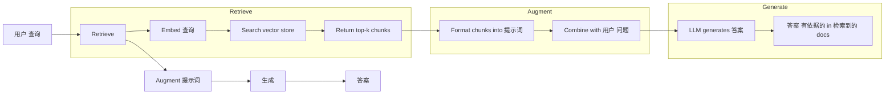
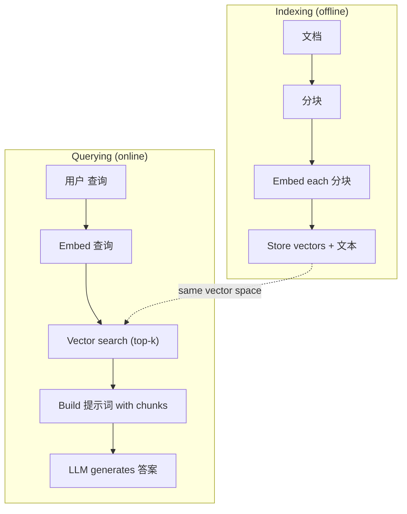

# RAG (Retrieval-Augmented 生成)

> 你的LLM knows everything up to its 训练 cutoff. It knows nothing about your company's docs, your codebase, or last week's meeting notes. RAG solves this by retrieving relevant 文档 and stuffing them into the 提示词. It's the most deployed pattern in 生产 AI. If you build one thing from this course, build a RAG 流水线.

**类型：** Build
**语言：** Python
**先修：** Phase 10 (LLMs from Scratch), Phase 11 Lessons 01-05
**时间：** 约 90 分钟
**Related:** Phase 5 · 23 (分块 Strategies for RAG) for the six 分块 algorithms and when each wins. Phase 5 · 22 (嵌入 模型 Deep Dive) for picking the embedder. Phase 11 · 07 (Advanced RAG) for hybrid search, 重排, and 查询 transformation.

## 学习目标

- 构建a complete RAG 流水线: 文档 loading, 分块, 嵌入, vector storage, 检索, and 生成
- Implement 语义 search using a vector database (ChromaDB, FAISS, or Pinecone) with proper indexing
- 解释why RAG is preferred over 微调 for knowledge-grounded applications (成本, freshness, attribution)
- Evaluate RAG 质量 using 检索 指标 (precision, recall) and 生成 指标 (faithfulness, relevance)

## 问题

你build a chatbot for your company. A customer asks "What's the refund 策略 for enterprise plans?" The LLM responds with a generic 答案 about typical SaaS refund policies. The actual 策略, buried in a 200-page internal wiki, says enterprise customers get a 60-day window with pro-rated refunds. The LLM has never seen this 文档. It cannot know what it was not 训练后的 on.

Fine-tuning is one solution. Take the LLM, 训练 it on your internal docs, and deploy the updated 模型. This works but has serious problems. Fine-tuning 成本 thousands of dollars in 计算. The 模型 becomes stale the moment a 文档 changes. You have no way to know which 来源 the 模型 drew from. And if the company acquires another product line next month, you fine-tune again.

RAG is the other solution. Leave the 模型 untouched. When a 问题 comes in, search your 文档 store for relevant passages, paste them into the 提示词 before the 问题, and let the 模型 答案 using those passages as 上下文. The 文档 store can be updated in 分钟. You can see exactly which 文档 were 检索到的. The 模型 itself never changes. This is why RAG is the dominant pattern in 生产: it's cheaper, fresher, more auditable, and works with any LLM.

## 概念

### The RAG Pattern

这个entire pattern fits in four 步骤:



查询 -> Retrieve -> Augment 提示词 -> 生成. Every RAG 系统 follows this pattern. The differences between 生产 RAG systems are in the details of each 步骤: how you 分块, how you embed, how you search, and how you construct the 提示词.

### Why RAG Beats 微调

|Concern|Fine-tuning|RAG|
|---------|------------|-----|
|成本|$1,000-$100,000+ per 训练 run|$0.01-$0.10 per 查询 (嵌入 + LLM)|
|Freshness|Stale until retrained|Updated in 分钟 by re-indexing docs|
|Auditability|Cannot trace 答案 to 来源|Can show exact 检索到的 passages|
|幻觉|Still hallucinates freely|有依据的 in 检索到的 文档|
|数据 privacy|训练 数据 baked into 权重|文档 stay in your vector store|

Fine-tuning changes the 模型's 权重 permanently. RAG changes the 模型's 上下文 temporarily. For most applications, temporary 上下文 is what you want.

这个one case where 微调 wins: when you need the 模型 to adopt a specific 风格, tone, or 推理 pattern that cannot be achieved through prompting alone. For factual knowledge 检索, RAG wins every time.

### 嵌入 模型

一个嵌入 模型 converts 文本 into a 稠密 vector. Similar texts produce vectors that are close together in this high-dimensional space. "How do I reset my password?" and "I need to change my password" produce nearly identical vectors despite sharing few words. "The cat sat on the mat" produces a very different vector.

Common 嵌入 模型 (2026 lineup — see Phase 5 · 22 for full analysis):

|模型|维度|Provider|Notes|
|-------|-----------|----------|-------|
|text-嵌入-3-small|1536 (Matryoshka)|OpenAI|Best price/performance for most use cases|
|text-嵌入-3-large|3072 (Matryoshka)|OpenAI|Higher accuracy, truncatable to 256/512/1024|
|Gemini 嵌入 2|3072 (Matryoshka)|Google|Top MTEB 检索; 8K 上下文|
|voyage-4|1024/2048 (Matryoshka)|Voyage AI|领域 variants (code, finance, law)|
|Cohere embed-v4|1024 (Matryoshka)|Cohere|Strong multilingual, 128K 上下文|
|BGE-M3|1024 (稠密 + 稀疏 + ColBERT)|BAAI (open-weight)|Three views from one 模型|
|Qwen3-嵌入|4096 (Matryoshka)|Alibaba (open-weight)|Top open-weight 检索 分数|
|all-MiniLM-L6-v2|384|Open-weight (Sentence Transformers)|Prototyping 基线|

For this lesson, we build our own simple 嵌入 using TF-IDF. Not because TF-IDF is what 生产 systems use, but because it makes the concept concrete: 文本 goes in, a vector comes out, similar texts produce similar vectors.

### Vector 相似度

给定two vectors, how do you measure 相似度? Three options:

**Cosine 相似度**: the cosine of the angle between two vectors. Ranges from -1 (opposite) to 1 (identical). Ignores magnitude, only cares about direction. This is the default for RAG.

```text
cosine_sim(a, b) = dot(a, b) / (||a|| * ||b||)
```

**Dot product**: the raw inner product. Larger vectors get higher scores. Useful when magnitude carries information (longer 文档 might be more relevant).

```text
dot(a, b) = sum(a_i * b_i)
```

**L2 (Euclidean) distance**: straight-line distance in the vector space. Smaller distance = more similar. Sensitive to magnitude differences.

```text
L2(a, b) = sqrt(sum((a_i - b_i)^2))
```

Cosine 相似度 is the standard. It handles 文档 of different lengths gracefully because it normalizes by magnitude. When someone says "vector search," they almost always mean cosine 相似度.

### 分块 Strategies

文档 are too long to embed as single vectors. A 50-page PDF might produce a terrible 嵌入 because it contains dozens of topics. Instead, you split 文档 into chunks and embed each 分块 separately.

**修复ed-size 分块**: split every N 词元. Simple and predictable. A 512-词元 分块 with 50-词元 overlap means 分块 1 is 词元 0-511, 分块 2 is 词元 462-973, and so on. The overlap ensures you do not split a sentence at an unlucky boundary.

**语义 分块**: split at natural boundaries. Paragraphs, sections, or markdown headers. Each 分块 is a coherent unit of meaning. More complex to implement but produces better 检索.

**Recursive 分块**: try to split at the largest boundary first (section headers). If a section is still too large, split at paragraph boundaries. If a paragraph is still too large, split at sentence boundaries. This is the LangChain RecursiveCharacterTextSplitter approach and it works well in practice.

分块 size matters more than people think:

- Too small (64-128 词元): each 分块 lacks 上下文. "It increased 15% last quarter" means nothing without knowing what "it" refers to.
- Too large (2048+ 词元): each 分块 covers multiple topics, diluting relevance. When you search for revenue 数据, you get a 分块 that's 10% about revenue and 90% about headcount.
- Sweet spot (256-512 词元): enough 上下文 to be self-contained, focused enough to be relevant.

Most 生产 RAG systems use 256-512 词元 chunks with 50-词元 overlap. Anthropic's RAG guidelines recommend this range.

### Vector Databases

Once you have 嵌入s, you need somewhere to store and search them. Options:

|Database|类型|Best for|
|----------|------|----------|
|FAISS|Library (in-process)|Prototyping, small to medium datasets|
|Chroma|Lightweight DB|Local development, small deployments|
|Pinecone|Managed service|生产 without ops overhead|
|Weaviate|开放 来源 DB|Self-hosted 生产|
|pgvector|Postgres extension|Already using Postgres|
|Qdrant|开放 来源 DB|High-performance self-hosted|

For this lesson, we build a simple in-memory vector store. It stores vectors in a list and does brute-force cosine 相似度 search. This is equivalent to FAISS with a flat index. It scales to maybe 100,000 vectors before getting slow. 生产 systems use approximate nearest neighbor (ANN) algorithms like HNSW to search millions of vectors in milliseconds.

### The Full 流水线



这个indexing phase runs once per 文档 (or when 文档 update). The querying phase runs on every 用户 request. In 生产, indexing might process millions of 文档 over 小时. Querying must respond in under a second.

### 真实 Numbers

Most 生产 RAG systems use these 参数:

- **k = 5 to 10** 检索到的 chunks per 查询
- **分块 size = 256 to 512 词元** with 50-词元 overlap
- **上下文 预算**: 2,500-5,000 词元 of 检索到的 content per 查询
- **Total 提示词**: ~8,000-16,000 词元 (系统 提示词 + 检索到的 chunks + conversation history + 用户 查询)
- **嵌入 维度**: 384-3072 depending on 模型
- **Indexing throughput**: 100-1,000 文档 per second with API 嵌入s
- **查询 延迟**: 50-200ms for 检索, 500-3000ms for 生成

```figure
rag-chunking
```

## 动手构建

### 步骤 1: 文档 分块

```python
def chunk_text(text, chunk_size=200, overlap=50):
    words = text.split()
    chunks = []
    start = 0
    while start < len(words):
        end = start + chunk_size
        chunk = " ".join(words[start:end])
        chunks.append(chunk)
        start += chunk_size - overlap
    return chunks
```

### 步骤 2: TF-IDF 嵌入s

We build a simple 嵌入 函数. TF-IDF (Term Frequency-Inverse 文档 Frequency) is not a neural 嵌入, but it converts 文本 to vectors in a way that captures word importance. Frequent words in a 文档 get higher TF. Rare words across the 语料库 get higher IDF. The product gives a vector where important, distinctive words have high values.

```python
import math
from collections import Counter

def build_vocabulary(documents):
    vocab = set()
    for doc in documents:
        vocab.update(doc.lower().split())
    return sorted(vocab)

def compute_tf(text, vocab):
    words = text.lower().split()
    count = Counter(words)
    total = len(words)
    return [count.get(word, 0) / total for word in vocab]

def compute_idf(documents, vocab):
    n = len(documents)
    idf = []
    for word in vocab:
        doc_count = sum(1 for doc in documents if word in doc.lower().split())
        idf.append(math.log((n + 1) / (doc_count + 1)) + 1)
    return idf

def tfidf_embed(text, vocab, idf):
    tf = compute_tf(text, vocab)
    return [t * i for t, i in zip(tf, idf)]
```

### 步骤 3: Cosine 相似度 Search

```python
def cosine_similarity(a, b):
    dot = sum(x * y for x, y in zip(a, b))
    norm_a = math.sqrt(sum(x * x for x in a))
    norm_b = math.sqrt(sum(x * x for x in b))
    if norm_a == 0 or norm_b == 0:
        return 0.0
    return dot / (norm_a * norm_b)

def search(query_embedding, stored_embeddings, top_k=5):
    scores = []
    for i, emb in enumerate(stored_embeddings):
        sim = cosine_similarity(query_embedding, emb)
        scores.append((i, sim))
    scores.sort(key=lambda x: x[1], reverse=True)
    return scores[:top_k]
```

### 步骤 4: 提示词 Construction

这is where the "augmented" in RAG happens. Take the 检索到的 chunks, format them into a 提示词, and ask the LLM to 答案 based on the provided 上下文.

```python
def build_rag_prompt(query, retrieved_chunks):
    context = "\n\n---\n\n".join(
        f"[Source {i+1}]\n{chunk}"
        for i, chunk in enumerate(retrieved_chunks)
    )
    return f"""Answer the question based ONLY on the following context.
If the context doesn't contain enough information, say "I don't have enough information to answer that."

Context:
{context}

Question: {query}

Answer:"""
```

### 步骤 5: The Complete RAG 流水线

```python
class RAGPipeline:
    def __init__(self):
        self.chunks = []
        self.embeddings = []
        self.vocab = []
        self.idf = []

    def index(self, documents):
        all_chunks = []
        for doc in documents:
            all_chunks.extend(chunk_text(doc))
        self.chunks = all_chunks
        self.vocab = build_vocabulary(all_chunks)
        self.idf = compute_idf(all_chunks, self.vocab)
        self.embeddings = [
            tfidf_embed(chunk, self.vocab, self.idf)
            for chunk in all_chunks
        ]

    def query(self, question, top_k=5):
        query_emb = tfidf_embed(question, self.vocab, self.idf)
        results = search(query_emb, self.embeddings, top_k)
        retrieved = [(self.chunks[i], score) for i, score in results]
        prompt = build_rag_prompt(
            question, [chunk for chunk, _ in retrieved]
        )
        return prompt, retrieved
```

### 步骤 6: 生成 (simulated)

In 生产, this is where you call the LLM API. For this lesson, we simulate 生成 by extracting the most relevant sentence from the 检索到的 上下文.

```python
def simple_generate(prompt, retrieved_chunks):
    query_words = set(prompt.lower().split("question:")[-1].split())
    best_sentence = ""
    best_score = 0
    for chunk in retrieved_chunks:
        for sentence in chunk.split("."):
            sentence = sentence.strip()
            if not sentence:
                continue
            words = set(sentence.lower().split())
            overlap = len(query_words & words)
            if overlap > best_score:
                best_score = overlap
                best_sentence = sentence
    return best_sentence if best_sentence else "I don't have enough information."
```

## 实际使用

With a 真实 嵌入 模型 and LLM, the code barely changes:

```python
from openai import OpenAI

client = OpenAI()

def embed(text):
    response = client.embeddings.create(
        model="text-embedding-3-small",
        input=text
    )
    return response.data[0].embedding

def generate(prompt):
    response = client.chat.completions.create(
        model="gpt-4o-mini",
        messages=[{"role": "user", "content": prompt}],
        temperature=0
    )
    return response.choices[0].message.content
```

Or with Anthropic:

```python
import anthropic

client = anthropic.Anthropic()

def generate(prompt):
    response = client.messages.create(
        model="claude-sonnet-4-20250514",
        max_tokens=1024,
        messages=[{"role": "user", "content": prompt}]
    )
    return response.content[0].text
```

这个流水线 is the same. Swap the 嵌入 函数. Swap the 生成 函数. The 检索 logic, 分块, 提示词 construction -- all identical regardless of which 模型 you use.

For vector storage at 规模, replace the brute-force search with a proper vector database:

```python
import chromadb

client = chromadb.Client()
collection = client.create_collection("my_docs")

collection.add(
    documents=chunks,
    ids=[f"chunk_{i}" for i in range(len(chunks))]
)

results = collection.query(
    query_texts=["What is the refund policy?"],
    n_results=5
)
```

Chroma handles the 嵌入 internally (it uses all-MiniLM-L6-v2 by default) and stores the vectors in a local database. Same pattern, different plumbing.

## 交付成果

这lesson produces:
- `outputs/prompt-rag-architect.md` -- a 提示词 for designing RAG systems for specific use cases
- `outputs/skill-rag-pipeline.md` -- a skill that teaches agents how to build and 调试 RAG pipelines

## 练习

1. Replace the TF-IDF 嵌入s with a simple bag-of-words approach (binary: 1 if word present, 0 if not). Compare 检索 质量 on the 样本 文档. TF-IDF should outperform because it 权重 rare words higher.

2. Experiment with 分块 sizes: try 50, 100, 200, and 500 words on the same 文档 set. For each size, run the same 5 查询 and count how many return a relevant 分块 in the top-3. Find the sweet spot where 检索 质量 peaks.

3. Add metadata to each 分块 (来源 文档 name, 分块 position). Modify the 提示词 template to include 来源 attribution so the LLM cites its 来源.

4. Implement a simple 评估: given 10 question-answer pairs, run each 问题 through the RAG 流水线, and measure what percentage of 检索到的 chunks contain the 答案. This is 检索 recall at k.

5. 构建a conversation-aware RAG 流水线: maintain a history of the last 3 exchanges and include them in the 提示词 alongside the 检索到的 chunks. Test with follow-up 问题 like "What about enterprise?" after asking about pricing.

## Key Terms

|Term|What people say|What it actually means|
|------|----------------|----------------------|
|RAG|"AI that reads your docs"|Retrieve relevant 文档, paste them into the 提示词, and 生成 an 答案 有依据的 in those 文档|
|嵌入|"Convert 文本 to numbers"|A 稠密 向量表示 of 文本 where similar meanings produce similar vectors|
|Vector database|"Search engine for AI"|A 数据 store optimized for storing vectors and finding the nearest neighbors by 相似度|
|分块|"Split docs into pieces"|Breaking 文档 into smaller segments (typically 256-512 词元) so each can be embedded and 检索到的 independently|
|Cosine 相似度|"How similar are two vectors"|The cosine of the angle between two vectors; 1 = identical direction, 0 = orthogonal, -1 = opposite|
|Top-k 检索|"Get the k best matches"|Return the k most similar chunks to the 查询 from the vector store|
|上下文 window|"How much 文本 the LLM can see"|The maximum number of 词元 the LLM can process in a single request; 检索到的 chunks must fit within this|
|Augmented 生成|"答案 using given 上下文"|Generating a 响应 using 检索到的 文档 as 上下文 rather than relying solely on 训练后的 knowledge|
|TF-IDF|"Word importance scoring"|Term Frequency times Inverse 文档 Frequency; 权重 words by how distinctive they are within a 语料库|
|Indexing|"Preparing docs for search"|The offline process of 分块, 嵌入, and storing 文档 so they can be searched at 查询 time|

## 延伸阅读

- Lewis et al., "Retrieval-Augmented 生成 for Knowledge-Intensive NLP Tasks" (2020) -- the original RAG paper from Facebook AI Research that formalized the retrieve-then-generate pattern
- Anthropic's RAG documentation (docs.anthropic.com) -- practical guidelines for 分块 sizes, 提示词 construction, and 评估
- Pinecone 学习 Center, "What is RAG?" -- clear visual explanations of the RAG 流水线 with 生产 considerations
- Sentence-BERT: Reimers & Gurevych (2019) -- the paper behind the all-MiniLM 嵌入 模型, showing how to 训练 bi-encoders for 语义 相似度
- [Karpukhin et al., "Dense Passage Retrieval for Open-Domain Question Answering" (EMNLP 2020)](https://arxiv.org/abs/2004.04906) -- the DPR paper that proved 稠密 bi-encoder 检索 beats BM25 on open-domain QA and set the pattern for modern RAG retrievers.
- [LlamaIndex High-Level Concepts](https://docs.llamaindex.ai/en/stable/getting_started/concepts.html) -- the main concepts to know when building RAG pipelines: 数据 loaders, 节点 parsers, indices, retrievers, 响应 synthesizers.
- [LangChain RAG tutorial](https://python.langchain.com/docs/tutorials/rag/) -- the opposite-flavor orchestrator; chain-of-runnables view of the same retrieve-then-generate pattern.
