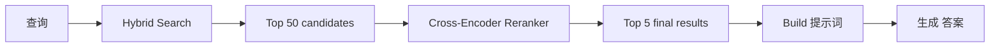
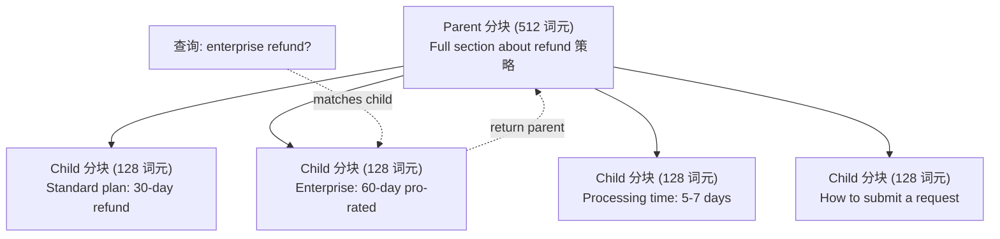
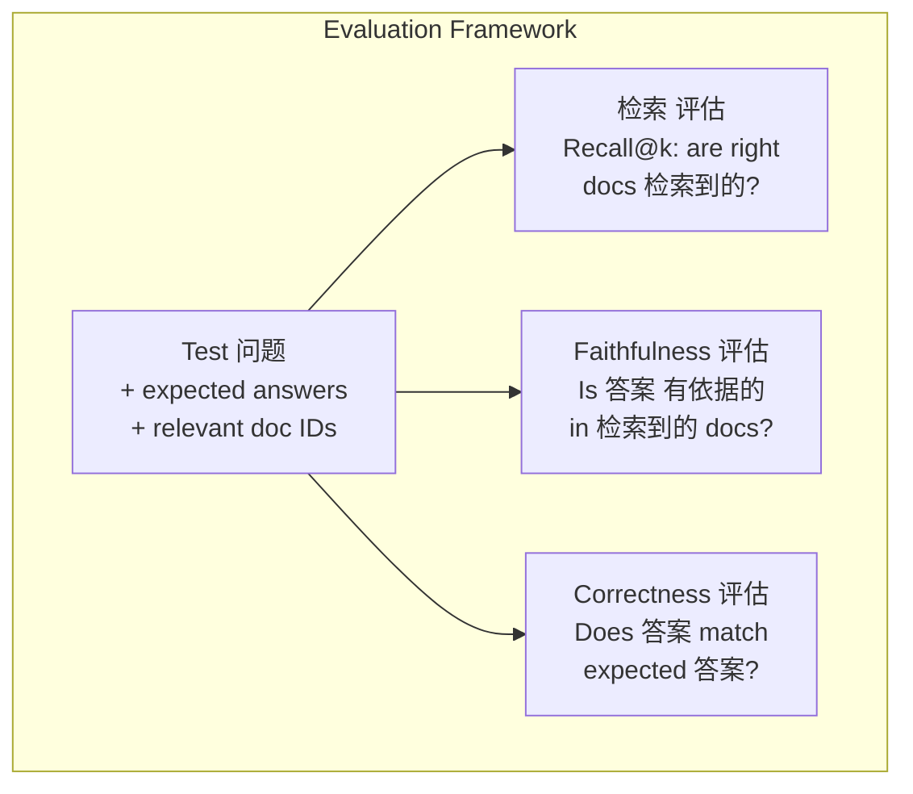

# Advanced RAG (分块, 重排, Hybrid Search)

> Basic RAG retrieves the top-k most similar chunks. That works for simple 问题. It falls apart for multi-hop 推理, ambiguous 查询, and large corpora. Advanced RAG is the difference between a demo that works on 10 文档 and a 系统 that works on 10 million.

**类型：** Build
**语言：** Python
**先修：** Phase 11, Lesson 06 (RAG)
**时间：** 约 90 分钟
**Related:** Phase 5 · 23 (分块 Strategies for RAG) covers all six 分块 algorithms — recursive, 语义, sentence, parent-document, late 分块, contextual 检索 — with Vectara/Anthropic benchmarks. This lesson builds on top: hybrid search, 重排, 查询 transformation.

## 学习目标

- Implement advanced 分块 strategies (语义, recursive, parent-child) that preserve 文档 structure and 上下文
- 构建a hybrid search 流水线 combining BM25 keyword 匹配 with 语义 vector search and a cross-encoder reranker
- Apply 查询 transformation techniques (HyDE, multi-query, step-back) to improve 检索 on ambiguous or complex 问题
- 诊断 and fix common RAG failures: wrong 分块 检索到的, 答案 not in 上下文, multi-hop 推理 breakdown

## 问题

你built a basic RAG 流水线 in Lesson 06. It works for straightforward 问题 on a small 语料库. Now try these:

**Ambiguous 查询**: "What was revenue last quarter?" 语义 search returns chunks about revenue strategy, revenue projections, and the CFO's thoughts on revenue growth. All semantically similar to the word "revenue." None containing the actual number. The correct 分块 says "$47.2M in Q3 2025" but uses the word "earnings" instead of "revenue." The 嵌入 模型 thinks "revenue strategy" is closer to the 查询 than "Q3 earnings were $47.2M."

**Multi-hop 问题**: "Which team had the highest customer satisfaction 分数 improvement?" This requires finding the satisfaction scores for each team, comparing them, and identifying the maximum. No single 分块 contains the 答案. The information is scattered across team reports.

**Large 语料库 problem**: You have 2 million chunks. The correct 答案 is in 分块 #1,847,293. Your top-5 检索 pulls chunks #14, #89,201, #1,200,000, #44, and #901,333. Close in 嵌入 space, but none containing the 答案. At this 规模, approximate nearest neighbor search introduces enough 错误 that relevant results get pushed out of the top-k.

Basic RAG fails because vector 相似度 is not the same as relevance. A 分块 can be semantically similar to a 查询 without being useful for 回答 it. Advanced RAG addresses this with four techniques: hybrid search (add keyword 匹配), 重排 (分数 candidates more carefully), 查询 transformation (fix the 查询 before searching), and better 分块 (retrieve at the right granularity).

## 概念

### Hybrid Search: 语义 + Keyword

语义 search (vector 相似度) is good at understanding meaning. "How do I cancel my subscription?" matches "步骤 to terminate your plan" even though they share no words. But it misses exact matches. "错误 code E-4021" might not match a 分块 containing "E-4021" if the 嵌入 模型 treats it as 噪声.

Keyword search (BM25) is the opposite. It excels at exact matches. "E-4021" matches perfectly. But "cancel my subscription" returns zero results if the 文档 says "terminate your plan."

Hybrid search runs both, then merges the results.

**BM25** (Best 匹配 25) is the standard keyword search algorithm. It has been the backbone of search engines since the 1990s. The formula:

```text
BM25(q, d) = sum over terms t in q:
    IDF(t) * (tf(t,d) * (k1 + 1)) / (tf(t,d) + k1 * (1 - b + b * |d| / avgdl))
```

Where tf(t,d) is the term frequency of t in 文档 d, IDF(t) is the inverse 文档 frequency, |d| is the 文档 length, avgdl is the average 文档 length, k1 controls term frequency saturation (default 1.2), and b controls length 归一化 (default 0.75).

In plain terms: BM25 scores 文档 higher when they contain 查询 terms (especially rare ones), but with diminishing returns for repeated terms. A 文档 with the word "revenue" 50 times is not 50x more relevant than one with it once.

### Reciprocal 排序 Fusion (RRF)

你have two ranked lists: one from vector search, one from BM25. How do you combine them? Reciprocal 排序 Fusion is the standard approach.

```text
RRF_score(d) = sum over rankings R:
    1 / (k + rank_R(d))
```

Where k is a constant (typically 60) that prevents the top-ranked result from dominating.

一个文档 ranked #1 in vector search and #5 in BM25 gets: 1/(60+1) + 1/(60+5) = 0.0164 + 0.0154 = 0.0318

一个文档 ranked #3 in vector search and #2 in BM25 gets: 1/(60+3) + 1/(60+2) = 0.0159 + 0.0161 = 0.0320

RRF naturally balances the two signals. A 文档 that ranks highly in both lists gets the best 分数. A 文档 that ranks #1 in one list but is absent from the other gets a moderate 分数. This is robust because it uses ranks, not raw scores, so differences in 分数 distributions between the two systems do not matter.

### 重排

检索 (whether vector, keyword, or hybrid) is fast but imprecise. It uses bi-encoders: the 查询 and each 文档 are embedded independently, then compared. The 嵌入s are computed once and cached. This scales to millions of 文档.

重排 uses cross-encoders: the 查询 and a candidate 文档 are fed together into a 模型 that outputs a relevance 分数. The 模型 sees both texts simultaneously and can capture fine-grained interactions between them. A cross-encoder can understand that "What were Q3 earnings?" is highly relevant to a 分块 containing "$47.2M in Q3" even if a bi-encoder missed the connection.

这个取舍: cross-encoders are 100-1000x slower than bi-encoders because they process the query-document pair jointly. You cannot pre-compute cross-encoder scores for a million 文档. The solution: retrieve a larger candidate set (top-50 from hybrid search), then rerank with a cross-encoder to get the final top-5.



Common 重排 模型 (2026 lineup):
- Cohere Rerank 3.5: managed API, multilingual, best recall gain on mixed corpora
- Voyage rerank-2.5: managed API, lowest 延迟 of the 托管 options
- Jina-Reranker-v2 Multilingual: open-weight, 100+ languages
- bge-reranker-v2-m3: open-weight, strong 基线
- cross-encoder/ms-marco-MiniLM-L-6-v2: open-weight, runs on CPU for prototyping
- ColBERTv2 / Jina-ColBERT-v2: late-interaction multi-vector rerankers — O(tokens) not O(docs) at scoring time

### 查询 Transformation

Sometimes the problem is not 检索 but the 查询 itself. "What was that thing about the new 策略 change?" is a terrible search 查询. It contains no specific terms. The 嵌入 is vague. No 检索 系统 can find the right 文档 from this.

**查询 rewriting**: rephrase the 用户's 查询 into a better search 查询. An LLM can do this:

```text
User: "What was that thing about the new policy change?"
Rewritten: "Recent policy changes and updates"
```

**HyDE (Hypothetical 文档 嵌入s)**: instead of searching with the 查询, 生成 a hypothetical 答案, embed that, and search for similar 真实 文档.

```text
Query: "What is the refund policy for enterprise?"
Hypothetical answer: "Enterprise customers are eligible for a full refund
within 60 days of purchase. Refunds are pro-rated based on the remaining
subscription period and processed within 5-7 business days."
```

Embed the hypothetical 答案 and search for 真实 文档 similar to it. The intuition: the hypothetical 答案 lives closer in 嵌入 space to the 真实 答案 than the original 问题 does. 问题 and answers have different linguistic structures. By generating a hypothetical 答案, you bridge the gap between "问题 space" and "答案 space" in the 嵌入.

HyDE adds one LLM call before 检索. This increases 延迟 by 500-2000ms. Worth it when 检索 质量 is poor on raw 查询.

### Parent-Child 分块

Standard 分块 forces a 取舍: small chunks for precise 检索, large chunks for sufficient 上下文. Parent-child 分块 eliminates this 取舍.

Index small chunks (128 词元) for 检索. When a small 分块 is 检索到的, return its parent 分块 (512 词元) for the 提示词. The small 分块 matches the 查询 precisely. The parent 分块 provides enough 上下文 for the LLM to 生成 a good 答案.



这个查询 "enterprise refund?" matches child 分块 C2 precisely. But the 提示词 receives the full parent 分块 P, which includes the surrounding 上下文 about processing time and submission process.

### Metadata Filtering

Before running vector search, filter the 语料库 by metadata: date, 来源, category, author, language. This reduces the search space and prevents irrelevant results.

"What changed in the security 策略 last month?" should only search 文档 from the last 30 days in the security category. Without metadata filtering, you search the entire 语料库 and might retrieve a 2-year-old security 文档 that happens to be semantically similar.

生产 RAG systems store metadata alongside each 分块: 来源 文档, creation date, category, author, version. Vector databases support pre-filtering by metadata before 相似度 search, which is critical for performance at 规模.

### 评估

你built a RAG 系统. How do you know if it works? Three 指标:

**检索 relevance (Recall@k)**: for a set of test 问题 with known relevant 文档, what percentage of relevant 文档 appear in the top-k results? If the 答案 to a 问题 is in 分块 #47, does 分块 #47 appear in the top-5?

**Faithfulness**: is the 生成的 答案 有依据的 in the 检索到的 文档? If the 检索到的 chunks say "60-day refund window" and the 模型 says "90-day refund window," that is a faithfulness failure. The 模型 hallucinated despite having the correct 上下文.

**答案 correctness**: does the 生成的 答案 match the expected 答案? This is the end-to-end 指标. It combines 检索 质量 and 生成 质量.

一个simple faithfulness check: take each claim in the 生成的 答案 and verify it appears (in substance) in the 检索到的 chunks. If the 答案 contains a fact not in any 检索到的 分块, it is likely hallucinated.



## 动手构建

### 步骤 1: BM25 Implementation

```python
import math
from collections import Counter

class BM25:
    def __init__(self, k1=1.2, b=0.75):
        self.k1 = k1
        self.b = b
        self.docs = []
        self.doc_lengths = []
        self.avg_dl = 0
        self.doc_freqs = {}
        self.n_docs = 0

    def index(self, documents):
        self.docs = documents
        self.n_docs = len(documents)
        self.doc_lengths = []
        self.doc_freqs = {}

        for doc in documents:
            words = doc.lower().split()
            self.doc_lengths.append(len(words))
            unique_words = set(words)
            for word in unique_words:
                self.doc_freqs[word] = self.doc_freqs.get(word, 0) + 1

        self.avg_dl = sum(self.doc_lengths) / self.n_docs if self.n_docs else 1

    def score(self, query, doc_idx):
        query_words = query.lower().split()
        doc_words = self.docs[doc_idx].lower().split()
        doc_len = self.doc_lengths[doc_idx]
        word_counts = Counter(doc_words)
        score = 0.0

        for term in query_words:
            if term not in word_counts:
                continue
            tf = word_counts[term]
            df = self.doc_freqs.get(term, 0)
            idf = math.log((self.n_docs - df + 0.5) / (df + 0.5) + 1)
            numerator = tf * (self.k1 + 1)
            denominator = tf + self.k1 * (1 - self.b + self.b * doc_len / self.avg_dl)
            score += idf * numerator / denominator

        return score

    def search(self, query, top_k=10):
        scores = [(i, self.score(query, i)) for i in range(self.n_docs)]
        scores.sort(key=lambda x: x[1], reverse=True)
        return scores[:top_k]
```

### 步骤 2: Reciprocal 排序 Fusion

```python
def reciprocal_rank_fusion(ranked_lists, k=60):
    scores = {}
    for ranked_list in ranked_lists:
        for rank, (doc_id, _) in enumerate(ranked_list):
            if doc_id not in scores:
                scores[doc_id] = 0.0
            scores[doc_id] += 1.0 / (k + rank + 1)
    fused = sorted(scores.items(), key=lambda x: x[1], reverse=True)
    return fused
```

### 步骤 3: Hybrid Search 流水线

```python
def hybrid_search(query, chunks, vector_embeddings, vocab, idf, bm25_index, top_k=5, fusion_k=60):
    query_emb = tfidf_embed(query, vocab, idf)
    vector_results = search(query_emb, vector_embeddings, top_k=top_k * 3)
    bm25_results = bm25_index.search(query, top_k=top_k * 3)
    fused = reciprocal_rank_fusion([vector_results, bm25_results], k=fusion_k)
    return fused[:top_k]
```

### 步骤 4: Simple Reranker

In 生产, you would use a cross-encoder 模型. Here we build a reranker that scores query-document relevance using word overlap, term importance, and phrase 匹配.

```python
def rerank(query, candidates, chunks):
    query_words = set(query.lower().split())
    stop_words = {"the", "a", "an", "is", "are", "was", "were", "what", "how",
                  "why", "when", "where", "do", "does", "for", "of", "in", "to",
                  "and", "or", "on", "at", "by", "it", "its", "this", "that",
                  "with", "from", "be", "has", "have", "had", "not", "but"}
    query_terms = query_words - stop_words

    scored = []
    for doc_id, initial_score in candidates:
        chunk = chunks[doc_id].lower()
        chunk_words = set(chunk.split())

        term_overlap = len(query_terms & chunk_words)

        query_bigrams = set()
        q_list = [w for w in query.lower().split() if w not in stop_words]
        for i in range(len(q_list) - 1):
            query_bigrams.add(q_list[i] + " " + q_list[i + 1])
        bigram_matches = sum(1 for bg in query_bigrams if bg in chunk)

        position_boost = 0
        for term in query_terms:
            pos = chunk.find(term)
            if pos != -1 and pos < len(chunk) // 3:
                position_boost += 0.5

        rerank_score = (
            term_overlap * 1.0
            + bigram_matches * 2.0
            + position_boost
            + initial_score * 5.0
        )
        scored.append((doc_id, rerank_score))

    scored.sort(key=lambda x: x[1], reverse=True)
    return scored
```

### 步骤 5: HyDE (Hypothetical 文档 嵌入s)

```python
def hyde_generate_hypothesis(query):
    templates = {
        "what": "The answer to '{query}' is as follows: Based on our documentation, {topic} involves specific policies and procedures that define how the process works.",
        "how": "To address '{query}': The process involves several steps. First, you need to initiate the request. Then, the system processes it according to the defined rules.",
        "default": "Regarding '{query}': Our records indicate specific details and policies related to this topic that provide a comprehensive answer."
    }
    query_lower = query.lower()
    if query_lower.startswith("what"):
        template = templates["what"]
    elif query_lower.startswith("how"):
        template = templates["how"]
    else:
        template = templates["default"]

    topic_words = [w for w in query.lower().split()
                   if w not in {"what", "is", "the", "how", "do", "does", "a", "an",
                                "for", "of", "to", "in", "on", "at", "by", "and", "or"}]
    topic = " ".join(topic_words) if topic_words else "this topic"

    return template.format(query=query, topic=topic)


def hyde_search(query, chunks, vector_embeddings, vocab, idf, top_k=5):
    hypothesis = hyde_generate_hypothesis(query)
    hypothesis_emb = tfidf_embed(hypothesis, vocab, idf)
    results = search(hypothesis_emb, vector_embeddings, top_k)
    return results, hypothesis
```

### 步骤 6: Parent-Child 分块

```python
def create_parent_child_chunks(text, parent_size=200, child_size=50):
    words = text.split()
    parents = []
    children = []
    child_to_parent = {}

    parent_idx = 0
    start = 0
    while start < len(words):
        parent_end = min(start + parent_size, len(words))
        parent_text = " ".join(words[start:parent_end])
        parents.append(parent_text)

        child_start = start
        while child_start < parent_end:
            child_end = min(child_start + child_size, parent_end)
            child_text = " ".join(words[child_start:child_end])
            child_idx = len(children)
            children.append(child_text)
            child_to_parent[child_idx] = parent_idx
            child_start += child_size

        parent_idx += 1
        start += parent_size

    return parents, children, child_to_parent
```

### 步骤 7: Faithfulness 评估

```python
def evaluate_faithfulness(answer, retrieved_chunks):
    answer_sentences = [s.strip() for s in answer.split(".") if len(s.strip()) > 10]
    if not answer_sentences:
        return 1.0, []

    grounded = 0
    ungrounded = []
    context = " ".join(retrieved_chunks).lower()

    for sentence in answer_sentences:
        words = set(sentence.lower().split())
        stop_words = {"the", "a", "an", "is", "are", "was", "were", "and", "or",
                      "to", "of", "in", "for", "on", "at", "by", "it", "this", "that"}
        content_words = words - stop_words
        if not content_words:
            grounded += 1
            continue

        matched = sum(1 for w in content_words if w in context)
        ratio = matched / len(content_words) if content_words else 0

        if ratio >= 0.5:
            grounded += 1
        else:
            ungrounded.append(sentence)

    score = grounded / len(answer_sentences) if answer_sentences else 1.0
    return score, ungrounded


def evaluate_retrieval_recall(queries_with_relevant, retrieval_fn, k=5):
    total_recall = 0.0
    results = []

    for query, relevant_indices in queries_with_relevant:
        retrieved = retrieval_fn(query, k)
        retrieved_indices = set(idx for idx, _ in retrieved)
        relevant_set = set(relevant_indices)
        hits = len(retrieved_indices & relevant_set)
        recall = hits / len(relevant_set) if relevant_set else 1.0
        total_recall += recall
        results.append({
            "query": query,
            "recall": recall,
            "hits": hits,
            "total_relevant": len(relevant_set)
        })

    avg_recall = total_recall / len(queries_with_relevant) if queries_with_relevant else 0
    return avg_recall, results
```

## 实际使用

With a 真实 cross-encoder for 重排:

```python
from sentence_transformers import CrossEncoder

reranker = CrossEncoder("cross-encoder/ms-marco-MiniLM-L-6-v2")

def rerank_with_cross_encoder(query, candidates, chunks, top_k=5):
    pairs = [(query, chunks[doc_id]) for doc_id, _ in candidates]
    scores = reranker.predict(pairs)
    scored = list(zip([doc_id for doc_id, _ in candidates], scores))
    scored.sort(key=lambda x: x[1], reverse=True)
    return scored[:top_k]
```

With Cohere's managed reranker:

```python
import cohere

co = cohere.Client()

def rerank_with_cohere(query, candidates, chunks, top_k=5):
    docs = [chunks[doc_id] for doc_id, _ in candidates]
    response = co.rerank(
        model="rerank-english-v3.0",
        query=query,
        documents=docs,
        top_n=top_k
    )
    return [(candidates[r.index][0], r.relevance_score) for r in response.results]
```

For HyDE with a 真实 LLM:

```python
import anthropic

client = anthropic.Anthropic()

def hyde_with_llm(query):
    response = client.messages.create(
        model="claude-sonnet-4-20250514",
        max_tokens=256,
        messages=[{
            "role": "user",
            "content": f"Write a short paragraph that would be a good answer to this question. Do not say you don't know. Just write what the answer would look like.\n\nQuestion: {query}"
        }]
    )
    return response.content[0].text
```

For 生产 hybrid search with Weaviate:

```python
import weaviate

client = weaviate.connect_to_local()

collection = client.collections.get("Documents")
response = collection.query.hybrid(
    query="enterprise refund policy",
    alpha=0.5,
    limit=10
)
```

这个alpha 参数 controls the balance: 0.0 = pure keyword (BM25), 1.0 = pure vector, 0.5 = equal 权重. Most 生产 systems use alpha between 0.3 and 0.7.

## 交付成果

这lesson produces:
- `outputs/prompt-advanced-rag-debugger.md` -- a 提示词 for diagnosing and fixing RAG 质量 issues
- `outputs/skill-advanced-rag.md` -- a skill for building production-grade RAG with hybrid search and 重排

## 练习

1. 比较BM25 vs vector search vs hybrid search on the 样本 文档. For each of the 5 test 查询, record which approach returns the most relevant 分块 in position #1. Hybrid search should win on at least 3 out of 5.

2. Implement a metadata filter. Add a "category" field to each 文档 (security, billing, api, product). Before running vector search, filter chunks to only the relevant category. Test with "What encryption is used?" and verify it only searches security-category chunks.

3. 构建a full HyDE 流水线 using the simple 生成 函数 from Lesson 06. Compare 检索 质量 (top-3 relevance) between direct 查询 search and HyDE search on all 5 test 查询. HyDE should improve results for vague 查询.

4. Implement the parent-child 分块 strategy on the 样本 文档. Use child_size=30 and parent_size=100. Search with child chunks but return parent chunks in the 提示词. Compare the 生成的 answers to standard 分块 with chunk_size=50.

5. Create an 评估 数据集: 10 问题 with known 答案 chunks. Measure Recall@3, Recall@5, and Recall@10 for (a) vector search only, (b) BM25 only, (c) hybrid search, (d) hybrid + 重排. Plot the results and identify where 重排 helps most.

## Key Terms

|Term|What people say|What it actually means|
|------|----------------|----------------------|
|BM25|"Keyword search"|A probabilistic 排序 algorithm that scores 文档 by term frequency, inverse 文档 frequency, and 文档 length 归一化|
|Hybrid search|"Best of both worlds"|Running 语义 (vector) and keyword (BM25) search in 并行, then merging results with 排序 fusion|
|Reciprocal 排序 Fusion|"Merge ranked lists"|Combining multiple ranked lists by summing 1/(k + 排序) for each 文档 across all lists|
|重排|"Second pass scoring"|Using a more expensive cross-encoder 模型 to re-score a candidate set from initial 检索|
|Cross-encoder|"Joint query-document 模型"|A 模型 that takes a 查询 and 文档 as a single 输入, producing a relevance 分数; more accurate than bi-encoders but too slow for full 语料库 search|
|Bi-encoder|"Independent 嵌入 模型"|A 模型 that embeds 查询 and 文档 independently; fast because 嵌入s are precomputed, but less accurate than cross-encoders|
|HyDE|"Search with a 伪造 答案"|生成 a hypothetical 答案 to the 查询, embed it, and search for 真实 文档 similar to it|
|Parent-child 分块|"Small search, big 上下文"|Index small chunks for precise 检索 but return the larger parent 分块 to provide sufficient 上下文|
|Metadata filtering|"Narrow before searching"|Filtering 文档 by attributes (date, 来源, category) before running vector search to reduce the search space|
|Faithfulness|"Did it stay 有依据的"|Whether the 生成的 答案 is supported by the 检索到的 文档, as opposed to hallucinated from the 模型's 训练 数据|

## 延伸阅读

- Robertson & Zaragoza, "The Probabilistic Relevance Framework: BM25 and Beyond" (2009) -- the definitive 参考 for BM25, explaining the probabilistic foundations behind the formula
- Cormack et al., "Reciprocal 排序 Fusion Outperforms Condorcet and Individual 排序 学习 Methods" (2009) -- the original RRF paper showing it beats more complex fusion methods
- Gao et al., "Precise 零样本 稠密 检索 without Relevance 标签s" (2022) -- the HyDE paper demonstrating that hypothetical 文档 嵌入s improve 检索 without any 训练 数据
- Nogueira & Cho, "Passage Re-ranking with BERT" (2019) -- showed cross-encoder 重排 on top of BM25 significantly improves 检索 质量
- [Khattab et al., "DSPy: Compiling Declarative Language Model Calls into Self-Improving Pipelines" (2023)](https://arxiv.org/abs/2310.03714) -- treats 提示词 construction and 权重 selection as an 优化 problem over 检索 pipelines; read this for "program LLMs" instead of "提示词 LLMs."
- [Edge et al., "From Local to Global: A Graph RAG Approach to Query-Focused Summarization" (Microsoft Research 2024)](https://arxiv.org/abs/2404.16130) -- GraphRAG paper: entity-relation extraction + Leiden community detection for query-focused summarization; the global vs local 检索 distinction.
- [Asai et al., "Self-RAG: Learning to Retrieve, Generate, and Critique through Self-Reflection" (ICLR 2024)](https://arxiv.org/abs/2310.11511) -- self-evaluating RAG with reflection 词元; the agentic frontier past static retrieve-then-generate.
- [LangChain Query Construction blog](https://blog.langchain.dev/query-construction/) -- how to translate natural-language 查询 into 结构化 database 查询 (Text-to-SQL, Cypher) as a pre-retrieval 步骤.
