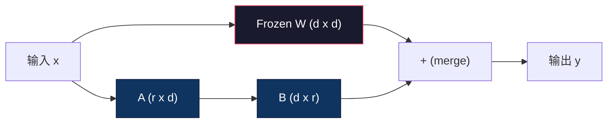
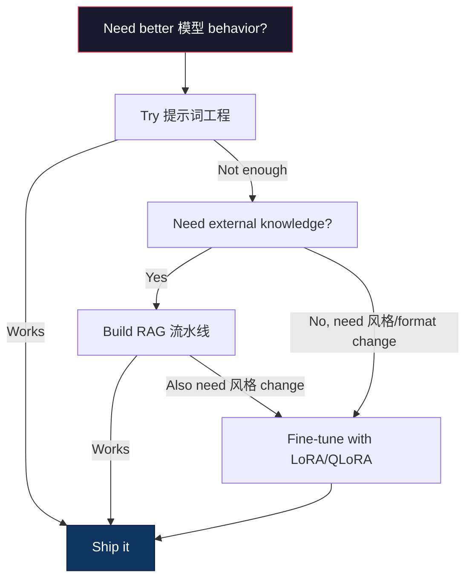

# 微调 with LoRA & QLoRA

> Full 微调 a 7B 模型 requires 56GB of VRAM. You don't have that. Neither do most companies. LoRA lets you fine-tune the same 模型 in 6GB by 训练 less than 1% of the 参数. This isn't a compromise -- it matches full 微调 质量 on most tasks. The entire open-source 微调 ecosystem runs on this one trick.

**类型：** Build
**语言：** Python
**先修：** Phase 10, Lesson 06 (指令调优 / SFT)
**时间：** 约 75 分钟
**Related:** Phase 10 covers the SFT/DPO loops from scratch. This lesson plugs those into the 2026 PEFT toolkits (PEFT, TRL, Unsloth, Axolotl, LLaMA-Factory).

## 学习目标

- Implement LoRA by injecting low-rank adapter matrices (A and B) into a 预训练 模型's 注意力 层
- Calculate the 参数 savings of LoRA vs full 微调: 排序 r with d_model 维度 trains 2*r*d 参数 instead of d^2
- Fine-tune a 模型 using QLoRA (4-bit 量化的 base + LoRA adapters) to fit within consumer GPU 内存
- Merge LoRA 权重 back into the base 模型 for deployment and compare 推理 speed with and without adapters

## 问题

你have a base 模型. Llama 3 8B. You want it to 答案 customer support tickets in your company's voice. SFT is the 答案. But SFT has a 成本 problem.

Full 微调 updates every 参数 in the 模型. Llama 3 8B has 8 billion 参数. In fp16, each 参数 takes 2 bytes. That's 16GB just to load the 权重. During 训练, you also need gradients (16GB), 优化器 states for Adam (32GB for momentum + 方差), and activations. Total: roughly 56GB of VRAM for a single 8B 模型.

一个A100 80GB can barely fit this. Two A100s 成本 $3-4/hour on cloud providers. 训练 for 3 epochs on 50,000 examples takes 6-10 小时. That's $30-40 per experiment. Run 10 experiments to get the hyperparameters right and you've spent $400 before deploying anything.

规模 this to Llama 3 70B and the numbers get absurd. 140GB for 权重 alone. You need a cluster. $100+ per experiment.

There's a deeper problem too. Full 微调 modifies every 权重 in the 模型. If you fine-tune on customer support 数据, you might degrade the 模型's general capabilities. It's called catastrophic forgetting. The 模型 gets better at your 任务 and worse at everything else.

你need a method that trains fewer 参数, uses less 内存, and doesn't destroy the 模型's existing knowledge.

## 概念

### LoRA: Low-Rank Adaptation

Edward Hu and colleagues at Microsoft published LoRA in June 2021. The paper's insight: the 权重 updates during 微调 have low intrinsic 排序. You don't need to update all 16.7 million 参数 in a 4096x4096 权重 matrix. The useful information in the update can be captured by a matrix of 排序 16 or 32.

Here's the math. A standard linear 层 computes:

```text
y = Wx
```

Where W is a d_out x d_in matrix. For a 4096x4096 注意力 projection, that's 16,777,216 参数.

LoRA freezes W and adds a low-rank decomposition:

```text
y = Wx + BAx
```

Where B is (d_out x r) and A is (r x d_in). The 排序 r is much smaller than d -- typically 8, 16, or 32.

For r=16 on a 4096x4096 层:
- Original 参数: 4096 x 4096 = 16,777,216
- LoRA 参数: (4096 x 16) + (16 x 4096) = 65,536 + 65,536 = 131,072
- Reduction: 131,072 / 16,777,216 = 0.78%

You're 训练 0.78% of the 参数 and getting 95-100% of the 质量.



一个is initialized with a random Gaussian. B is initialized to zero. This means the LoRA contribution starts at zero -- the 模型 begins 训练 from its original behavior and gradually learns the adaptation.

### The 扩展 Factor: Alpha

LoRA introduces a 扩展 factor alpha that controls how much the low-rank update affects the 输出：

```text
y = Wx + (alpha / r) * BAx
```

当alpha = r, the 扩展 is 1x. When alpha = 2r (the common default), the 扩展 is 2x. This hyperparameter controls the 学习 速率 of the LoRA path independently of the base 学习 速率.

Practical guidance:
- alpha = 2 * 排序 is a common community convention (the original paper used alpha = 排序 in most experiments)
- alpha = 排序 gives 1x 扩展, conservative but stable
- Higher alpha means larger updates per 步骤, which can speed convergence or cause instability

### Where to Apply LoRA

一个transformer has many linear 层. You don't need to add LoRA to all of them. The original paper tested different combinations:

|目标 层|Trainable Params (7B)|质量|
|--------------|----------------------|---------|
|q_proj only|4.7M|Good|
|q_proj + v_proj|9.4M|Better|
|q_proj + k_proj + v_proj + o_proj|18.9M|Best for 注意力|
|All linear (注意力 + MLP)|37.7M|Marginal gain, 2x params|

这个sweet spot for most tasks: q_proj + v_proj. This 目标 the 查询 and value projections in self-attention, which control what the 模型 attends to and what information it extracts. Adding MLP 层 helps for complex tasks like code 生成 but doubles the 参数 count for diminishing returns on simpler tasks.

### 排序 Selection

这个排序 r controls the expressiveness of the adaptation:

|排序|Trainable Params (per 层)|Best For|
|------|---------------------------|----------|
|4|32,768|Simple 分类, sentiment|
|8|65,536|Single-domain Q&A, summarization|
|16|131,072|Multi-domain tasks, instruction following|
|32|262,144|Complex 推理, code 生成|
|64|524,288|Diminishing returns for most tasks|
|128|1,048,576|Rarely justified|

Hu et al. showed that r=4 already captures most of the adaptation for simple tasks. r=8 and r=16 are the most common choices in practice. Going beyond r=64 rarely improves 质量 and starts to lose LoRA's 内存 advantage.

### QLoRA: 4-Bit 量化 + LoRA

Tim Dettmers and colleagues at the University of Washington published QLoRA in May 2023. The idea: quantize the frozen base 模型 to 4-bit precision, then attach LoRA adapters in fp16 on top.

这changes the 内存 equation dramatically:

|Method|权重 内存 (7B)|训练 内存 (7B)|GPU Required|
|--------|-------------------|---------------------|-------------|
|Full fine-tune (fp16)|14GB|~56GB|1x A100 80GB|
|LoRA (fp16 base)|14GB|~18GB|1x A100 40GB|
|QLoRA (4-bit base)|3.5GB|~6GB|1x RTX 3090 24GB|

QLoRA makes three technical contributions:

**NF4 (Normal Float 4-bit)**: A new 数据 type designed specifically for neural network 权重. Neural network 权重 follow a roughly normal 分布. NF4 places its 16 量化 levels at the quantiles of a standard normal 分布. This is information-theoretically optimal for normally 分布式 数据. It loses less information than uniform 4-bit 量化 (INT4) or standard Float4.

**Double 量化**: The 量化 constants themselves take 内存. Each 块 of 64 权重 needs a fp32 规模 factor (4 bytes). For a 7B 模型, that's an extra 0.4GB. Double 量化 quantizes these constants to fp8, reducing the overhead to 0.1GB. Small but it adds up.

**Paged optimizers**: During 训练, 优化器 states (Adam's momentum and 方差) can exceed GPU 内存 on long sequences. Paged optimizers use NVIDIA's unified 内存 to automatically page 优化器 states to CPU RAM when GPU 内存 is exhausted, and page them back when needed. This prevents OOM crashes at the 成本 of some throughput.

### The 质量 问题

Does reducing 参数 or quantizing the base hurt 质量? The results from multiple papers:

|Method|MMLU (5-shot)|MT-Bench|HumanEval|
|--------|--------------|----------|-----------|
|Full fine-tune (Llama 2 7B)|48.3|6.72|14.6|
|LoRA r=16|47.9|6.68|14.0|
|QLoRA r=16 (NF4)|47.5|6.61|13.4|
|QLoRA r=64 (NF4)|48.1|6.70|14.2|

LoRA at r=16 is within 1% of full 微调 on most benchmarks. QLoRA at r=16 loses another fraction of a percent. QLoRA at r=64 essentially matches full 微调 while using 90% less 内存.

### Real-World 成本

Fine-tuning Llama 3 8B on 50,000 examples (3 epochs):

|Method|GPU|时间|成本|
|--------|-----|------|------|
|Full fine-tune|2x A100 80GB|8 小时|~$32|
|LoRA r=16|1x A100 40GB|4 小时|~$8|
|QLoRA r=16|1x RTX 4090 24GB|6 小时|~$5|
|QLoRA r=16 (Unsloth)|1x RTX 4090 24GB|2.5 小时|~$2|
|QLoRA r=16|1x T4 16GB|12 小时|~$4|

QLoRA on a single consumer GPU 成本 less than a lunch. This is why the open-weight 微调 community exploded in 2023 and why every 训练 framework below ships QLoRA by default in 2026.

### The 2026 PEFT stack

|Framework|What it is|Pick when|
|-----------|-----------|-----------|
|**Hugging Face PEFT**|The canonical LoRA/QLoRA/DoRA/IA3 library|You want raw control and your 训练 循环 is already on `transformers.Trainer`|
|**TRL**|HF's reinforcement-from-feedback trainers (SFT, DPO, GRPO, PPO, ORPO)|You need DPO/GRPO after SFT; built on top of PEFT|
|**Unsloth**|Triton-kernel rewrite of the forward/backward pass|You want 2-5x speedup + half the VRAM with no accuracy 损失; Llama/Mistral/Qwen family|
|**Axolotl**|YAML-config wrapper over PEFT + TRL + DeepSpeed + Unsloth|You want reproducible, version-controlled 训练 runs|
|**LLaMA-Factory**|GUI/CLI/API over PEFT + TRL|You want zero-code 微调; 100+ 模型 families supported|
|**torchtune**|Native PyTorch recipes, no `transformers` dep|You want minimal deps and your org already standardizes on PyTorch|

Rule of thumb: research use or one-off experiment → PEFT. Repeatable 生产 流水线 → Axolotl with Unsloth kernels enabled. Throwaway prototyping → LLaMA-Factory.

### Merging Adapters

After 训练, you have two things: the frozen base 模型 and a small LoRA adapter (typically 10-100MB). You can either:

1. **Keep them separate**: Load the base 模型, load the adapter on top. Swap adapters for different tasks. This is how you serve multiple fine-tuned variants from one base 模型.

2. **Merge them permanently**: 计算 W' = W + (alpha/r) * BA and save the result as a new full 模型. The merged 模型 is the same size as the original. No 推理 overhead. No adapter to manage.

For serving multiple tasks (customer support adapter, code adapter, translation adapter), keep them separate. For deploying a single specialized 模型, merge.

Advanced merging techniques for combining multiple adapters:

- **TIES-Merging** (Yadav et al. 2023): Trims small-magnitude 参数, resolves sign conflicts, then merges. Reduces interference between adapters.
- **DARE** (Yu et al. 2023): Randomly drops adapter 参数 before merging and rescales the rest. Surprisingly effective at combining capabilities.
- **任务 arithmetic**: Simply add or subtract adapter 权重. Adding a "code" adapter and a "math" adapter often produces a 模型 good at both.

### When NOT to Fine-Tune

Fine-tuning is the third option, not the first.

**First: 提示词工程.** Write a better 系统 提示词. Add 少样本 examples. Use chain-of-thought. This 成本 nothing and takes 分钟. If prompting gets you 80% of the way there, you probably don't need to fine-tune.

**Second: RAG.** If the 模型 needs to know about your specific 数据 (文档, knowledge base, product catalog), 检索 is cheaper and more maintainable than baking it into 权重. See Lesson 06.

**Third: 微调.** Use this when you need the 模型 to adopt a specific 风格, format, or 推理 pattern that cannot be achieved through prompting. When you need consistent 结构化 输出. When you need to distill a larger 模型 into a smaller one. When 延迟 matters and you can't afford the extra 词元 from 少样本 prompting.



```figure
lora-params
```

## 动手构建

We implement LoRA from scratch in pure PyTorch. No libraries. No magic. You'll build the LoRA 层, inject it into a 模型, 训练 it, and merge the 权重 back.

### 步骤 1: The LoRA 层

```python
import torch
import torch.nn as nn
import math

class LoRALayer(nn.Module):
    def __init__(self, in_features, out_features, rank=8, alpha=16):
        super().__init__()
        self.rank = rank
        self.alpha = alpha
        self.scaling = alpha / rank

        self.A = nn.Parameter(torch.randn(in_features, rank) * (1 / math.sqrt(rank)))
        self.B = nn.Parameter(torch.zeros(rank, out_features))

    def forward(self, x):
        return (x @ self.A @ self.B) * self.scaling
```

一个is initialized with scaled random values. B is initialized to zero. The product BA starts at zero, so the 模型 begins with its original behavior.

### 步骤 2: LoRA-Wrapped Linear 层

```python
class LinearWithLoRA(nn.Module):
    def __init__(self, linear, rank=8, alpha=16):
        super().__init__()
        self.linear = linear
        self.lora = LoRALayer(
            linear.in_features, linear.out_features, rank, alpha
        )

        for param in self.linear.parameters():
            param.requires_grad = False

    def forward(self, x):
        return self.linear(x) + self.lora(x)
```

这个original linear 层 is frozen. Only the LoRA 参数 (A and B) are trainable.

### 步骤 3: Inject LoRA into a 模型

```python
def inject_lora(model, target_modules, rank=8, alpha=16):
    for param in model.parameters():
        param.requires_grad = False

    lora_layers = {}
    for name, module in model.named_modules():
        if isinstance(module, nn.Linear):
            if any(t in name for t in target_modules):
                parent_name = ".".join(name.split(".")[:-1])
                child_name = name.split(".")[-1]
                parent = dict(model.named_modules())[parent_name]
                lora_linear = LinearWithLoRA(module, rank, alpha)
                setattr(parent, child_name, lora_linear)
                lora_layers[name] = lora_linear
    return lora_layers
```

First, freeze every 参数 in the 模型. Then walk the 模型 tree, find linear 层 匹配 your 目标 names, and replace them with LoRA-wrapped versions. The LoRA A and B matrices are the only trainable 参数 in the entire 模型.

### 步骤 4: Count 参数

```python
def count_parameters(model):
    total = sum(p.numel() for p in model.parameters())
    trainable = sum(p.numel() for p in model.parameters() if p.requires_grad)
    frozen = total - trainable
    return {
        "total": total,
        "trainable": trainable,
        "frozen": frozen,
        "trainable_pct": 100 * trainable / total if total > 0 else 0
    }
```

### 步骤 5: Merge 权重 Back

```python
def merge_lora_weights(model):
    for name, module in model.named_modules():
        if isinstance(module, LinearWithLoRA):
            with torch.no_grad():
                merged = (
                    module.lora.A @ module.lora.B
                ) * module.lora.scaling
                module.linear.weight.data += merged.T
            parent_name = ".".join(name.split(".")[:-1])
            child_name = name.split(".")[-1]
            if parent_name:
                parent = dict(model.named_modules())[parent_name]
            else:
                parent = model
            setattr(parent, child_name, module.linear)
```

After merging, the LoRA 层 are gone. The 模型 is the same size as the original with the adaptation baked into the 权重. No 推理 overhead.

### 步骤 6: Simulated QLoRA 量化

```python
def quantize_to_nf4(tensor, block_size=64):
    blocks = tensor.reshape(-1, block_size)
    scales = blocks.abs().max(dim=1, keepdim=True).values / 7.0
    scales = torch.clamp(scales, min=1e-8)
    quantized = torch.round(blocks / scales).clamp(-8, 7).to(torch.int8)
    return quantized, scales

def dequantize_from_nf4(quantized, scales, original_shape):
    dequantized = quantized.float() * scales
    return dequantized.reshape(original_shape)
```

这simulates 4-bit 量化 by mapping 权重 into 16 discrete levels within 块 of 64. 生产 QLoRA uses the bitsandbytes library for true NF4 on GPU.

### 步骤 7: 训练 循环

```python
def train_lora(model, data, epochs=5, lr=1e-3, batch_size=4):
    optimizer = torch.optim.AdamW(
        [p for p in model.parameters() if p.requires_grad], lr=lr
    )
    criterion = nn.MSELoss()

    losses = []
    for epoch in range(epochs):
        epoch_loss = 0.0
        n_batches = 0
        indices = torch.randperm(len(data["inputs"]))

        for i in range(0, len(indices), batch_size):
            batch_idx = indices[i:i + batch_size]
            x = data["inputs"][batch_idx]
            y = data["targets"][batch_idx]

            output = model(x)
            loss = criterion(output, y)

            optimizer.zero_grad()
            loss.backward()
            optimizer.step()

            epoch_loss += loss.item()
            n_batches += 1

        avg_loss = epoch_loss / n_batches
        losses.append(avg_loss)

    return losses
```

### 步骤 8: Full Demo

```python
def demo():
    torch.manual_seed(42)
    d_model = 256
    n_classes = 10

    model = nn.Sequential(
        nn.Linear(d_model, 512),
        nn.ReLU(),
        nn.Linear(512, 512),
        nn.ReLU(),
        nn.Linear(512, n_classes),
    )

    n_samples = 500
    x = torch.randn(n_samples, d_model)
    y = torch.randint(0, n_classes, (n_samples,))
    y_onehot = torch.zeros(n_samples, n_classes).scatter_(1, y.unsqueeze(1), 1.0)

    data = {"inputs": x, "targets": y_onehot}

    params_before = count_parameters(model)

    lora_layers = inject_lora(
        model, target_modules=["0", "2"], rank=8, alpha=16
    )

    params_after = count_parameters(model)

    losses = train_lora(model, data, epochs=20, lr=1e-3)

    merge_lora_weights(model)
    params_merged = count_parameters(model)

    return {
        "params_before": params_before,
        "params_after": params_after,
        "params_merged": params_merged,
        "losses": losses,
    }
```

这个demo creates a small 模型, injects LoRA into two 层, trains it, and merges the 权重 back. The 参数 count drops from full trainable to ~1% trainable during LoRA 训练, then returns to the original 架构 after merging.

## 实际使用

With the Hugging Face ecosystem, LoRA on a 真实 模型 takes about 20 lines:

```python
from transformers import AutoModelForCausalLM, AutoTokenizer
from peft import LoraConfig, get_peft_model, TaskType

model = AutoModelForCausalLM.from_pretrained("meta-llama/Llama-3.1-8B")
tokenizer = AutoTokenizer.from_pretrained("meta-llama/Llama-3.1-8B")

lora_config = LoraConfig(
    task_type=TaskType.CAUSAL_LM,
    r=16,
    lora_alpha=32,
    lora_dropout=0.05,
    target_modules=["q_proj", "v_proj"],
)

model = get_peft_model(model, lora_config)
model.print_trainable_parameters()
```

For QLoRA, add bitsandbytes 量化:

```python
from transformers import BitsAndBytesConfig

bnb_config = BitsAndBytesConfig(
    load_in_4bit=True,
    bnb_4bit_quant_type="nf4",
    bnb_4bit_compute_dtype=torch.bfloat16,
    bnb_4bit_use_double_quant=True,
)

model = AutoModelForCausalLM.from_pretrained(
    "meta-llama/Llama-3.1-8B",
    quantization_config=bnb_config,
    device_map="auto",
)

model = get_peft_model(model, lora_config)
```

That's it. Same 训练 循环. Same 数据 流水线. The base 模型 now lives in 4-bit, LoRA adapters 训练 in fp16, and the whole thing fits in 6GB.

For 训练 with the Hugging Face Trainer:

```python
from transformers import TrainingArguments, Trainer
from datasets import load_dataset

dataset = load_dataset("tatsu-lab/alpaca", split="train[:5000]")

training_args = TrainingArguments(
    output_dir="./lora-llama",
    num_train_epochs=3,
    per_device_train_batch_size=4,
    gradient_accumulation_steps=4,
    learning_rate=2e-4,
    fp16=True,
    logging_steps=10,
    save_strategy="epoch",
    optim="paged_adamw_8bit",
)

trainer = Trainer(
    model=model,
    args=training_args,
    train_dataset=dataset,
)

trainer.train()

model.save_pretrained("./lora-adapter")
```

这个saved adapter is 10-100MB. The base 模型 stays untouched. You can share adapters on the Hugging Face Hub without redistributing the full 模型.

## 交付成果

这lesson produces:
- `outputs/prompt-lora-advisor.md` -- a 提示词 that helps you decide LoRA 排序, 目标 modules, and hyperparameters for your specific 任务
- `outputs/skill-fine-tuning-guide.md` -- a skill that teaches agents the decision tree for when and how to fine-tune

## 练习

1. **排序 ablation study.** Run the demo with ranks 2, 4, 8, 16, 32, and 64. Plot final 损失 vs. 排序. Find the point of diminishing returns where doubling the 排序 no longer halves the 损失. For a simple 分类 任务 on 256-dim 特征s, this should be around r=8-16.

2. **目标 module comparison.** Modify inject_lora to 目标 only 层 "0", only 层 "2", only 层 "4", and all three. 训练 each variant for 20 epochs. Compare convergence speed and final 损失. This mirrors the 真实 decision of targeting q_proj vs v_proj vs all linear 层.

3. **量化 错误 analysis.** Take the 训练后的 模型's 权重 matrices before and after quantize_to_nf4 / dequantize_from_nf4. 计算 the mean squared 错误, max absolute 错误, and the correlation between original and reconstructed 权重. Experiment with block_size values of 32, 64, 128, and 256.

4. **Multi-adapter serving.** 训练 two LoRA adapters on different subsets of the 数据 (even indices vs odd indices). Save both adapters. Load the base 模型 once, then swap adapters and verify that each produces different outputs on the same 输入. This is how 生产 systems serve multiple fine-tuned 模型 from one base.

5. **Merge vs. unmerged 推理.** Compare the 输出 of the LoRA 模型 before and after merge_lora_weights on the same 100 inputs. Verify the outputs are identical (within floating-point tolerance of 1e-5). Then 基准 推理 speed for both -- merged should be slightly faster since it's a single matrix multiply instead of two.

## Key Terms

|Term|What people say|What it actually means|
|------|----------------|----------------------|
|LoRA|"Efficient 微调"|Low-Rank Adaptation: freeze base 权重, 训练 two small matrices A and B whose product approximates the full 权重 update|
|QLoRA|"Fine-tune on a laptop"|量化的 LoRA: load the base 模型 in 4-bit NF4, 训练 LoRA adapters in fp16 on top, enabling 7B 微调 in 6GB VRAM|
|排序 (r)|"How much the 模型 can learn"|The inner 维度 of the A and B matrices; controls expressiveness vs. 参数 count|
|Alpha|"LoRA 学习 速率"|扩展 factor applied to the LoRA 输出; alpha/r scales the adaptation's contribution to the final 输出|
|NF4|"4-bit 量化"|Normal Float 4: a 4-bit 数据 type with 量化 levels at normal 分布 quantiles, optimal for neural network 权重|
|Adapter|"The small 训练后的 part"|The LoRA A and B matrices saved as a separate file (10-100MB), loadable on top of any copy of the base 模型|
|目标 modules|"Which 层 to LoRA"|The specific linear 层 (q_proj, v_proj, etc.) where LoRA adapters are injected|
|Merging|"Bake it in"|Computing W + (alpha/r) * BA and replacing the original 权重, eliminating the adapter overhead at 推理|
|Paged optimizers|"Don't OOM during 训练"|Offloading 优化器 states (Adam momentum, 方差) to CPU when GPU 内存 is exhausted|
|Catastrophic forgetting|"Fine-tuning broke everything else"|When updating all 权重 causes the 模型 to lose previously learned capabilities|

## 延伸阅读

- Hu et al., "LoRA: Low-Rank Adaptation of Large Language 模型" (2021) -- the original paper introducing the low-rank decomposition method, tested on GPT-3 175B with 排序 as low as 4
- Dettmers et al., "QLoRA: Efficient Finetuning of 量化的 Language 模型" (2023) -- introduces NF4, double 量化, and paged optimizers, enabling 65B 微调 on a single 48GB GPU
- PEFT library documentation (huggingface.co/docs/peft) -- the standard library for LoRA, QLoRA, and other parameter-efficient methods in the Hugging Face ecosystem
- Yadav et al., "TIES-Merging: Resolving Interference When Merging 模型" (2023) -- techniques for combining multiple LoRA adapters without 质量 degradation
- [Rafailov et al., "Direct Preference Optimization: Your Language Model is Secretly a Reward Model" (NeurIPS 2023)](https://arxiv.org/abs/2305.18290) -- DPO derivation; the preference-tuning stage that comes after SFT, no 奖励模型 needed.
- [TRL documentation](https://huggingface.co/docs/trl/) -- official 参考 for `SFTTrainer`, `DPOTrainer`, `KTOTrainer`, and the integration surface with PEFT/bitsandbytes/Unsloth.
- [Unsloth documentation](https://docs.unsloth.ai/) -- fused kernels that double 微调 throughput and halve 内存; the performance 层 under TRL.
- [Axolotl documentation](https://axolotl-ai-cloud.github.io/axolotl/) -- YAML-configured multi-GPU SFT/DPO/QLoRA trainer; the config-as-code 替代方案 to hand-written scripts.
