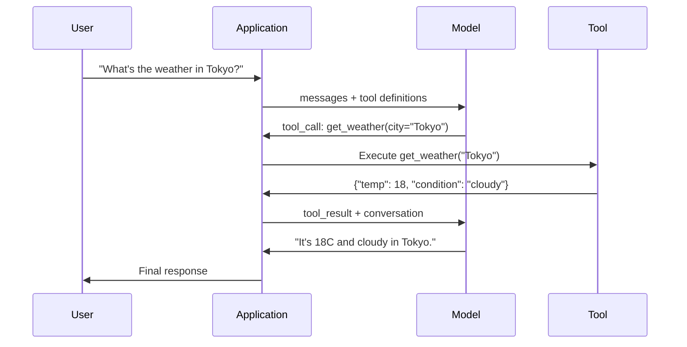

# 函数调用 & 工具使用

> LLMs cannot do anything. They 生成 文本. That is the entire capability. They cannot check the weather, 查询 a database, send an email, run code, or read a file. Every "AI 智能体" you have ever seen is an LLM generating JSON that says which 函数 to call -- and then your code actually calling it. The 模型 is the brain. 工具 are the hands. 函数 calling is the nervous 系统 connecting them.

**类型：** Build
**语言：** Python
**先修：** Phase 11 Lesson 03 (结构化输出)
**时间：** 约 75 分钟
**Related:** Phase 11 · 14 (模型 上下文 协议) — when a 工具 is shared across hosts, graduate from inline function-calling to an MCP 服务器. This lesson covers the inline case; MCP covers the 协议 case.

## 学习目标

- Implement a 函数调用 循环: define 工具 schemas, parse the 模型's tool-call JSON, execute 函数, and return results
- Design 工具 schemas with clear descriptions and typed 参数 that the 模型 can reliably invoke
- 构建a multi-turn 智能体 循环 that chains multiple 函数 calls to 答案 complex 查询
- Handle 函数调用 边 cases: 并行 工具 calls, 错误 propagation, and preventing infinite 工具 loops

## 问题

你build a chatbot. A 用户 asks: "What's the weather in Tokyo right now?"

这个模型 responds: "I don't have access to 实时 weather 数据, but based on the season, Tokyo is likely around 15 degrees Celsius..."

那is a 幻觉 dressed in a disclaimer. The 模型 does not know the weather. It never will. Weather changes every hour. The 模型's 训练 数据 is months old.

这个correct 答案 requires calling the OpenWeatherMap API, getting the current temperature, and returning the 真实 number. The 模型 cannot call APIs. Your code can. The missing piece: a 结构化 协议 that lets the 模型 say "I need to call the weather API with these arguments" and lets your code execute it and feed the result back.

这is 函数调用. The 模型 outputs 结构化 JSON describing which 函数 to invoke with what arguments. Your 应用 executes the 函数. The result goes back into the conversation. The 模型 uses the result to produce its final 答案.

Without 函数调用, LLMs are encyclopedias. With it, they become agents.

## 概念

### The 函数调用 循环

每个tool-use interaction follows the same 5-步骤 循环.



步骤 1: the 用户 sends a 消息. 步骤 2: the 模型 receives the 消息 along with 工具 definitions (JSON 模式 describing available 函数). 步骤 3: instead of responding with 文本, the 模型 outputs a 工具 call -- a 结构化 JSON object with the 函数 name and arguments. 步骤 4: your code executes the 函数 and captures the result. 步骤 5: the result goes back to the 模型, which now has 真实 数据 to produce its final 答案.

这个模型 never executes anything. It only decides what to call and with what arguments. Your code is the executor.

### 工具 Definitions: The JSON 模式 Contract

Each 工具 is defined by a JSON 模式 that tells the 模型 what the 函数 does, what arguments it takes, and what types those arguments must be.

```json
{
  "type": "function",
  "function": {
    "name": "get_weather",
    "description": "Get current weather for a city. Returns temperature in Celsius and conditions.",
    "parameters": {
      "type": "object",
      "properties": {
        "city": {
          "type": "string",
          "description": "City name, e.g. 'Tokyo' or 'San Francisco'"
        },
        "units": {
          "type": "string",
          "enum": ["celsius", "fahrenheit"],
          "description": "Temperature units"
        }
      },
      "required": ["city"]
    }
  }
}
```

这个`description` fields are critical. The 模型 reads them to decide when and how to use the 工具. A vague 描述 like "gets weather" produces worse 工具 selection than "Get current weather for a city. Returns temperature in Celsius and conditions." The 描述 is a 提示词 for 工具 selection.

### Provider Comparison

每个major provider supports 函数调用, but the API surface differs.

|Provider|API 参数|工具 Call Format|并行 Calls|Forced Calling|
|----------|--------------|-----------------|---------------|----------------|
|OpenAI (GPT-5, o4)|`tools`|`tool_calls[].function`|Yes (multiple per turn)|`tool_choice="required"`|
|Anthropic (Claude 4.6/4.7)|`tools`|`content[].type="tool_use"`|Yes (multiple 块)|`tool_choice={"type":"any"}`|
|Google (Gemini 3)|`function_declarations`|`functionCall`|Yes|`function_calling_config`|
|Open-weight (Llama 4, Qwen3, DeepSeek-V3)|Native `tools` on Llama 4; Hermes or ChatML on others|Mixed|Model-dependent|Prompt-based or `tool_choice` if supported|

By 2026 the three closed providers have converged on near-identical JSON-Schema-based formats. Llama 4 ships with a native `tools` field that matches OpenAI's shape. Open-weight fine-tunes still vary — the Hermes format (NousResearch) is the most common for third-party fine-tunes. For shared 工具 across hosts, prefer MCP (Phase 11 · 14) over inline function-calling — the 服务器 is the same for all of them.

### 工具 Choice: Auto, Required, Specific

你control when the 模型 uses 工具.

**Auto** (default): the 模型 decides whether to call a 工具 or respond directly. "What's 2+2?" -- responds directly. "What's the weather?" -- calls the 工具.

**Required**: the 模型 must call at least one 工具. Use this when you know the 用户's intent requires a 工具. Prevents the 模型 from guessing instead of looking up 真实 数据.

**Specific 函数**: force the 模型 to call a particular 函数. `tool_choice={"type":"function", "function": {"name": "get_weather"}}` guarantees the weather 工具 is called, regardless of the 查询. Use this for 路由 -- when upstream logic already determined which 工具 is needed.

### 并行 函数调用

GPT-4o and Claude can call multiple 函数 in a single turn. A 用户 asks: "What's the weather in Tokyo and New York?" The 模型 outputs two 工具 calls simultaneously:

```json
[
  {"name": "get_weather", "arguments": {"city": "Tokyo"}},
  {"name": "get_weather", "arguments": {"city": "New York"}}
]
```

你的code executes both (ideally concurrently), returns both results, and the 模型 synthesizes a single 响应. This cuts round trips from 2 to 1. For agents with 5-10 工具 calls per 查询, 并行 calling reduces 延迟 by 60-80%.

### 结构化输出 vs 函数调用

Lesson 03 covered 结构化输出. 函数 calling uses the same JSON 模式 machinery, but for a different purpose.

**结构化 outputs**: force the 模型 to produce 数据 in a specific shape. The 输出 is the final product. Example: extract product info from 文本 as `{name, price, in_stock}`.

**函数 calling**: the 模型 declares an intent to execute an 动作. The 输出 is an intermediate 步骤. Example: `get_weather(city="Tokyo")` -- the 模型 is requesting an 动作, not producing the final 答案.

使用结构化输出 when you want 数据 extraction. Use 函数调用 when you want the 模型 to interact with external systems.

### Security: The Non-Negotiable Rules

函数 calling is the most dangerous capability you can give an LLM. The 模型 chooses what to execute. If your 工具 set includes database 查询, the 模型 constructs the 查询. If it includes shell commands, the 模型 writes them.

**Rule 1: Never pass model-generated SQL directly to a database.** The 模型 can and will 生成 DROP TABLE, UNION injections, or 查询 that return every row. Always parameterize. Always 验证. Always use an allowlist of operations.

**Rule 2: Allowlist 函数.** The 模型 can only call 函数 you explicitly define. Never build a generic "execute any 函数 by name" 工具. If you have 50 internal 函数, expose only the 5 the 用户 needs.

**Rule 3: 验证 arguments.** The 模型 might pass a city name of `"; DROP TABLE users; --"`. 验证 every argument against expected types, ranges, and formats before execution.

**Rule 4: Sanitize 工具 results.** If a 工具 returns sensitive 数据 (API keys, PII, internal 错误), filter it before sending it back to the 模型. The 模型 will include 工具 results in its 响应 verbatim.

**Rule 5: 速率 限制 工具 calls.** A 模型 in a 循环 can call 工具 hundreds of times. Set a maximum (10-20 calls per conversation is reasonable). Break infinite loops.

### 错误 Handling

工具 fail. APIs time out. Databases go down. Files do not exist. The 模型 needs to know when a 工具 fails and why.

返回错误 as 结构化 工具 results, not exceptions:

```json
{
  "error": true,
  "message": "City 'Toky' not found. Did you mean 'Tokyo'?",
  "code": "CITY_NOT_FOUND"
}
```

这个模型 reads this, adjusts its arguments, and retries. 模型 are good at self-correcting from 结构化 错误 消息. They are bad at recovering from empty 响应 or generic "something went wrong" 错误.

### MCP: 模型 上下文 协议

MCP is Anthropic's 开放 standard for 工具 interoperability. Instead of every 应用 defining its own 工具, MCP provides a universal 协议: 工具 are served by MCP servers, consumed by MCP clients (like Claude Code, Cursor, or your 应用).

One MCP 服务器 can expose 工具 to any compatible 客户端. A Postgres MCP 服务器 gives any MCP-compatible 智能体 database access. A GitHub MCP 服务器 gives any 智能体 repository access. The 工具 are defined once, used everywhere.

MCP is to 函数调用 what HTTP is to networking. It standardizes the transport 层 so 工具 become portable.

## 动手构建

### 步骤 1: Define the 工具 Registry

构建a registry that stores 工具 definitions and their implementations. Each 工具 has a JSON 模式 definition (what the 模型 sees) and a Python 函数 (what your code executes).

```python
import json
import math
import time
import hashlib


TOOL_REGISTRY = {}


def register_tool(name, description, parameters, function):
    TOOL_REGISTRY[name] = {
        "definition": {
            "type": "function",
            "function": {
                "name": name,
                "description": description,
                "parameters": parameters,
            },
        },
        "function": function,
    }
```

### 步骤 2: Implement 5 工具

构建a calculator, weather lookup, web search simulator, file reader, and code runner.

```python
def calculator(expression, precision=2):
    allowed = set("0123456789+-*/.() ")
    if not all(c in allowed for c in expression):
        return {"error": True, "message": f"Invalid characters in expression: {expression}"}
    try:
        result = eval(expression, {"__builtins__": {}}, {"math": math})
        return {"result": round(float(result), precision), "expression": expression}
    except Exception as e:
        return {"error": True, "message": str(e)}


WEATHER_DB = {
    "tokyo": {"temp_c": 18, "condition": "cloudy", "humidity": 72, "wind_kph": 14},
    "new york": {"temp_c": 22, "condition": "sunny", "humidity": 45, "wind_kph": 8},
    "london": {"temp_c": 12, "condition": "rainy", "humidity": 88, "wind_kph": 22},
    "san francisco": {"temp_c": 16, "condition": "foggy", "humidity": 80, "wind_kph": 18},
    "sydney": {"temp_c": 25, "condition": "sunny", "humidity": 55, "wind_kph": 10},
}


def get_weather(city, units="celsius"):
    key = city.lower().strip()
    if key not in WEATHER_DB:
        suggestions = [c for c in WEATHER_DB if c.startswith(key[:3])]
        return {
            "error": True,
            "message": f"City '{city}' not found.",
            "suggestions": suggestions,
            "code": "CITY_NOT_FOUND",
        }
    data = WEATHER_DB[key].copy()
    if units == "fahrenheit":
        data["temp_f"] = round(data["temp_c"] * 9 / 5 + 32, 1)
        del data["temp_c"]
    data["city"] = city
    return data


SEARCH_DB = {
    "python function calling": [
        {"title": "OpenAI Function Calling Guide", "url": "https://platform.openai.com/docs/guides/function-calling", "snippet": "Learn how to connect LLMs to external tools."},
        {"title": "Anthropic Tool Use", "url": "https://docs.anthropic.com/en/docs/tool-use", "snippet": "Claude can interact with external tools and APIs."},
    ],
    "MCP protocol": [
        {"title": "Model Context Protocol", "url": "https://modelcontextprotocol.io", "snippet": "An open standard for connecting AI models to data sources."},
    ],
    "weather API": [
        {"title": "OpenWeatherMap API", "url": "https://openweathermap.org/api", "snippet": "Free weather API with current, forecast, and historical data."},
    ],
}


def web_search(query, max_results=3):
    key = query.lower().strip()
    for db_key, results in SEARCH_DB.items():
        if db_key in key or key in db_key:
            return {"query": query, "results": results[:max_results], "total": len(results)}
    return {"query": query, "results": [], "total": 0}


FILE_SYSTEM = {
    "data/config.json": '{"model": "gpt-4o", "temperature": 0.7, "max_tokens": 4096}',
    "data/users.csv": "name,email,role\nAlice,alice@example.com,admin\nBob,bob@example.com,user",
    "README.md": "# My Project\nA tool-use agent built from scratch.",
}


def read_file(path):
    if ".." in path or path.startswith("/"):
        return {"error": True, "message": "Path traversal not allowed.", "code": "FORBIDDEN"}
    if path not in FILE_SYSTEM:
        available = list(FILE_SYSTEM.keys())
        return {"error": True, "message": f"File '{path}' not found.", "available_files": available, "code": "NOT_FOUND"}
    content = FILE_SYSTEM[path]
    return {"path": path, "content": content, "size_bytes": len(content), "lines": content.count("\n") + 1}


def run_code(code, language="python"):
    if language != "python":
        return {"error": True, "message": f"Language '{language}' not supported. Only 'python' is available."}
    forbidden = ["import os", "import sys", "import subprocess", "exec(", "eval(", "__import__", "open("]
    for pattern in forbidden:
        if pattern in code:
            return {"error": True, "message": f"Forbidden operation: {pattern}", "code": "SECURITY_VIOLATION"}
    try:
        local_vars = {}
        exec(code, {"__builtins__": {"print": print, "range": range, "len": len, "str": str, "int": int, "float": float, "list": list, "dict": dict, "sum": sum, "min": min, "max": max, "abs": abs, "round": round, "sorted": sorted, "enumerate": enumerate, "zip": zip, "map": map, "filter": filter, "math": math}}, local_vars)
        result = local_vars.get("result", None)
        return {"success": True, "result": result, "variables": {k: str(v) for k, v in local_vars.items() if not k.startswith("_")}}
    except Exception as e:
        return {"error": True, "message": f"{type(e).__name__}: {e}"}
```

### 步骤 3: Register All 工具

```python
def register_all_tools():
    register_tool(
        "calculator", "Evaluate a mathematical expression. Supports +, -, *, /, parentheses, and decimals. Returns the numeric result.",
        {"type": "object", "properties": {"expression": {"type": "string", "description": "Math expression, e.g. '(10 + 5) * 3'"}, "precision": {"type": "integer", "description": "Decimal places in result", "default": 2}}, "required": ["expression"]},
        calculator,
    )
    register_tool(
        "get_weather", "Get current weather for a city. Returns temperature, condition, humidity, and wind speed.",
        {"type": "object", "properties": {"city": {"type": "string", "description": "City name, e.g. 'Tokyo' or 'San Francisco'"}, "units": {"type": "string", "enum": ["celsius", "fahrenheit"], "description": "Temperature units, defaults to celsius"}}, "required": ["city"]},
        get_weather,
    )
    register_tool(
        "web_search", "Search the web for information. Returns a list of results with title, URL, and snippet.",
        {"type": "object", "properties": {"query": {"type": "string", "description": "Search query"}, "max_results": {"type": "integer", "description": "Maximum results to return", "default": 3}}, "required": ["query"]},
        web_search,
    )
    register_tool(
        "read_file", "Read the contents of a file. Returns the file content, size, and line count.",
        {"type": "object", "properties": {"path": {"type": "string", "description": "Relative file path, e.g. 'data/config.json'"}}, "required": ["path"]},
        read_file,
    )
    register_tool(
        "run_code", "Execute Python code in a sandboxed environment. Set a 'result' variable to return output.",
        {"type": "object", "properties": {"code": {"type": "string", "description": "Python code to execute"}, "language": {"type": "string", "enum": ["python"], "description": "Programming language"}}, "required": ["code"]},
        run_code,
    )
```

### 步骤 4: Build the 函数调用 循环

这is the core engine. It simulates the 模型 deciding which 工具 to call, executes the 工具, and feeds results back.

```python
def simulate_model_decision(user_message, tools, conversation_history):
    msg = user_message.lower()

    if any(word in msg for word in ["weather", "temperature", "forecast"]):
        cities = []
        for city in WEATHER_DB:
            if city in msg:
                cities.append(city)
        if not cities:
            for word in msg.split():
                if word.capitalize() in [c.title() for c in WEATHER_DB]:
                    cities.append(word)
        if not cities:
            cities = ["tokyo"]
        calls = []
        for city in cities:
            calls.append({"name": "get_weather", "arguments": {"city": city.title()}})
        return calls

    if any(word in msg for word in ["calculate", "compute", "math", "what is", "how much"]):
        for token in msg.split():
            if any(c in token for c in "+-*/"):
                return [{"name": "calculator", "arguments": {"expression": token}}]
        if "+" in msg or "-" in msg or "*" in msg or "/" in msg:
            expr = "".join(c for c in msg if c in "0123456789+-*/.() ")
            if expr.strip():
                return [{"name": "calculator", "arguments": {"expression": expr.strip()}}]
        return [{"name": "calculator", "arguments": {"expression": "0"}}]

    if any(word in msg for word in ["search", "find", "look up", "google"]):
        query = msg.replace("search for", "").replace("look up", "").replace("find", "").strip()
        return [{"name": "web_search", "arguments": {"query": query}}]

    if any(word in msg for word in ["read", "file", "open", "cat", "show"]):
        for path in FILE_SYSTEM:
            if path.split("/")[-1].split(".")[0] in msg:
                return [{"name": "read_file", "arguments": {"path": path}}]
        return [{"name": "read_file", "arguments": {"path": "README.md"}}]

    if any(word in msg for word in ["run", "execute", "code", "python"]):
        return [{"name": "run_code", "arguments": {"code": "result = 'Hello from the sandbox!'", "language": "python"}}]

    return []


def execute_tool_call(tool_call):
    name = tool_call["name"]
    args = tool_call["arguments"]

    if name not in TOOL_REGISTRY:
        return {"error": True, "message": f"Unknown tool: {name}", "code": "UNKNOWN_TOOL"}

    tool = TOOL_REGISTRY[name]
    func = tool["function"]
    start = time.time()

    try:
        result = func(**args)
    except TypeError as e:
        result = {"error": True, "message": f"Invalid arguments: {e}"}

    elapsed_ms = round((time.time() - start) * 1000, 2)
    return {"tool": name, "result": result, "execution_time_ms": elapsed_ms}


def run_function_calling_loop(user_message, max_iterations=5):
    conversation = [{"role": "user", "content": user_message}]
    tool_definitions = [t["definition"] for t in TOOL_REGISTRY.values()]
    all_tool_results = []

    for iteration in range(max_iterations):
        tool_calls = simulate_model_decision(user_message, tool_definitions, conversation)

        if not tool_calls:
            break

        results = []
        for call in tool_calls:
            result = execute_tool_call(call)
            results.append(result)

        conversation.append({"role": "assistant", "content": None, "tool_calls": tool_calls})

        for result in results:
            conversation.append({"role": "tool", "content": json.dumps(result["result"]), "tool_name": result["tool"]})

        all_tool_results.extend(results)
        break

    return {"conversation": conversation, "tool_results": all_tool_results, "iterations": iteration + 1 if tool_calls else 0}
```

### 步骤 5: Argument 验证

构建a validator that checks 工具 call arguments against the JSON 模式 before execution.

```python
def validate_tool_arguments(tool_name, arguments):
    if tool_name not in TOOL_REGISTRY:
        return [f"Unknown tool: {tool_name}"]

    schema = TOOL_REGISTRY[tool_name]["definition"]["function"]["parameters"]
    errors = []

    if not isinstance(arguments, dict):
        return [f"Arguments must be an object, got {type(arguments).__name__}"]

    for required_field in schema.get("required", []):
        if required_field not in arguments:
            errors.append(f"Missing required argument: {required_field}")

    properties = schema.get("properties", {})
    for arg_name, arg_value in arguments.items():
        if arg_name not in properties:
            errors.append(f"Unknown argument: {arg_name}")
            continue

        prop_schema = properties[arg_name]
        expected_type = prop_schema.get("type")

        type_checks = {"string": str, "integer": int, "number": (int, float), "boolean": bool, "array": list, "object": dict}
        if expected_type in type_checks:
            if not isinstance(arg_value, type_checks[expected_type]):
                errors.append(f"Argument '{arg_name}': expected {expected_type}, got {type(arg_value).__name__}")

        if "enum" in prop_schema and arg_value not in prop_schema["enum"]:
            errors.append(f"Argument '{arg_name}': '{arg_value}' not in {prop_schema['enum']}")

    return errors
```

### 步骤 6: Run the Demo

```python
def run_demo():
    register_all_tools()

    print("=" * 60)
    print("  Function Calling & Tool Use Demo")
    print("=" * 60)

    print("\n--- Registered Tools ---")
    for name, tool in TOOL_REGISTRY.items():
        desc = tool["definition"]["function"]["description"][:60]
        params = list(tool["definition"]["function"]["parameters"].get("properties", {}).keys())
        print(f"  {name}: {desc}...")
        print(f"    params: {params}")

    print(f"\n--- Argument Validation ---")
    validation_tests = [
        ("get_weather", {"city": "Tokyo"}, "Valid call"),
        ("get_weather", {}, "Missing required arg"),
        ("get_weather", {"city": "Tokyo", "units": "kelvin"}, "Invalid enum value"),
        ("calculator", {"expression": 123}, "Wrong type (int for string)"),
        ("unknown_tool", {"x": 1}, "Unknown tool"),
    ]
    for tool_name, args, label in validation_tests:
        errors = validate_tool_arguments(tool_name, args)
        status = "VALID" if not errors else f"ERRORS: {errors}"
        print(f"  {label}: {status}")

    print(f"\n--- Tool Execution ---")
    direct_tests = [
        {"name": "calculator", "arguments": {"expression": "(10 + 5) * 3 / 2"}},
        {"name": "get_weather", "arguments": {"city": "Tokyo"}},
        {"name": "get_weather", "arguments": {"city": "Mars"}},
        {"name": "web_search", "arguments": {"query": "python function calling"}},
        {"name": "read_file", "arguments": {"path": "data/config.json"}},
        {"name": "read_file", "arguments": {"path": "../etc/passwd"}},
        {"name": "run_code", "arguments": {"code": "result = sum(range(1, 101))"}},
        {"name": "run_code", "arguments": {"code": "import os; os.system('rm -rf /')"}},
    ]
    for call in direct_tests:
        result = execute_tool_call(call)
        print(f"\n  {call['name']}({json.dumps(call['arguments'])})")
        print(f"    -> {json.dumps(result['result'], indent=None)[:100]}")
        print(f"    time: {result['execution_time_ms']}ms")

    print(f"\n--- Full Function Calling Loop ---")
    test_queries = [
        "What's the weather in Tokyo?",
        "Calculate (100 + 250) * 0.15",
        "Search for MCP protocol",
        "Read the config file",
        "Run some Python code",
        "Tell me a joke",
    ]
    for query in test_queries:
        print(f"\n  User: {query}")
        result = run_function_calling_loop(query)
        if result["tool_results"]:
            for tr in result["tool_results"]:
                print(f"    Tool: {tr['tool']} ({tr['execution_time_ms']}ms)")
                print(f"    Result: {json.dumps(tr['result'], indent=None)[:90]}")
        else:
            print(f"    [No tool called -- direct response]")
        print(f"    Iterations: {result['iterations']}")

    print(f"\n--- Parallel Tool Calls ---")
    multi_city_query = "What's the weather in tokyo and london?"
    print(f"  User: {multi_city_query}")
    result = run_function_calling_loop(multi_city_query)
    print(f"  Tool calls made: {len(result['tool_results'])}")
    for tr in result["tool_results"]:
        city = tr["result"].get("city", "unknown")
        temp = tr["result"].get("temp_c", "N/A")
        print(f"    {city}: {temp}C, {tr['result'].get('condition', 'N/A')}")

    print(f"\n--- Security Checks ---")
    security_tests = [
        ("read_file", {"path": "../../etc/passwd"}),
        ("run_code", {"code": "import subprocess; subprocess.run(['ls'])"}),
        ("calculator", {"expression": "__import__('os').system('ls')"}),
    ]
    for tool_name, args in security_tests:
        result = execute_tool_call({"name": tool_name, "arguments": args})
        blocked = result["result"].get("error", False)
        print(f"  {tool_name}({list(args.values())[0][:40]}): {'BLOCKED' if blocked else 'ALLOWED'}")
```

## 实际使用

### OpenAI 函数调用

```python
# from openai import OpenAI
#
# client = OpenAI()
#
# tools = [{
#     "type": "function",
#     "function": {
#         "name": "get_weather",
#         "description": "Get current weather for a city",
#         "parameters": {
#             "type": "object",
#             "properties": {
#                 "city": {"type": "string"},
#                 "units": {"type": "string", "enum": ["celsius", "fahrenheit"]}
#             },
#             "required": ["city"]
#         }
#     }
# }]
#
# response = client.chat.completions.create(
#     model="gpt-4o",
#     messages=[{"role": "user", "content": "Weather in Tokyo?"}],
#     tools=tools,
#     tool_choice="auto",
# )
#
# tool_call = response.choices[0].message.tool_calls[0]
# args = json.loads(tool_call.function.arguments)
# result = get_weather(**args)
#
# final = client.chat.completions.create(
#     model="gpt-4o",
#     messages=[
#         {"role": "user", "content": "Weather in Tokyo?"},
#         response.choices[0].message,
#         {"role": "tool", "tool_call_id": tool_call.id, "content": json.dumps(result)},
#     ],
# )
# print(final.choices[0].message.content)
```

OpenAI returns 工具 calls as `response.choices[0].message.tool_calls`. Each call has an `id` you must include when returning the result. The 模型 uses this ID to match results to calls. GPT-4o can return multiple 工具 calls in a single 响应 -- iterate and execute all of them.

### Anthropic 工具使用

```python
# import anthropic
#
# client = anthropic.Anthropic()
#
# response = client.messages.create(
#     model="claude-sonnet-4-20250514",
#     max_tokens=1024,
#     tools=[{
#         "name": "get_weather",
#         "description": "Get current weather for a city",
#         "input_schema": {
#             "type": "object",
#             "properties": {
#                 "city": {"type": "string"},
#                 "units": {"type": "string", "enum": ["celsius", "fahrenheit"]}
#             },
#             "required": ["city"]
#         }
#     }],
#     messages=[{"role": "user", "content": "Weather in Tokyo?"}],
# )
#
# tool_block = next(b for b in response.content if b.type == "tool_use")
# result = get_weather(**tool_block.input)
#
# final = client.messages.create(
#     model="claude-sonnet-4-20250514",
#     max_tokens=1024,
#     tools=[...],
#     messages=[
#         {"role": "user", "content": "Weather in Tokyo?"},
#         {"role": "assistant", "content": response.content},
#         {"role": "user", "content": [{"type": "tool_result", "tool_use_id": tool_block.id, "content": json.dumps(result)}]},
#     ],
# )
```

Anthropic returns 工具 calls as content 块 with `type: "tool_use"`. The 工具 result goes in a 用户 消息 with `type: "tool_result"`. Note the key difference: Anthropic uses `input_schema` for 工具 参数 definitions, while OpenAI uses `parameters`.

### MCP Integration

```python
# MCP servers expose tools over a standardized protocol.
# Any MCP-compatible client can discover and call these tools.
#
# Example: connecting to a Postgres MCP server
#
# from mcp import ClientSession, StdioServerParameters
# from mcp.client.stdio import stdio_client
#
# server_params = StdioServerParameters(
#     command="npx",
#     args=["-y", "@modelcontextprotocol/server-postgres", "postgresql://localhost/mydb"],
# )
#
# async with stdio_client(server_params) as (read, write):
#     async with ClientSession(read, write) as session:
#         await session.initialize()
#         tools = await session.list_tools()
#         result = await session.call_tool("query", {"sql": "SELECT count(*) FROM users"})
```

MCP decouples 工具 implementation from 工具 consumption. The Postgres 服务器 knows SQL. The GitHub 服务器 knows the API. Your 智能体 just discovers and calls 工具 -- it does not need provider-specific code for each integration.

## 交付成果

这lesson produces `outputs/prompt-tool-designer.md` -- a 可复用 提示词 template for designing 工具 definitions. Give it a 描述 of what you want a 工具 to do, and it produces the complete JSON 模式 definition with descriptions, types, and constraints.

It also produces `outputs/skill-function-calling-patterns.md` -- a decision framework for implementing 函数调用 in 生产, covering 工具 design, 错误 handling, security, and provider-specific patterns.

## 练习

1. **Add a 6th 工具: database 查询.** Implement a simulated SQL 工具 with an in-memory table. The 工具 accepts a table name and filter conditions (not raw SQL). 验证 that the table name is in an allowlist and that filter operators are restricted to `=`, `>`, `<`, `>=`, `<=`. Return 匹配 rows as JSON.

2. **Implement retry with 错误 feedback.** When a 工具 call fails (e.g., city not found), feed the 错误 消息 back to the 模型 decision 函数 and let it correct its arguments. Track how many retries each call takes. Set a maximum of 3 retries per 工具 call.

3. **Build a multi-step 智能体.** Some 查询 require chaining 工具 calls: "Read the 配置 file and tell me what 模型 is configured, then search the web for that 模型's pricing." Implement a 循环 that runs until the 模型 decides no more 工具 are needed, passing accumulated results into each decision 步骤. 限制 to 10 iterations to prevent infinite loops.

4. **Measure 工具 selection accuracy.** Create 30 test 查询 with expected 工具 names. Run your decision 函数 on all 30 and measure what percentage of the time it selects the correct 工具. Identify which 查询 cause the most confusion between 工具.

5. **Implement 工具 call 缓存.** If the same 工具 is called with identical arguments within 60 seconds, return the cached result instead of re-executing. Use a dictionary keyed by `(tool_name, frozenset(args.items()))`. Measure 缓存 hit rates across a conversation with 20 查询.

## Key Terms

|Term|What people say|What it actually means|
|------|----------------|----------------------|
|函数 calling|"工具 use"|The 模型 outputs 结构化 JSON describing a 函数 to invoke with specific arguments -- your code executes it, not the 模型|
|工具 definition|"函数 模式"|A JSON 模式 object describing a 工具's name, purpose, 参数, and types -- the 模型 reads this to decide when and how to use the 工具|
|工具 choice|"Calling mode"|Controls whether the 模型 must call a 工具 (required), may call a 工具 (auto), or must call a specific 工具 (named)|
|并行 calling|"Multi-tool"|The 模型 outputs multiple 工具 calls in a single turn, reducing round trips -- GPT-4o and Claude both support this|
|工具 result|"函数 输出"|The return value from executing a 工具, sent back to the 模型 as a 消息 so it can use 真实 数据 in its 响应|
|Argument 验证|"输入 checking"|Verifying that model-generated arguments match the expected types, ranges, and constraints before executing the 工具|
|MCP|"工具 协议"|模型 上下文 协议 -- Anthropic's 开放 standard for exposing 工具 via servers that any compatible 客户端 can discover and call|
|智能体 循环|"ReAct 循环"|The iterative cycle of model-decides-tool, code-executes-tool, result-feeds-back until the 模型 has enough information to respond|
|工具 poisoning|"提示词 injection via 工具"|An attack where 工具 results contain instructions that manipulate the 模型's behavior -- sanitize all 工具 outputs|
|速率 limiting|"Call 预算"|Setting a maximum number of 工具 calls per conversation to prevent infinite loops and runaway API 成本|

## 延伸阅读

- [OpenAI Function Calling Guide](https://platform.openai.com/docs/guides/function-calling) -- the definitive 参考 for 工具使用 with GPT-4o, including 并行 calls, forced calling, and 结构化 arguments
- [Anthropic Tool Use Guide](https://docs.anthropic.com/en/docs/tool-use) -- Claude's 工具使用 implementation with input_schema, multi-tool 响应, and tool_choice configuration
- [Model Context Protocol Specification](https://modelcontextprotocol.io) -- the 开放 standard for 工具 interoperability across AI applications, with 服务器/客户端 架构
- [Schick et al., 2023 -- "Toolformer: Language Models Can Teach Themselves to Use Tools"](https://arxiv.org/abs/2302.04761) -- the foundational paper on 训练 LLMs to decide when and how to call external 工具
- [Patil et al., 2023 -- "Gorilla: Large Language Model Connected with Massive APIs"](https://arxiv.org/abs/2305.15334) -- 微调 LLMs for accurate API calls across 1,645 APIs with 幻觉 reduction
- [Berkeley Function Calling Leaderboard](https://gorilla.cs.berkeley.edu/leaderboard.html) -- 实时 基准 comparing 函数调用 accuracy across GPT-4o, Claude, Gemini, and 开放 模型
- [Yao et al., "ReAct: Synergizing Reasoning and Acting in Language Models" (ICLR 2023)](https://arxiv.org/abs/2210.03629) -- the Thought-Action-Observation 循环 that is the outer 智能体 循环 around every 工具 call; where this lesson ends, Phase 14 picks up.
- [Anthropic — Building effective agents (Dec 2024)](https://www.anthropic.com/research/building-effective-agents) -- five composable patterns (提示词 chaining, 路由, parallelization, orchestrator-workers, evaluator-optimizer) built from the single tool-use primitive.
