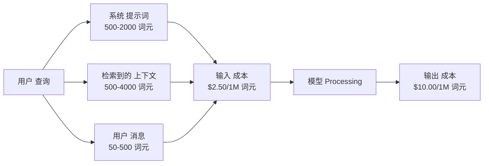
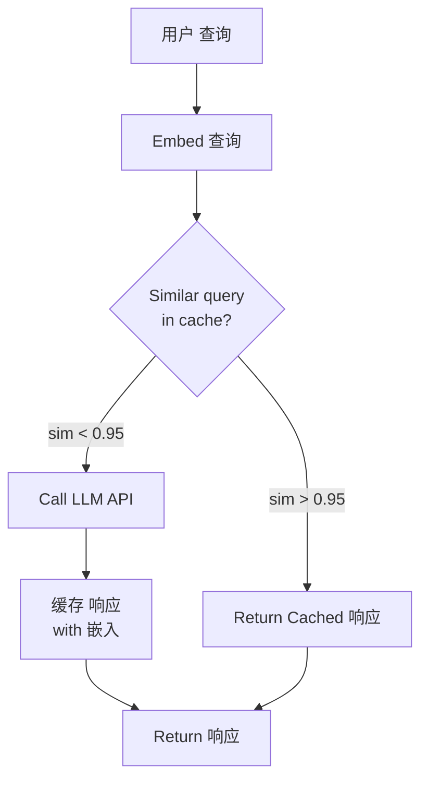
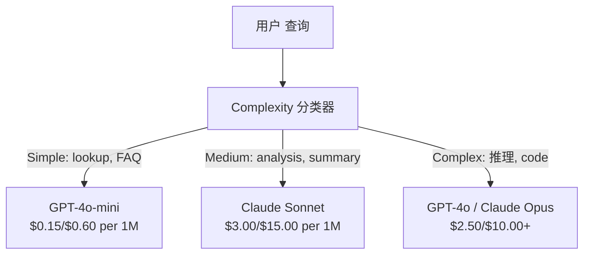

# 缓存, 速率 Limiting & 成本 优化

> Most AI startups do not die from bad 模型. They die from bad unit economics. A single GPT-4o call 成本 fractions of a cent. Ten thousand users making ten calls per day 成本 $250 in 输入 词元 alone -- before you charge a single dollar. The companies that survive are the ones that treat every API call as a financial transaction, not a 函数 call.

**类型：** Build
**语言：** Python
**先修：** Phase 11 Lesson 09 (函数调用)
**时间：** 约 45 分钟
**Related:** Phase 11 · 15 (提示词 缓存) — this lesson covers application-layer 缓存 (语义 缓存, exact hash 缓存, 模型 路由). Lesson 15 covers provider-layer 提示词 缓存 (Anthropic cache_control, OpenAI automatic, Gemini CachedContent). Combine both for 50-95% 成本 reduction.

## 学习目标

- Implement 语义 缓存 that serves repeated or similar 查询 from 缓存 instead of making a new API call
- Calculate per-request 成本 across providers and implement token-aware 速率 limiting and 预算 alerts
- 构建a 成本 优化 层 with 提示词 压缩, 模型 路由 (expensive vs cheap), and 响应 缓存
- Design a tiered 缓存 strategy using exact match, 语义 相似度, and prefix 缓存 for different 查询 types

## 问题

你build a RAG chatbot. It works beautifully. Users love it.

Then the invoice arrives.

GPT-5 成本 $5 per million 输入 词元 and $15 per million 输出. Claude Opus 4.7 成本 $15 输入 / $75 输出. Gemini 3 Pro 成本 $1.25 输入 / $5 输出. GPT-5-mini is $0.25/$2. Prices below are illustrative; always check the provider's current pricing page.

Here is the math that kills startups:

- 10,000 daily active users
- 10 查询 per 用户 per day
- 1,000 输入 词元 per 查询 (系统 提示词 + 上下文 + 用户 消息)
- 500 输出 词元 per 响应

**Daily 输入 成本:** 10,000 x 10 x 1,000 / 1,000,000 x $2.50 = **$250/day**
**Daily 输出 成本:** 10,000 x 10 x 500 / 1,000,000 x $10.00 = **$500/day**
**Monthly total:** **$22,500/month**

那is just the LLM. Add 嵌入s, vector database hosting, infrastructure. You are looking at $30,000/month for a chatbot.

这个brutal part: 40-60% of those 查询 are near-duplicates. Users ask the same 问题 in slightly different words. Your 系统 提示词 -- identical across every request -- gets billed every single time. 上下文 文档 检索到的 by RAG repeat across users who ask about the same topic.

你are paying full price for redundant computation.

## 概念

### The 成本 Anatomy of an LLM Call

每个API call has five 成本 components.



系统 prompts are the silent killer. A 1,500-词元 系统 提示词 sent with every request 成本 $3.75 per million requests just for that prefix. At 100K requests per day, that is $375/day -- $11,250/month -- for 文本 that never changes.

### Provider 缓存: Built-in Discounts

All three major providers offer provider-side 提示词 缓存 in 2026, but the mechanics differ. See Phase 11 · 15 for the deep dive.

|Provider|Mechanism|Discount|Minimum|缓存 Duration|
|----------|-----------|----------|---------|----------------|
|Anthropic|Explicit cache_control markers|90% on 缓存 hits (pay 25% extra on write)|1,024 词元 (Sonnet/Opus), 2,048 (Haiku)|5 min default; 1h extended (2x write premium)|
|OpenAI|Automatic prefix 匹配|50% on 缓存 hits|1,024 词元|Best-effort up to 1 hour|
|Google Gemini|Explicit CachedContent API|~75% reduction (plus storage)|4,096 (Flash) / 32,768 (Pro)|User-configurable TTL|

**Anthropic's approach** is explicit. You mark sections of your 提示词 with `cache_control: {"type": "ephemeral"}`. The first request pays a 25% write premium. Subsequent requests with the same prefix get a 90% discount. A 2,000-词元 系统 提示词 that 成本 $0.005 normally 成本 $0.000625 on 缓存 hits. Over 100K requests, that saves $437.50/day.

**OpenAI's approach** is automatic. Any 提示词 prefix that matches a previous request gets a 50% discount. No markers needed. The tradeoff: less discount, less control, but zero implementation effort.

### 语义 缓存: Your Custom 层

Provider 缓存 only works for identical prefixes. 语义 缓存 handles the harder case: different 查询 with the same meaning.

"What is the return 策略?" and "How do I return an item?" are different strings but identical intent. A 语义 缓存 embeds both 查询, computes cosine 相似度, and returns the cached 响应 if 相似度 exceeds a 阈值 (typically 0.92-0.95).



这个嵌入 成本 are negligible. OpenAI's text-嵌入-3-small 成本 $0.02 per million 词元. Checking the 缓存 成本 almost nothing compared to a full LLM call.

### Exact 缓存: Hash and Match

For deterministic calls (temperature=0, same 模型, same 提示词), exact 缓存 is simpler and faster. Hash the full 提示词, check the 缓存, return if found.

这works perfectly for:
- 系统 提示词 + fixed 上下文 + identical 用户 查询
- 函数 calling with identical 工具 definitions
- 批次 processing where the same 文档 gets processed multiple times

### 速率 Limiting: Protecting Your 预算

速率 limiting is not just about fairness. It is about survival.

**词元 bucket algorithm:** each 用户 gets a bucket of N 词元 that refills at 速率 R per second. A request consumes 词元 from the bucket. If the bucket is empty, the request is rejected. This allows bursts (use the full bucket at once) while enforcing an average 速率.

**Per-user quotas:** set daily/monthly 词元 limits per 用户 tier.

|Tier|Daily 词元 限制|Max Requests/min|模型 Access|
|------|------------------|------------------|-------------|
|Free|50,000|10|GPT-4o-mini only|
|Pro|500,000|60|GPT-4o, Claude Sonnet|
|Enterprise|5,000,000|300|All 模型|

### 模型 路由: Right 模型 for the Right Job

Not every 查询 needs GPT-4o.

"What time does the store close?" does not require a $10/M-output 模型. GPT-4o-mini at $0.60/M 输出 handles it perfectly. Claude Haiku at $1.25/M 输出 handles it. A simple 分类器 routes cheap 查询 to cheap 模型 and complex 查询 to expensive 模型.



一个well-tuned 路由器 saves 40-70% on 模型 成本 alone.

### 成本 Tracking: Know Where the Money Goes

你cannot 优化 what you do not measure. Log every API call with:

- 时间stamp
- 模型 name
- 输入 词元
- 输出 词元
- 延迟 (ms)
- Computed 成本 ($)
- 用户 ID
- 缓存 hit/miss
- Request category

这数据 reveals which 特征s are expensive, which users are heavy consumers, and where 缓存 has the most impact.

### Batching: Bulk Discounts

OpenAI's 批次 API processes requests asynchronously at a 50% discount. You submit a 批次 of up to 50,000 requests, and results come back within 24 小时.

使用batching for:
- Nightly 文档 processing
- Bulk 分类
- 评估 runs
- 数据 enrichment pipelines

Not for: 实时 user-facing 查询 (延迟 matters).

### 预算 Alerts and Circuit Breakers

一个circuit breaker stops spending when you hit a 限制. Without one, a bug or abuse can burn through your monthly 预算 in 小时.

Set three thresholds:
1. **Warning** (70% of 预算): send an alert
2. **Throttle** (85% of 预算): switch to cheaper 模型 only
3. **Stop** (95% of 预算): reject new requests, return cached 响应 only

### The 优化 Stack

Apply these techniques in order. Each 层 compounds on the previous ones.

|层|Technique|Typical Savings|Implementation Effort|
|-------|-----------|----------------|----------------------|
|1|Provider 提示词 缓存|30-50%|Low (add 缓存 markers)|
|2|Exact 缓存|10-20%|Low (hash + dict)|
|3|语义 缓存|15-30%|Medium (嵌入s + 相似度)|
|4|模型 路由|40-70%|Medium (分类器)|
|5|速率 limiting|预算 protection|Low (词元 bucket)|
|6|提示词 压缩|10-30%|Medium (rewrite prompts)|
|7|Batching|50% on eligible|Low (批次 API)|

一个RAG app applying 层 1-5 typically reduces 成本 from $22,500/month to $4,000-6,000/month. That is the difference between burning runway and building a business.

### 真实 Savings: Before and After

Here is a 真实 breakdown for a RAG chatbot serving 10,000 DAU.

|指标|Before 优化|After 优化|Savings|
|--------|--------------------|--------------------|---------|
|Monthly LLM 成本|$22,500|$5,200|77%|
|Avg 成本 per 查询|$0.0075|$0.0017|77%|
|缓存 hit 速率|0%|52%|--|
|查询 routed to mini|0%|65%|--|
|P95 延迟|2,800ms|900ms (缓存 hits: 50ms)|68%|
|Monthly 嵌入 成本|$0|$180|(new 成本)|
|Total monthly 成本|$22,500|$5,380|76%|

这个嵌入 成本 for 语义 缓存 ($180/month) pays for itself within the first hour of 缓存 hits.

## 动手构建

### 步骤 1: 成本 Calculator

构建a 词元 成本 calculator that knows current pricing for major 模型.

```python
import hashlib
import time
import json
import math
from dataclasses import dataclass, field


MODEL_PRICING = {
    "gpt-4o": {"input": 2.50, "output": 10.00, "cached_input": 1.25},
    "gpt-4o-mini": {"input": 0.15, "output": 0.60, "cached_input": 0.075},
    "gpt-4.1": {"input": 2.00, "output": 8.00, "cached_input": 0.50},
    "gpt-4.1-mini": {"input": 0.40, "output": 1.60, "cached_input": 0.10},
    "gpt-4.1-nano": {"input": 0.10, "output": 0.40, "cached_input": 0.025},
    "o3": {"input": 2.00, "output": 8.00, "cached_input": 0.50},
    "o3-mini": {"input": 1.10, "output": 4.40, "cached_input": 0.55},
    "o4-mini": {"input": 1.10, "output": 4.40, "cached_input": 0.275},
    "claude-opus-4": {"input": 15.00, "output": 75.00, "cached_input": 1.50},
    "claude-sonnet-4": {"input": 3.00, "output": 15.00, "cached_input": 0.30},
    "claude-haiku-3.5": {"input": 0.80, "output": 4.00, "cached_input": 0.08},
    "gemini-2.5-pro": {"input": 1.25, "output": 10.00, "cached_input": 0.3125},
    "gemini-2.5-flash": {"input": 0.15, "output": 0.60, "cached_input": 0.0375},
}


def calculate_cost(model, input_tokens, output_tokens, cached_input_tokens=0):
    if model not in MODEL_PRICING:
        return {"error": f"Unknown model: {model}"}
    pricing = MODEL_PRICING[model]
    non_cached = input_tokens - cached_input_tokens
    input_cost = (non_cached / 1_000_000) * pricing["input"]
    cached_cost = (cached_input_tokens / 1_000_000) * pricing["cached_input"]
    output_cost = (output_tokens / 1_000_000) * pricing["output"]
    total = input_cost + cached_cost + output_cost
    return {
        "model": model,
        "input_tokens": input_tokens,
        "output_tokens": output_tokens,
        "cached_input_tokens": cached_input_tokens,
        "input_cost": round(input_cost, 6),
        "cached_input_cost": round(cached_cost, 6),
        "output_cost": round(output_cost, 6),
        "total_cost": round(total, 6),
    }
```

### 步骤 2: Exact 缓存

Hash the full 提示词 and return cached 响应 for identical requests.

```python
class ExactCache:
    def __init__(self, max_size=1000, ttl_seconds=3600):
        self.cache = {}
        self.max_size = max_size
        self.ttl = ttl_seconds
        self.hits = 0
        self.misses = 0

    def _hash(self, model, messages, temperature):
        key_data = json.dumps({"model": model, "messages": messages, "temperature": temperature}, sort_keys=True)
        return hashlib.sha256(key_data.encode()).hexdigest()

    def get(self, model, messages, temperature=0.0):
        if temperature > 0:
            self.misses += 1
            return None
        key = self._hash(model, messages, temperature)
        if key in self.cache:
            entry = self.cache[key]
            if time.time() - entry["timestamp"] < self.ttl:
                self.hits += 1
                entry["access_count"] += 1
                return entry["response"]
            del self.cache[key]
        self.misses += 1
        return None

    def put(self, model, messages, temperature, response):
        if temperature > 0:
            return
        if len(self.cache) >= self.max_size:
            oldest_key = min(self.cache, key=lambda k: self.cache[k]["timestamp"])
            del self.cache[oldest_key]
        key = self._hash(model, messages, temperature)
        self.cache[key] = {
            "response": response,
            "timestamp": time.time(),
            "access_count": 1,
        }

    def stats(self):
        total = self.hits + self.misses
        return {
            "hits": self.hits,
            "misses": self.misses,
            "hit_rate": round(self.hits / total, 4) if total > 0 else 0,
            "cache_size": len(self.cache),
        }
```

### 步骤 3: 语义 缓存

Embed 查询 and return cached 响应 when 相似度 exceeds a 阈值.

```python
def simple_embed(text):
    words = text.lower().split()
    vocab = {}
    for w in words:
        vocab[w] = vocab.get(w, 0) + 1
    norm = math.sqrt(sum(v * v for v in vocab.values()))
    if norm == 0:
        return {}
    return {k: v / norm for k, v in vocab.items()}


def cosine_similarity(a, b):
    if not a or not b:
        return 0.0
    all_keys = set(a) | set(b)
    dot = sum(a.get(k, 0) * b.get(k, 0) for k in all_keys)
    return dot


class SemanticCache:
    def __init__(self, similarity_threshold=0.85, max_size=500, ttl_seconds=3600):
        self.entries = []
        self.threshold = similarity_threshold
        self.max_size = max_size
        self.ttl = ttl_seconds
        self.hits = 0
        self.misses = 0

    def get(self, query):
        query_embedding = simple_embed(query)
        now = time.time()
        best_match = None
        best_sim = 0.0
        for entry in self.entries:
            if now - entry["timestamp"] > self.ttl:
                continue
            sim = cosine_similarity(query_embedding, entry["embedding"])
            if sim > best_sim:
                best_sim = sim
                best_match = entry
        if best_match and best_sim >= self.threshold:
            self.hits += 1
            best_match["access_count"] += 1
            return {"response": best_match["response"], "similarity": round(best_sim, 4), "original_query": best_match["query"]}
        self.misses += 1
        return None

    def put(self, query, response):
        if len(self.entries) >= self.max_size:
            self.entries.sort(key=lambda e: e["timestamp"])
            self.entries.pop(0)
        self.entries.append({
            "query": query,
            "embedding": simple_embed(query),
            "response": response,
            "timestamp": time.time(),
            "access_count": 1,
        })

    def stats(self):
        total = self.hits + self.misses
        return {
            "hits": self.hits,
            "misses": self.misses,
            "hit_rate": round(self.hits / total, 4) if total > 0 else 0,
            "cache_size": len(self.entries),
        }
```

### 步骤 4: 速率 Limiter

词元 bucket 速率 limiter with per-user quotas.

```python
class TokenBucketRateLimiter:
    def __init__(self):
        self.buckets = {}
        self.tiers = {
            "free": {"capacity": 50_000, "refill_rate": 500, "max_requests_per_min": 10},
            "pro": {"capacity": 500_000, "refill_rate": 5_000, "max_requests_per_min": 60},
            "enterprise": {"capacity": 5_000_000, "refill_rate": 50_000, "max_requests_per_min": 300},
        }

    def _get_bucket(self, user_id, tier="free"):
        if user_id not in self.buckets:
            tier_config = self.tiers.get(tier, self.tiers["free"])
            self.buckets[user_id] = {
                "tokens": tier_config["capacity"],
                "capacity": tier_config["capacity"],
                "refill_rate": tier_config["refill_rate"],
                "last_refill": time.time(),
                "request_timestamps": [],
                "max_rpm": tier_config["max_requests_per_min"],
                "tier": tier,
                "total_tokens_used": 0,
            }
        return self.buckets[user_id]

    def _refill(self, bucket):
        now = time.time()
        elapsed = now - bucket["last_refill"]
        refill = int(elapsed * bucket["refill_rate"])
        if refill > 0:
            bucket["tokens"] = min(bucket["capacity"], bucket["tokens"] + refill)
            bucket["last_refill"] = now

    def check(self, user_id, tokens_needed, tier="free"):
        bucket = self._get_bucket(user_id, tier)
        self._refill(bucket)
        now = time.time()
        bucket["request_timestamps"] = [t for t in bucket["request_timestamps"] if now - t < 60]
        if len(bucket["request_timestamps"]) >= bucket["max_rpm"]:
            return {"allowed": False, "reason": "rate_limit", "retry_after_seconds": 60 - (now - bucket["request_timestamps"][0])}
        if bucket["tokens"] < tokens_needed:
            deficit = tokens_needed - bucket["tokens"]
            wait = deficit / bucket["refill_rate"]
            return {"allowed": False, "reason": "token_limit", "tokens_available": bucket["tokens"], "retry_after_seconds": round(wait, 1)}
        return {"allowed": True, "tokens_available": bucket["tokens"]}

    def consume(self, user_id, tokens_used, tier="free"):
        bucket = self._get_bucket(user_id, tier)
        bucket["tokens"] -= tokens_used
        bucket["request_timestamps"].append(time.time())
        bucket["total_tokens_used"] += tokens_used

    def get_usage(self, user_id):
        if user_id not in self.buckets:
            return {"error": "User not found"}
        b = self.buckets[user_id]
        return {
            "user_id": user_id,
            "tier": b["tier"],
            "tokens_remaining": b["tokens"],
            "capacity": b["capacity"],
            "total_tokens_used": b["total_tokens_used"],
            "utilization": round(b["total_tokens_used"] / b["capacity"], 4) if b["capacity"] else 0,
        }
```

### 步骤 5: 成本 Tracker

Log every call and 计算 running totals.

```python
class CostTracker:
    def __init__(self, monthly_budget=1000.0):
        self.logs = []
        self.monthly_budget = monthly_budget
        self.alerts = []

    def log_call(self, model, input_tokens, output_tokens, cached_input_tokens=0, latency_ms=0, user_id="anonymous", cache_status="miss"):
        cost = calculate_cost(model, input_tokens, output_tokens, cached_input_tokens)
        entry = {
            "timestamp": time.time(),
            "model": model,
            "input_tokens": input_tokens,
            "output_tokens": output_tokens,
            "cached_input_tokens": cached_input_tokens,
            "latency_ms": latency_ms,
            "cost": cost["total_cost"],
            "user_id": user_id,
            "cache_status": cache_status,
        }
        self.logs.append(entry)
        self._check_budget()
        return entry

    def _check_budget(self):
        total = self.total_cost()
        pct = total / self.monthly_budget if self.monthly_budget > 0 else 0
        if pct >= 0.95 and not any(a["level"] == "stop" for a in self.alerts):
            self.alerts.append({"level": "stop", "message": f"Budget 95% consumed: ${total:.2f}/${self.monthly_budget:.2f}", "timestamp": time.time()})
        elif pct >= 0.85 and not any(a["level"] == "throttle" for a in self.alerts):
            self.alerts.append({"level": "throttle", "message": f"Budget 85% consumed: ${total:.2f}/${self.monthly_budget:.2f}", "timestamp": time.time()})
        elif pct >= 0.70 and not any(a["level"] == "warning" for a in self.alerts):
            self.alerts.append({"level": "warning", "message": f"Budget 70% consumed: ${total:.2f}/${self.monthly_budget:.2f}", "timestamp": time.time()})

    def total_cost(self):
        return round(sum(e["cost"] for e in self.logs), 6)

    def cost_by_model(self):
        by_model = {}
        for e in self.logs:
            m = e["model"]
            if m not in by_model:
                by_model[m] = {"calls": 0, "cost": 0, "input_tokens": 0, "output_tokens": 0}
            by_model[m]["calls"] += 1
            by_model[m]["cost"] = round(by_model[m]["cost"] + e["cost"], 6)
            by_model[m]["input_tokens"] += e["input_tokens"]
            by_model[m]["output_tokens"] += e["output_tokens"]
        return by_model

    def cache_savings(self):
        cache_hits = [e for e in self.logs if e["cache_status"] == "hit"]
        if not cache_hits:
            return {"saved": 0, "cache_hits": 0}
        saved = 0
        for e in cache_hits:
            full_cost = calculate_cost(e["model"], e["input_tokens"], e["output_tokens"])
            saved += full_cost["total_cost"]
        return {"saved": round(saved, 4), "cache_hits": len(cache_hits)}

    def summary(self):
        if not self.logs:
            return {"total_calls": 0, "total_cost": 0}
        total_latency = sum(e["latency_ms"] for e in self.logs)
        cache_hits = sum(1 for e in self.logs if e["cache_status"] == "hit")
        return {
            "total_calls": len(self.logs),
            "total_cost": self.total_cost(),
            "avg_cost_per_call": round(self.total_cost() / len(self.logs), 6),
            "avg_latency_ms": round(total_latency / len(self.logs), 1),
            "cache_hit_rate": round(cache_hits / len(self.logs), 4),
            "cost_by_model": self.cost_by_model(),
            "cache_savings": self.cache_savings(),
            "budget_remaining": round(self.monthly_budget - self.total_cost(), 2),
            "budget_utilization": round(self.total_cost() / self.monthly_budget, 4) if self.monthly_budget > 0 else 0,
            "alerts": self.alerts,
        }
```

### 步骤 6: 模型 路由器

Route 查询 to the cheapest 模型 that can handle them.

```python
SIMPLE_KEYWORDS = ["what time", "hours", "address", "phone", "price", "return policy", "hello", "hi", "thanks", "yes", "no"]
COMPLEX_KEYWORDS = ["analyze", "compare", "explain why", "write code", "debug", "architect", "design", "trade-off", "evaluate"]


def classify_complexity(query):
    q = query.lower()
    if len(q.split()) <= 5 or any(kw in q for kw in SIMPLE_KEYWORDS):
        return "simple"
    if any(kw in q for kw in COMPLEX_KEYWORDS):
        return "complex"
    return "medium"


def route_model(query, tier="pro"):
    complexity = classify_complexity(query)
    routing_table = {
        "simple": {"free": "gpt-4.1-nano", "pro": "gpt-4o-mini", "enterprise": "gpt-4o-mini"},
        "medium": {"free": "gpt-4o-mini", "pro": "claude-sonnet-4", "enterprise": "claude-sonnet-4"},
        "complex": {"free": "gpt-4o-mini", "pro": "gpt-4o", "enterprise": "claude-opus-4"},
    }
    model = routing_table[complexity].get(tier, "gpt-4o-mini")
    return {"query": query, "complexity": complexity, "model": model, "tier": tier}
```

### 步骤 7: Run the Demo

```python
def simulate_llm_call(model, query):
    input_tokens = len(query.split()) * 4 + 500
    output_tokens = 150 + (len(query.split()) * 2)
    latency = 200 + (output_tokens * 2)
    return {
        "model": model,
        "response": f"[Simulated {model} response to: {query[:50]}...]",
        "input_tokens": input_tokens,
        "output_tokens": output_tokens,
        "latency_ms": latency,
    }


def run_demo():
    print("=" * 60)
    print("  Caching, Rate Limiting & Cost Optimization Demo")
    print("=" * 60)

    print("\n--- Model Pricing ---")
    for model, pricing in list(MODEL_PRICING.items())[:6]:
        cost_1k = calculate_cost(model, 1000, 500)
        print(f"  {model}: ${cost_1k['total_cost']:.6f} per 1K in + 500 out")

    print("\n--- Cost Comparison: 100K Requests ---")
    for model in ["gpt-4o", "gpt-4o-mini", "claude-sonnet-4", "claude-haiku-3.5"]:
        cost = calculate_cost(model, 1000 * 100_000, 500 * 100_000)
        print(f"  {model}: ${cost['total_cost']:.2f}")

    print("\n--- Anthropic Cache Savings ---")
    no_cache = calculate_cost("claude-sonnet-4", 2000, 500, 0)
    with_cache = calculate_cost("claude-sonnet-4", 2000, 500, 1500)
    saving = no_cache["total_cost"] - with_cache["total_cost"]
    print(f"  Without cache: ${no_cache['total_cost']:.6f}")
    print(f"  With 1500 cached tokens: ${with_cache['total_cost']:.6f}")
    print(f"  Savings per call: ${saving:.6f} ({saving/no_cache['total_cost']*100:.1f}%)")

    exact_cache = ExactCache(max_size=100, ttl_seconds=300)
    semantic_cache = SemanticCache(similarity_threshold=0.75, max_size=100)
    rate_limiter = TokenBucketRateLimiter()
    tracker = CostTracker(monthly_budget=100.0)

    print("\n--- Exact Cache ---")
    messages_1 = [{"role": "user", "content": "What is the return policy?"}]
    result = exact_cache.get("gpt-4o-mini", messages_1, 0.0)
    print(f"  First lookup: {'HIT' if result else 'MISS'}")
    exact_cache.put("gpt-4o-mini", messages_1, 0.0, "You can return items within 30 days.")
    result = exact_cache.get("gpt-4o-mini", messages_1, 0.0)
    print(f"  Second lookup: {'HIT' if result else 'MISS'} -> {result}")
    result = exact_cache.get("gpt-4o-mini", messages_1, 0.7)
    print(f"  With temp=0.7: {'HIT' if result else 'MISS (non-deterministic, skip cache)'}")
    print(f"  Stats: {exact_cache.stats()}")

    print("\n--- Semantic Cache ---")
    test_queries = [
        ("What is the return policy?", "Items can be returned within 30 days with receipt."),
        ("How do I return an item?", None),
        ("What are your store hours?", "We are open 9am-9pm Monday through Saturday."),
        ("When does the store open?", None),
        ("Tell me about quantum computing", "Quantum computers use qubits..."),
        ("Explain quantum mechanics", None),
    ]
    for query, response in test_queries:
        cached = semantic_cache.get(query)
        if cached:
            print(f"  '{query[:40]}' -> CACHE HIT (sim={cached['similarity']}, original='{cached['original_query'][:40]}')")
        elif response:
            semantic_cache.put(query, response)
            print(f"  '{query[:40]}' -> MISS (stored)")
        else:
            print(f"  '{query[:40]}' -> MISS (no match)")
    print(f"  Stats: {semantic_cache.stats()}")

    print("\n--- Rate Limiting ---")
    for i in range(12):
        check = rate_limiter.check("user_1", 1000, "free")
        if check["allowed"]:
            rate_limiter.consume("user_1", 1000, "free")
        status = "OK" if check["allowed"] else f"BLOCKED ({check['reason']})"
        if i < 5 or not check["allowed"]:
            print(f"  Request {i+1}: {status}")
    print(f"  Usage: {rate_limiter.get_usage('user_1')}")

    print("\n--- Model Routing ---")
    routing_queries = [
        "What time do you close?",
        "Summarize this quarterly earnings report",
        "Analyze the trade-offs between microservices and monoliths",
        "Hello",
        "Write code for a binary search tree with deletion",
    ]
    for q in routing_queries:
        route = route_model(q, "pro")
        print(f"  '{q[:50]}' -> {route['model']} ({route['complexity']})")

    print("\n--- Full Pipeline: Before vs After Optimization ---")
    queries = [
        "What is the return policy?",
        "How do I return something?",
        "What are your hours?",
        "When do you open?",
        "Explain the difference between TCP and UDP",
        "Compare TCP vs UDP protocols",
        "Hello",
        "What is your phone number?",
        "Write a Python function to sort a list",
        "Analyze the pros and cons of serverless architecture",
    ]

    print("\n  [Before: no caching, single model (gpt-4o)]")
    tracker_before = CostTracker(monthly_budget=1000.0)
    for q in queries:
        result = simulate_llm_call("gpt-4o", q)
        tracker_before.log_call("gpt-4o", result["input_tokens"], result["output_tokens"], latency_ms=result["latency_ms"], cache_status="miss")
    before = tracker_before.summary()
    print(f"  Total cost: ${before['total_cost']:.6f}")
    print(f"  Avg cost/call: ${before['avg_cost_per_call']:.6f}")
    print(f"  Avg latency: {before['avg_latency_ms']}ms")

    print("\n  [After: caching + routing + rate limiting]")
    exact_c = ExactCache()
    semantic_c = SemanticCache(similarity_threshold=0.75)
    tracker_after = CostTracker(monthly_budget=1000.0)

    for q in queries:
        messages = [{"role": "user", "content": q}]
        cached = exact_c.get("gpt-4o", messages, 0.0)
        if cached:
            tracker_after.log_call("gpt-4o-mini", 0, 0, latency_ms=5, cache_status="hit")
            continue
        sem_cached = semantic_c.get(q)
        if sem_cached:
            tracker_after.log_call("gpt-4o-mini", 0, 0, latency_ms=15, cache_status="hit")
            continue
        route = route_model(q)
        result = simulate_llm_call(route["model"], q)
        tracker_after.log_call(route["model"], result["input_tokens"], result["output_tokens"], latency_ms=result["latency_ms"], cache_status="miss")
        exact_c.put(route["model"], messages, 0.0, result["response"])
        semantic_c.put(q, result["response"])

    after = tracker_after.summary()
    print(f"  Total cost: ${after['total_cost']:.6f}")
    print(f"  Avg cost/call: ${after['avg_cost_per_call']:.6f}")
    print(f"  Avg latency: {after['avg_latency_ms']}ms")
    print(f"  Cache hit rate: {after['cache_hit_rate']:.0%}")

    if before["total_cost"] > 0:
        savings_pct = (1 - after["total_cost"] / before["total_cost"]) * 100
        print(f"\n  SAVINGS: {savings_pct:.1f}% cost reduction")
        print(f"  Latency improvement: {(1 - after['avg_latency_ms'] / before['avg_latency_ms']) * 100:.1f}% faster")

    print("\n--- Budget Alerts Demo ---")
    alert_tracker = CostTracker(monthly_budget=0.01)
    for i in range(5):
        alert_tracker.log_call("gpt-4o", 5000, 2000, latency_ms=500)
    print(f"  Total spent: ${alert_tracker.total_cost():.6f} / ${alert_tracker.monthly_budget}")
    for alert in alert_tracker.alerts:
        print(f"  ALERT [{alert['level'].upper()}]: {alert['message']}")

    print("\n--- Cost Breakdown by Model ---")
    multi_tracker = CostTracker(monthly_budget=500.0)
    for _ in range(50):
        multi_tracker.log_call("gpt-4o-mini", 800, 200, latency_ms=150)
    for _ in range(30):
        multi_tracker.log_call("claude-sonnet-4", 1500, 500, latency_ms=400)
    for _ in range(10):
        multi_tracker.log_call("gpt-4o", 2000, 800, latency_ms=600)
    for _ in range(10):
        multi_tracker.log_call("claude-opus-4", 3000, 1000, latency_ms=1200)
    breakdown = multi_tracker.cost_by_model()
    for model, data in sorted(breakdown.items(), key=lambda x: x[1]["cost"], reverse=True):
        print(f"  {model}: {data['calls']} calls, ${data['cost']:.6f}, {data['input_tokens']:,} in / {data['output_tokens']:,} out")
    print(f"  Total: ${multi_tracker.total_cost():.6f}")

    print("\n" + "=" * 60)
    print("  Demo complete.")
    print("=" * 60)


if __name__ == "__main__":
    run_demo()
```

## 实际使用

### Anthropic 提示词 缓存

```python
# import anthropic
#
# client = anthropic.Anthropic()
#
# response = client.messages.create(
#     model="claude-sonnet-4-20250514",
#     max_tokens=1024,
#     system=[
#         {
#             "type": "text",
#             "text": "You are a helpful customer support agent for Acme Corp...",
#             "cache_control": {"type": "ephemeral"},
#         }
#     ],
#     messages=[{"role": "user", "content": "What is the return policy?"}],
# )
#
# print(f"Input tokens: {response.usage.input_tokens}")
# print(f"Cache creation tokens: {response.usage.cache_creation_input_tokens}")
# print(f"Cache read tokens: {response.usage.cache_read_input_tokens}")
```

这个first call writes to the 缓存 (25% premium). Every subsequent call with the same 系统 提示词 prefix reads from the 缓存 (90% discount). The 缓存 lasts 5 分钟 and resets the timer on every hit.

### OpenAI Automatic 缓存

```python
# from openai import OpenAI
#
# client = OpenAI()
#
# response = client.chat.completions.create(
#     model="gpt-4o",
#     messages=[
#         {"role": "system", "content": "You are a helpful customer support agent..."},
#         {"role": "user", "content": "What is the return policy?"},
#     ],
# )
#
# print(f"Prompt tokens: {response.usage.prompt_tokens}")
# print(f"Cached tokens: {response.usage.prompt_tokens_details.cached_tokens}")
# print(f"Completion tokens: {response.usage.completion_tokens}")
```

OpenAI caches automatically. Any 提示词 prefix of 1,024+ 词元 that matches a recent request gets a 50% discount. No code changes needed -- just check `prompt_tokens_details.cached_tokens` in the 响应 to verify it is working.

### OpenAI 批次 API

```python
# import json
# from openai import OpenAI
#
# client = OpenAI()
#
# requests = []
# for i, query in enumerate(queries):
#     requests.append({
#         "custom_id": f"request-{i}",
#         "method": "POST",
#         "url": "/v1/chat/completions",
#         "body": {
#             "model": "gpt-4o-mini",
#             "messages": [{"role": "user", "content": query}],
#         },
#     })
#
# with open("batch_input.jsonl", "w") as f:
#     for r in requests:
#         f.write(json.dumps(r) + "\n")
#
# batch_file = client.files.create(file=open("batch_input.jsonl", "rb"), purpose="batch")
# batch = client.batches.create(input_file_id=batch_file.id, endpoint="/v1/chat/completions", completion_window="24h")
# print(f"Batch ID: {batch.id}, Status: {batch.status}")
```

批次 API gives a flat 50% discount on all 词元. Results arrive within 24 小时. Perfect for non-real-time workloads: evaluations, 数据 标签ing, bulk summarization.

### 生产 语义 缓存 with Redis

```python
# import redis
# import numpy as np
# from openai import OpenAI
#
# r = redis.Redis()
# client = OpenAI()
#
# def get_embedding(text):
#     response = client.embeddings.create(model="text-embedding-3-small", input=text)
#     return response.data[0].embedding
#
# def semantic_cache_lookup(query, threshold=0.95):
#     query_emb = np.array(get_embedding(query))
#     keys = r.keys("cache:emb:*")
#     best_sim, best_key = 0, None
#     for key in keys:
#         stored_emb = np.frombuffer(r.get(key), dtype=np.float32)
#         sim = np.dot(query_emb, stored_emb) / (np.linalg.norm(query_emb) * np.linalg.norm(stored_emb))
#         if sim > best_sim:
#             best_sim, best_key = sim, key
#     if best_sim >= threshold and best_key:
#         response_key = best_key.decode().replace("cache:emb:", "cache:resp:")
#         return r.get(response_key).decode()
#     return None
```

In 生产, replace the linear scan with a vector index (Redis Vector Search, Pinecone, or pgvector). Linear scan works for <1,000 entries. Beyond that, use ANN (approximate nearest neighbor) for O(log n) lookup.

## 交付成果

这lesson produces `outputs/prompt-cost-optimizer.md` -- a 可复用 提示词 that analyzes your LLM 应用 and recommends specific 成本 optimizations with projected savings.

It also produces `outputs/skill-cost-patterns.md` -- a decision framework for choosing the right 缓存 strategy, 速率 limiting configuration, and 模型 路由 rules for your use case.

## 练习

1. **Implement LRU eviction for the 语义 缓存.** Replace the oldest-first eviction with least-recently-used. Track the last access time for each entry and evict the entry with the oldest access time when the 缓存 is full. Compare hit rates between the two strategies over 100 查询.

2. **Build a 成本 projection 工具.** Given a log of API calls (the CostTracker logs), project the monthly 成本 based on the trailing 7-day average. Account for weekday/weekend patterns. Trigger an alert if the projected monthly 成本 exceeds the 预算 by more than 20%.

3. **Implement tiered 语义 缓存.** Use two 相似度 thresholds: 0.98 for high-confidence hits (return immediately) and 0.90 for medium-confidence hits (return with a disclaimer: "Based on a similar previous 问题..."). Track which tier each hit came from and measure 用户 satisfaction differences.

4. **Build a 模型 路由 分类器.** Replace the keyword-based 分类器 with an 嵌入-based one. Embed 50 标签ed 查询 (simple/medium/complex), then classify new 查询 by finding the nearest 标签ed example. Measure 分类 accuracy against a 测试集 of 20 查询.

5. **Implement a circuit breaker with degradation levels.** At 70% 预算, log a warning. At 85%, automatically switch all 路由 to the cheapest 模型 (gpt-4o-mini). At 95%, serve only cached 响应 and reject new 查询. Test by simulating 1,000 requests against a $1.00 预算 and verify each 阈值 triggers correctly.

## Key Terms

|Term|What people say|What it actually means|
|------|----------------|----------------------|
|提示词 缓存|"缓存 the 系统 提示词"|Provider-level 缓存 where repeated 提示词 prefixes get a discount (90% Anthropic, 50% OpenAI) -- no code changes for OpenAI, explicit markers for Anthropic|
|语义 缓存|"Smart 缓存"|嵌入 the 查询, computing 相似度 to past 查询, and returning the cached 响应 if 相似度 exceeds a 阈值 -- catches paraphrases that exact 匹配 misses|
|Exact 缓存|"Hash 缓存"|Hashing the full 提示词 (模型 + 消息 + temperature) and returning the cached 响应 for identical inputs -- only works for temperature=0 deterministic calls|
|词元 bucket|"速率 limiter"|An algorithm where each 用户 has a bucket of N 词元 that refills at 速率 R per second -- allows bursts up to N while enforcing an average 速率 of R|
|模型 路由|"Cheapskate 路由"|Using a 分类器 to send simple 查询 to cheap 模型 (GPT-4o-mini, Haiku) and complex 查询 to expensive 模型 (GPT-4o, Opus) -- saves 40-70% on 模型 成本|
|成本 tracking|"Metering"|Logging every API call with 模型, 词元, 延迟, 成本, and 用户 ID so you know exactly where money goes and which 特征s are expensive|
|Circuit breaker|"Kill switch"|Automatically degrading service (cheaper 模型, cached-only) or stopping requests entirely when spending approaches the 预算 限制|
|批次 API|"Bulk discount"|OpenAI's 异步 processing at 50% discount -- submit up to 50,000 requests, get results within 24 小时|
|提示词 压缩|"词元 diet"|Rewriting 系统 prompts and 上下文 to use fewer 词元 while preserving meaning -- shorter prompts 成本 less and often perform better|
|缓存 hit 速率|"缓存 efficiency"|The percentage of requests served from 缓存 instead of calling the LLM -- 40-60% is typical for 生产 chatbots, saves proportionally on 成本|

## 延伸阅读

- [Anthropic Prompt Caching Guide](https://docs.anthropic.com/en/docs/build-with-claude/prompt-caching) -- the official docs for Anthropic's explicit cache_control markers, pricing, and 缓存 lifetime behavior
- [OpenAI Prompt Caching](https://platform.openai.com/docs/guides/prompt-caching) -- OpenAI's automatic 缓存, how to verify 缓存 hits via usage fields, and minimum prefix lengths
- [OpenAI Batch API](https://platform.openai.com/docs/guides/batch) -- 50% discount for 异步 processing, JSONL format, 24-hour completion window, and 50K request limits
- [GPTCache](https://github.com/zilliztech/GPTCache) -- open-source 语义 缓存 library supporting multiple 嵌入 backends, vector stores, and eviction policies
- [Martian Model Router](https://docs.withmartian.com) -- 生产 模型 路由 that automatically selects the cheapest 模型 capable of handling each 查询
- [Not Diamond](https://www.notdiamond.ai) -- ML-based 模型 路由器 that learns from your traffic patterns to 优化 成本/质量 取舍 across providers
- [Helicone](https://www.helicone.ai) -- LLM observability platform with 成本 tracking, 缓存, 速率 limiting, and 预算 alerts as a proxy 层
- [Dean & Barroso, "The Tail at Scale" (CACM 2013)](https://research.google/pubs/the-tail-at-scale/) -- 延迟, throughput, TTFT/TPOT percentiles, and hedged requests; the 成本 模型 behind "pick the cheapest 模型 that still meets P95."
- [Kwon et al., "Efficient Memory Management for Large Language Model Serving with PagedAttention" (SOSP 2023)](https://arxiv.org/abs/2309.06180) -- the vLLM paper; why paged KV-cache + continuous batching beat naive servers 24× on throughput, the infra 层 under "缓存 and 成本."
- [Dao et al., "FlashAttention-2: Faster Attention with Better Parallelism and Work Partitioning" (ICLR 2024)](https://arxiv.org/abs/2307.08691) -- kernel-level 成本 reduction orthogonal to 提示词 缓存; read alongside 推测解码 and GQA for the full cost-curve picture.
