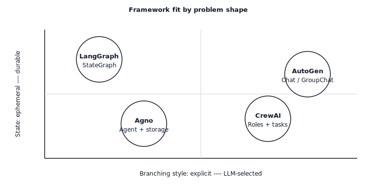

# 智能体 Framework 取舍 — LangGraph vs CrewAI vs AutoGen vs Agno

> 每个framework sells the same demo (research 智能体 builds a report) and hides the same bug (状态 模式 fights with the orchestration 层). Pick the framework whose abstractions match the shape of your problem; everything else is glue you write twice.

**类型：** Learn
**语言：** Python
**先修：** Phase 11 · 09 (函数调用), Phase 11 · 16 (LangGraph)
**时间：** 约 45 分钟

## 问题

你have a 任务 that needs more than one LLM call. Maybe it is a research 工作流 (plan, search, summarize, cite). Maybe it is a code-review 流水线 (parse diff, critique, patch, 验证). Maybe it is a multi-turn 助手 that books flights, writes emails, and files expense reports. You pick a framework.

Three days later, you discover the framework's abstractions leak. CrewAI gives you roles but fights you when the "researcher" needs to hand a 结构化 plan to the "writer." AutoGen gives you chat between agents but has no first-class 状态 so your checkpoint is a pickle of a conversation log. LangGraph gives you a 状态 图 but forces you to name every transition before you know what the 智能体 will do. Agno gives you a single-agent abstraction that screams when you try to fan out to three concurrent workers.

这个fix is not "pick the best framework." It is to match the framework's core abstraction to the shape of your problem. This lesson draws that map.

## 概念

Four frameworks dominate the 2026 landscape. Their core abstractions are not the same.

|Framework|Core abstraction|Best fit|Worst fit|
|-----------|------------------|----------|-----------|
|**LangGraph**|`StateGraph` — typed 状态, nodes, 条件式 edges, checkpointer.|Workflows with explicit 状态 and human-in-the-loop interrupts; 生产 agents needing time-travel 调试.|Loose, role-driven brainstorming where the 拓扑 is unknown.|
|**CrewAI**|`Crew` — roles (goal, backstory), tasks, process (sequential or hierarchical).|Role-playing or persona-driven workflows with a short linear/hierarchical plan.|Anything stateful beyond the crew's turn history; complex branching.|
|**AutoGen**|`ConversableAgent` pair — two or more agents that speak in turns until an exit 条件.|Multi-agent *dialogue* (teacher-student, proposer-critic, actor-reviewer) where the thinking emerges from the chat.|Deterministic workflows with a known DAG; anything needing durable 状态 across restarts.|
|**Agno**|`Agent` — a single LLM + 工具 + 内存, composable into teams.|Fast-to-build single agents and lightweight teams; strong multi-modality and built-in storage drivers.|Deep, explicitly-branched graphs with custom reducers.|

### What "abstraction" actually means

一个framework's core abstraction is the thing you draw on the whiteboard when you pitch the 架构.

- **LangGraph** → you draw a 图. Nodes are 步骤, edges are transitions, and the 状态 object at every point is typed. The mental 模型 is a 状态 machine.
- **CrewAI** → you draw an org chart. Each role has a job 描述 and a manager routes tasks. The mental 模型 is a small team of specialists.
- **AutoGen** → you draw a Slack DM. Two agents 消息 each other; a third joins if you need a moderator. The mental 模型 is chat.
- **Agno** → you draw a single box with 工具 hanging off it. Put boxes next to each other for a team. The mental 模型 is "智能体 with batteries included."

### The 状态 问题

状态 is where most framework choices break down in 生产.

- **LangGraph.** 类型d 状态 (`TypedDict` or Pydantic 模型), per-field reducers, first-class checkpointer (SQLite/Postgres/Redis). Resume, interrupt, and time-travel are free. *(See Phase 11 · 16.)*
- **CrewAI.** 状态 flows as strings between tasks via the `context` field, or 结构化 through `output_pydantic`. No durable per-crew store out of the box; you bolt on your own if the crew must survive a restart.
- **AutoGen.** 状态 is the chat history and any user-defined `context`. Conversation transcripts persist; arbitrary 工作流 状态 does not unless you write adapters.
- **Agno.** Built-in storage drivers (SQLite, Postgres, Mongo, Redis, DynamoDB) attached to an `Agent` via `storage=` — conversation sessions and 用户 memories persist automatically. Not a full 图 checkpointer; a session store.

### The branching 问题

每个non-trivial 智能体 branches. Who decides the branch matters.

- **LangGraph** — you decide, via 条件式 edges. 路由 is a Python 函数 with named branches. Branches are first-class in the compiled 图; the checkpointer records which branch was taken.
- **CrewAI** — the manager decides in hierarchical mode; in sequential mode you decide at build time. 路由 is implicit in the 任务 list; there is no first-class "if" outside the manager's 提示词.
- **AutoGen** — the agents decide via chat. Branching is emergent from who speaks next. `GroupChatManager` selects the next speaker; you can hand-write a `speaker_selection_method` but the default is LLM-driven.
- **Agno** — the 智能体 decides by which 工具 to call next. Teams have a coordinator/路由器/collaborator mode; branching beyond that is the developer's responsibility.

### The observability 问题

- **LangGraph** — OpenTelemetry via LangSmith or any OTel exporter. Every 节点 transition is a trace span; checkpoints double as replayable traces. LangSmith is the first-party option; Langfuse/Phoenix also have adapters.
- **CrewAI** — first-class OpenTelemetry since late-2025; integrations with Langfuse, Phoenix, Opik, AgentOps.
- **AutoGen** — OpenTelemetry integration via `autogen-core`; AgentOps and Opik have connectors. Tracing granularity is per-agent-message, not per-node.
- **Agno** — built-in `monitoring=True` flag plus OpenTelemetry exporters; tight integration with Langfuse for session traces.

### 成本 and 延迟

All four frameworks add per-call overhead (framework logic, 验证, serialization). Rough order of increasing overhead: Agno ≈ LangGraph < CrewAI ≈ AutoGen. The difference is dominated by how much extra LLM 路由 the framework does. CrewAI's hierarchical manager spends 词元 deciding who goes next; AutoGen's `GroupChatManager` likewise. LangGraph only spends 词元 where you write `llm.invoke`. Agno's single-agent path is thin.

当成本 per run matters, prefer explicit 路由 (LangGraph edges, AutoGen `speaker_selection_method`) over LLM-selected 路由.

### Interoperability

- **LangGraph** ↔ **LangChain** 工具, retrievers, LLMs. First-class MCP adapter (工具 imported as MCP servers).
- **CrewAI** ↔ 工具 inherit from `BaseTool`; LangChain 工具, LlamaIndex 工具, and MCP 工具 all adapt in. Crew-to-crew delegation via `allow_delegation=True`.
- **AutoGen** → `FunctionTool` wraps any Python callable; MCP adapter available. Tight coupling to AG2 ecosystem for agent-to-agent patterns.
- **Agno** → `@tool` decorator or BaseTool subclass; MCP adapter; 工具 can be shared across agents and teams.

## The Skill

> 你can explain, in one sentence, why a given framework is right for a given 智能体 problem.

Pre-build checklist:

1. **Draw the shape.** Is this a 图 (typed 状态, named transitions)? A role play (specialists hand off work)? A chat (agents talk until done)? A single 智能体 with 工具?
2. **Decide who branches.** Developer-decided branching → LangGraph. Manager-agent-decided → CrewAI hierarchical. Chat-emergent → AutoGen. Tool-call-decided → Agno.
3. **Check the 状态 预算.** Do you need resume-from-checkpoint? 时间-travel? Human interrupts mid-run? If yes, LangGraph is the default; Agno sessions cover conversation-scoped 状态.
4. **Check the 成本 预算.** LLM-selected 路由 成本 extra 词元 per turn. If the 智能体 runs thousands of times a day, prefer explicit 路由.
5. **预算 the framework overhead.** Every framework is another dependency. If the 任务 is two LLM calls and a 工具, write 30 lines of plain Python; no framework is cheaper than no framework.

拒绝 reach for a framework before you can draw the 图, the org chart, the chat, or the 智能体 box. 拒绝 pick one that forces you to fight its 状态 模型 for the thing you actually need.

## The Decision Matrix

|Problem shape|Preferred framework|Why|
|---------------|---------------------|-----|
|工作流 DAG with typed 状态, human approvals, long-running|LangGraph|First-class 状态, checkpointer, interrupts, time-travel.|
|Research / writing 流水线 with distinct roles|CrewAI (sequential) or LangGraph subgraphs|Role-per-task is cheap to express in CrewAI; 规模 up with LangGraph when branching gets complex.|
|Proposer-critic or teacher-student dialogue|AutoGen|Two-agent chat is its native shape.|
|Single 智能体 with 工具, sessions, 内存|Agno|Thinnest setup, built-in storage and 内存.|
|Thousands of 并行 fanouts with reducers|LangGraph + `Send`|The only one with a first-class parallel-dispatch API.|
|Quick prototype, no framework commitment|Plain Python + provider SDK|No framework is the fastest framework.|

## 练习

1. **Easy.** Take the same 任务 — "research Anthropic's headquarters, write a 200-word brief, cite 来源" — and implement it in LangGraph (four nodes: plan, search, write, cite) and in CrewAI (three roles: researcher, writer, editor). Report 词元 成本 per run and lines of code.
2. **Medium.** Build the same 任务 in AutoGen (researcher ↔ writer chat, editor joins via `GroupChat`) and Agno (a single 智能体 with `search_tools` and `write_tools`, plus a session store). 排序 the four implementations on (a) 成本 per run, (b) ability to resume after a crash, (c) ability to inject a human approval before the write 步骤.
3. **Hard.** Build a decision-tree script `pick_framework.py` that takes a short problem 描述 (JSON: `{has_typed_state, has_roles, has_dialogue, has_parallel_fanout, needs_resume}`) and returns a recommendation with one-sentence justification. Verify it on six cases you design yourself.

## Key Terms

|Term|What people say|What it actually means|
|------|-----------------|-----------------------|
|Orchestration|"How the agents coordinate"|The 层 that decides which 节点/role/智能体 runs next.|
|Durable 状态|"Resume after a restart"|状态 that survives process death, attached to a checkpoint or session store.|
|LLM-selected 路由|"Let the 模型 decide"|A planner LLM picks the next 步骤 each turn; flexible but pays 词元 on every decision.|
|Explicit 路由|"Developer decides"|A Python 函数 or static 边 picks the next 步骤; cheap and auditable.|
|Crew|"A CrewAI team"|Roles + tasks + process (sequential or hierarchical) bound into a single runnable.|
|GroupChat|"AutoGen's multi-agent chat"|A managed conversation between N agents with a speaker selector.|
|Team (Agno)|"Multi-agent Agno"|Route / coordinate / collaborate mode over a set of agents.|
|StateGraph|"LangGraph's 图"|类型d-状态, 节点, conditional-edge, checkpointer abstraction.|

## 延伸阅读

- [LangGraph documentation](https://langchain-ai.github.io/langgraph/) — StateGraph, checkpointers, interrupts, time-travel.
- [CrewAI documentation](https://docs.crewai.com/) — Crews, Flows, Agents, Tasks, Processes.
- [AutoGen documentation](https://microsoft.github.io/autogen/) — ConversableAgent, GroupChat, teams, 工具.
- [Agno documentation](https://docs.agno.com/) — 智能体, Team, 工作流, storage, 内存.
- [Anthropic — Building effective agents (Dec 2024)](https://www.anthropic.com/research/building-effective-agents) — pattern library (提示词 chaining, 路由, parallelization, orchestrator-workers, evaluator-optimizer) framework-agnostic.
- [Yao et al., "ReAct: Synergizing Reasoning and Acting" (ICLR 2023)](https://arxiv.org/abs/2210.03629) — the 循环 every framework dresses up.
- [Wu et al., "AutoGen: Enabling Next-Gen LLM Applications via Multi-Agent Conversation" (2023)](https://arxiv.org/abs/2308.08155) — AutoGen's design paper.
- [Park et al., "Generative Agents: Interactive Simulacra of Human Behavior" (UIST 2023)](https://arxiv.org/abs/2304.03442) — role-play foundation that CrewAI-style persona stacks build on.
- Phase 11 · 16 (LangGraph) — the framework this lesson benchmarks against.
- Phase 11 · 19 (Reflexion) — a pattern that maps cleanly to LangGraph but awkwardly to CrewAI.
- Phase 11 · 22 (生产 observability) — how to instrument whichever framework you pick.
