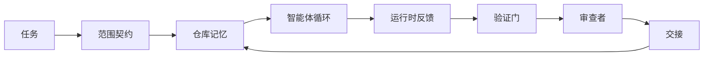

# 智能体 Workbench 工程：为什么强大的模型仍会失败

> 一个强大的模型还不够。可靠的智能体需要一个 workbench：指令、状态、范围、反馈、验证、审查与交接。把这些都剥离掉，即使是前沿模型也会产出不安全、无法交付的成果。

**类型：** 学习 + 构建
**语言：** Python（标准库）
**前置：** Phase 14 · 01（智能体循环）、Phase 14 · 26（失败模式）
**时长：** 约 45 分钟

## 学习目标

- 把模型能力与执行可靠性区分开。
- 说出决定一个智能体能否交付的七个 workbench 面（surface）。
- 在一个小型仓库任务上，对比"仅靠提示"的运行与"workbench 引导"的运行。
- 产出一份失败模式报告，把每个缺失的面映射到它所引发的症状。

## 问题

你把一个前沿模型丢进一个真实仓库，让它给输入加上校验。它打开了四个文件，写了看似合理的代码，宣告成功，然后停下。你运行测试。两个失败。第三个被改动的文件跟校验毫无关系。没有任何记录说明这个智能体假设了什么、最先尝试了什么、还剩下什么没做。

这个模型对 Python 的理解没错。它错在对工作的理解上。它根本不知道什么算"完成"、它被允许在哪里写入、哪些测试是权威的，或者下一次会话该如何接手。

这不是模型的 bug。这是 workbench 的 bug。围绕智能体的那个面缺少了把一次性生成变成可靠、可恢复工程的那些部分。

## 概念

workbench 是任务执行期间包裹住模型的运行环境。它有七个面：

| 面 | 它承载的内容 | 缺失时的失败 |
|---------|-----------------|----------------------|
| 指令 | 启动规则、禁止动作、完成的定义 | 智能体只能猜什么叫交付 |
| 状态 | 当前任务、已改动文件、阻塞项、下一步动作 | 每次会话都从零重启 |
| 范围 | 允许的文件、禁止的文件、验收标准 | 改动渗漏到无关代码里 |
| 反馈 | 真实命令输出被捕获进循环 | 智能体在一个 400 上宣告成功 |
| 验证 | 测试、lint、冒烟运行、范围检查 | "看着不错"就进了 main |
| 审查 | 由另一个角色做第二遍 | 构建者给自己批作业 |
| 交接 | 改了什么、为什么、还剩什么 | 下一次会话重新发现一切 |

workbench 独立于模型。你可以换掉模型而保留这些面。你无法换掉这些面还保住可靠性。



循环闭合在状态文件上，而不是在聊天历史上。聊天是易失的。仓库才是记录系统。

### Workbench 与提示工程

提示告诉模型这一轮你想要什么。workbench 告诉模型如何跨轮、跨会话地完成工作。大多数智能体的失败故事，其实是穿着提示工程外衣的 workbench 失败。

### Workbench 与框架

框架给你一个运行时（LangGraph、AutoGen、Agents SDK）。workbench 在那个运行时里给智能体一个干活的地方。两者你都需要。这条迷你专题讲的是后者。

### 从基本原语推理，而非从厂商分类法推理

眼下关于"harness 工程"的文章很多。Addy Osmani、OpenAI、Anthropic、LangChain、Martin Fowler、MongoDB、HumanLayer、Augment Code、Thoughtworks、walkinglabs 的 awesome 清单，以及源源不断的 Medium 和 Hacker News 文章都在谈它。它们对 harness 的边界是什么、范围包含什么、用哪套词汇这些问题各执一词。我们不必选边站。这七个面是一个 UX 层；在每个 workbench 底下,都是支撑任何可靠后端的同一套分布式系统原语。

把智能体这个标签暂时撕掉。一次智能体运行就是跨越时间、进程和机器的计算。要让它可靠,你需要的就是任何生产系统都需要的那套原语。

| 原语 | 它是什么 | 它为智能体承载什么 |
|-----------|------------|------------------------------|
| 函数 | 带类型的处理器。尽可能纯。拥有自己的输入和输出。 | 一次工具调用、一次规则检查、一个验证步骤、一次模型调用 |
| 工作者 | 长期存活的进程，拥有一个或多个函数及一个生命周期 | 构建者、审查者、验证者、一个 MCP server |
| 触发器 | 调用函数的事件源 | 智能体循环的一次 tick、HTTP 请求、队列消息、cron、文件变更、hook |
| 运行时 | 决定什么在哪里运行、用什么超时和资源的边界 | Claude Code 的进程、LangGraph 的运行时、一个工作者容器 |
| HTTP / RPC | 调用方与工作者之间的线缆 | 工具调用协议、MCP 请求、模型 API |
| 队列 | 触发器与工作者之间的持久缓冲；背压、重试、幂等 | 任务看板、反馈日志、审查收件箱 |
| 会话持久化 | 能在崩溃、重启、模型替换后存活的状态 | `agent_state.json`、检查点、KV 存储、仓库本身 |
| 授权策略 | 谁能以什么范围调用哪个函数 | 允许/禁止的文件、审批边界、MCP 能力清单 |

现在把这七个 workbench 面映射到这些原语上。

- **指令** —— 策略 + 函数元数据。规则是检查（函数）。路由器（`AGENTS.md`）是附着在运行时启动上的策略。
- **状态** —— 会话持久化。一个带键的存储，运行时在每一步都会读取。文件、KV 或 DB；要紧的是持久化语义，存储后端无所谓。
- **范围** —— 每个任务的授权策略。允许/禁止的 glob 是一份 ACL。要求的审批是一个权限格。
- **反馈** —— 写入队列的调用日志。每一次 shell 调用都是一条记录，持久、可重放。
- **验证** —— 一个函数。对输入是确定性的。在任务关闭时触发。失败时默认关闭。
- **审查** —— 一个独立的工作者，对构建者的产物拥有只读授权，对审查报告拥有只写授权。
- **交接** —— 由会话结束触发器发出的一条持久记录。下一次会话的启动触发器会读取它。

智能体循环本身是一个工作者，它消费事件（用户消息、工具结果、定时器 tick），调用函数（先是模型，然后是模型挑选的工具），写记录（状态、反馈），并发出触发器（验证、审查、交接）。没什么神秘的；和一个作业处理器是同一个形状。

### 流传中的模式，翻译成原语

每一个流行的 harness 模式都可归约为这八个原语。翻译表如下。

| 厂商或社区模式 | 它实际上是什么 |
|------------------------------|--------------------|
| Ralph Loop（Claude Code、Codex、agentic_harness 一书）—— 当智能体试图过早停下时，把原始意图重新注入一个全新的上下文窗口 | 一个把任务用干净上下文重新入队的触发器；会话持久化把目标带向前 |
| Plan / Execute / Verify（PEV） | 三个工作者，每个角色一个，通过状态和阶段之间的队列通信 |
| harness-compute 分离（OpenAI Agents SDK，2026 年 4 月）—— 把控制平面与执行平面拆开 | 这是在重述控制平面 / 数据平面。比智能体这个标签早了几十年 |
| Open Agent Passport（OAP，2026 年 3 月）—— 在执行前，对照一份声明式策略对每次工具调用签名并审计 | 一份由前置动作工作者强制执行的授权策略，配一个带签名的审计队列 |
| Guides and Sensors（Birgitta Böckeler / Thoughtworks）—— 前馈规则 + 反馈可观测性 | 授权策略 + 验证函数 + 可观测性 trace |
| 渐进式压实，五阶段（Claude Code 逆向工程，2026 年 4 月） | 一个状态管理工作者，以类 cron 的方式在会话持久化上运行，把它控制在预算之内 |
| Hooks / 中间件（LangChain、Claude Code）—— 拦截模型和工具调用 | 包裹在运行时调用路径周围的触发器 + 函数 |
| 以 Markdown 形式、带渐进式披露的 Skills（Anthropic、Flue） | 一个函数注册表，其中函数元数据在恰当时机即时加载进上下文 |
| 沙箱智能体（Codex、Sandcastle、Vercel Sandbox） | 计算平面：一个拥有隔离文件系统、网络和生命周期的运行时 |
| MCP server | 通过稳定 RPC 暴露函数的工作者，以能力清单作为授权 |

那张表里的每一条，都是智能体社区抵达一个在分布式系统中早已有名字的原语，然后给它起了个新名字。作为营销标签有用；作为工程词汇没用。

### 收据上到底写了什么

"harness 胜过模型"这个论断现在背后有了数字。值得知道，因为它们也是反驳"只要等一个更聪明的模型就行"的唯一诚实论据。

- Terminal Bench 2.0 —— 同一个模型，仅改 harness 就把一个编码智能体从前 30 名开外提到了第五名（LangChain，*Anatomy of an Agent Harness*）。
- Vercel —— 删掉了其智能体 80% 的工具；成功率从 80% 跳到 100%（MongoDB）。
- Harvey —— 仅靠 harness 优化就把法律智能体的准确率提高了一倍多（MongoDB）。
- 88% 的企业 AI 智能体项目无法进入生产。这些失败聚集在运行时，而非推理上（preprints.org，*Harness Engineering for Language Agents*，2026 年 3 月）。
- 一项 2025 年横跨三个流行开源框架的基准研究报告了约 50% 的任务完成率；长上下文 WebAgent 在长上下文条件下从 40–50% 崩到不足 10%，主要源于无限循环和目标丢失（2026 年初的多篇文章广泛报道）。

要点不是"harness 永远赢"。模型确实会随时间吸收 harness 的技巧。要点是：今天，承重的工程在模型周围，而不在模型内部，而承载这份重量的原语，正是每个生产系统一直以来都需要的那些。

### 厂商文章在哪里浅尝辄止

这一部分你不必客气。

- LangChain 的 *Anatomy of an Agent Harness* 列举了十一个组件 —— 提示、工具、hooks、沙箱、编排、记忆、skills、子智能体，以及一个运行时的"笨循环"。它没有提到队列、作为部署单元的工作者、触发器语义、作为独立关切的会话持久化，或授权策略。它把 harness 当作一个你去配置的对象，而不是一个你去部署的系统。
- Addy Osmani 的 *Agent Harness Engineering* 落到了 `Agent = Model + Harness` 这个框架和棘轮模式，但没说清 harness 是由什么搭起来的。它读起来像一种立场，而非一份规格。
- Anthropic 和 OpenAI 在这些面上挖得最深，但都停留在各自的运行时里。2026 年 4 月 Agents SDK 中的"harness-compute 分离"公告，是第一篇明确认可控制平面 / 数据平面拆分的厂商文章。那是一个原语的想法，而非新想法。
- agentic_harness 一书把 harness 当作一个配置对象（Jaymin West 的 *Agentic Engineering*，第 6 章），其中最有力的一句是"harness 是智能体系统中首要的安全边界"。那只是授权策略的另一种说法。
- Hacker News 的讨论串一次次抵达同一个地方。2026 年 4 月的讨论串 *The agent harness belongs outside the sandbox* 主张 harness 应当坐在"更像一个 hypervisor，位于一切之外，并基于上下文与用户授权访问"的位置。这又是把授权策略当作一个独立平面。

你不必反对上面任何一篇文章，就能注意到这个缺口。它们在为一个已经存在的系统撰写 UX 描述。我们在撰写这个系统。当系统建对了，七个面会从原语里自然落出来。当系统建错了，再多的 `AGENTS.md` 打磨也补不上缺失的队列。

所以当你在别处听到"harness 工程"时，把它翻译成原语。提示和规则是策略与函数。脚手架是运行时。护栏是授权 + 验证。Hooks 是触发器。记忆是会话持久化。Ralph Loop 是重新入队。子智能体是工作者。沙箱是计算平面。词汇在变；工程没变。workbench 是面向智能体的 UX；而 harness，在那种能熬过下一次厂商重新包装的意义上，是函数、工作者、触发器、运行时、队列、持久化和策略正确接线后的总和。

## 动手构建

`code/main.py` 把一个微型仓库任务跑两遍。先是仅靠提示，然后接入七个面。同一个模型，同一个任务。脚本统计在失败的那次运行中缺了哪些面，并打印一份失败模式报告。

这个仓库任务故意做得很小：给一个单文件、FastAPI 风格的处理器加上输入校验，并写一个通过的测试。

运行它：

```
python3 code/main.py
```

输出：两次运行的并排日志、一份总结仅靠提示那次运行的 `failure_modes.json`，以及 workbench 那次运行的一行结论。

这个智能体是一个微型的、基于规则的桩；重点是那些面，而非模型。在这条迷你专题的其余部分，你将把每一个面重建成一个真实、可复用的产物。

## 实际运用

workbench 的面早已在现实中存在三处，即便没人这么叫它们：

- **Claude Code、Codex、Cursor。** `AGENTS.md` 和 `CLAUDE.md` 是指令面。斜杠命令是范围。Hooks 是验证。
- **LangGraph、OpenAI Agents SDK。** 检查点和会话存储是状态面。Handoffs 是交接面。
- **真实仓库上的 CI。** 测试、lint 和类型检查是验证。PR 模板是交接。CODEOWNERS 是审查。

workbench 工程，就是把这些面变得显式且可复用的那门学问，而不是放任每个团队各自重新发现它们。

## 交付

`outputs/skill-workbench-audit.md` 是一个可移植的 skill，它针对七个 workbench 面审计一个现有仓库，并报告哪些缺失、哪些部分具备、哪些健康。把它丢到任何智能体设置旁边；它会告诉你该先修什么。

## 练习

1. 挑一个你已经在跑智能体的仓库。给七个面从 0（缺失）到 2（健康）打分。你最弱的面是哪个？
2. 扩展 `main.py`，让仅靠提示的那次运行也产出一个假的"成功"声明。验证验证门本可以抓住它。
3. 为你自己的产品加上第八个面。论证它为什么不会塌缩进已有的七个之一。
4. 用一个不同的桩智能体重跑脚本，让它幻想出一次多余的文件写入。哪个面最先抓住它？
5. 把 Phase 14 · 26 中那五个行业反复出现的失败模式映射到七个面上。每个面是为吸收哪种模式而设计的？

## 关键术语

| 术语 | 人们怎么说 | 它实际上是什么 |
|------|----------------|------------------------|
| Workbench | "那套设置" | 围绕模型、让工作变可靠的、被工程化的面 |
| 面（Surface） | "一份文档"或"一个脚本" | 一个有名字、机器可读的输入，智能体每一轮都会读它或写它 |
| 记录系统 | "那些笔记" | 当聊天历史没了之后，智能体当作真相对待的那个文件 |
| 完成的定义 | "验收" | 一份客观的、有文件背书的清单，智能体无法造假 |
| Workbench 审计 | "仓库就绪检查" | 在开工前对七个面过一遍，标出缺失的部件 |

## 延伸阅读

把这些当作数据点来读，而不是当作权威。每一篇都是一份不完整的分类法。在决定是否采纳之前，把每个概念翻译回一个原语（函数、工作者、触发器、运行时、HTTP/RPC、队列、持久化、策略）。

厂商的框架：

- [Addy Osmani, Agent Harness Engineering](https://addyosmani.com/blog/agent-harness-engineering/) —— `Agent = Model + Harness` 与棘轮模式；在基础设施上着墨甚少
- [LangChain, The Anatomy of an Agent Harness](https://blog.langchain.com/the-anatomy-of-an-agent-harness/) —— 十一个组件：提示、工具、hooks、编排、沙箱、记忆、skills、子智能体、运行时；省略了队列、部署、授权
- [OpenAI, Harness engineering: leveraging Codex in an agent-first world](https://openai.com/index/harness-engineering/) —— Codex 团队对围绕其运行时的那些面的看法
- [OpenAI, Unrolling the Codex agent loop](https://openai.com/index/unrolling-the-codex-agent-loop/) —— 把智能体循环归约为一个对函数调用的 `while`
- [Anthropic, Effective harnesses for long-running agents](https://www.anthropic.com/engineering/effective-harnesses-for-long-running-agents) —— 一个特定运行时内的长程面
- [Anthropic, Harness design for long-running application development](https://www.anthropic.com/engineering/harness-design-long-running-apps) —— 应用化的设计笔记
- [LangChain Deep Agents harness capabilities](https://docs.langchain.com/oss/python/deepagents/harness) —— 运行时配置面

有可用细节的实践派文章：

- [Martin Fowler / Birgitta Böckeler, Harness engineering for coding agent users](https://martinfowler.com/articles/harness-engineering.html) —— guides（前馈）+ sensors（反馈）；最干净的控制论框架
- [HumanLayer, Skill Issue: Harness Engineering for Coding Agents](https://www.humanlayer.dev/blog/skill-issue-harness-engineering-for-coding-agents) —— "这不是模型问题，是配置问题"
- [MongoDB, The Agent Harness: Why the LLM Is the Smallest Part of Your Agent System](https://www.mongodb.com/company/blog/technical/agent-harness-why-llm-is-smallest-part-of-your-agent-system) —— 收据：Vercel 80% 到 100%、Harvey 准确率翻倍、Terminal Bench 前 30 到前 5
- [Augment Code, Harness Engineering for AI Coding Agents](https://www.augmentcode.com/guides/harness-engineering-ai-coding-agents) —— 约束优先的逐步讲解
- [Sequoia podcast, Harrison Chase on Context Engineering Long-Horizon Agents](https://sequoiacap.com/podcast/context-engineering-our-way-to-long-horizon-agents-langchains-harrison-chase/) —— 运行时关切高于模型关切

书籍、论文与参考实现：

- [Jaymin West, Agentic Engineering — Chapter 6: Harnesses](https://www.jayminwest.com/agentic-engineering-book/6-harnesses) —— 一整本书的篇幅，把 harness 当作首要安全边界
- [preprints.org, Harness Engineering for Language Agents (March 2026)](https://www.preprints.org/manuscript/202603.1756) —— 学术框架，归为控制 / 能动性 / 运行时
- [walkinglabs/awesome-harness-engineering](https://github.com/walkinglabs/awesome-harness-engineering) —— 横跨上下文、评估、可观测性、编排的精选阅读清单
- [ai-boost/awesome-harness-engineering](https://github.com/ai-boost/awesome-harness-engineering) —— 另一份精选清单（工具、评估、记忆、MCP、权限）
- [andrewgarst/agentic_harness](https://github.com/andrewgarst/agentic_harness) —— 一个生产就绪的参考实现，带 Redis 支撑的记忆和评估套件
- [HKUDS/OpenHarness](https://github.com/HKUDS/OpenHarness) —— 一个内置个人智能体的开源 agent harness

值得为其中的分歧（而非共识）一读的 Hacker News 讨论串：

- [HN: Effective harnesses for long-running agents](https://news.ycombinator.com/item?id=46081704)
- [HN: Improving 15 LLMs at Coding in One Afternoon. Only the Harness Changed](https://news.ycombinator.com/item?id=46988596)
- [HN: The agent harness belongs outside the sandbox](https://news.ycombinator.com/item?id=47990675) —— 主张把授权作为一个独立平面

本课程内部的交叉引用：

- Phase 14 · 23 —— OpenTelemetry GenAI 约定：sensors 文献所指向的可观测性层
- Phase 14 · 26 —— 七个面所要吸收的那些失败模式的目录
- Phase 14 · 27 —— 坐落在授权策略原语上的提示注入防御
- Phase 14 · 29 —— 生产运行时（队列、事件、cron）：本课中那些原语在部署里所处的位置
