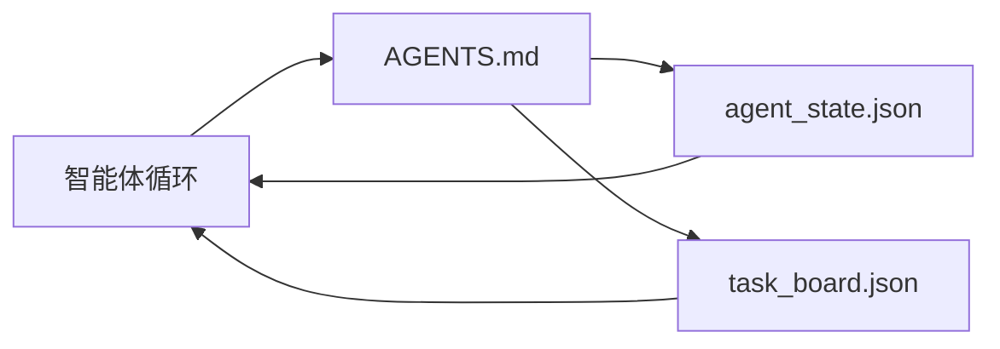

# 最小智能体 Workbench

> 最小可用的 workbench 由三个文件组成：一个根指令路由器、一个状态文件，以及一个任务看板。其他一切都建立在它们之上。如果一个仓库连这三个文件都承载不了，再好的模型也救不了它。

**类型：** Build
**语言：** Python (stdlib)
**前置：** Phase 14 · 31（为什么能力强的模型仍会失败）
**时长：** ~45 分钟

## 学习目标

- 定义构成最小可行 workbench 的三个文件。
- 解释为什么一个简短的根路由器胜过一个冗长的单体 `AGENTS.md`。
- 构建一个智能体每一轮都能读取、在结束时写入的状态文件。
- 构建一个无需聊天历史就能跨多个会话存续的任务看板。

## 问题

大多数团队搭建 workbench 的方式是写一个 3000 行的 `AGENTS.md` 就算完事。模型加载了它，忽略掉无法概括的部分，最终仍然在它一贯失败的那些地方失败。

你需要的恰恰相反。一个极小的根文件，只在相关时把智能体路由到更深的文件里。一份持久的状态，智能体在行动前读取、行动后写入。一个任务看板，写明哪些任务在进行中、哪些被阻塞、接下来要做什么。

三个文件。每个都有自己的职责。每个都足够机器可读，以便日后演进成一个真正的系统。

## 概念



### AGENTS.md 是路由器，不是手册

一个好的 `AGENTS.md` 是简短的。它把智能体指向：

- 状态文件（你在哪里）。
- 任务看板（还剩什么）。
- 更深的规则（位于 `docs/agent-rules.md`）。
- 验证命令（如何确认它能工作）。

更长的内容都放进更深的文档里，只在需要时加载。冗长的手册会被忽略。简短的路由器会被遵循。

### agent_state.json 是记录系统

状态承载：当前活跃的任务 id、改动过的文件、已做的假设、阻塞项，以及下一步动作。智能体每一轮都读取它。下一个会话读取它，而不是重放聊天记录。

状态存在文件里，是因为聊天历史不可靠。会话会终止。对话会被裁剪。文件不会。

### task_board.json 是队列

任务看板承载每一个任务，状态为 `todo | in_progress | done | blocked`。当状态为空时，智能体从这个队列里取任务；当你想知道智能体是否走在正轨上时，你读取的也是这个队列。

看板上的一个任务有 id、目标、负责人（`builder`、`reviewer` 或 `human`），以及验收标准。看板故意保持小巧：当它增长到超过一屏时，你面对的是一个规划问题，而不是看板问题。

### 三个文件是下限，不是上限

后续课程会加入范围契约、反馈运行器、验证门、reviewer 检查清单和交接包。这里的三个文件是它们全部所依赖的基础。

## 动手构建

`code/main.py` 把最小 workbench 写入一个空仓库，并演示一个单独的智能体回合，它会：

1. 读取 `agent_state.json`。
2. 如果状态为空，从 `task_board.json` 拉取下一个任务。
3. 在范围内改动单个文件。
4. 写回更新后的状态。

运行它：

```
python3 code/main.py
```

脚本会在自身旁边创建 `workdir/`，铺设这三个文件，运行一个回合，并打印 diff。再次运行它，看看第二个回合如何从第一个回合停下的地方接续。

## 使用它

在生产级智能体产品内部，同样的三个文件以不同的名字出现：

- **Claude Code：** 用 `AGENTS.md` 或 `CLAUDE.md` 作路由器，用 `.claude/state.json` 风格的存储作状态，用 hooks 作看板。
- **Codex / Cursor：** 用 workspace 规则作路由器，用会话记忆作状态，用聊天侧边栏里排队的任务作看板。
- **自定义 Python 智能体：** 就是你刚刚写的那些文件。

名字会变。形态不变。

## 真实世界中的生产模式

当三个模式叠加在最小 workbench 之上时，它就能经受住真实 monorepo 的考验。它们彼此独立；挑选你的仓库真正需要的那些。

**嵌套 `AGENTS.md`，就近优先。** OpenAI 在其主仓库中部署了 88 个 `AGENTS.md` 文件，每个子组件一个。Codex、Cursor、Claude Code 和 Copilot 都会从工作文件出发向仓库根目录遍历，并把沿途找到的每个 `AGENTS.md` 拼接起来。子目录文件扩展根文件。Codex 增加了 `AGENTS.override.md` 用来替换而非扩展；这个 override 机制是 Codex 特有的，跨工具工作时应避免使用。Augment Code 的测量结果才是关键这句话：最好的 `AGENTS.md` 文件带来的质量跃升相当于从 Haiku 升级到 Opus；最差的则让输出比没有文件还糟。

**应当拒绝的反模式，即便它们看起来像是覆盖更全。** 相互冲突的指令会悄无声息地把智能体从交互模式拉低到贪婪模式（ICLR 2026 AMBIG-SWE：解决率 48.8% → 28%）；给优先级编号，而不是把它们平铺堆叠。无法验证的风格规则（“遵循 Google Python Style Guide”）若没有执行命令，就让智能体自己编造合规性；给每条风格规则都配上确切的 lint 命令。以风格而非命令开头会掩埋验证路径；命令在前，风格在后。为人类而非智能体写作会浪费上下文预算；简洁是一种特性。

**跨工具符号链接。** 一个根文件加上符号链接（`ln -s AGENTS.md CLAUDE.md`、`ln -s AGENTS.md .github/copilot-instructions.md`、`ln -s AGENTS.md .cursorrules`）能让每个编码智能体共用同一份事实来源。Nx 的 `nx ai-setup` 从单一配置出发，在 Claude Code、Cursor、Copilot、Gemini、Codex 和 OpenCode 之间自动完成这件事。

## 交付它

`outputs/skill-minimal-workbench.md` 为任何新仓库生成这套三文件 workbench：一个针对项目调校的 `AGENTS.md` 路由器、一个带有正确键的 `agent_state.json`，以及一个用当前 backlog 预填的 `task_board.json`。

## 练习

1. 给 `agent_state.json` 加一个 `last_run` 时间戳。如果文件超过 24 小时，除非操作者确认，否则拒绝运行。
2. 给任务看板加一个 `priority` 字段，并修改拉取器，使其总是挑选优先级最高的 `todo`。
3. 把 `task_board.json` 迁移到 JSON Lines，使每个任务占一行，在版本控制中的 diff 更干净。
4. 写一个 `lint_workbench.py`，当 `AGENTS.md` 超过 80 行或引用了不存在的文件时报失败。
5. 判断三个文件中失去哪一个最痛。为你的判断辩护。

## 关键术语

| 术语 | 人们怎么说 | 它实际指什么 |
|------|----------------|------------------------|
| 路由器 | `AGENTS.md` | 把智能体指向更深文档和文件的简短根文件 |
| 状态文件 | “那些笔记” | 关于智能体当前所处位置的机器可读记录，每一轮都写入 |
| 任务看板 | “backlog” | 带状态、负责人、验收的工作 JSON 队列 |
| 记录系统 | “事实来源” | 当聊天消失时，workbench 视为权威的那个文件 |

## 延伸阅读

- [agents.md — 开放规范](https://agents.md/) — 已被 Cursor、Codex、Claude Code、Copilot、Gemini、OpenCode 采用
- [Augment Code, A good AGENTS.md is a model upgrade. A bad one is worse than no docs at all](https://www.augmentcode.com/blog/how-to-write-good-agents-dot-md-files) — 实测的质量跃升
- [Blake Crosley, AGENTS.md Patterns: What Actually Changes Agent Behavior](https://blakecrosley.com/blog/agents-md-patterns) — 经验上什么有效、什么无效
- [Datadog Frontend, Steering AI Agents in Monorepos with AGENTS.md](https://dev.to/datadog-frontend-dev/steering-ai-agents-in-monorepos-with-agentsmd-13g0) — 实践中的嵌套优先级
- [Nx Blog, Teach Your AI Agent How to Work in a Monorepo](https://nx.dev/blog/nx-ai-agent-skills) — 跨六个工具的单一来源生成
- [The Prompt Shelf, AGENTS.md Best Practices: Structure, Scope, and Real Examples](https://thepromptshelf.dev/blog/agents-md-best-practices/) — 经得起评审的章节排序
- [Anthropic, Claude Code subagents and session store](https://docs.anthropic.com/en/docs/agents-and-tools/claude-code/sub-agents)
- Phase 14 · 31 — 这套最小配置所吸收的失败模式
- Phase 14 · 34 — 本课预告的持久状态模式
