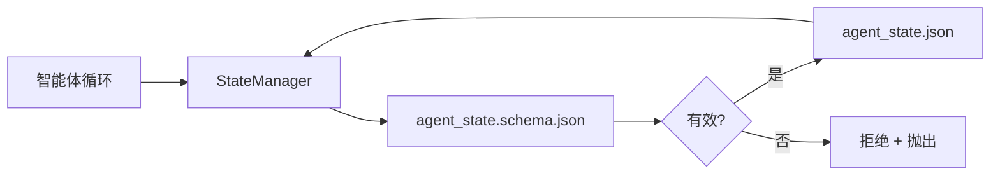

# 仓库记忆与持久化状态

> 对话历史是易失的。仓库是持久的。工作台将智能体状态存储在带版本的文件里，让下一次会话、下一个智能体、下一位评审者都从同一份事实来源中读取。

**类型：** 构建
**语言：** Python（标准库 + 可选 `jsonschema`）
**前置条件：** Phase 14 · 32（最小工作台）
**时长：** 约 60 分钟

## 学习目标

- 明确什么属于仓库记忆，什么属于对话历史。
- 为 `agent_state.json` 和 `task_board.json` 编写 JSON Schema。
- 构建一个状态管理器，负责加载、校验、变更并原子化持久化状态。
- 利用模式在坏写入破坏工作台之前拒绝它们。

## 问题所在

智能体完成了一次会话。对话关闭。下一次会话开启，询问从哪里开始。模型说“让我检查一下文件”，读到了过时的笔记，于是重做了早已完成的工作。或者更糟，它重写了一个已完成的文件，因为没人告诉它这个文件已经完成了。

工作台的解法是仓库记忆：状态存放在仓库的 JSON 文件里，按模式写入，原子化持久化，在代码评审中对 diff 友好。对话是一条临时的信息流；仓库才是记录系统。

## 概念



### 什么属于仓库记忆

| 属于 | 不属于 |
|---------|-----------------|
| 当前任务 id | 原始对话记录 |
| 本次会话触碰过的文件 | token 级推理轨迹 |
| 智能体做出的假设 | “用户似乎很沮丧” |
| 未解决的阻塞项 | 采样得到的补全 |
| 下一步动作 | 厂商特定的模型 id |

判断标准是持久性：三个月后在一次 CI 重跑中，这条信息还有用吗？如果有用，放仓库。如果没有，归为遥测。

### 模式优先的状态

JSON Schema 就是契约。没有它，每个智能体都会发明新字段，每位评审者都得学习新的结构，每个 CI 脚本都得为过往版本做特例处理。有了它，坏写入就是被拒绝的写入。

模式涵盖：

- 必填键。
- 允许的 `status` 取值。
- 禁止的取值（例如数组不能为 `null`）。
- 模式约束（任务 id 匹配 `T-\d{3,}`）。
- 用于迁移的版本字段。

### 原子写入

状态写入需要在部分失败中存活：写入临时文件、fsync，再重命名覆盖目标。状态文件是事实来源；一个写到一半的文件比没有文件更糟。

### 迁移

当模式变更时，随着模式版本升级一起交付一个迁移脚本。状态文件携带一个 `schema_version` 字段；当遇到无法迁移的版本时，管理器拒绝加载该文件。

## 动手构建

`code/main.py` 实现了：

- `agent_state.schema.json` 和 `task_board.schema.json`。
- 一个仅依赖标准库的校验器（JSON Schema 的子集：required、type、enum、pattern、items）。
- `StateManager.load`、`StateManager.update`、`StateManager.commit`，采用临时文件加重命名的原子写入。
- 一个演示：变更状态、持久化、重新加载，并证明往返过程正确。

运行它：

```
python3 code/main.py
```

该脚本写入 `workdir/agent_state.json` 和 `workdir/task_board.json`，跨两个回合变更它们，并在每一步打印校验后的状态。

## 真实世界中的生产模式

四种模式把本课的最小实现变成一个多智能体 monorepo 能够长期存活的东西。

**临时文件加重命名的原子写入不是可选项。** 2026 年 3 月的一份 Hive 项目缺陷报告清晰记录了这一失败模式：`state.json` 通过 `write_text()` 写入，异常被捕获后静默吞掉。部分写入让会话在恢复时面对损坏的状态，却没有任何信号。修复办法始终是：在目标所在的同一目录里执行 `tempfile.mkstemp`，写入，`fsync`，`os.replace`（在 POSIX 和 Windows 上都是原子重命名）。本课的 `atomic_write` 正是这么做的。

**对每个非幂等的工具调用使用幂等键。** 如果智能体在调用工具之后、对结果做检查点之前崩溃，恢复时会重试这次工具调用。对读取是安全的；对发邮件、数据库插入、文件上传则是危险的。模式是：在执行前把每个工具调用 ID 记录到 `pending_calls.jsonl`。重试时检查该 ID；若已存在，跳过调用并使用缓存结果。Anthropic 和 LangChain 在 2026 年的指南中都指出了这一点；LangGraph 的检查点器出于同样原因会持久化待处理的写入。

**把大型工件与状态分离。** 不要把 CSV、长篇记录或生成的文件存进 `agent_state.json`。将工件保存为单独的文件（或上传到对象存储），状态里只保留路径。检查点保持小而快；工件则独立增长。

**用事件溯源做审计，用快照做恢复。** 每次变更都向事件日志（`state.events.jsonl`）追加；定期快照到 `state.json`。恢复时读取快照，然后重放快照时间戳之后的任何事件。这要占用更多磁盘，但能让你逐字重放智能体的决策——在调试长周期运行时这是必不可少的。这与 Postgres 内部为 WAL 采用的形态相同。

**要么做模式迁移，要么拒绝加载。** 整数 `schema_version` 就是契约。当管理器加载到一个未知版本的文件时，它拒绝读取。随着模式版本升级一起交付迁移脚本；`tools/migrate_state.py` 在每次启动时幂等运行。

## 应用它

在生产中：

- **LangGraph 检查点器。** 同样的思路，不同的存储。检查点器把图状态持久化到 SQLite、Postgres 或自定义后端。本课讲授的模式，正是当检查点器挂掉、你需要手动读取状态时所要依靠的东西。
- **Letta 记忆块。** 带结构化模式的持久块（Phase 14 · 08）。同样的纪律，应用于长期运行的人格。
- **OpenAI Agents SDK 会话存储。** 可插拔后端，感知模式。本课的状态文件就是其本地文件后端。

## 交付它

`outputs/skill-state-schema.md` 会生成一对项目专属的 JSON Schema（状态 + 看板）、一个接好原子写入的 Python `StateManager`，以及一个迁移脚手架，让下一次模式版本升级不会破坏工作台。

## 练习

1. 添加一个 `last_human_touch` 时间戳。拒绝在人类编辑后五秒内的任何智能体写入。
2. 扩展校验器以支持 `oneOf`，让一个任务可以是构建任务，也可以是带不同必填字段的评审任务。
3. 添加一个 `schema_version` 字段，并编写从 v1 到 v2 的迁移（把 `blockers` 重命名为 `risks`）。
4. 把存储后端从本地文件改为 SQLite。保持 `StateManager` 的 API 完全一致。
5. 让两个智能体以 50 ms 的写入竞争访问同一个状态文件。会出什么问题，原子重命名又如何救你于水火？

## 关键术语

| 术语 | 人们怎么说 | 它实际指什么 |
|------|----------------|------------------------|
| 仓库记忆 | “笔记文件” | 存储在仓库被追踪文件里、遵循模式的状态 |
| 模式优先 | “校验输入” | 在写入者之前定义契约，拒绝漂移 |
| 原子写入 | “直接重命名” | 写入临时文件、fsync、重命名，使部分失败无法造成损坏 |
| 迁移 | “模式版本升级” | 把 vN 状态转换为 v(N+1) 状态的脚本 |
| 记录系统 | “事实来源” | 工作台视为权威的那个工件 |

## 延伸阅读

- [JSON Schema 规范](https://json-schema.org/specification.html)
- [LangGraph 检查点器](https://langchain-ai.github.io/langgraph/concepts/persistence/)
- [Letta 记忆块](https://docs.letta.com/concepts/memory)
- [Fast.io，AI Agent State Checkpointing: A Practical Guide](https://fast.io/resources/ai-agent-state-checkpointing/) —— 带幂等性的模式优先检查点
- [Fast.io，AI Agent Workflow State Persistence: Best Practices 2026](https://fast.io/resources/ai-agent-workflow-state-persistence/) —— 并发控制、TTL、事件溯源
- [Hive Issue #6263 —— 非原子的 state.json 写入被静默忽略](https://github.com/aden-hive/hive/issues/6263) —— 真实项目中的失败模式
- [eunomia，Checkpoint/Restore Systems: Evolution, Techniques, Applications](https://eunomia.dev/blog/2025/05/11/checkpointrestore-systems-evolution-techniques-and-applications-in-ai-agents/) —— 把操作系统历史中的 CR 原语应用于智能体
- [Indium，7 State Persistence Strategies for Long-Running AI Agents in 2026](https://www.indium.tech/blog/7-state-persistence-strategies-ai-agents-2026/)
- [Microsoft Agent Framework，Compaction](https://learn.microsoft.com/en-us/agent-framework/agents/conversations/compaction) —— 厂商的检查点管理器
- Phase 14 · 08 —— 记忆块与睡眠时计算
- Phase 14 · 32 —— 本课为其建立模式的三文件最小实现
- Phase 14 · 40 —— 从同一模式读取的交接数据包
