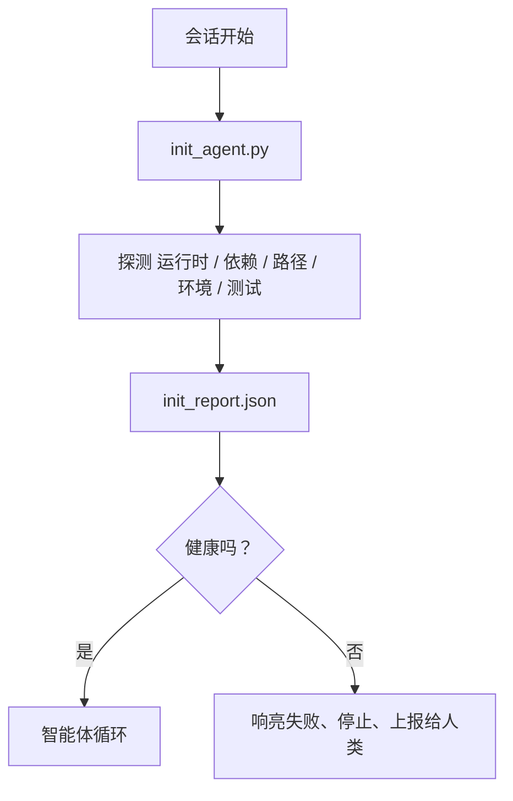

# 智能体初始化 Scripts

> 每个冷启动的会话都要交一份税。智能体重读同样的文件、重试同样的探测、重新发现同样的路径。一个 init 脚本只交一次税，并把答案写进状态。

**类型：** Build
**语言：** Python (stdlib)
**前置要求：** Phase 14 · 32（Minimal Workbench）、Phase 14 · 34（Repo Memory）
**时长：** ~45 分钟

## 学习目标

- 识别出智能体每个会话都不应该重做的工作。
- 构建一个确定性的 init 脚本，探测运行时、依赖和仓库健康状况。
- 持久化探测结果，让智能体直接读取，而不是重新运行检查。
- 失败时要响亮、迅速，并且只有一个地方需要排查。

## 问题

打开一个会话。智能体猜测 Python 版本。猜测测试命令。把仓库根目录列了五遍才找到入口点。试图 import 一个并未安装的包。问用户配置文件在哪里。等到它真正做出一次编辑时，已经有一万个 token 花在了本该是单个脚本完成的设置工作上。

解决办法是一个初始化脚本，它在智能体做任何事情之前先运行，并写出一份 `init_report.json`，让智能体在启动时读取。

## 概念



### init 脚本探测什么

| 探测 | 为什么重要 |
|-------|----------------|
| 运行时版本 | 错误的 Python 或 Node 版本意味着悄无声息的版本错误 bug |
| 依赖可用性 | 一个缺失的包在后期付出的代价是现在抓住它的十倍 |
| 测试命令 | 智能体必须知道如何验证；如果命令缺失，workbench 就是坏的 |
| 仓库路径 | 硬编码路径会漂移；解析一次并钉死 |
| 环境变量 | 缺失的 `OPENAI_API_KEY` 是一个失败面，而不是运行时谜题 |
| 状态 + 看板新鲜度 | 来自崩溃会话的陈旧状态是一个自伤陷阱 |
| 最后已知良好提交 | 会话结束时交接 diff 的锚点 |

### 失败要响亮、迅速、在一个地方

一次探测失败意味着停止并上报给人类。不存在“智能体会自己想办法”。init 的全部意义就在于：当 workbench 是坏的时候拒绝启动。

### 幂等

连续运行两次。第二次运行除了刷新一个时间戳之外应该是 no-op。幂等性正是让你能把脚本接入 CI、hooks 或一个 pre-task 斜杠命令的关键。

### init 与启动规则

规则（Phase 14 · 33）描述了为了行动必须为真的条件。init 是确立这些规则能够被检查的脚本。没有 init 的规则会沦为“小心点”。没有规则的 init 会沦为一次精致的失败。

## 动手构建

`code/main.py` 实现了 `init_agent.py`：

- 五个探测：Python 版本、通过 `importlib.util.find_spec` 列出的依赖、测试命令可解析性、必需的环境变量、状态文件新鲜度。
- 每个探测返回 `(name, status, detail)`。
- 脚本写出包含完整探测集的 `init_report.json`，并在任何阻塞级（block-severity）探测失败时以非零退出。

运行它：

```
python3 code/main.py
```

脚本打印探测表格，写出 `init_report.json`，在顺利路径上以零退出，或带着失败探测列表以非零退出。

## 现实中的生产模式

三个模式把有用的 init 脚本和一种仪式区分开来。

**最后已知良好提交锚定。** 将当前提交与上次成功合并时写入的 `LKG` 文件进行探测对比。如果 diff 超过预算（默认 50 个文件），拒绝启动并要求人类批准新基线。这正是 Cloudflare 的 AI Code Review 用来限定 reviewer 智能体范围的做法：每次审查会话都锚定到同一个最后已知良好状态，从不在会话之间累积漂移。

**带 TTL 的锁文件。** 在第一次探测全部通过后写出一个 `prereqs.lock`。后续运行在 N 小时内（默认 24h）信任该锁并跳过昂贵的探测。init 脚本先读取锁；如果它是新鲜的且依赖清单的哈希匹配，就短路。这与 Docker 用于层缓存的模式相同：幂等探测 + 内容哈希 = 跳过。

**热路径上不联网、不调用 LLM、不出意外。** init 探测是确定性的管道工作。一个调用 LLM 去给失败分类、或访问外部服务去检查许可证的探测不是探测；它是一个工作流。如果一个探测在 dry run 中耗时超过三秒，把它当作 workbench 异味，要么把它移出 init，要么缓存它的结果。

## 使用它

在生产环境中：

- **Claude Code hooks。** `pre-task` hook 调用 init 脚本，如果失败就拒绝启动智能体。
- **GitHub Actions。** 一个 `setup-agent` job 运行 init 脚本；智能体 job 依赖于它。
- **Docker entrypoint。** 智能体容器在 exec 智能体运行时之前运行 init 脚本；失败时日志会浮现。

init 脚本是可移植的，因为它不调用任何特定框架。Bash、Make 或一个 tasks 文件都可以包装它。

## 交付它

`outputs/skill-init-script.md` 对项目进行访谈，把它的设置工作分类成探测，并生成一个针对该项目的 `init_agent.py`，外加一个在任何智能体步骤之前运行它的 CI 工作流。

## 练习

1. 添加一个探测，将当前提交与最后已知良好提交做 diff，如果超过 50 个文件发生变化就拒绝启动。
2. 把脚本接好以写出一个 `prereqs.lock` 文件，如果锁超过七天就拒绝启动。
3. 添加一个 `--fix` 标志，自动安装缺失的开发依赖，但在未经批准前绝不修改运行时依赖。
4. 把探测从硬编码函数迁移到一个 YAML 注册表。为这个取舍辩护。
5. 为每个探测添加一个计时预算。运行超过三秒的探测是一种 workbench 异味。

## 关键术语

| 术语 | 人们怎么说 | 它实际上意味着什么 |
|------|----------------|------------------------|
| Probe（探测） | “一次检查” | 一个返回 `(name, status, detail)` 的确定性函数 |
| Init report（init 报告） | “设置输出” | 写在状态旁、包含探测结果的 JSON |
| Idempotent（幂等） | “可安全重跑” | 连续两次运行产生除时间戳外完全相同的报告 |
| Fail loud（响亮失败） | “别吞掉” | 停止并上报给人类；没有静默回退 |
| Setup tax（设置税） | “引导成本” | 智能体每个会话花在重新发现显而易见之事上的 token |

## 延伸阅读

- [Anthropic, Effective harnesses for long-running agents](https://www.anthropic.com/engineering/effective-harnesses-for-long-running-agents)
- [GitHub Actions, composite actions for setup](https://docs.github.com/en/actions/sharing-automations/creating-actions/creating-a-composite-action)
- [microservices.io, GenAI dev platform: guardrails](https://microservices.io/post/architecture/2026/03/09/genai-development-platform-part-1-development-guardrails.html) — 作为 init 的 pre-commit + CI 检查
- [Augment Code, How to Build Your AGENTS.md (2026)](https://www.augmentcode.com/guides/how-to-build-agents-md) — init 预期
- [Codex Blog, Codex CLI Context Compaction](https://codex.danielvaughan.com/2026/03/31/codex-cli-context-compaction-architecture/) — 会话开始作为感知 compaction 的 init
- Phase 14 · 33 — 本脚本所启用的规则集
- Phase 14 · 34 — 本脚本所播种的状态文件
- Phase 14 · 38 — init 脚本所馈入的验证关卡
- Phase 14 · 40 — 消费 init 报告中最后已知良好状态的交接
