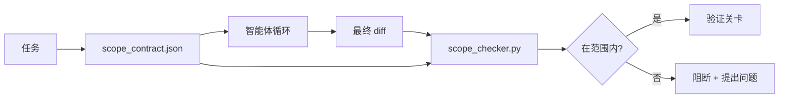

# 范围契约与任务边界

> 模型不知道工作在哪里结束。范围契约是一个针对单个任务的文件，它说明工作从哪里开始、在哪里结束，以及如果越界该如何回滚。这份契约把"待在范围内"从一个愿望变成了一项检查。

**类型：** 构建
**语言：** Python（stdlib）
**前置知识：** Phase 14 · 32（最小工作台）、Phase 14 · 33（作为约束的规则）
**时间：** ~50 分钟

## 学习目标

- 编写一份范围契约，让智能体在任务开始时读取、让验证器在任务结束时读取。
- 指定允许的文件、禁止的文件、验收标准、回滚计划和审批边界。
- 实现一个范围检查器，将 diff 与契约进行比对并标记违规。
- 让范围蔓延变得可见、自动且可审查。

## 问题

智能体会蔓延。任务是"修复登录 bug"。而 diff 触及了登录路由、邮件辅助函数、数据库驱动、README 以及发布脚本。每一处改动在当下都有看似合理的理由。但它们合在一起，就成了一个不同于被评审过的那个变更。

范围蔓延是智能体工作中最缺乏监控的失败模式，因为智能体会一步步善意地叙述每一步。修复之道不是更严格的提示词。修复之道是磁盘上的一份契约，它说明承诺了什么，以及一项把结果与承诺进行比对的检查。

## 概念



### 范围契约包含什么

| 字段 | 用途 |
|-------|---------|
| `task_id` | 链接到看板上的任务 |
| `goal` | 评审者可以验证的一句话 |
| `allowed_files` | 智能体可以写入的 glob |
| `forbidden_files` | 智能体即便是意外也绝不能触碰的 glob |
| `acceptance_criteria` | 证明完成的测试命令或断言行 |
| `rollback_plan` | 如果需要叫停，操作者可以执行的一段话 |
| `approvals_required` | 超出范围、需要明确人工签字的动作 |

一份没有 `forbidden_files` 的契约是不完整的。这片"负空间"是契约的一半。

### Glob，而非原始路径

真实仓库中文件会移动。把契约钉在 glob 上（`app/**/*.py`、`tests/test_signup*.py`），这样会话之间的重构就不会使契约失效。

### 回滚是范围的一部分

列出如何回滚，会迫使契约作者思考哪里可能出错。一份你无法从中回滚的契约，就是一份不应该被批准的契约。

### 范围检查就是 diff 检查

智能体写出一个 diff。检查器读取 diff、允许的 glob、禁止的 glob，以及已运行的任何验收命令的列表。每一处违规都是一个带标签的发现，验证关卡可以据此拒绝。

### 范围的两个高度：特性列表与任务契约

范围契约约束的是一个任务。它不约束整个项目。一个智能体可以在登录修复的契约内待得完美无缺，却仍然在下一回合决定项目还需要一个设置页面、一个暗色模式开关，以及对路由器的重写。这份契约从未被询问哪些工作属于项目的范围，只被询问了哪些文件属于该任务的范围。

那第二个高度需要它自己的原语：一个智能体在会话开始时读取的 `feature_list.json`。它是机器可读、有序的项目待办列表文件。智能体只挑选一个 `status` 为 `todo` 的特性，把它的 `id` 写入活动的范围契约，并被禁止在同一会话中开始第二个特性。"一次只做一个特性"不再是提示词中一行智能体可以自圆其说绕过去的话，而成了它从磁盘读取的一个值,以及关卡强制执行的一项检查。

```json
{
  "project": "knowledge-base",
  "active": "import-pdf",
  "features": [
    { "id": "import-pdf",   "status": "in_progress", "goal": "import a PDF into the library",        "done_when": "pytest tests/test_import.py && a sample PDF appears in the library view" },
    { "id": "full-text-search", "status": "todo",     "goal": "search document text and rank hits",   "done_when": "query returns ranked results with snippets" },
    { "id": "cite-answers", "status": "todo",         "goal": "answers carry source citations",        "done_when": "every answer renders at least one clickable citation" }
  ]
}
```

| 字段 | 用途 |
|-------|---------|
| `active` | 当前会话可以触碰的唯一特性；为空表示挑选一个并设置它 |
| `features[].id` | 范围契约的 `task_id` 所指向的稳定 slug |
| `features[].status` | `todo`、`in_progress`、`done`、`blocked`；同一时间只能有一个 `in_progress` |
| `features[].goal` | 评审者可以验证的一句话 |
| `features[].done_when` | 把 `in_progress` 翻转为 `done` 的验收行 |

两条规则让这个列表成为承重结构而非装饰。第一，"最多一个 `in_progress`"这个不变量本身就是一项启动检查（Phase 14 · 33）：如果列表显示有两个，会话拒绝启动，直到有人来解决它。第二，特性列表是一个文件，而不是一条聊天消息，因为聊天会滚出上下文,而文件在会话之间和智能体之间持续存在。交接（Phase 14 · 40）把已完成特性的状态写回 `done`，这样下一个会话打开时面对的是一块准确的看板，而不必重新推导还剩什么。

契约与列表按最小权限组合，也就是下文描述的那种合并：任务契约的 `allowed_files` 必须位于活动特性所触碰范围之内，绝不能在其之外。

## 动手构建

`code/main.py` 实现：

- `scope_contract.json` 模式（JSON Schema 的子集，glob 数组）。
- 一个 diff 解析器，把一份被触碰文件的列表加上一份运行命令的列表转换为 `RunSummary`。
- 一个 `scope_check`，针对契约返回 `(violations, in_scope, off_scope)`。
- 两次演示运行：一次待在范围内，一次蔓延。检查器用确切的文件和原因标记蔓延。

运行它：

```
python3 code/main.py
```

输出：契约、两次运行、每次运行的判定，以及一份保存的 `scope_report.json`。

## 业界的生产实践模式

一位实践者运行"specsmaxxing"（在调用智能体之前用 YAML 写范围契约）报告说，在不改变智能体的情况下，三周内"掉进兔子洞"的比率从 52% 降到了 21%。是契约在起作用，而非模型。有三种模式让这一收益得以持续。

**违规预算，而非二元失败。** `agent-guardrails`（Claude Code、Cursor、Windsurf、Codex 经由 MCP 使用的 OSS 合并关卡）为每个任务提供一个 `violationBudget`：预算内的轻微范围越界以警告形式呈现；只有当预算被超出时，合并关卡才拒绝。与 `violationSeverity: "error" | "warning"` 搭配使用。这个预算是一道能够上线的关卡，与一道被讨厌它的团队禁用的关卡之间的差别。

**按路径族划分的严重度不对称。** 越界写入 `docs/**` 通常是 `warn`；越界写入 `scripts/**`、`migrations/**`、`config/prod/**` 总是 `block`。这种不对称必须存在于契约中，而非运行时,因为它是项目特定的，并且每个任务都会变化。

**时间与网络预算与文件预算并列。** 一个 `time_budget_minutes` 字段约束墙钟时间；运行时拒绝在未重新批准的情况下超出它继续运行。一个针对主机名的 `network_egress` 允许列表，防止智能体悄悄访问一个不属于该任务的外部 API。这些也是范围维度；文件 glob 是必要的，但不充分。

**多契约合并语义（最小权限）。** 当两份范围契约同时适用（例如，一份项目级契约加上一份任务特定契约）时，合并方式是：**取交集** `allowed_files`（两份契约都必须允许该路径），**取并集** `forbidden_files`（任一方都可禁止），`time_budget_minutes` 取最严格者（最小值），`approvals_required` 累加。`network_egress` 为 `None` 表示不强制，`[]` 表示全部拒绝，`[...]` 作为允许列表；合并时，`None` 让位于另一方，两个列表取交集，全部拒绝保持全部拒绝。在契约模式中声明这一点，使合并是机械式且可审查的。

## 实际运用

生产模式：

- **Claude Code 斜杠命令。** 一个 `/scope` 命令写出契约并把它钉为会话上下文。子智能体在行动前读取契约。
- **GitHub PR。** 把契约作为一个 JSON 文件推送到 PR 正文中，或作为一个签入的产物。CI 针对合并 diff 运行范围检查器。
- **LangGraph 中断。** 一处范围违规触发中断；处理器询问人类是契约需要扩大，还是智能体需要退回。

契约随任务一起流转。当任务关闭时，契约被归档到 `outputs/scope/closed/` 下。

## 交付

`outputs/skill-scope-contract.md` 为一段任务描述生成一份范围契约，以及一个具备 glob 感知能力、在 CI 中针对每个智能体 diff 运行的检查器。

## 练习

1. 添加一个 `network_egress` 字段，列出允许的外部主机。拒绝触及其他主机的运行。
2. 扩展检查器，使其对 `docs/**` 软失败、对 `scripts/**` 硬失败。论证这种不对称的理由。
3. 让契约用一套静态规则集（不用 LLM）从 `goal` 字段推导 `allowed_files`。在第一个边界情况上会出什么问题？
4. 添加一个 `time_budget_minutes`，一旦墙钟时间超出它就拒绝继续。
5. 针对同一个 diff 运行两份契约。当两者都适用时，正确的合并语义是什么？

## 关键术语

| 术语 | 人们怎么说 | 它实际是什么意思 |
|------|----------------|------------------------|
| 范围契约 | "任务简报" | 列出允许/禁止文件、验收、回滚的每任务 JSON |
| 范围蔓延 | "它还顺手改了……" | 同一任务中契约之外的文件被改动 |
| 回滚计划 | "我们可以还原" | 用于叫停的一段话操作者运行手册 |
| 审批边界 | "需要签字" | 契约中列为需要明确人工批准的动作 |
| diff 检查 | "路径审计" | 把被触碰文件与契约 glob 进行比对 |

## 延伸阅读

- [LangGraph human-in-the-loop interrupts](https://langchain-ai.github.io/langgraph/concepts/human_in_the_loop/)
- [OpenAI Agents SDK tool approval policies](https://platform.openai.com/docs/guides/agents-sdk)
- [logi-cmd/agent-guardrails — merge gates and scope validation](https://github.com/logi-cmd/agent-guardrails) — 违规预算、严重度分级
- [Dev|Journal, Preventing AI Agent Configuration Drift with Agent Contract Testing](https://earezki.com/ai-news/2026-05-05-i-built-a-tiny-ci-tool-to-keep-ai-agent-configs-from-drifting-in-my-repo/) — 无外部依赖的 `--strict` 模式
- [Agentic Coding Is Not a Trap (production logs)](https://dev.to/jtorchia/agentic-coding-is-not-a-trap-i-answered-the-viral-hn-post-with-my-own-production-logs-33d9) — specsmaxxing 实证：52% → 21%
- [OpenCode permission globs](https://opencode.ai/docs/agents/) — 细粒度的每权限范围
- [Knostic, AI Coding Agent Security: Threat Models and Protection Strategies](https://www.knostic.ai/blog/ai-coding-agent-security) — 范围作为最小权限的一部分
- [Augment Code, AI Spec Template](https://www.augmentcode.com/guides/ai-spec-template) — 三级边界系统（must/ask/never）
- Phase 14 · 27 — 与范围锁配套的提示注入防御
- Phase 14 · 33 — 本契约针对每个任务特化的那套规则集
- Phase 14 · 38 — 检查器向其汇报的验证关卡
