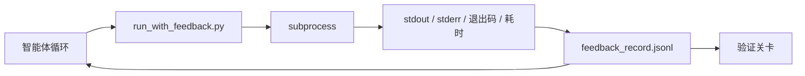

# 运行时反馈循环

> 看不到真实命令输出的智能体只能靠猜。反馈运行器会把 stdout、stderr、退出码和耗时捕获到一条结构化记录中，供下一轮读取。这样智能体就能对事实做出反应，而不是对自己预测的事实做出反应。

**类型：** Build
**语言：** Python (stdlib)
**前置：** Phase 14 · 32（Minimal Workbench）、Phase 14 · 35（Init Script）
**时长：** ~50 分钟

## 学习目标

- 区分运行时反馈与可观测性遥测。
- 构建一个反馈运行器，包装 shell 命令并持久化结构化记录。
- 确定性地截断超大输出，使循环保持在 token 预算内。
- 在反馈缺失时拒绝推进循环。

## 问题

智能体说"正在运行测试"。下一条消息说"所有测试通过"。而现实是根本没有测试运行。智能体凭空想象了输出，或者它运行了命令却从未读取结果，或者它读了结果却悄悄截掉了失败行。

反馈运行器消除了这个鸿沟。每条命令都经过运行器。每条记录都携带命令、捕获的 stdout 和 stderr、退出码、墙钟耗时以及一行智能体备注。智能体在下一轮读取该记录。验证关卡在任务结束时读取这些记录。

## 概念



### 一条反馈记录里有什么

| 字段 | 为什么重要 |
|-------|----------------|
| `command` | 确切的 argv，没有 shell 展开的意外 |
| `stdout_tail` | 最后 N 行，确定性截断 |
| `stderr_tail` | 最后 N 行，与 stdout 分开 |
| `exit_code` | 明确无歧义的成功信号 |
| `duration_ms` | 暴露缓慢探针和失控进程 |
| `started_at` | 用于回放的时间戳 |
| `agent_note` | 智能体写下的一行关于其预期的内容 |

### 截断是确定性的

一个 50 MB 的日志会摧毁循环。运行器用 `...truncated N lines...` 标记对头部和尾部进行截断，是确定性的，因此相同的输出总是产生相同的记录。不做采样；智能体需要看到的部分（最终错误、最终摘要）都在尾部。

### 反馈与遥测

遥测（Phase 14 · 23，OTel GenAI 约定）面向人类操作员，用于跨时间审查运行。反馈面向本次运行的下一轮。它们共享字段，但位于不同的文件中，保留策略也不同。

### 反馈缺失时拒绝推进

如果运行器在捕获退出码之前出错，记录将携带 `exit_code: null` 和 `error: <reason>`。智能体循环必须拒绝在 `null` 退出码上声称成功。没有退出码，就没有进展。

## 动手构建

`code/main.py` 实现了：

- `run_with_feedback(command, agent_note)`，包装 `subprocess.run`，捕获 stdout/stderr/退出码/耗时，确定性截断，追加到 `feedback_record.jsonl`。
- 一个小型加载器，把 JSONL 流式读入 Python 列表。
- 一个演示，运行三条命令（成功、失败、缓慢），并打印每条命令的最后一条记录。

运行它：

```
python3 code/main.py
```

输出：三条反馈记录追加到 `feedback_record.jsonl`，并内联打印每条的最后一条。在多次重跑之间 tail 该文件，可以看到循环不断累积。

## 真实世界中的生产模式

三个模式足以让运行器达到可发布的稳健程度。

**在写入时脱敏，而非读取时。** 任何触及 stdout 或 stderr 的记录都可能泄露密钥。运行器在 JSONL 追加前进行一遍脱敏：剥除匹配 `^Bearer `、`password=`、`api[_-]?key=`、`AKIA[0-9A-Z]{16}`（AWS）、`xox[baprs]-`（Slack）的行。读取时脱敏是个坑；磁盘上的文件才是攻击者能够到的东西。每季度对照生产运行时观察到的密钥格式审计一次脱敏模式。

**轮转策略，而非单一文件。** 把 `feedback_record.jsonl` 限制在每个文件 1 MB；溢出时轮转到 `.1`、`.2`，丢弃 `.5`。智能体的循环只读取当前文件，因此运行时成本是有界的。CI 制品存储拿到完整的轮转集合。没有轮转，文件会在每次加载器调用时成为瓶颈。

**用于重试链的父命令 id。** 每条记录都获得 `command_id`；重试携带指向上一次尝试的 `parent_command_id`。审查者的"失败尝试"列表（Phase 14 · 40）和验证关卡的审计都沿着这条链追踪。没有这个链接，重试看起来就像独立的成功，审计会隐藏失败历史。

## 使用它

生产模式：

- **Claude Code Bash 工具。** 该工具已经捕获 stdout、stderr、退出码和耗时。本课中的运行器是针对任何智能体产品的、与框架无关的等价物。
- **LangGraph 节点。** 把任意 shell 节点包进运行器，使记录在图状态之外持久化。
- **CI 日志。** 把 JSONL 导入你的 CI 制品存储；审查者无需重新运行会话即可回放任意命令。

运行器是一个薄包装层，它能在每次框架迁移中存活，因为它拥有记录的形态。

## 交付它

`outputs/skill-feedback-runner.md` 生成一个项目专属的 `run_with_feedback.py`，带有合适的截断预算、一个接入 workbench 的 JSONL 写入器，以及一个智能体在每一轮读取的加载器。

## 练习

1. 为每条记录添加一个 `cwd` 字段，使从不同目录运行的同一命令可以区分。
2. 添加一个 `redaction` 步骤，剥除匹配 `^Bearer ` 或 `password=` 的行。在一个夹具记录上测试。
3. 通过轮转到 `.1`、`.2` 文件，把 `feedback_record.jsonl` 的总大小限制在 1 MB。为这个轮转策略辩护。
4. 添加一个 `parent_command_id`，使重试链可见：哪个命令产生了下一个命令消费的输入。
5. 把 JSONL 导入一个小型 TUI，高亮最新的非零退出码。列出该 TUI 必须展示的八个关键特性，才能在审查中真正有用。

## 关键术语

| 术语 | 人们怎么说 | 它实际的含义 |
|------|----------------|------------------------|
| Feedback record（反馈记录） | "运行日志" | 带有命令、输出、退出码、耗时的结构化 JSONL 条目 |
| Tail truncation（尾部截断） | "裁剪日志" | 确定性的头部+尾部捕获，使记录适配 token 预算 |
| Refuse-on-null（null 时拒绝） | "缺数据时阻断" | 当 `exit_code` 为 null 时循环不得推进 |
| Agent note（智能体备注） | "预期标签" | 智能体在读取结果前写下的一行预测 |
| Telemetry split（遥测拆分） | "两个日志文件" | 反馈给下一轮，遥测给操作员 |

## 延伸阅读

- [OpenTelemetry GenAI 语义约定](https://opentelemetry.io/docs/specs/semconv/gen-ai/)
- [Anthropic, Effective harnesses for long-running agents](https://www.anthropic.com/engineering/effective-harnesses-for-long-running-agents)
- [Guardrails AI x MLflow — 确定性安全、PII、质量校验器](https://guardrailsai.com/blog/guardrails-mlflow) — 把脱敏模式作为回归测试
- [Aport.io, Best AI Agent Guardrails 2026: Pre-Action Authorization Compared](https://aport.io/blog/best-ai-agent-guardrails-2026-pre-action-authorization-compared/) — 工具调用前/后的捕获
- [Andrii Furmanets, AI Agents in 2026: Practical Architecture for Tools, Memory, Evals, Guardrails](https://andriifurmanets.com/blogs/ai-agents-2026-practical-architecture-tools-memory-evals-guardrails) — 可观测性面
- Phase 14 · 23 — 遥测一侧的 OTel GenAI 约定
- Phase 14 · 24 — 智能体可观测性平台（Langfuse、Phoenix、Opik）
- Phase 14 · 33 — 要求在声明完成前必须有反馈的规则
- Phase 14 · 38 — 读取 JSONL 的验证关卡
