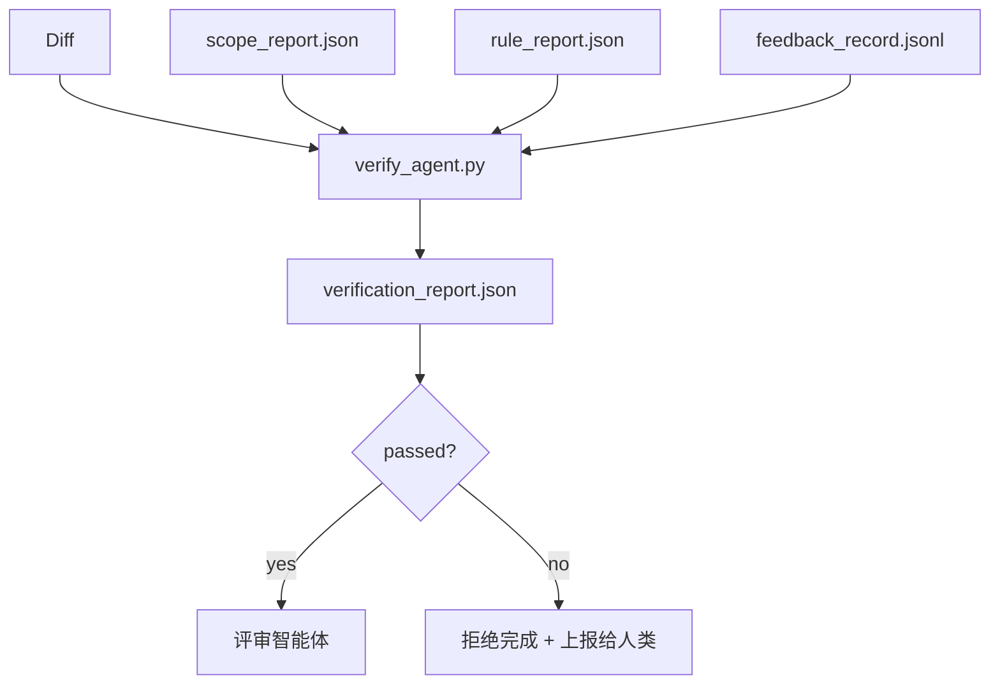

# 验证关卡

> 智能体不能自己把任务标记为完成。验证关卡读取范围契约、反馈日志、规则报告和 diff，并回答一个单一的问题：这个任务真的完成了吗？如果关卡说没有，那么任务就没有完成，无论聊天里怎么说。

**类型：** Build
**语言：** Python (stdlib)
**前置要求：** Phase 14 · 33（规则）、Phase 14 · 36（范围）、Phase 14 · 37（反馈）
**时间：** 约 55 分钟

## 学习目标

- 将验证关卡定义为针对工作台产物的确定性函数。
- 把规则报告、范围报告、反馈记录和 diff 组合成单一裁决。
- 输出一份评审智能体和 CI 都能读取的 `verification_report.json`。
- 在任何 block 级失败时拒绝推进任务，没有例外。

## 问题

智能体太轻易地宣布成功。三种失败形态占主导：

- “看起来不错。”模型读了自己的 diff，然后判定它是正确的。
- “测试通过了。”说得很自信。但没有测试实际运行的记录。
- “满足验收。”验收标准被宽松地解读成“任何看起来像完成的东西”。

工作台的修正方案是一个单一的验证关卡，它读取智能体已经产出的产物并做出判断。关卡是确定性的。关卡在版本控制中。关卡接入了 CI。智能体无法贿赂它。

## 概念



### 关卡检查什么

| 检查 | 来源产物 | 严重级别 |
|-------|-----------------|----------|
| 所有验收命令都运行了 | `feedback_record.jsonl` | block |
| 所有验收命令都以零退出码退出 | `feedback_record.jsonl` | block |
| 范围检查没有禁止的写入 | `scope_report.json` | block |
| 范围检查没有越界的写入 | `scope_report.json` | block 或 warn |
| 所有 block 级规则通过 | `rule_report.json` | block |
| 反馈中没有 `null` 退出码 | `feedback_record.jsonl` | block |
| 触碰的文件匹配 `scope.allowed_files` | 两者 | warn |

一个 `warn` 发现会给裁决加上注释；一个 `block` 发现会阻止 `passed: true`。

### 确定性，而非概率性

关卡必须对同一组产物每次都产出相同的裁决。不用 LLM 评判。LLM 评判属于评审一侧（Phase 14 · 39），那里的目标是定性评估，而不是状态判定。

### 一份报告，一个路径

关卡在每次任务收尾时输出一份 `verification_report.json`，写入到 `outputs/verification/<task_id>.json` 下。CI 消费同一个路径。多个使用不同路径的关卡会分裂真相之源。

### 拒绝，没有例外

Block 级发现不能被智能体覆盖。它们只能被人类覆盖，并附带记录在案的 `override_reason` 和 `overridden_by` 用户 id。覆盖是一个签名的变更，而不是一个智能体决定。

## 动手构建

`code/main.py` 实现了：

- 针对每个输入产物的加载器，全部在本地打桩，使课程自包含。
- 一个 `verify(task_id, artifacts) -> VerdictReport` 纯函数。
- 一个打印器，显示每项检查的结果和最终的通过/失败。
- 一个带三个任务场景的演示：干净通过、范围蔓延、缺失验收。

运行它：

```
python3 code/main.py
```

输出：三份裁决报告，每份都保存在脚本旁边。

## 现实世界中的生产模式

四种模式把关卡从“又一个 lint 作业”提升为“决定性边界”。

**纵深防御，而非单一关卡。** 预提交钩子 → CI 状态检查 → pre-tool 授权钩子 → 预合并关卡。每一层都是确定性的，因此某一层的失败会被下一层捕获。microservices.io 在 2026 年 3 月的剧本里说得很明确：预提交钩子是不可绕过的，因为与模型侧的技能不同，它不依赖于智能体遵守指令。验证关卡位于 CI / 预合并层。

**用确定性检查防御，仅在细微之处用模型评判。** Anthropic 2026 年的 Hybrid Norm 搭配：可验证奖励（单元测试、模式检查、退出码）回答“代码解决了问题吗？”——LLM 评分量表回答“代码可读吗、安全吗、符合风格吗？”关卡运行第一类；评审（Phase 14 · 39）运行第二类。把它们混在一起会让信号坍塌。

**签名的覆盖日志，而非 Slack 线程。** 每次覆盖都在 `outputs/verification/overrides.jsonl` 中输出一行，包含：时间戳、发现代码、原因、签名用户、当前 HEAD 提交。运行时拒绝任何缺少签名的覆盖；审计轨迹由 git 跟踪。这就是覆盖策略和覆盖表演之间的分界线。

**覆盖率底线作为一等检查。** 一份 `coverage_report.json` 喂给一个 `coverage_floor`（默认 80%）检查。如果测得的覆盖率跌破底线，或比上一次合并的底线下降超过 1 个百分点，关卡就失败。没有这项检查，智能体会悄悄删除失败的测试，而验证报告依然保持绿色。

**`--strict` 模式把 warn 提升为 block。** 对于发布分支、阻止发布的 PR，或事故后分诊，`--strict` 让每个警告都成为硬失败。这个标志按分支选择开启；不是全局默认，因为对所有东西都严格会侵蚀日常流程。

## 使用它

生产模式：

- **CI 步骤。** 一个 `verify_agent` 作业针对智能体的最终产物运行关卡。合并保护在没有 `passed: true` 时拒绝。
- **交接前钩子。** 智能体运行时在生成交接文档之前调用关卡。没有绿色裁决，就没有交接。
- **手动分诊。** 当智能体宣称成功而人类心存怀疑时，操作者阅读这份报告。

关卡是工作台流程中的决定性边界。其他每个面都在它的上游。

## 交付它

`outputs/skill-verification-gate.md` 把关卡接入一个具体项目：哪些验收命令喂给它、哪些规则是 block 级、哪些越界写入可以容忍、覆盖审计日志如何存储。

## 练习

1. 添加一个 `coverage_floor` 检查：测试命令必须产出一份至少 80% 的覆盖率报告。决定哪个产物承载这个底线。
2. 支持一个 `--strict` 模式，把每个 `warn` 提升为 `block`。记录哪些情况下严格模式是正确的默认值。
3. 让关卡在 JSON 之外再产出一份 Markdown 摘要。论证哪些字段应该放进摘要。
4. 添加一个 `time_since_last_human_touch` 检查：任何在人类按键 60 秒内被编辑的文件，豁免于越界标记。
5. 在你产品里一个真实的智能体 diff 上运行关卡。有多少发现是真的，多少是噪声？关卡需要在哪里成长？

## 关键术语

| 术语 | 人们怎么说 | 它实际是什么 |
|------|----------------|------------------------|
| 验证关卡 | “那个拦下东西的检查” | 针对工作台产物、产出通过/失败裁决的确定性函数 |
| Block 严重级别 | “硬失败” | 一个阻止 `passed: true` 并要求签名覆盖的发现 |
| 覆盖日志 | “我们为什么放它过去” | 带原因和用户 id 的签名条目，由评审审计 |
| 验收命令 | “证据” | 一个其零退出码即为 `done` 含义的 shell 命令 |
| 单一报告路径 | “真相之源” | `outputs/verification/<task_id>.json`，被 CI 和人类同样消费 |

## 延伸阅读

- [Anthropic, Harness design for long-running application development](https://www.anthropic.com/engineering/harness-design-long-running-apps)
- [OpenAI Agents SDK guardrails](https://platform.openai.com/docs/guides/agents-sdk/guardrails)
- [microservices.io, GenAI dev platform: guardrails](https://microservices.io/post/architecture/2026/03/09/genai-development-platform-part-1-development-guardrails.html) —— 预提交与 CI 之间的纵深防御
- [ICMD, The 2026 Playbook for Agentic AI Ops](https://icmd.app/article/the-2026-playbook-for-agentic-ai-ops-guardrails-costs-and-reliability-at-scale-1776661990431) —— 审批关卡阶梯（草稿 → 审批 → 阈值下自动）
- [Type-Checked Compliance: Deterministic Guardrails (arXiv 2604.01483)](https://arxiv.org/pdf/2604.01483) —— Lean 4 作为确定性关卡的上界
- [logi-cmd/agent-guardrails — merge gate spec](https://github.com/logi-cmd/agent-guardrails) —— 范围 + 变异测试关卡
- [Guardrails AI x MLflow](https://guardrailsai.com/blog/guardrails-mlflow) —— 作为 CI 评分器的确定性校验器
- [Akira, Real-Time Guardrails for Agentic Systems](https://www.akira.ai/blog/real-time-guardrails-agentic-systems) —— pre/post-tool 关卡
- Phase 14 · 27 —— 提示注入防御（关卡的对抗搭档）
- Phase 14 · 36 —— 这个关卡所执行的范围契约
- Phase 14 · 37 —— 这个关卡所评分的反馈日志
- Phase 14 · 39 —— 关卡交接给的评审智能体
