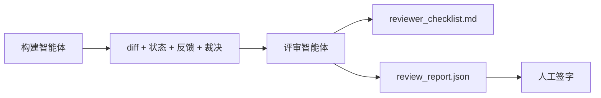

# 评审智能体：让构建者与评分者分离

> 写代码的智能体无法给自己的代码打分。评审者是第二个循环，拥有不同的系统提示、不同的目标，并且对构建者产出的一切只有只读访问权限。构建者与评审者之间的差距，正是大部分可靠性的来源。

**类型：** 构建
**语言：** Python（标准库）
**前置要求：** 第 14 阶段 · 38（验证关卡）
**时长：** 约 55 分钟

## 学习目标

- 说明为什么同一个智能体无法可靠地评审自己的工作。
- 构建一个评审智能体循环，消费构建者产出的工件并发出结构化的评审报告。
- 编写一个评审评分标准，对具体维度评分，而不是凭感觉。
- 把评审者接入工作台，让人工评审环节从真实工件开始。

## 问题所在

你让智能体修复一个 bug。它编辑了四个文件，运行了测试，并报告完成。验证关卡（第 14 阶段 · 38）确认验收已运行、范围已守住。关卡显示 `passed: true`。你合并了代码。两天后你发现，这个修复解决的是 bug 错误的那一半。

验收是必要的，但并不充分。评审者会提出验收无法提出的问题：这是否解决了正确的问题？它是否在未声明的情况下扩大了范围？它是否记录了那些本应被质疑的假设？它是否把工作台留在了下一个会话可以接手的状态？

## 概念



### 评审评分标准

五个维度，每个维度从 0 到 2 评分。

| 维度 | 问题 |
|-----------|----------|
| 问题契合度 | 这个改动是否解决了任务所述的问题，而不是一个相近的任务？ |
| 范围纪律 | 编辑是否限定在契约范围内，还是有意地扩展了契约？ |
| 假设 | 所有隐藏的假设是否都写在了某个可供评审的地方？ |
| 验证质量 | 验收命令是否真的证明了目标，还是只证明了一个较弱的版本？ |
| 交接就绪度 | 下一个会话能否从当前状态干净利落地接手？ |

总分 10 分。低于 7 分为软失败；低于 5 分为硬失败。

### 评审者是一个独立角色，而非一个独立模型

你可以用与构建者相同的模型来运行评审者。其中的纪律在于角色分离：不同的系统提示、不同的输入、对 diff 没有写入权限。姿态的改变就是信号的改变。

### 评审者不能编辑 diff

评审者读取 diff、状态、反馈、裁决。它写一份报告。它不修补 diff。如果报告说“修复这个”，由下一个构建者轮次去做修复；评审者继续回去评审。混淆角色就会瓦解这个差距。

### 评审评分标准与验证关卡

关卡（第 14 阶段 · 38）检查确定性事实：验收是否运行、规则是否通过、范围是否守住。评审者做出定性判断：这是否是正确的工作、是否有文档记录、交接是否可用。两者都是必需的。

## 动手构建

`code/main.py` 实现了：

- 一个 `ReviewerInputs` 数据类，打包评审者读取的工件。
- 一个评分标准打分器，每个维度对应一个函数。每个函数都是确定性的，且为本课的桩级实现；真实实现会调用 LLM。
- 一个 `review_report.json` 写入器，包含五个分数、总分以及裁决（`pass`、`soft_fail`、`hard_fail`）。
- 两个演示案例：一个干净的改动，以及一个“测试对、问题错”的改动。

运行它：

```
python3 code/main.py
```

输出：两份评审报告写入磁盘，以及一张控制台表格展示各维度分数。

## 现实中的生产模式

证据在此：Cloudflare 在 2026 年 4 月的 AI 代码评审系统，在 30 天内于 5,169 个仓库的 48,095 个合并请求上运行了 131,246 次评审。中位评审在 3 分 39 秒内完成。在一个 Review Coordinator（评审协调器）之下，多达七个专家评审者（安全、性能、代码质量、文档、发布管理、合规、Engineering Codex）并行运行，协调器对发现去重并判定严重程度。顶级模型专门保留给协调器；专家则运行在更便宜的层级上。

四种模式让它在大规模下行得通。

**专家池，而非一个大评审者。** 一个带 5 维评分标准的评审者适用于单人仓库。一旦代码库出现安全关键、性能关键和文档等多个面向，就拆分成各自带更小提示的专家。协调器负责去重；专家从不运行完整评分标准。模型层级分离也随之而来：便宜的专家、昂贵的协调器。

**把偏见缓解当作设计要求，而非优化项。** LLM 裁判表现出四种可靠的偏见（Adnan Masood，2026 年 4 月）：位置偏见（GPT-4 在 (A,B) 与 (B,A) 顺序上约 40% 不一致）、冗长偏见（对更长的输出约有 15% 的分数膨胀）、自我偏好（裁判更偏好来自同一模型家族的输出）、权威偏见（裁判对引用知名作者的内容评分过高）。缓解措施：评估两种顺序，仅计算一致的胜出；使用明确奖励简洁的 1-4 分制；在不同模型家族之间轮换裁判；评分前去除作者姓名。

**校准集，而非凭感觉。** 一个由 10-20 个任务组成、带有已知正确裁决的历史集合。在每次提示变更时让评审者跑一遍。如果与历史记录的一致性低于 80%，则评分标准在评审者上线前需要修订。这是每个团队最终都会重新发现的东西；不如一开始就用它。

**与关卡的混合规范。** 验证关卡（第 14 阶段 · 38）处理确定性检查（验收是否运行、测试是否通过、范围是否守住）。评审者处理语义检查（这是否是正确的工作、假设是否有文档记录、交接是否可用）。Anthropic 2026 年的指引对这一划分表述明确：不要让评审者重做关卡已经证明过的事情。

## 使用它

生产模式：

- **Claude Code 子智能体。** 评审子智能体在构建者关闭任务后运行。它在 PR 上发布一条带有评分标准分数的评论。
- **OpenAI Agents SDK 交接。** 构建者在任务完成时交接给评审者。评审者可以带着一份发现清单交接回去，或向上交接给人类。
- **双模型配对。** 构建者运行在更快更便宜的模型上。评审者运行在更强、上下文更小的模型上，专注于判断。

评审者就是当人类无法亲自完成每一次评审时，工作台所生长出的第二双眼睛。

## 交付它

`outputs/skill-reviewer-agent.md` 生成一个针对具体项目的评审评分标准、一个接入构建者工件的评审智能体桩，以及一个与验证关卡的集成，让人工评审从一份书面报告开始，而不是从一张白纸开始。

## 练习

1. 增加一个针对你产品领域的第六个维度。论证为什么它没有被现有的五个维度所吸收。
2. 用两种不同的系统提示（简洁、冗长）运行评审者。哪一种产出的报告人类更可能去读？
3. 为每个维度增加一个 `confidence` 字段。当最低维度的置信度低于 0.6 时，拒绝交付报告。
4. 构建一个校准集：10 个带有已知正确裁决的历史任务收尾。让评审者跑一遍。它在哪里与历史记录产生分歧？
5. 增加一个“请求更多证据”的能力：评审者可以在评分前要求构建者执行一次特定的测试运行。怎样的退避策略才合适，才不会让它陷入循环？

## 关键术语

| 术语 | 人们怎么说 | 它实际的含义 |
|------|----------------|------------------------|
| 评审评分标准 | “检查清单” | 五维 0-2 评分，每个维度配一个书面问题 |
| 软失败 | “需要修订” | 总分低于 7；构建者拿到需处理的发现 |
| 硬失败 | “拒绝” | 总分低于 5 或任一维度为 0；停止并上报给人类 |
| 角色分离 | “不同的提示” | 同一模型可以同时担任两个角色；纪律在于输入与姿态 |
| 置信度下限 | “不要交付低信号的报告” | 当评分标准不确定时拒绝发出裁决 |

## 延伸阅读

- [OpenAI Agents SDK handoffs](https://platform.openai.com/docs/guides/agents-sdk/handoffs)
- [Anthropic Claude Code subagents](https://docs.anthropic.com/en/docs/agents-and-tools/claude-code/sub-agents)
- [Cloudflare, Orchestrating AI Code Review at Scale](https://blog.cloudflare.com/ai-code-review/) —— 7 专家 + 协调器架构，30 天 13.1 万次运行
- [Agent-as-a-Judge: Evaluating Agents with Agents (OpenReview / ICLR)](https://openreview.net/forum?id=DeVm3YUnpj) —— DevAI 基准，366 个分层解决方案需求
- [Adnan Masood, Rubric-Based Evaluations and LLM-as-a-Judge: Methodologies, Biases, Empirical Validation](https://medium.com/@adnanmasood/rubric-based-evals-llm-as-a-judge-methodologies-and-empirical-validation-in-domain-context-71936b989e80) —— 4 种偏见及缓解措施
- [MLflow, LLM-as-a-Judge Evaluation](https://mlflow.org/llm-as-a-judge) —— 用于分离构建者/评估者的生产工具
- [LangChain, How to Calibrate LLM-as-a-Judge with Human Corrections](https://www.langchain.com/articles/llm-as-a-judge) —— 校准集工作流
- [Evidently AI, LLM-as-a-judge: a complete guide](https://www.evidentlyai.com/llm-guide/llm-as-a-judge)
- [Arize, LLM as a Judge — Primer and Pre-Built Evaluators](https://arize.com/llm-as-a-judge/)
- 第 14 阶段 · 05 —— Self-Refine 与 CRITIC（单智能体自评审基线）
- 第 14 阶段 · 30 —— 评估驱动的智能体开发（校准集生成器）
- 第 14 阶段 · 38 —— 评审者读取的验证关卡
- 第 14 阶段 · 40 —— 评审报告所馈入的交接包
