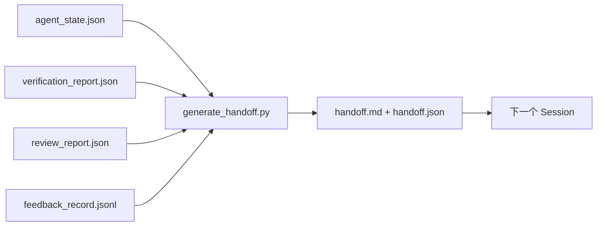

# 多 Session Handoff

> Session 即将结束，但工作还没完成。Handoff packet 就是那个把"智能体工作了一个小时"转化为"下一个 session 在第一分钟就能高效产出"的产物。要有意识地构建它，而不是事后补救。

**类型：** Build
**语言：** Python (stdlib)
**前置知识：** Phase 14 · 34 (Repo Memory)、Phase 14 · 38 (Verification)、Phase 14 · 39 (Reviewer)
**时长：** 约 50 分钟

## 学习目标

- 识别每个 handoff packet 都需要的七个字段。
- 从 workbench 产物生成 handoff，而无需手写散文。
- 把庞大的反馈日志裁剪为 handoff 规模的摘要。
- 让下一个 session 的第一个动作具有确定性。

## 问题所在

Session 结束了。智能体说"很好，我们取得了进展"。下一个 session 打开。下一个智能体问"我们上次进行到哪里了？"第一个智能体的答案已经消失了。下一个智能体重新发现、重新运行同样的命令、重新向人类问同样的问题，花掉三十分钟去恢复上一个 session 最后三十秒的工作。

一次糟糕 handoff 的代价会在整个任务的生命周期里每个 session 都付出一遍。解决办法是在 session 结束时自动生成一个 packet：改了什么、为什么改、尝试了什么、失败了什么、还剩什么、下次首先该做什么。

## 概念



### 每个 handoff 都携带的七个字段

| 字段 | 它回答的问题 |
|-------|---------------------|
| `summary` | 一段话说明做了什么 |
| `changed_files` | 一眼看清的 diff |
| `commands_run` | 实际执行了什么 |
| `failed_attempts` | 尝试了什么以及为什么没成功 |
| `open_risks` | 下个 session 可能踩到的坑，含严重程度 |
| `next_action` | 下个 session 采取的第一个具体步骤 |
| `verdict_pointer` | 指向 verification + review 报告的路径 |

`next_action` 字段是承重的那一个。一个除了 `next_action` 什么都有的 handoff，是状态报告，不是 handoff。

### Handoff 是生成的，不是写出来的

手写的 handoff，就是那种在艰难的日子里会被跳过的 handoff。生成器读取 workbench 产物并输出 packet。智能体的任务是把 workbench 留在一个生成器能够总结的状态，而不是去写那份摘要。

### 两种形式：人类可读和机器可读

`handoff.md` 是人类阅读的内容。`handoff.json` 是下一个智能体加载的内容。两者都来自相同的源产物。如果它们出现分歧，以 JSON 为准。

### 反馈日志裁剪

完整的 `feedback_record.jsonl` 可能有数百条记录。Handoff 只携带最后 K 条，外加每一条退出码非零的记录。下一个 session 如果需要可以加载完整日志，但 packet 保持小巧。

### 留下干净的状态

Handoff 描述工作。干净的状态让工作可以恢复。两者不是一回事。如果下一个 session 打开后看到的是一个只应用了一半的 diff、一个智能体忘记删的临时文件、一个游离的分支、以及还没运行就报错的测试，那么一份完美的 `handoff.md` 也毫无价值。下一个智能体随后会把它的头十分钟花在给上一个收拾烂摊子上,而不是构建,这个代价在整个任务生命周期里每个 session 都会累加。

所以 session 不是在功能可用时结束。它是在 workbench 处于一个生成器能总结、下一个 session 能信任的状态时才结束。清理是它自己的一个阶段,在 handoff 之前运行,而且它是一项检查,不是一种习惯,因为习惯就是在艰难的日子里会被跳过的东西。

| 检查项 | 干净意味着 | 脏会阻断,因为 |
|-------|-------------|----------------------|
| 工作树 | 每个改动都已提交,或带说明地显式 stash | 一个只应用了一半的 diff 在下个智能体看来像是有意为之的工作 |
| 临时产物 | 没有遗留的 `*.tmp`、scratch 目录、调试打印或注释掉的代码块 | 散落的文件污染 diff 和下个智能体的心智模型 |
| 测试 | 绿色,或红色但失败已记入 `open_risks` | 一个无声的红色测试是下个 session 会踩进去的陷阱 |
| Feature board | `feature_list.json` 状态反映现实 (Phase 14 · 36) | 一个过时的 board 会把下个 session 引向已经完成的工作 |
| 分支 | 在预期分支上,没有 detached HEAD,没有孤儿分支 | 错误的分支意味着下个 session 的第一个提交落在错误的位置 |

清理阶段会输出一个记录阻断性问题的 `clean_state.json`;空列表是 handoff 生成器在写 packet 之前所断言的前置条件。建立在脏工作树上的 handoff 不是 handoff,而是被转发的一团乱麻。这两个产物成对出现:清理证明 workbench 可以安全地离开,handoff 证明下个 session 知道从哪里开始。

## 动手构建

`code/main.py` 实现了：

- 一个加载器,把 state、verdict、review 和 feedback 收集进单个 `WorkbenchSnapshot`。
- 一个 `generate_handoff(snapshot) -> (markdown, payload)` 函数。
- 一个过滤器,挑出最后 K 条反馈记录外加所有退出码非零的记录。
- 一个 demo 运行,在脚本旁边写出 `handoff.md` 和 `handoff.json`。

运行它：

```
python3 code/main.py
```

输出：打印出的 handoff 正文,外加磁盘上的两个文件。

## 真实世界中的生产模式

Codex CLI、Claude Code 和 OpenCode 各自给出了一套不同的压缩(compaction)方案;结构化的 handoff packet 凌驾于这三者之上。

**压缩策略各不相同;packet 的模式不变。** Codex CLI 的 POST /v1/responses/compact 是一个服务端不透明的 AES blob(针对 OpenAI 模型的快速路径);其回退方案是一个作为 `_summary` user-role 消息追加的本地"handoff 摘要"。Claude Code 在上下文达到 95% 时运行五阶段渐进式压缩。OpenCode 做基于时间戳的消息隐藏,外加一个 5 标题的 LLM 摘要。三种不同的机制,同一个需求:把压缩后存活下来的内容序列化成一个可移植的产物。Packet 就是那个产物。

**全新 session 的 handoff 不是压缩。** 压缩延长一个 session;handoff 干净地关闭一个并开启下一个。Hermes Issue #20372 的提法(2026 年 4 月)是对的:当原地压缩开始降低质量时,智能体应当写一个紧凑的 handoff、结束 session,然后在全新上下文中恢复。Packet 就是让这个转换变得低成本的东西。错误在于一直压缩直到质量崩溃;修复办法是为一次早期、干净的 handoff 预留预算。

**每个分支和主题只有一个活跃的 handoff。** 多智能体协作更多是栽在过时的 handoff 上,而不是糟糕的模型输出上。始终包含 `branch`、`last_known_good_commit`,以及一个 `active | superseded | archived` 的 `status`。过时的 handoff 被归档;只有活跃的那个驱动下一个 session。这就是 handoff-作为笔记和 handoff-作为状态之间的区别。

**在 50-75% 上下文之前收尾,而不是顶到墙根。** 手写模式的实战手册(CLAUDE.md + HANDOVER.md)报告称,在上下文预算的 50-75% 而非 95% 处结束 session 效果最好。Packet 生成器会在压缩产物污染源状态之前干净地运行。上下文完整时写它很便宜;模型已经迷失方向时写它很昂贵。

## 使用它

生产模式：

- **Session 结束钩子。** 运行时在用户关闭聊天时触发生成器。Packet 进入 `outputs/handoff/<session_id>/`。
- **PR 模板。** 生成器的 markdown 同时也是一个 PR 正文。审查者无需打开另外五个文件就能阅读。
- **跨智能体 handoff。** 用一个产品(Claude Code)构建,用另一个(Codex)继续。Packet 是通用语。

Packet 小巧、规整、生产成本低廉。这种成本节省随着每个 session 而累加。

## 交付它

`outputs/skill-handoff-generator.md` 产出一个针对项目产物路径调优的生成器、一个运行它的 session 结束钩子,以及一个下一个智能体在启动时读取的 `handoff.json` 模式。

## 练习

1. 添加一个 `assumptions_to_validate` 字段,浮现出每一个构建者记录了但审查者评分未超过 1 的假设。
2. 对失败的运行和通过的运行采用不同的方式裁剪反馈摘要。为这种不对称性辩护。
3. 包含一个"给人类的问题"列表。一个问题进入 packet 而非进入聊天消息的阈值是什么?
4. 让生成器具有幂等性:运行两次产出相同的 packet。要让它成立,什么需要保持稳定?
5. 添加一个"下个 session 前置条件"小节,精确列出下个 session 在行动之前必须加载的产物。

## 关键术语

| 术语 | 人们怎么说 | 它实际的含义 |
|------|----------------|------------------------|
| Handoff packet | "Session 摘要" | 携带七个字段的生成产物,markdown 和 JSON 两种形式 |
| Next action | "首先做什么" | 启动下个 session 的那一个具体步骤 |
| Feedback trim | "日志摘要" | 最后 K 条记录外加每一条退出码非零的记录 |
| 状态报告 | "我们做了什么" | 一份缺少 `next_action` 的文档;有用,但不是 handoff |
| Verdict pointer | "收据" | 指向 verification + review 报告的路径,用于可追溯 |

## 延伸阅读

- [Anthropic, Effective harnesses for long-running agents](https://www.anthropic.com/engineering/effective-harnesses-for-long-running-agents)
- [OpenAI Agents SDK handoffs](https://platform.openai.com/docs/guides/agents-sdk/handoffs)
- [Codex Blog, Codex CLI Context Compaction: Architecture, Configuration, Managing Long Sessions](https://codex.danielvaughan.com/2026/03/31/codex-cli-context-compaction-architecture/) — POST /v1/responses/compact 和本地回退
- [Justin3go, Shedding Heavy Memories: Context Compaction in Codex, Claude Code, OpenCode](https://justin3go.com/en/posts/2026/04/09-context-compaction-in-codex-claude-code-and-opencode) — 三家厂商压缩对比
- [JD Hodges, Claude Handoff Prompt: How to Keep Context Across Sessions (2026)](https://www.jdhodges.com/blog/ai-session-handoffs-keep-context-across-conversations/) — CLAUDE.md + HANDOVER.md,50-75% 上下文预算
- [Mervin Praison, Managing Handoffs in Multi-Agent Coding Sessions: Fresh Context Without Losing Continuity](https://mer.vin/2026/04/managing-handoffs-in-multi-agent-coding-sessions-fresh-context-without-losing-continuity/) — 分布式系统视角
- [Hermes Issue #20372 — automatic fresh-session handoff when compression becomes risky](https://github.com/NousResearch/hermes-agent/issues/20372)
- [Hermes Issue #499 — Context Compaction Quality Overhaul](https://github.com/NousResearch/hermes-agent/issues/499) — Codex CLI 中面向 handoff 的提示
- [Microsoft Agent Framework, Compaction](https://learn.microsoft.com/en-us/agent-framework/agents/conversations/compaction)
- [OpenCode, Context Management and Compaction](https://deepwiki.com/sst/opencode/2.4-context-management-and-compaction)
- [LangChain, Context Engineering for Agents](https://www.langchain.com/blog/context-engineering-for-agents)
- Phase 14 · 34 — 生成器读取的状态文件
- Phase 14 · 38 — packet 指向的 verification verdict
- Phase 14 · 39 — 打包进 packet 的审查者报告
