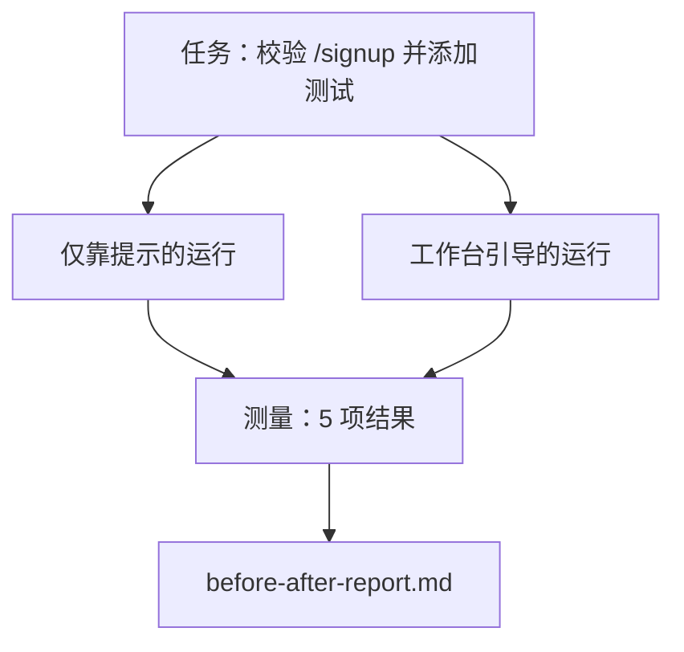

# 在真实仓库上的工作台

> 十一节课的各种工作面，如果经不起真实代码库的考验，就一文不值。本课在一个小型示例应用上把同一个任务运行两次：仅靠提示（prompt-only）对比工作台引导（workbench-guided）。让数字来说话。

**类型：** Build
**语言：** Python（stdlib）
**前置要求：** 阶段 14 · 32 到 14 · 40
**时间：** ~60 分钟

## 学习目标

- 把七个工作台工作面汇集到一个小型应用上。
- 将同一个任务运行两次（仅靠提示与工作台引导），并测量五项结果。
- 阅读前后对比报告，判断哪些工作面带来了最大的杠杆效应。
- 面对“可我的模型已经足够好了”的反驳时，为工作台辩护。

## 问题

在玩具任务上做演示说服不了任何人。只有当一个有真实感的任务在一个有真实感的仓库上落地到生产环境，并且故障更少、回滚更少、还留下一份下一次会话可以使用的交接包时，工作台的价值才算被证明。

本课提供这样一个有真实感的仓库，并将同一个任务跑通两条流水线。结果是一份你可以递给怀疑者的前后对比报告。

## 概念



### 示例应用

`sample_app/` 中一个极简的 FastAPI 风格处理器：

- `app.py`，包含 `/signup`（尚无校验）。
- `test_app.py`，包含一个顺利路径（happy-path）测试。
- `README.md` 和 `scripts/release.sh` 作为禁区诱饵。

### 任务

> 为 `/signup` 添加输入校验：拒绝长度小于 8 个字符的密码，返回 422 并附带带类型的错误信封（typed error envelope）。添加一个测试来证明新行为。

### 两条流水线

仅靠提示：

1. 阅读 README。
2. 阅读 `app.py`。
3. 编辑文件。
4. 声称完成。

工作台引导：

1. 运行初始化脚本（第 35 课）。
2. 阅读范围契约（第 36 课）。
3. 阅读状态（第 34 课）。
4. 只编辑被允许的文件。
5. 通过反馈运行器执行验收命令（第 37 课）。
6. 运行验证关卡（第 38 课）。
7. 运行评审器（第 39 课）。
8. 生成交接（第 40 课）。

### 测量的五项结果

| 结果 | 为何重要 |
|---------|----------------|
| `tests_actually_run` | 大多数“测试通过”的声称都无法验证 |
| `acceptance_met` | 证明目标的那个测试必须就是实际运行的那个测试 |
| `files_outside_scope` | 范围蔓延是占主导的无声失败 |
| `handoff_quality` | 下一次会话要为它付出代价，或从中受益 |
| `reviewer_total` | 在关卡之上做出的定性判断 |

## 动手构建

`code/main.py` 针对同一个示例应用 fixture 编排两条流水线。两条流水线都是脚本化的（回路中没有 LLM），因此测量是可复现的。脚本将对比结果写入 `before-after-report.md` 和 `comparison.json`。

运行它：

```
python3 code/main.py
```

输出：每条流水线各项结果的控制台表格、保存在脚本旁的 markdown 报告，以及供想要绘图的人使用的 JSON。

## 真实世界中的生产模式

怀疑者的问题是“工作台到底能帮上多少忙？”。2026 年的数字比解释更有说服力。

**同一个模型从 Terminal Bench 前 30 名外冲进前 5。** LangChain 的《Anatomy of an Agent Harness》（2026 年 4 月）：一个编码智能体仅通过更改 harness，就从 Terminal Bench 2.0 前 30 名开外跃升到第五名。同一个模型。不同的工作面。二十五个名次的差距。

**Vercel 通过删除工具从 80% 升到 100%。** Vercel 报告称，删除其智能体 80% 的工具，把成功率从 80% 提升到 100%。更小的工具面、更清晰的范围、更少的失败途径。负空间取胜。

**Harvey 仅靠 harness 把准确率翻倍。** 法律智能体仅通过 harness 优化，准确率就提升了一倍以上，模型没有变化。

**88% 的企业 AI 智能体项目无法进入生产。** preprints.org 的《Harness Engineering for Language Agents》论文（2026 年 3 月）将这些失败追溯到运行时，而非推理：状态陈旧、重试脆弱、上下文过度膨胀、从中间错误中恢复不力。

**长上下文崩溃。** WebAgent 基线 40-50% 的成功率，在长上下文条件下跌至 10% 以下，主要源于无限循环和目标丢失。Ralph Loop 和交接包正是为吸收这种情况而存在。

**假阴性依然存在。** 单步事实性任务、单行 lint、格式化器运行，以及任何模型已逐字记住的东西——这些用仅靠提示的方式跑得更快。基准应当诚实地把它们列举出来，以免工作台被框定为“杀鸡用牛刀”。

要点不是“harness 永远胜出”。模型确实会随时间吸收 harness 的技巧。要点是在今天,工程负担落在这七个工作面上，而数字证明了这一点。

## 用起来

本课是你在以下场景中引用的案例卷宗：

- 有人问为什么每个 PR 都要带一份 `agent-rules.md` 和一份范围契约。
- 某个团队想“就这一个 sprint”去掉验证关卡。
- 一款新的智能体产品发布，你需要一个可移植的基准来判断它是否真的节省了时间。

数字比解释传播得更远。

## 交付

`outputs/skill-workbench-benchmark.md` 是一个可移植的评估 harness，它针对一个项目自己的示例应用，让任何智能体产品跑通两条流水线，并报告五项结果。

## 练习

1. 添加第六项结果：到首次有意义编辑的时间（time-to-first-meaningful-edit）。你如何干净地测量它？
2. 在你代码库中一个真实的第二天任务上运行这个对比。工作台的数字在哪里会下滑？
3. 添加一个“假阴性”检验：那些仅靠提示本来更快、工作台开销是实打实成本的任务。仍然为保留工作台辩护。
4. 用真实的 LLM 调用替换脚本化的“智能体”。哪些结果会变得更嘈杂？
5. 撰写一页面向非工程师的总结。哪些内容能保留下来？

## 关键术语

| 术语 | 人们怎么说 | 它实际指什么 |
|------|----------------|------------------------|
| 示例应用 | “玩具仓库” | 小但足够真实，能演练全部七个工作面 |
| 流水线 | “工作流” | 智能体遵循的、有序的工作面读写序列 |
| 前后对比报告 | “凭据” | 你递给怀疑者的产物 |
| 假阴性 | “工作台杀鸡用牛刀” | 仅靠提示更快的任务；诚实列举它们很有用 |
| 工作台基准 | “可靠性评分” | 在你的代码库上运行对比的可移植 harness |

## 延伸阅读

- [LangChain, The Anatomy of an Agent Harness](https://blog.langchain.com/the-anatomy-of-an-agent-harness/) — Terminal Bench 从前 30 到前 5 的凭据
- [MongoDB, The Agent Harness: Why the LLM Is the Smallest Part of Your Agent System](https://www.mongodb.com/company/blog/technical/agent-harness-why-llm-is-smallest-part-of-your-agent-system) — Vercel + Harvey 的数字
- [preprints.org, Harness Engineering for Language Agents](https://www.preprints.org/manuscript/202603.1756) — 88% 企业失败率，运行时根因
- [HN: Improving 15 LLMs at Coding in One Afternoon. Only the Harness Changed](https://news.ycombinator.com/item?id=46988596) — 在 15 个模型上复现
- [Cloudflare, Orchestrating AI Code Review at Scale](https://blog.cloudflare.com/ai-code-review/) — 生产环境 30 天 13.1 万次评审运行
- [Anthropic, Building Effective Agents](https://www.anthropic.com/research/building-effective-agents)
- 阶段 14 · 32 到 14 · 40 — 本课端到端演练的那些工作面
- 阶段 14 · 19 — SWE-bench、GAIA、AgentBench 作为本课所补充的宏观基准
- 阶段 14 · 30 — 本 harness 接入的评估驱动智能体开发
