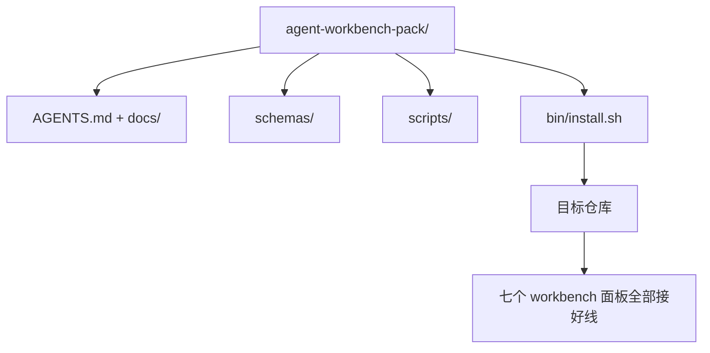

# Capstone：交付一个可复用的智能体 workbench 包

> 这个迷你专题以一个可以放进任意仓库的包收尾。十一节课所讲的各个面板被压缩进一个目录，你可以 `cp -r` 复制它，第二天早上就能让智能体可靠地工作起来。这个 capstone 就是整套课程所交付的成果物。

**类型：** 构建
**语言：** Python（标准库）
**前置：** Phases 14 · 31 到 14 · 41
**时长：** 约 75 分钟

## 学习目标

- 把七个 workbench 面板打包进一个可直接放入的目录。
- 固定（pin）模式、脚本和模板，让新仓库获得一份已知良好的基线。
- 添加单个安装脚本，以幂等方式铺设整个包。
- 决定哪些东西留在包里、哪些留在包外，并为每一项取舍给出理由。

## 问题

一个分散在 Google Doc、聊天记录和三个只记得一半的脚本里的 workbench，是一个每个季度都要重建的 workbench。解药是一个带版本的包：一个仓库或目录，包含各个面板、模式、脚本以及一条命令的安装器。

本节课结束时，你将在磁盘上交付 `outputs/agent-workbench-pack/`，以及一个能把它铺设进任意目标仓库的 `bin/install.sh`。

## 概念



### 包的布局

```
outputs/agent-workbench-pack/
├── AGENTS.md
├── docs/
│   ├── agent-rules.md
│   ├── reliability-policy.md
│   ├── handoff-protocol.md
│   └── reviewer-rubric.md
├── schemas/
│   ├── agent_state.schema.json
│   ├── task_board.schema.json
│   └── scope_contract.schema.json
├── scripts/
│   ├── init_agent.py
│   ├── run_with_feedback.py
│   ├── verify_agent.py
│   └── generate_handoff.py
├── bin/
│   └── install.sh
└── README.md
```

### 哪些留下，哪些留在外面

留下的：

- 各面板的模式。它们就是契约。
- 上面的四个脚本。它们就是运行时。
- 那四份文档。它们就是规则与评分标准。

留在外面的：

- 项目专属的任务。任务属于目标仓库的看板，而不是这个包。
- 厂商 SDK 调用。这个包是与框架无关的。
- 入职说明文字。这个包应当与团队既有的入职材料并列存在，而不是嵌进其中。

### 安装器

一个简短的 `bin/install.sh`（或 `bin/install.py`）：

1. 在没有 `--force` 的情况下，拒绝覆盖已存在的包。
2. 把包复制进目标仓库。
3. 如果存在 `.github/workflows/`，则接好 CI。
4. 打印后续步骤：填写看板、设置验收命令、运行 init 脚本。

### 版本管理

包里带有一个 `VERSION` 文件。需要迁移的模式升级和脚本变更会提升主版本号。仅文档的变更提升补丁版本号。目标仓库的 `agent_state.json` 会记录它是基于哪个包版本初始化的。

## 动手构建

`code/main.py` 会把这个包组装到课程旁边的 `outputs/agent-workbench-pack/` 中，并以本迷你专题前几节课的模式与脚本、以及你已经写好的文档作为初始内容。

运行它：

```
python3 code/main.py
```

该脚本会复制并固定各个面板、写出 README、打印包的目录树，并以零退出码退出。重复运行是幂等的。

## 真实世界中的生产模式

一个包只有在能挺过 fork、更新和不友好的上游时才有价值。四种模式能让它做到这一点。

**`VERSION` 是契约，不是营销话术。** 主版本升级需要一次状态迁移。次版本升级需要重跑一遍检查器。补丁版本升级仅涉及文档。安装器每次安装都会把 `.workbench-version` 写入目标仓库；如果目标的锁文件与包的 `VERSION` 不一致，`lint_pack.py` 会拒绝交付。这正是 `npm`、`Cargo` 和 `pyproject.toml` 挺过十年变动的方式；智能体并没有改变任何这些规则。

**面向跨工具分发的单一来源。** Nx 提供一个 `nx ai-setup`，从单一配置铺设 `AGENTS.md`、`CLAUDE.md`、`.cursor/rules/`、`.github/copilot-instructions.md` 以及一个 MCP 服务器。这个包也应当如此；安装器会生成符号链接（`ln -s AGENTS.md CLAUDE.md`），让单一真相来源扇出到每一个编码智能体。为了支持某一个工具而 fork 这个包，是一种失败模式。

**在非平凡状态下会拒绝执行的 `uninstall.sh`。** 卸载这个包绝不能删除用户的 `agent_state.json`、`task_board.json` 或 `outputs/`。卸载器会移除模式、脚本、文档和 `AGENTS.md`（带有 `--keep-agents-md` 退出选项），并在状态文件存在任何未提交更改时拒绝继续。状态属于用户；包并不拥有它。

**技能即可发布物。SkillKit 风格的分发。** 这个包以一个 SkillKit 技能的形式交付：`skillkit install agent-workbench-pack` 会从单一来源把它铺设到 32 个 AI 智能体上。包仓库是真相来源；SkillKit 是分发渠道。厂商锁定随之瓦解；七个面板保持不变。

## 使用它

这个包的三种交付场景：

- **作为一个你放进仓库的目录。** `cp -r outputs/agent-workbench-pack /path/to/repo`。
- **作为一个公开的模板仓库。** fork 后定制，由 `VERSION` 控制漂移。
- **作为一个 SkillKit 技能。** 接入你的智能体产品，让单条命令把它铺设下来。

包是配方。每次安装是一份成品。

## 交付它

`outputs/skill-workbench-pack.md` 会生成一个针对项目调优过的包：规则按团队历史打磨得更锋利、作用域 glob 与仓库相匹配、评分标准维度扩展出一条领域专属条目。

## 练习

1. 决定哪一份可选的第五份文档值得提升进规范化的包里。为这个取舍辩护。
2. 用 Python 重写安装器，并带上一个 `--dry-run` 标志。把它的使用体验与 bash 做对比。
3. 添加一个 `bin/uninstall.sh`，安全地移除这个包，并在状态文件有非平凡历史时拒绝执行。什么算是非平凡？
4. 添加一个 `lint_pack.py`，在包与 `VERSION` 发生漂移时失败。把它接入这个包自己仓库的 CI。
5. 撰写从手搓 workbench 迁移到这个包的迁移操作手册（runbook）。怎样的操作顺序能把停机时间降到最低？

## 关键术语

| 术语 | 人们怎么说 | 它实际的含义 |
|------|----------------|------------------------|
| Workbench 包 | “启动套件” | 一个带版本、承载全部七个面板的目录 |
| 安装器 | “安装脚本” | 以幂等方式铺设包的 `bin/install.sh` |
| 包版本 | “VERSION” | 主版本升级对应模式/脚本变更，补丁对应仅文档变更 |
| 直接放入的包 | “cp -r 即用” | 第一天就无需逐仓库定制即可工作的包 |
| 可 fork 的模板 | “GitHub 模板” | GitHub 的“Use this template”可从中克隆的公开仓库 |

## 延伸阅读

- Phases 14 · 31 到 14 · 41 —— 这个包捆绑的每一个面板
- [SkillKit](https://github.com/rohitg00/skillkit) —— 把这个技能安装到 32 个 AI 智能体上
- [Nx Blog, Teach Your AI Agent How to Work in a Monorepo](https://nx.dev/blog/nx-ai-agent-skills) —— 跨六个工具的单一来源生成器
- [agents.md — the open spec](https://agents.md/) —— 你的包的路由器必须实现的规范
- [HKUDS/OpenHarness](https://github.com/HKUDS/OpenHarness) —— 一个包等价物的参考实现
- [andrewgarst/agentic_harness](https://github.com/andrewgarst/agentic_harness) —— 带评估套件的 Redis 后端参考实现
- [Augment Code, A good AGENTS.md is a model upgrade](https://www.augmentcode.com/blog/how-to-write-good-agents-dot-md-files) —— 包文档的质量标准
- [Anthropic, Effective harnesses for long-running agents](https://www.anthropic.com/engineering/effective-harnesses-for-long-running-agents)
- [Anthropic, Harness design for long-running application development](https://www.anthropic.com/engineering/harness-design-long-running-apps)
- Phase 14 · 30 —— 消费这个包的验证关卡的、评估驱动的智能体开发
- Phase 14 · 41 —— 这个包所改进的前后基准
