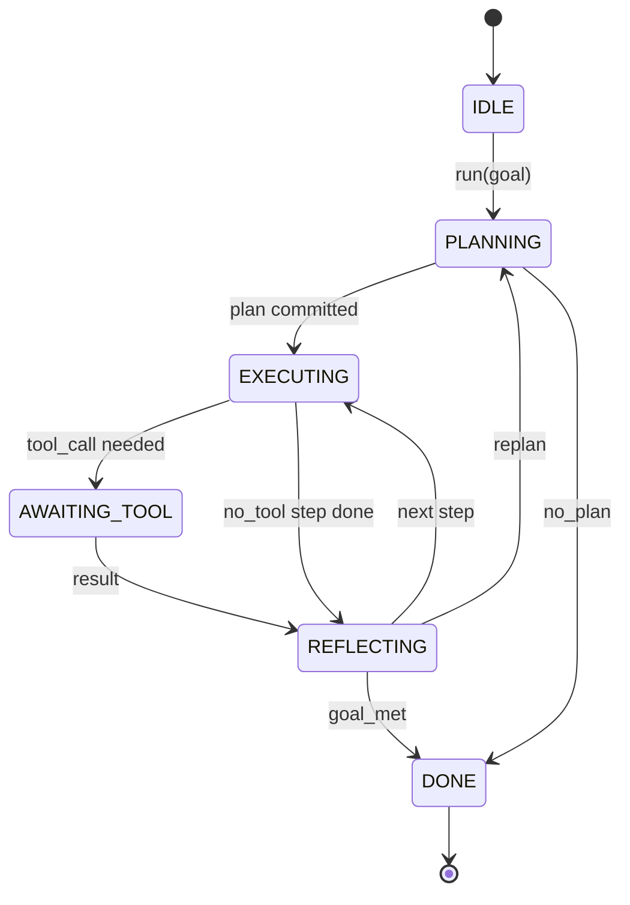

# 智能体测试框架循环契约

> 测试框架就是智能体。模型是协处理器。本课固定循环契约，让你可以把任何模型接进来。

**Type:** Build
**Languages:** Python
**Prerequisites:** Phase 13 lessons 01-07, Phase 14 lesson 01
**Time:** ~90 分钟

## 学习目标
- 将智能体测试框架循环规定为带显式转换的确定性状态机。
- 实现十个生命周期 hook 主题，让操作者能接入策略、遥测和护栏。
- 定义两个 pull point，循环在这些位置把控制权交还给调用方，并在新输入上恢复。
- 执行每会话预算（turns、tool calls、wall-clock），超限时不泄漏部分状态。
- 发出包含十一种事件类型的类型化流，让下游 UI 和 tracer 不必直接检查循环就能订阅。

## 框架视角

一个无人值守运行四十轮的编程智能体，不是聊天循环。它是状态机，操作者可以拦截它的节点，审计它的边。只要契约写清楚，替换模型、工具或策略就不再是重构，而是一次注册调用。

本课构建这个契约。我们命名六个状态、十个 hook 主题、两个 pull point、十一种事件类型和一个预算信封。测试框架中的其他部分（工具注册表、JSON-RPC transport、dispatcher、planner）都会接入这个形状。

## 状态

循环有六个状态。五个是活动状态。一个是终止状态。



`IDLE` 是唯一合法入口。`DONE` 是唯一合法出口。`AWAITING_TOOL` 是唯一会产生 pull point 的状态。其他所有转换都是内部转换。

状态机是确定性的。给定同一份事件日志，测试框架会重新进入同一个状态。这个性质让你可以重放会话来调试，而不需要再次调用模型。

## Hook 主题

Hooks 是操作者接入循环的缝合面。测试框架会触发十个主题。每个主题都接受任意数量的订阅者。订阅者按注册顺序触发。订阅者可以修改 payload、抛出异常来中止本轮，或返回 sentinel 来跳过下一步。

```text
before_plan         after_plan
before_tool_call    after_tool_call
before_step         after_step
on_error
on_pause
on_budget_exceeded
on_complete
```

这个形状呼应了 Claude Code、Cursor 和 OpenCode 在 2025 年中都收敛出的结构。名称是功能性的，不绑定品牌。阻止 `rm -rf` 的 hook 放在 `before_tool_call`。发送 OpenTelemetry span 的 hook 放在 `after_step`。在暂停会话上恢复的 hook 放在 `on_pause`。

## Pull points

循环会两次交出控制权。第一次是在 `AWAITING_TOOL`，也就是没有工具结果就无法继续时。第二次是在 `on_pause`，也就是预算耗尽或某个 hook 明确请求人工审核时。

Pull point 不是异常。它是返回。调用方检查测试框架状态，获取测试框架请求的内容，然后调用 `resume(payload)`。测试框架从停止的位置继续。这和 Python generator 的形状一样。pull point 上的 transport 由你选择。在 TUI 中它是按键。通过 MCP 时它是 `tools/call`。通过队列时它是 job poll。

## 事件流

循环会在契约中的特定位置向类型化流追加事件。这个流只追加，订阅者可以从任意 offset 重放。实现的十一种事件类型是：

- `session.start`，调用 `run(goal)` 时发出一次
- `plan.draft`，planner 返回草案计划时发出
- `plan.commit`，草案被提交为活动计划后发出
- `step.start`，每个执行步骤开始时发出
- `step.end`，每个执行步骤结束时发出
- `tool.call`，需要工具的步骤把控制权交给调用方时发出
- `tool.result`，用工具结果恢复时发出
- `tool.error`，用错误恢复，或 hook 中止调用时发出
- `budget.warn`，达到预算限制时发出
- `session.pause`，循环因暂停（预算或 hook）而让出时发出
- `session.complete`，循环到达 `DONE` 时发出一次

事件不会复制 hook payload。Hooks 是命令式的（修改、中止）。Events 是观察式的（记录、发送）。把它们视为相互独立。

## 预算信封

一个会话携带三个限制。Turn count、tool call count、wall-clock seconds。每一轮会让 turns 加一。每次工具调用会让 tool calls 加一。每次状态转换都会检查 wall-clock。任何限制达到时，循环会触发 `on_budget_exceeded`，发出 `budget.warn`，然后在下一个 pull point 带着 budget-exceeded 原因转换到 `IDLE`。

预算不是 kill switch。它是让出控制权。调用方决定是扩展预算并恢复，还是关闭会话。

## 本课不做什么

它不调用模型。不注册真实工具。不实现 transport。这些是接下来四课的内容。本课钉牢契约，让接下来的四课可以接进来，而不用重写。

`main.py` 中的确定性 planner 是替身。它返回一个硬编码的三步计划，其中两步需要工具结果。重点是循环，不是计划。

## 如何阅读代码

`HarnessLoop` 是主类。它保存状态、触发 hooks、发出 events。`Budget` 跟踪限制。`Event` 是事件流上的类型化信封。`HookRegistry` 是调度表。`_transition` 是唯一会改变状态的函数，所以状态机不变量集中在一个地方。

从头到尾阅读 `main.py`。然后阅读 `code/tests/test_loop.py`。测试固定了每个转换和每个 hook 的触发顺序。

## 继续深入

在生产中构建测试框架，最难的部分不是状态机，而是让契约可执行。契约必须经得住 planner 热重载。必须经得住工具返回畸形 JSON。必须经得住一个 hook 在四十轮会话进行到三分之二时，在 `before_tool_call` 中抛出异常。本课测试覆盖这些失败模式。运行它们。打破它们。补充用例。

下一课会添加工具注册表。再下一课是 JSON-RPC transport。之后是 dispatcher。到第二十四课时，本文件中的循环会在真实工具上执行真实计划，并强制真实预算。
