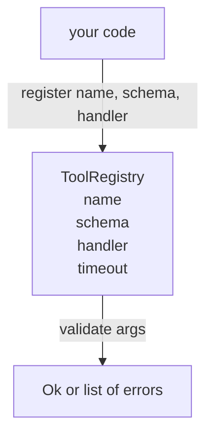

# 带模式验证的工具注册表

> 智能体无法验证的工具，就是智能体无法调用的工具。先构建注册表和模式检查器，再构建工具本身。

**Type:** Build
**Languages:** Python
**Prerequisites:** Phase 13 lessons 01-07, Phase 14 lesson 01
**Time:** ~90 minutes

## 学习目标
- 持有一个带类型的注册表，记录工具名 -> 模式 -> 处理器，让调度器只查询一次，之后就能信任它。
- 实现 JSON Schema 2020-12 的一个子集，覆盖百分之九十工具调用实际会用到的关键字。
- 返回精确的 json-pointer 形状错误路径，让模型能在一次往返内自我修正。
- 在没有显式 override 的情况下拒绝重复注册，因为静默覆盖正是生产工具目录漂移的来源。
- 保持验证器纯净，没有 I/O，没有时间，没有全局状态，这样它才能在 replay log 上重新运行。

## 为什么注册表先于工具

2026 年的编码智能体拥有的已注册工具，已经多到模型无法一次放进单个上下文窗口。一个非平凡的 harness 会注册两百个工具，并在任意回合暴露十到四十个。注册表是这些问题的事实来源：“有哪些工具”，“它们的参数是什么形状”，“我该调用哪个处理器”。一旦这三个答案被固定，harness 的其余部分就可以停止猜测。

我们要避免的错误，是发布没有模式的处理器，或发布没有验证的模式。这两种情况都很常见。它们都会把下一层，也就是第二十三课的 dispatcher，变成猜谜游戏，而唯一的失败模式就是处理器抛出的栈跟踪。

## 工具记录长什么样

```text
ToolRecord
  name        : str          (unique, lowercase alphanumeric and underscore segments separated by dots, e.g., snake_case.segment.case)
  description : str          (one line, shown to the model)
  schema      : dict         (JSON Schema 2020-12 subset)
  handler     : Callable     (async or sync, returns Any)
  idempotent  : bool         (dispatcher uses this for retry decisions)
  timeout_ms  : int          (override per-tool dispatcher default)
```

模式是验证器唯一会触碰的字段。处理器对它是不透明的。我们有意把它们分开。模式是数据，处理器是代码。把它们混在一起，会诱使你把验证逻辑塞进处理器，而这正是我们要阻止的 bug。

## JSON Schema 2020-12 子集

完整的 2020-12 规范像一篇论文。我们只需要八个关键字。

```text
type           string / number / integer / boolean / object / array / null
properties     map of property name -> schema
required       list of property names
enum           list of allowed primitive values
minLength      integer, applies to strings
maxLength      integer, applies to strings
pattern        ECMA-262-compatible regex, applies to strings
items          schema applied to every array element
```

这已经足够覆盖工具 API 实际需要的内容。我们不加入的关键字，oneOf、anyOf、allOf、$ref、conditionals，在生产模式里都合法，但会把验证器变成带环的树遍历器。我们在构建注册表，不是在构建 JSON Schema 引擎。

## Json pointer 错误路径

验证失败时，验证器返回一组错误。每个错误都带有指向输入内部的 json-pointer 路径。pointer 是以斜杠开头的属性名和数组下标序列。

```text
{"a": {"b": [1, 2, "x"]}}
                    ^
                    /a/b/2
```

模型读错误路径，比读句子更好。如果模式要求 `args.user.email`，而模型传入了整数，错误应该是 `/user/email`，并带上 `expected_type: string`。模型能在下一次调用里修正它，不需要再进行一轮自然语言解释。

## 注册与覆盖

`register(name, schema, handler, **opts)` 默认拒绝重复注册。调用方必须传入 `override=True` 才能替换。这是运行层面的卫生习惯。代码库两个部分静默注册同一个工具名，就是那种要在生产里花一周才能找到的 bug。

注册表暴露三个读取方法。`get(name)` 返回记录或抛错。`validate(name, args)` 返回 `Ok` 或错误列表。`names()` 按注册顺序返回工具名。

## 验证器是什么，不是什么

它是一次对模式树的递归遍历。它是纯函数。它不调用处理器。它不强制转换类型，字符串 `"42"` 不会通过 number 模式。它不会静默截断。

它不是安全边界。验证通过之后，恶意处理器仍然可能胡作非为。第二十三课的 dispatcher 会加入 timeout 和 sandbox 层。注册表加入的是形状。

## 形状



## 如何阅读代码

`code/main.py` 定义 `ToolRegistry`、`ToolRecord`、`ValidationError` 和八个验证器函数。验证器根据 `schema["type"]` 分发，或把带有 `enum` 的模式视为无类型枚举检查。每种类型验证器返回空列表或 `ValidationError` 列表。顶层 walker 会拼接错误，并在下降时给路径加上片段。

`code/tests/test_registry.py` 覆盖注册、覆盖、验证成功、带路径的验证失败，以及子集中的每个关键字。

## 继续深入

这课落地后，你会想要的两个扩展是：针对本地 definitions 块的 `$ref` 解析，以及用于严格形状的 `additionalProperties: false`。两者都不大。工具目录超过五十个工具后，两者都很常见。我们把它们留在课程之外，是为了让文件保持在一次阅读以内。

下一课，第二十二课，会构建 JSON-RPC stdio transport，把这个注册表暴露给模型客户端。再下一课，第二十三课，会用带 timeout 和 retry 的 dispatcher 把两者包起来。
