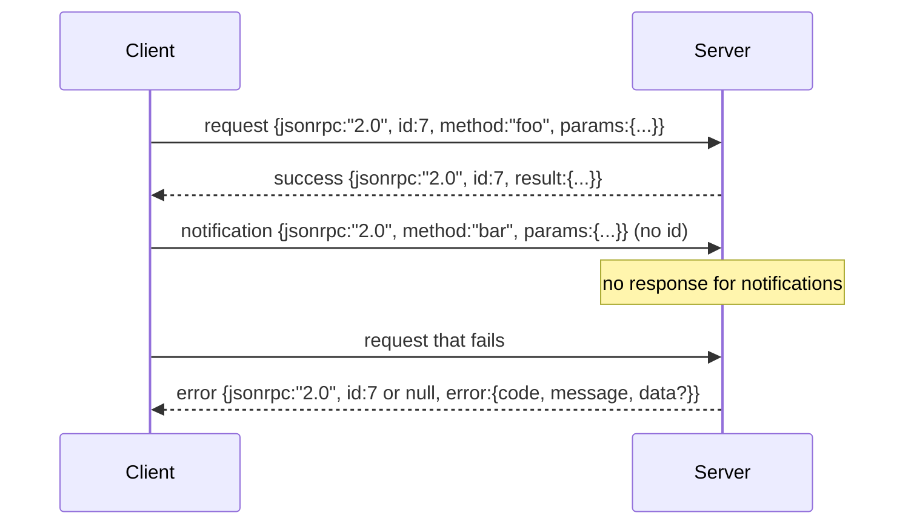

# 基于换行分隔 Stdio 的 JSON-RPC 2.0

> 模型客户端和工具服务器之间的传输层，是跑在 stdio 上的 JSON-RPC。手写一次，你就会明白每个 framing layer 到底在为什么付出成本。

**Type:** Build
**Languages:** Python
**Prerequisites:** Phase 13 lessons 01-07, Phase 14 lesson 01
**Time:** ~90 minutes

## 学习目标
- 使用以换行分隔的 JSON，在 stdin 和 stdout 之上表达 JSON-RPC 2.0。
- 映射五个标准错误码，-32700、-32600、-32601、-32602、-32603，并用正确语义暴露它们。
- 区分 request、response、notification 和 batch，不发明新的 envelope key。
- 每行单独处理一个 parse error，不污染流中的其余内容。
- 使用 io.BytesIO 构建一个会自行结束的 demo，让课程无需生成子进程也能运行。

## 为什么 JSON-RPC 仍然是通用语

2026 年，一个编码智能体在单个会话里可能要和十二个工具服务器对话。每个服务器都是一个独立进程或远程端点。线上的格式从 2013 年以来基本没变。JSON-RPC 2.0 是两页规范。它能活下来，是因为替代方案，gRPC、每次调用一个 HTTP 请求、自定义二进制协议，都强加了 JSON-RPC 没有的取舍：它们会在 streaming、batching 或 transport coupling 中选边。JSON-RPC 在 stdio、socket、websocket 和 HTTP 上是对称的，只要双方遵守规范，客户端就能驱动一个它从未见过的服务器。

本课构建 stdio 变体。换行分隔 JSON。每个 request 是一行。每个 response 是一行。传输边界是 `\n`。

## 线上的形状

一共有四种 envelope 形状。两种由客户端发出，两种由服务器发出。



notification 没有 `id`。服务器绝不能响应它。如果服务器给 notification 返回 response，客户端就没有办法把它关联到某个调用点。这一条规则让 framing 的计算保持简单。

batch 是由 request 或 notification 组成的 JSON 数组。服务器返回 response 数组，顺序可以任意，对每个非 notification 条目返回一个 response。如果 batch 中每个条目都是 notification，服务器不发送任何内容。

## 五个错误码

```text
-32700  Parse error      JSON could not be parsed
-32600  Invalid Request  Envelope shape is wrong
-32601  Method not found
-32602  Invalid params
-32603  Internal error
```

-32000 到 -32099 之间的代码为服务器定义错误保留。其他都是应用定义错误。本课只使用这五个。如果你的处理器抛错，transport 会把它包装成 -32603，并在 `data.exception` 中放入异常类名。

parse error 有一条特殊规则。response 中的 `id` 是 `null`，因为请求甚至没有被解析到足以提取 id 的程度。

## 换行 framing 与 BytesIO demo

transport 一次读取一行。一行是到并包含 `\n` 为止的字节。如果某行无法解析，transport 会写出一个 `id: null` 的 -32700 response，然后继续。流不会被污染。下一行会重新解析。

在本课中，我们把一对 `io.BytesIO` 包装成 stdin 和 stdout。服务器读取请求直到 EOF，为每个请求写 response，然后返回。客户端再读回 response。不生成进程。没有 timeout。传输行为和真实子进程 pipe 完全一致，因为 Python 的 `io` 接口提供了同样的 `.readline()` 和 `.write()` 契约。

## 方法分发

transport 不知道有哪些 method。它把请求交给 harness 提供的 callable：`handler(method, params)`。处理器返回 result 或抛错。三个异常类会暴露特定代码。

```text
MethodNotFound -> -32601
InvalidParams  -> -32602
Anything else  -> -32603 with exception name in data
```

transport 永远看不到工具注册表。注册表位于 handler 之后。这正是我们想要的分层。transport 说 JSON-RPC。registry 说工具形状。dispatcher，第二十三课，会把它们缝在一起。

## 错误时的流行为

```text
client writes              server reads             server writes
---------------            -----------              -------------
{...valid request...}      parses ok                {...response, id matches...}
{...broken json...         parse fails              {id:null, error: -32700}
{...valid request...}      parses ok                {...response, id matches...}
{...missing method...}     invalid envelope         {id:X, error: -32600}
```

坏掉的 JSON 行不会停止循环。缺失 `method` 字段不会停止循环。处理器异常也不会停止循环。transport 会一直读到 EOF。

## Notifications 与非对称流

notification 是 fire-and-forget。harness 用 notification 表达进度事件、取消信号和日志行。notification 让长时间运行的工具可以流式发送状态更新，而不必每条状态都做一次往返。

本课实现一个出站 notification helper，`write_notification`。服务器用它在 request 进行期间发出进度。demo 展示了这个模式：一个 request 进来，handler 发出两个 progress notification，然后写入最终 response。

## 如何阅读代码

`code/main.py` 定义 `StdioTransport`、parse helper `parse_request`、三个 write helper `write_response`、`write_error`、`write_notification`，以及 dispatch loop `serve`。错误码常量位于模块作用域。

`code/tests/test_transport.py` 覆盖五个错误码、notification 不写 response、batch 数组输入和数组输出并跳过 notification、坏 JSON 触发 parse error 后继续，以及 handler 在调用中途写 notification 的非对称流。

## 继续深入

这个 transport 已经足够后续课程使用。生产 transport 会加入三件事。一个能跨转发保留的 correlation id 字段，你的 `id` 已经承担了这个职责，但在 mesh 中你还需要一个外层 trace id。一个取消通道，比如带有 in-flight call id 的 `$/cancelRequest` notification。以及 content-type negotiation handshake，让同一个 socket 可以同时说 JSON-RPC 和 Streamable HTTP。这些都不改变 wire。它们只是加入 metadata。
