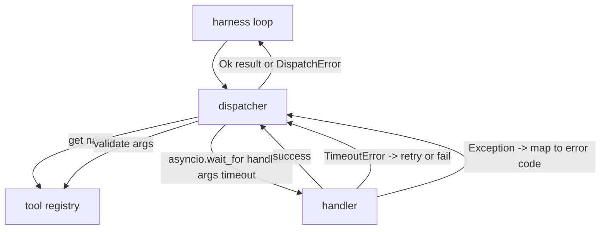
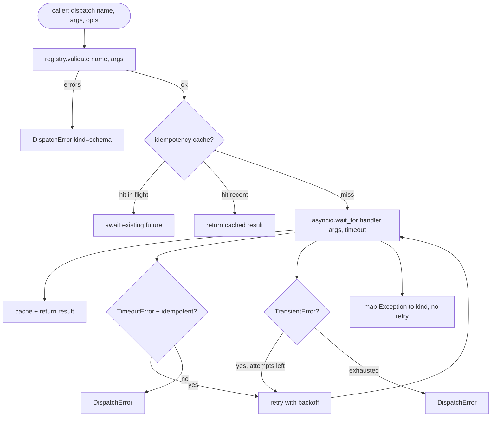

# 函数调用调度器

> dispatcher 是 harness 为模式承诺付账的地方。Timeout、retry、dedupe、error mapping。全都落在同一个接缝上。

**Type:** Build
**Languages:** Python
**Prerequisites:** Phase 13 lessons 01-07, Phase 14 lesson 01
**Time:** ~90 minutes

## 学习目标
- 用逐调用 timeout 包装工具处理器，返回带类型的错误，而不是让 loop 卡住。
- 应用带 jitter 的指数退避 retry，并设置最大 attempt 次数。
- 基于 idempotency key 对 retry 去重，避免和缓慢原始调用竞态的 retry 被执行两次。
- 把处理器异常和 transport fault 映射到 harness loop 已经理解的单一错误 envelope。
- 用 concurrency limit 限制并行 dispatch，避免四十个工具调用的 fan-out 耗尽 event loop。

## dispatcher 位于哪里

它位于 harness loop，第二十课，和工具注册表，第二十一课，之间。transport，第二十二课，向 loop 输入。loop 把工具调用交给 dispatcher。dispatcher 调用 registry，运行 handler，然后返回 result 或 JSON-RPC 形状的 error envelope。



dispatcher 是唯一知道 timer、retry 和 idempotency 的层。loop 不知道。registry 不知道。handler 也不知道。这种隔离就是重点。

## Timeouts

每个工具都有默认 timeout。registry record 携带 `timeout_ms`。当 harness 传入逐调用 override 时，dispatcher 会覆盖它。我们使用 `asyncio.wait_for`。timeout 时，handler task 会被取消，dispatcher 返回 `DispatchError(kind="timeout")`。

对非幂等工具来说，timeout 默认不是可 retry 错误。一个 `db.write` 超时了，它可能已经提交，也可能没有。retry 会复制这次写入。dispatcher 遵守 registry record 里的 `idempotent` 标记。幂等工具会 retry。非幂等工具不会。

## 带指数退避的 retry

retry 策略最多三次 attempt。退避是带 jitter 的指数退避。

```text
attempt 1  -> delay 0
attempt 2  -> delay 0.1s * (1 + random[0..0.5])
attempt 3  -> delay 0.4s * (1 + random[0..0.5])
```

只有 `timeout` 和 `transient` 错误会 retry。`schema` 错误、`not_found` 或 `internal` 错误不会 retry。模式错误是确定性的。retry 不会改变结果，只会消耗预算。

retry loop 会遵守 harness 的预算。如果调用方预算里剩余工具调用次数为零，dispatcher 会在第一次 attempt 前快速失败，并返回 `kind="budget_exceeded"`。

## Idempotency key 去重

retry 在原始调用仍在进行时发出，是一个真实的生产 bug。第一次调用在四点九秒处挂住，刚好低于 timeout。retry 在五秒发出。现在两个 request 会竞态访问同一个后端。如果工具是 `payments.charge`，你就扣了两次款。

dispatcher 接受一个可选的 `idempotency_key`。如果调用到达时同一个 key 已经 in flight，dispatcher 会等待 in-flight future，并返回它的结果。cache 会在完成后保留 key 六十秒，以吸收迟到的 retry。

key 是调用方的责任。harness 从 planner 推导它：`f"{step_id}:{tool_name}:{hash(args)}"`。dispatcher 不发明 key，因为只从参数推导 key，会让两个语义不同的调用看起来一样。

## 错误 envelope

dispatch 失败返回单一形状。

```text
DispatchError
  kind        : "timeout" | "transient" | "schema" | "not_found" | "internal" | "budget_exceeded"
  message     : str
  attempts    : int
  jsonrpc_code: int   (one of -32601, -32602, -32603)
```

harness loop 把 `kind` 映射到下一个状态。`schema` 和 `not_found` 进入 `on_error` 并触发 replan。`timeout` 和 `transient` 进入 `on_error`，是否 replan 取决于 attempts。`budget_exceeded` 触发 `on_budget_exceeded`。

## Fan-out 上的 concurrency limit

`gather(*calls)` 会同时运行所有 coroutine。四十个工具调用意味着四十个打开的 socket，或四十条子进程 pipe。大多数后端都不喜欢来自单个客户端的四十个并行连接。

dispatcher 用 semaphore 包装 `gather`。默认 concurrency limit 是八。每个调用在 dispatch 前获取 semaphore，完成后释放。调用方看到的是 `gather` 形状的输出，但实际调度是有界的。

## 单次调用的流程



## 如何阅读代码

`code/main.py` 定义 `Dispatcher`、`DispatchError` 和 `TransientError`。dispatcher 在构造时接收 registry。异步 `dispatch(name, args, ...)` 是唯一入口。逐 attempt timeout 会在 `_run_with_retries` 内联使用 `asyncio.wait_for` 应用。`gather_bounded(calls)` 用 concurrency limit 运行多个 dispatch。

`code/tests/test_dispatcher.py` 覆盖 timeout 触发、transient 上 retry、schema error 不 retry、idempotency dedupe，两个并发同 key 调用折叠成一次 handler 调用，以及 concurrency limiting，也就是 semaphore 生效。

测试使用 `asyncio.sleep(0)` 和基于确定性 `Counter` 的 handler，所以会在毫秒级完成，不依赖墙钟时间。

## 继续深入

生产 dispatcher 会加入两个扩展。第一，在每个 transition 上做结构化日志，loop 的事件流已经给你这些，但 dispatcher 也应该发出 `dispatch.attempt` 和 `dispatch.retry` 事件。第二，circuit breaker：在一个窗口里出现 N 次失败后，工具进入 cool-down 期，在此期间 dispatch 会立即返回 `kind="circuit_open"`，而不是尝试 handler。两者都能叠在这个 dispatcher 之上，不改变契约。

第二十四课会把 dispatcher 接到 plan-and-execute 智能体上，让你看到四个部件一起运转。
