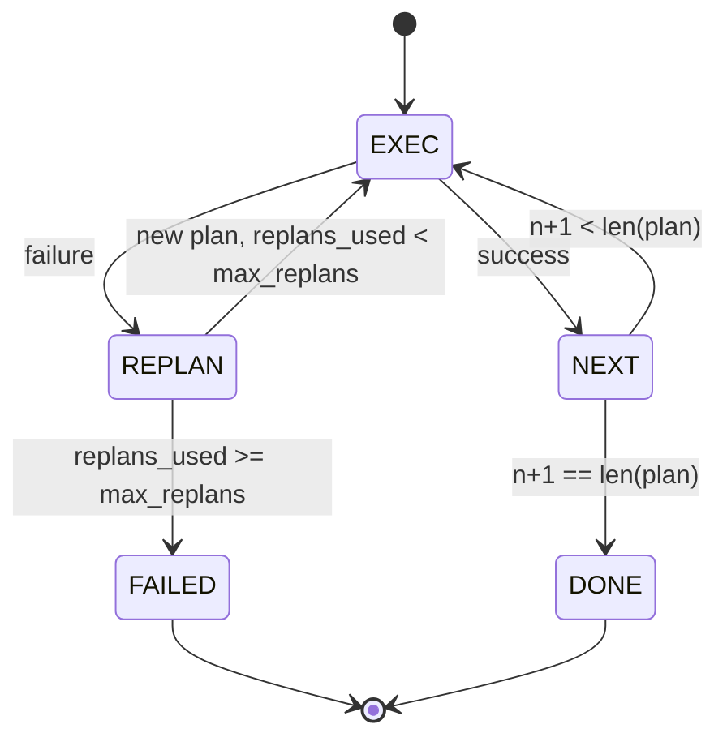

# Plan-Execute 控制流

> 无法从失败中恢复的 plan 只是脚本。能 replan 的脚本才是智能体。先构建 replanner。

**Type:** Build
**Languages:** Python
**Prerequisites:** Phase 13 lessons 01-07, Phase 14 lesson 01
**Time:** ~90 minutes

## 学习目标
- 把 plan 表示为有序的带类型 step 列表，让 executor 能推理进度和结果。
- 顺序执行 step，并在失败时把控制权有边界地交回 planner。
- 从当前 cursor 重新规划，把之前的 error 放进上下文，让下一份 plan 能吸收信息。
- 每次 revision 都发出 plan diff，让下游 tracer 或 UI 能展示 plan 为什么改变。
- 强制执行两个预算：硬 step 上限和硬 replan 上限。

## Plan and execute，不是 chain-of-thought

chain-of-thought 智能体发出 token，让 loop 猜工具调用在哪里结束。plan-and-execute 智能体先发出结构化 plan，然后确定性地执行每个 step。plan 是 harness 可以 introspect 的数据。execution 是 harness 把这些数据跑过 dispatcher。

两块内容。planner 产出 plan。executor 运行 plan。真正有趣的是 executor 遇到失败后发生什么。三个选项：

```text
1. Abort         (return failed, surface the error)
2. Skip          (mark step failed, continue with the rest)
3. Replan        (hand the error to the planner, get a new plan from the cursor)
```

Replan 才是把脚本变成智能体的东西。

## Step 形状

```text
Step
  id              : int           (monotonic within a plan revision)
  tool_name       : str
  args            : dict
  expected_outcome: str           (planner's stated success condition)
  result          : Any | None
  error           : str | None
```

`expected_outcome` 是 planner 随 step 发出的一句短句。executor 不强制检查它。它有两个用途：replanner 在修订 plan 时会读取它；事件流会发出它，这样 tracer 可以显示“这个 step 原本应该做 X”。

## planner 形状

```python
def planner(goal: str, history: list[Step], last_error: str | None) -> list[Step]:
    ...
```

一个纯函数。`goal` 是用户目标。`history` 是已经执行过的 step，填好了 result 和 error。`last_error` 第一次调用时是 None，后续每次调用时是最近一次失败消息。planner 返回从 cursor 开始的下一份 plan。

planner 不知道 executor。它不知道 retry。它不知道 timeout。它产出 plan。仅此而已。

## executor

executor 是一个小状态机。每个 step 都通过 dispatcher 运行。结果是三种之一：success、failure-replannable、failure-fatal。可 replan 失败会交回 planner。致命失败，预算耗尽或到达 replan 上限，会返回 `FAILED` session result。



## revision 上的 plan diff

当 planner 在失败后返回新 plan 时，executor 会发出一个 `plan.diff` 事件，包含三个字段。

```text
removed: list of step ids that were in the old plan and are not in the new
added  : list of step ids in the new plan that were not in the old
revised: list of step ids whose tool_name or args changed
```

tracer 或 UI 可以把 removed step 渲染成删除线，把 added step 高亮。重点不是 diff 格式。重点是 revision 是一个可见事件，而不是静默重写。

## 两个预算，都是硬限制

`max_steps` 限制整个 session 的总 step 执行次数，包括 replan 之后的执行。默认是十二。一个线性的五步 plan，如果 replan 两次，并且每次增加三个 step，就会达到十六次执行，超过预算。executor 会拒绝这次 replan，并返回 FAILED。

`max_replans` 限制第一次 plan 之后 planner 被调用的次数。默认是五。这是更重要的限制。一个 planner 如果连续五次返回同一份坏 plan，否则会一直循环到 step 预算拦住它。限制 replan 会让失败更快，原因也更清楚。

## 本课中的确定性 planner

本课不调用模型。本课提供一个确定性 planner，它根据 `last_error` 选择 plan。

```text
last_error is None    -> emit a four-step plan
last_error matches X  -> emit a three-step plan that routes around X
last_error matches Y  -> emit a two-step plan that gives up gracefully
otherwise             -> return [] (signals nothing to replan)
```

这足以测试 executor 在每条 transition 路径上的行为：success、replan-once、replan-twice、replan-exhaustion 和 step-budget exhaustion。

## Result 形状

```text
SessionResult
  status      : "completed" | "failed"
  reason      : str     ("goal_met" | "step_budget" | "replan_budget" | "no_plan")
  history     : list[Step]
  revisions   : list[PlanDiff]
  events      : list[Event]
```

第二十课的 harness loop 可以直接读取它。第二十三课的 dispatcher 负责执行每个 step。第二十一课的 registry 负责验证每个 step 的 args。第二十二课的 transport 会通过 JSON-RPC 把整条 flow 暴露给模型客户端。

## 如何阅读代码

`code/main.py` 定义 `PlanExecuteAgent`、`Step`、`PlanDiff`、`SessionResult` 和确定性 planner。executor 是一个 `run(goal)` 方法，返回 `SessionResult`。plan diff 通过比较 step id 和 `(tool_name, args)` tuple 计算。

`code/tests/test_agent.py` 覆盖线性 success、中途失败并 replan 一次、replan exhaustion 返回 `failed:replan_budget`、step-budget exhaustion，以及 plan-diff 事件格式。

## 继续深入

一旦你把它接到真实模型上，会想要两个扩展。第一，partial-plan caching：当一个六步 plan 的前三步成功，第四步失败，你不想重新运行前三步。executor 已经保留 history，planner 只需要读取它。第二，并行分支：当前 executor 严格顺序执行。一个发出独立分支的 planner，使用 `gather_step` 而不是 `next_step`，就可以通过 dispatcher 并发运行两个工具调用。

两者都会增加真实复杂度。在线性 executor 固定后，两者都更容易加入。这正是本课要做的事。
