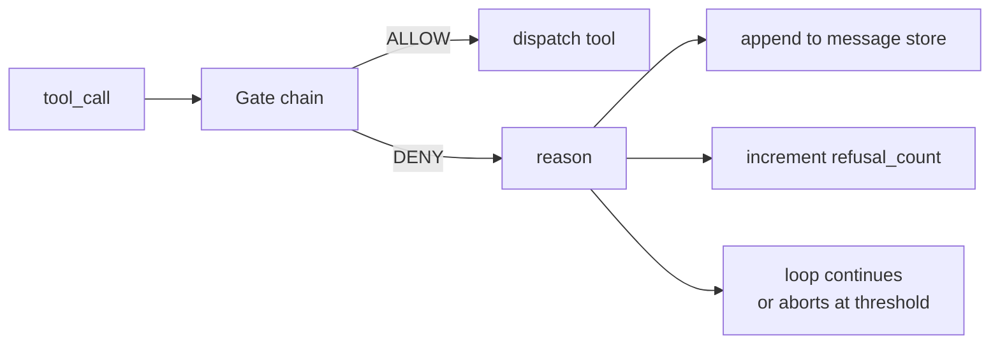
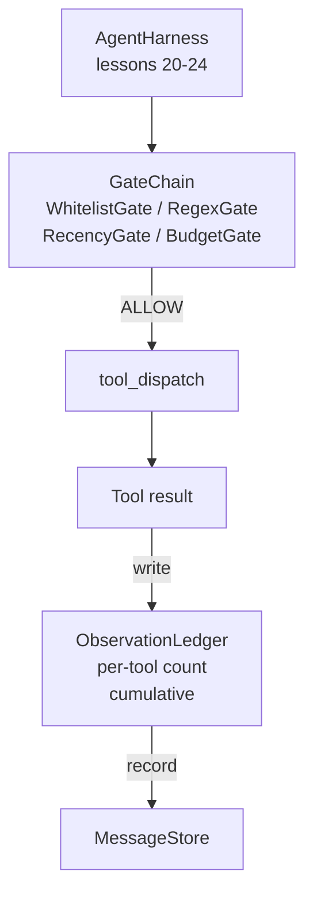

# 综合实战第 25 课：验证关卡与观察预算

> 没有验证层的 agent harness，就是披着风衣的愿望。本课构建一条确定性 gate chain，用来决定一次工具调用是否允许发出，智能体能看到多少工具输出，以及当智能体已经读得太多时 loop 何时必须停止。这条链由小型命名 gate 和 observation ledger 组成，ledger 会跟踪模型看到过的每一个 token。

**Type:** Build
**Languages:** Python (stdlib)
**Prerequisites:** Phase 19 · 20-24 (Track A1: agent loop, tool registry, message store, prompt builder, model router), Phase 14 · 33 (instructions as constraints), Phase 14 · 36 (scope contracts), Phase 14 · 38 (verification gates)
**Time:** ~90 minutes

## 学习目标

- 构建带有确定性 `evaluate(call)` 方法的 `VerificationGate` protocol。
- 把 budget、recency、whitelist 和 regex gate 组合成带短路语义的 chain。
- 通过按 tool 和 turn 索引的 `ObservationLedger` 跟踪每条 observation。
- 当累计 observation budget 将被超过时，拒绝工具调用。
- 暴露结构化 `GateDecision` record，让下游 observability 可以采集。

## 问题

当 agent harness 让模型自由调用工具时，真实使用的第一个小时内就会出现三类 bug。

第一类是无边界 observation。对一个 20 万行 repo 做 grep，会把 50 万 token 的输出灌进下一轮。模型每千字节只看到一个匹配，其余上下文都被浪费。token 账单很大，而智能体现在对任务的表现更差，不是更好。

第二类是过期 recency。一个长任务积累了五十次工具调用。模型把第三轮的第一个 read_file 重新当作实时状态读取。第四十七轮做出的编辑永远不会出现，因为 prompt builder 先序列化了最早的 observations。

第三类是权限蔓延。一个研究任务从调用 `web_search` 开始，然后不知为何跑起了 `shell`，因为模型编造了一个工具名，而 harness 默认放行。等有人读 trace 时，/tmp 里已经有一个垃圾文件，并且 curl 已经打到一个私有 API。

verification gate 是 harness 中负责说不的组件。它不是模型。它不是 judge。它是 `(call, history, ledger)` 的确定性函数，返回 ALLOW 或 DENY，并带上原因。原因会被记录。模型会被告知。loop 继续或中止。

## 概念



gate 是任何带有 `evaluate(call, ctx) -> GateDecision` 方法的东西。chain 是一个有序列表。评估会在第一次 deny 时短路。顺序很重要：便宜的结构 gate 先于昂贵的 token-counting gate 运行。

本课提供四个 gate：

- `WhitelistGate`。允许的工具名是一个显式集合。集合外的任何工具都会被拒绝。这是最便宜的 gate，最先运行。
- `RegexGate`。工具参数会与 regex 匹配。适合拒绝带有 `rm -rf` 的 shell 调用，或打到内网 IP 的 HTTP 调用。它只依赖 call payload。
- `RecencyGate`。模型只能看到最近 N 轮的 observations。更旧的 observations 会被 mask。该 gate 会拒绝结果将扩展一个已经过期的 observation window 的工具调用。
- `BudgetGate`。模型在整个 session 中读取的累计 token 有一个上限。当 ledger 表明上限已达到时，之后所有工具调用都会被拒绝。

observation ledger 是记账系统。每次成功工具调用写入一行：工具名、turn、发出的 token 数、累计数。ledger 回答两个问题：模型总共看过多少，以及模型看过 tool X 的多少。budget gate 读取前者。你会作为练习编写的 per-tool budget gate 读取后者。

## 架构



harness 询问 chain。chain 点头或拒绝。如果点头，工具运行，ledger 计数，结果追加到 message store。如果拒绝，模型会收到作为 system message 的拒绝信息，loop 决定重试还是中止。

## 你将构建什么

实现是一个 `main.py` 加测试。

1. `Observation` 和 `ToolCall` dataclasses 定义线上形状。
2. `ObservationLedger` 记录 `(turn, tool, tokens)` 行，并回答 `cumulative()` 和 `per_tool(name)`。
3. `GateDecision` 携带 `(allow, reason, gate_name)`。
4. `VerificationGate` 是 protocol。每个 gate 实现 `evaluate(call, ctx)`。
5. `GateChain` 包装一个有序列表。它调用每个 gate，返回第一个 deny，或在所有 gate 都通过时返回 allow。
6. demo 运行一个很小的合成 agent loop。三轮。第三轮触发 budget gate，loop 报告一个干净拒绝，并带有非零 refusal count。

token counter 故意使用很笨的 `len(text) // 4` 启发式。本课重点是 gate plumbing，不是 tokenizer。生产中替换为真实 tokenizer。

## 为什么 chain 顺序重要

deny 比 allow 便宜。`WhitelistGate` 是 O(1) hash lookup。`RegexGate` 是 O(pattern * argv)。`RecencyGate` 读取 message store 的一个小切片。`BudgetGate` 读取整个 ledger。你按成本升序排列它们，这样被拒绝的调用会在昂贵工作开始前短路。

你也按爆炸半径排列它们。whitelist 是最强断言：这个工具不在契约里。regex gate 下一位：这个参数不在契约里。recency 再之后：harness 仍然关心，但调用在结构上合法。budget 最后，因为按定义，它只会在其他所有检查通过后触发。

## 它如何与 Track A 其余部分组合

前几课给了你 loop、tool registry、message store、prompt builder 和 model router。本课加入模型与工具之间的层。第 26 课提供 sandbox，dispatcher 会在 gate chain 返回 ALLOW 后把工具调用交给它。第 27 课提供 eval harness，把 refusal count 记录为质量信号。第 28 课把 gate decision 接入 OpenTelemetry spans。第 29 课把全部内容缝成一个可工作的编码智能体。

## 运行

```bash
cd phases/19-capstone-projects-综合实战项目/25-verification-gates-observation-budget-验证关卡observation预算
python3 code/main.py
python3 -m pytest code/tests/ -v
```

demo 会打印逐轮 trace，其中包括每个 gate decision，并以零退出。测试覆盖 ledger、每个 gate 的隔离行为、chain short-circuit，以及合成 loop 的端到端行为。
