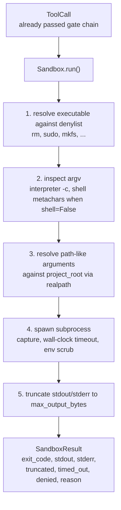
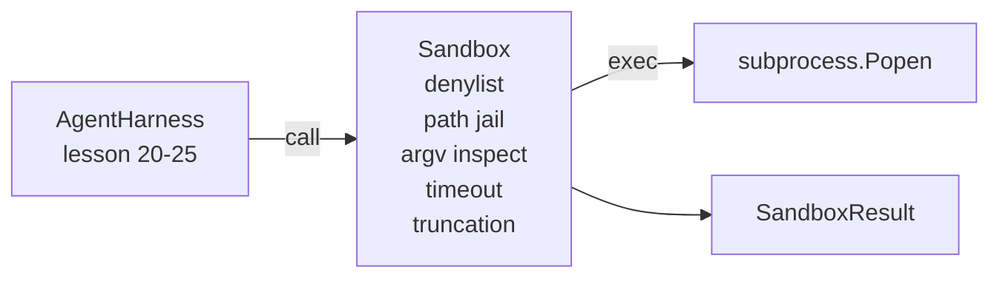

# 综合实战第 26 课：带 Denylist 和 Path Jail 的 Sandbox Runner

> verification gate 决定一次工具调用是否应该运行。sandbox 决定它运行时会发生什么。本课提供一个 subprocess runner，它拒绝危险 executable，拒绝危险 argv 形状，把每个文件路径限制在项目 root 内，截断过大的输出，并在 wall-clock timeout 时杀死失控进程。它是模型和操作系统之间两层防护中的第二层。

**Type:** Build
**Languages:** Python (stdlib)
**Prerequisites:** Phase 19 · 25 (verification gates and observation budget), Phase 14 · 33 (instructions as constraints), Phase 14 · 38 (verification gates)
**Time:** ~90 minutes

## 学习目标

- 构建一个包装 `subprocess.run` 的 `Sandbox` class，带 timeout、capture 和 truncation。
- 按名称对照 denylist，按结构对照 argv inspector，拒绝命令。
- 拒绝任何解析后位于声明项目 root 之外的路径参数。
- 在 shell mode 关闭时拒绝 shell metacharacters。
- 返回结构化 `SandboxResult`，供下游 observability 和 eval harness 采集。

## 问题

一个可以 shell out 的编码智能体，能在单轮内安装后门、外泄密钥、毁掉开发者笔记本电脑，并堆出一笔云账单。成本最低的防御是不给它 shell。成本第二低的防御，是一个会对精确模式列表说不的 sandbox。

agent traces 中反复出现三类失败。

第一类是危险 executable。一个急于修路径问题的模型会尝试 `sudo`、`chmod -R 777`、`rm -rf`、`mkfs`、`dd`。这些都不属于 agent run。denylist 会按名称和别名捕获它们。

第二类是 argv 花招。被告知不能使用 shell 的模型，会通过解释器管道化一次攻击：`python3 -c "import os; os.system('rm -rf /')"`、`bash -c '...'`、`node -e '...'`、`perl -e '...'`。sandbox 需要知道，任何带有 `-c` 类 flag 的解释器运行，都只是多绕了一步的 shell 调用。

第三类是路径逃逸。模型被要求读取 `./src/main.py`，却读取 `../../etc/passwd`。sandbox 通过 `os.path.realpath` 解析每个路径参数，并断言前缀，从而把路径限制在 jail 内。

sandbox 不是操作系统意义上的安全边界。拥有代码执行能力的坚定攻击者仍可能逃逸。sandbox 是开发时 guardrail：它让常见失败模式变得响亮，并阻止智能体因为纯粹笨拙而造成破坏。

## 概念



sandbox 有四个拒绝轴：name、argv、path、structure。每个轴都是 call 的纯函数，此时还没有 subprocess。只有所有轴都通过后，才会生成 subprocess。

`SandboxResult` 的 exit code 使用约定俗成的值：0 表示成功，非零表示失败，再加上三个 sentinel code：denied 是 -100，timed_out 是 -101，truncated 使用真实 exit code 并设置 flag。下游课程读取这个结构化 result，而不是解析 stderr。

## 架构



denylist 是 executable basename 的 frozenset。别名，`/bin/rm`、`/usr/bin/rm`，最终都会解析成同一个 basename。argv inspector 知道解释器形状：任何 argv，如果 argv[0] 是解释器，且后续任一 arg 以 `-c` 或 `-e` 开头，就会被拒绝。当调用没有显式请求 shell 时，shell metacharacters，`;`、`|`、`&`、`>`、`<`、backticks、`$()`，会导致拒绝。

path jail 是最微妙的部分。sandbox 在构造时接受一个 `project_root`。任何看起来像路径的参数，包含 `/` 或匹配一个现有文件，都会通过 `os.path.realpath` 规范化，然后与项目 root 的 realpath 比较。如果解析后的目标不在 root 下，就拒绝。symlink 逃逸尝试，项目 root 中指向外部的 symlink，会因为检查 realpath 而不是字面路径被拦住。

## 你将构建什么

实现是 `main.py` 加 tests 目录。

1. `SandboxResult` dataclass：exit_code、stdout、stderr、truncated、timed_out、denied、reason、duration_ms。
2. `SandboxConfig` dataclass：project_root、max_output_bytes、timeout_seconds、denylist、interpreter_block。
3. `Sandbox` class：`run(argv, *, shell=False, cwd=None)` 返回 `SandboxResult`。
4. 内部拒绝 helpers：`_check_executable_denylist`、`_check_argv_interpreter`、`_check_shell_metachars`、`_check_path_jail`。
5. 输出截断，带明确的 `truncated` flag，并在捕获流中加入 marker line。
6. 底部 demo：一组合法和对抗性调用。每个调用都会显示其 result。

sandbox 默认使用 `shell=False` 和 `capture_output=True` 调用 `subprocess.run`。wall-clock timeout 使用 `timeout` 参数；遇到 `TimeoutExpired` 时，sandbox 会杀死 process group，并合成一个 SandboxResult。

## 为什么这不是真正的 sandbox

课程 sandbox 不使用 namespaces、cgroups、seccomp、gVisor、Firecracker 或任何 kernel-level isolation。subprocess 能做的事，sandbox 也能做。保护是结构性的：智能体最常见的危险调用会被拒绝，响亮的拒绝会进入 observability，而不是静默运行。

生产智能体会在上面再叠层：运行在无特权 Docker 容器内，运行在 microVM 内，drop capabilities，把项目 root 挂载为 read-only，把 scratch dir 挂载为 read-write，对内存和 CPU 设置 ulimit，把环境清理成已知安全的 whitelist。第 29 课会做其中一些。操作系统级隔离不在本课范围内。

## 运行

```bash
cd phases/19-capstone-projects-综合实战项目/26-sandbox-runner-denylist-沙箱运行器denylist
python3 code/main.py
python3 -m pytest code/tests/ -v
```

demo 会创建一个临时目录，放入一个干净文件，然后运行一组调用。合法调用成功。被拒绝的调用返回 `denied=True` 并带原因的 SandboxResult。timeout 返回 `timed_out=True`。截断设置 `truncated=True`。demo 打印 outcomes 的 JSON table，并以零退出。

## 它如何与 Track A 其余部分组合

第 25 课产出了 gate chain。第 26 课是 gate ALLOW 后运行的 executor。第 27 课的 eval harness 会把 sandbox results 与每个 task 的预期 exit-code 对比。第 28 课会围绕每次 `Sandbox.run` 调用发出 `gen_ai.tool.execution` span。第 29 课的端到端 demo 会把一个真实编码智能体接过这两层。
