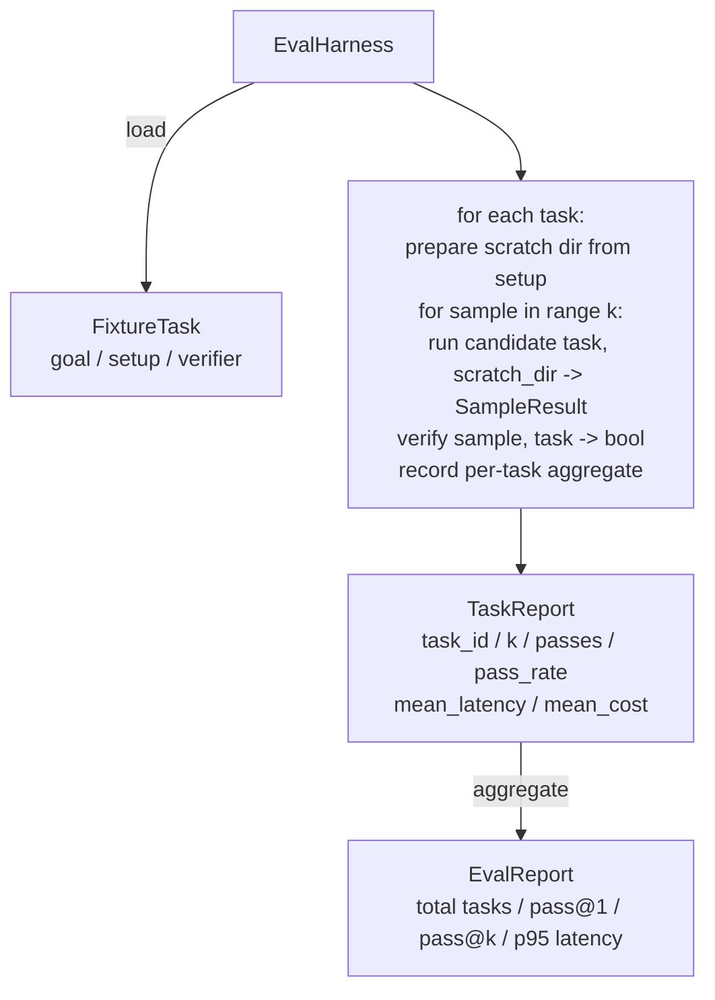

# 综合实战第 27 课：带 Fixture Tasks 的 Eval Harness

> 编码智能体的水平取决于你用来衡量它的任务套件。本课构建一个 evaluation harness，它接收一个 fixture tasks 文件夹，让每个任务通过候选智能体运行，用确定性 verifier 评分通过或失败，并把结果聚合为 pass@1、pass@k、mean latency 和 mean cost。harness 是事实来源，让你区分 regression 和 refactor。

**Type:** Build
**Languages:** Python (stdlib)
**Prerequisites:** Phase 19 · 25 (verification gates), Phase 19 · 26 (sandbox runner), Phase 14 · 30 (eval-driven agent development), Phase 14 · 19 (SWE-bench and GAIA benchmarks)
**Time:** ~90 minutes

## 学习目标

- 把 fixture task 定义为 goal、setup 和 verifier 的三元组。
- 对每个 task 的多个 sample run 打分，并计算 pass@1 和 pass@k。
- 把 latency 和 cost 聚合成 mean 与 95th-percentile metrics。
- 把确定性 verifier，file diff、exit code、regex match，接入可复用函数。
- 发出结构化 JSON report，供 regression-tracking script 采集。

## 问题

没有 eval harness 的 agent benchmark 会被三种失败模式困扰。

第一种是未经验证的 pass。智能体说它修好了 bug，人类扫一眼 diff，suite 被标绿。三周后 regression test 暴露同一个 bug。智能体只是推理得像真的，并没有实际修复。

第二种是未发现的 regression。prompt template 的一次改动，让智能体在显眼任务上好 4%，在安静任务上差 14%。没有 goldset 和 per-task score，regression 会进入 main，直到客户抱怨才暴露。

第三种是 per-task drift。eval 周一用 100 个任务运行，周五只用 95 个，因为有人重命名了五个 fixtures。pass rate 看起来提高了 5%。其实没有。

harness 是把这些失败变成事实的程序。它每次都以可复现顺序运行每个 fixture，并用返回 true 或 false 的确定性检查 verifier 评分。

## 概念

```mermaid
flowchart LR
  F1[fixtures/task_001/<br/>task.json + expected/] --> Harness
  F2[fixtures/task_002/<br/>...] --> Harness
  Harness[Harness<br/>for each task:<br/>setup / run agent k samples /<br/>verify each sample /<br/>record latency, cost]
  Harness --> Report[EvalReport<br/>pass@1 / pass@k<br/>mean ms / p95 ms<br/>mean cost]
```

`FixtureTask` 是一个小 JSON 文件，加一个可选的 `expected/` 目录。JSON 声明 `id`、`goal`，也就是喂给智能体的 prompt，`setup` block，也就是要放进 scratch dir 的文件，以及 `verifier` block。verifier block 指定 harness 的 verifier registry 中的一个函数，并提供其参数。

三种 verifier 形状覆盖大多数有用任务。

第一种是 `file_equals`。智能体运行后，把指定文件与 expected content 对比。这能捕获“用这种确切方式修复 bug”的任务。

第二种是 `regex_match`。对指定文件的内容匹配 regex。这能捕获“函数必须存在并返回 X”这类有多种可接受解法的任务。

第三种是 `shell_exit_zero`。harness 通过第 26 课的 sandbox 运行 shell command，只有命令以零退出才判定 task 通过。这能捕获“测试必须通过”的任务。

harness 对每个 task 运行 `k` 次。Pass@k 是 `1 - (1 - p)^k`，其中 p 是经验 pass rate；harness 也报告 raw counts，这样你能看到 variance。Latency 是每个 sample 的 wall-clock。Cost 是智能体自报告的任何东西，token count、USD 或两者；harness 会跨 samples 求和，并展示 per-task 和 aggregate numbers。

```figure
pass-at-k
```

## 架构



candidate 是一个 callable：`Callable[[FixtureTask, str], SampleResult]`。harness 通过 `tempfile.mkdtemp()` 创建 scratch directory，并把它的路径作为普通字符串传入。harness 不关心 candidate 如何工作。candidate 可以是一个确定性 patch applier，适合 harness 自测，可以是真实 LLM agent，也可以是 fuzzer。契约是 SampleResult。

## 你将构建什么

`main.py` 提供：

1. `FixtureTask` dataclass。
2. `SampleResult` dataclass：success_self_reported、latency_ms、cost_units、edits。
3. 带有 `to_dict()` 的 `TaskReport`、`EvalReport` dataclasses。
4. `VerifierRegistry`，把 verifier name 映射到 function。内置 verifiers：file_equals、regex_match、shell_exit_zero。
5. `EvalHarness` class。让一个任务目录通过 candidate 运行。返回 EvalReport。
6. 打包在 `tasks/` 中的五个 fixture tasks：
   - `fizzbuzz` 中的 off-by-one
   - `factorial` 中缺失 return
   - error message 中的 typo
   - 空 function body
   - linked-list traversal 中的 off-by-one
7. 一个确定性 reference candidate，`apply_known_fixes`，harness 用它展示一个干净的 pass@1 = 1.0。
8. demo 打印 EvalReport JSON 并以零退出。

fixture tasks 以 JSON 文件形式打包在 `tasks/` 中，并配对 `tasks/<id>/buggy/` 和 `tasks/<id>/expected/` 中的源文件。harness 把 buggy 复制到 scratch dir，交给 candidate，然后用 expected 验证。

## 为什么用 pass@k，而不只是 pass@1

真实 LLM agents 是随机的。pass@1 为 0.6 看起来像失败。pass@5 为 0.95 说明智能体大多数时候能得到正确答案，但早期 sample 选错了。修复方式是 sampling 和 ranking，不一定总是更多训练。Pass@k 会让这一点可见。

Pass@k 与 pass@1 一起报告，因为 pass@k 会掩盖真实失败：如果模型二十次里只有一次答对，你没有一个有用的智能体。harness 会同时展示两者。

## 它如何与 Track A 其余部分组合

第 25 课产出了 gate chain。第 26 课产出了 sandbox。harness 会把 sandbox 用于任何 `shell_exit_zero` verifier。第 28 课用 OTel trace 包装每次 harness run。第 29 课在其中一个打包 fixture 上运行端到端 demo，并断言 reference candidate 的 pass@1 = 1.0。

## 运行

```bash
cd phases/19-capstone-projects-综合实战项目/27-eval-harness-fixture-tasks-评估测试框架fixturetasks
python3 code/main.py
python3 -m pytest code/tests/ -v
```

demo 会以 JSON 打印 EvalReport，包括 pass@1、pass@5、mean latency 和 per-task breakdown。退出码为零。测试覆盖 verifier functions、pass@k 数学、fixture loading，以及 harness 针对打包 reference candidate 的端到端行为。
