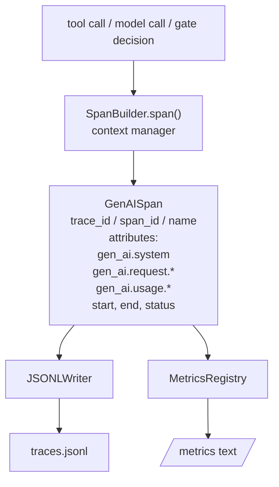
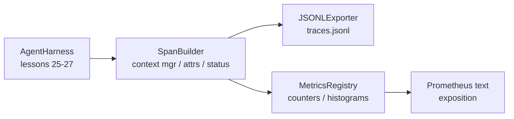

# 综合实战第 28 课：使用 OTel GenAI Spans 和 Prometheus Metrics 做可观测性

> 没有 observability 的 agent harness，是一个花钱的黑箱。本课手写一个 span builder，发出符合 OpenTelemetry GenAI semantic conventions 的 records，把它们写入 JSON-Lines 文件，每行一个 span，并以 Prometheus text format 暴露 counters 和 histograms。整件事都使用 stdlib Python，并且可离线运行。

**Type:** Build
**Languages:** Python (stdlib)
**Prerequisites:** Phase 19 · 25 (verification gates), Phase 19 · 26 (sandbox), Phase 19 · 27 (eval harness), Phase 13 · 20 (OpenTelemetry GenAI), Phase 14 · 23 (OTel GenAI conventions)
**Time:** ~90 minutes

## 学习目标

- 构建一个符合 OpenTelemetry GenAI semantic conventions 形状的 span data class。
- 实现 JSONL exporter，每行写一个自包含 span。
- 构建带 labels 的 counters 和 histograms，并用 Prometheus text-format exposition 输出。
- 用 span context manager 包装任意 callable，记录 duration、status 和 exceptions。
- 验证发出的 spans 能通过 `json.loads` roundtrip，并匹配 spec shape。

## 问题

生产中的编码智能体每轮都会产生三类 artifact：model call、tool execution 和 verification gate decision。没有结构化 telemetry，它们都没用。

第一种失败模式是缺失 trace。周二出了问题，但唯一记录是一份 500 行 chat log。没有记录哪个 tool 跑了、耗时多久、prompt 输入了多少 token，或 gate 是否拒绝过任何东西。agent author 只能猜。

第二种失败模式是不可解析 trace。harness 写了 spans，但用了自己的临时字段名。Grafana、Honeycomb、Jaeger 或本地 CLI 都读不了。团队栈里已有的工具全被浪费，因为 spans 不标准。

第三种失败模式是未聚合 metric。你能在 trace 中看到一个慢的 tool call，但回答不了“过去一小时 read_file 调用的 p95 latency 是多少？”，因为没有 metrics，只有 traces。

OpenTelemetry GenAI semantic conventions 正是为此存在。它们定义了一小组标准 attributes，供各个 LLM framework 的 span emitters 共用。如果你的 harness 写出这些 attributes，每个 OTel-compatible backend 都能读取它们。

## 概念



harness 中每个 operation 都产生一个 span。span 有 trace id，表示整个 agent invocation，span id，表示这个 operation，name，例如 `gen_ai.chat`、`gen_ai.tool.execution`，遵循 GenAI conventions 的 attributes，start 和 end time，以及 status。

GenAI conventions 标准化了这些 attribute keys：`gen_ai.system`，哪个 provider，例如 `anthropic`、`openai`，`gen_ai.request.model`，model id，`gen_ai.request.max_tokens`，`gen_ai.usage.input_tokens`，`gen_ai.usage.output_tokens`，`gen_ai.response.model`，`gen_ai.response.id`，`gen_ai.operation.name`，以及 tool-specific keys `gen_ai.tool.name` 和 `gen_ai.tool.call.id`。

exporter 写 JSONL。每行一个 JSON object。这是下游工具可以 stream、grep 和 import 的最简单格式。真实 OTel exporter 会说 OTLP gRPC；本课的 JSONL exporter 是离线等价物，并且在每台工作站上都能以零退出。

Metrics 与 traces 放在一起。每次 tool call 会递增一个 counter：`tools_called_total{tool="read_file"}`。histogram 会记录观察到的 latency：`tool_latency_ms{tool="read_file"}`。两者都序列化为 Prometheus text exposition format，这是 pull-based metrics 的事实标准。

```figure
trace-spans
```

## 架构



span builder 是一个小 class，带有 `span(name, attrs)` 方法，返回一个 context manager。context manager 在 enter 时记录 start time，在 exit 时记录 end time，如果抛出了 exception 就附加它，并把 finalized span 推给 exporter。

metrics registry 是两个 dict。Counters 是 `{(name, frozen_labels): int}`。Histograms 把 raw samples 保存在 list 中，并在 exposition time 序列化为 Prometheus histogram buckets。

## 你将构建什么

`main.py` 提供：

1. `GenAISpan` dataclass：trace_id、span_id、parent_span_id、name、attributes、start_unix_nano、end_unix_nano、status、status_message、events。
2. `SpanBuilder` class，带 `span(name, attrs, parent=None)` context manager。
3. `JSONLExporter` class，带 `export(span)`，追加一行。
4. `Counter` 和 `Histogram` classes，加上 `MetricsRegistry`。
5. `prometheus_exposition(registry)`，产出 text-format output。
6. `wrap_tool_call(name)` decorator，发出 span 并更新 metrics。
7. demo：合成一个完整 agent invocation，gen_ai.chat span 包住 tool spans，写入 traces.jsonl，打印 Prometheus exposition，以零退出。

span id 和 trace id 是 16-byte hex strings，由 `os.urandom` 生成。这符合 OTel 的 W3C trace context。exporter 永不抛错；IO errors 会被暴露，但 harness 继续运行。

histogram 有固定 bucket set，OTel 对毫秒 latency 的默认值：5、10、25、50、100、250、500、1000、2500、5000、10000、+Inf。Samples 存成 list；exposition 按需计算每个 bucket 的 count。

## 为什么手写，而不是 opentelemetry-sdk

OTel Python SDK 是真实依赖。它也有几千行代码、OTLP exporter 的多个进程，以及会压过课程预算的 runtime cost。手写版本教的是 wire format。在生产里，你把同样的 attributes 接到真实 SDK，就能免费获得 OTLP exporter、batching 和 resource detection。

conventions 是稳定的。本课发出的 wire format 到 2030 年仍能解析，因为 OTel 从不破坏 GenAI attribute names，只会新增。

## 它如何与 Track A 其余部分组合

第 25 课产出了 gate chain。第 26 课产出了 sandbox。第 27 课产出了 eval harness。第 28 课让这三者都可观测。第 29 课会把端到端 demo 的每一步都包进 spans，并在最后打印 Prometheus text。

## 运行

```bash
cd phases/19-capstone-projects-综合实战项目/28-observability-otel-traces-可观测性oteltraces
python3 code/main.py
python3 -m pytest code/tests/ -v
```

demo 会在课程工作目录中发出一个 `traces.jsonl`，结束时清理，然后打印三个 spans 的 sample，再打印 counters 和 histograms 的 Prometheus exposition。测试验证 spans 能序列化 round-trip、canonical GenAI attributes 存在、counters 正确递增，以及 histogram exposition 包含预期 bucket counts。
