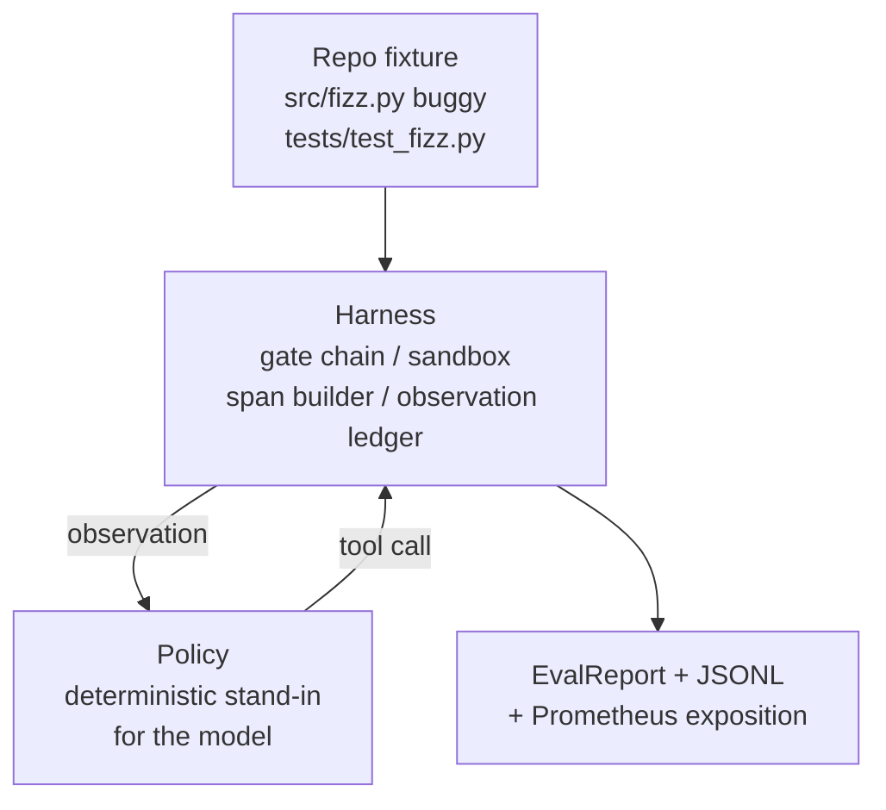
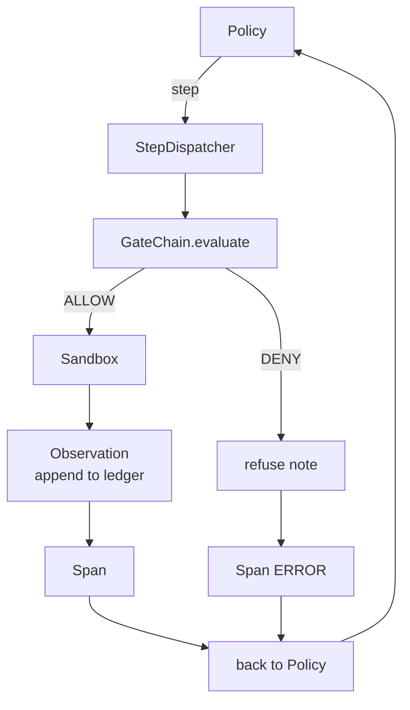

# 综合实战第 29 课：Harness 上的端到端编码智能体

> Track A 的回报。本课把 gate chain、sandbox、eval harness 和 OTel spans 缝成一个可工作的编码智能体，它能修复一个真实的，小型 fixture 规模的，多文件 Python 项目中的 bug。智能体是一个确定性 policy，不是 LLM；这种替换让课程可复现，并表明 harness 从一开始就是有趣的部分。契约完全相同：真实模型会插入 policy seam。

**Type:** Build
**Languages:** Python (stdlib)
**Prerequisites:** Phase 19 · 25 (verification gates), Phase 19 · 26 (sandbox), Phase 19 · 27 (eval harness), Phase 19 · 28 (observability), Phase 14 · 38 (verification gates), Phase 14 · 41 (workbench for real repos), Phase 14 · 42 (agent workbench capstone)
**Time:** ~90 minutes

## 学习目标

- 把 gate chain、sandbox、eval harness 和 span builder 组合成单个 agent loop。
- 实现一个确定性 policy，使用 read_file、run_tests 和 write_file 修复 fixture bug。
- 在一次端到端运行中强制执行全局 step budget 和 observation token budget。
- 为完整运行发出完整 OTel GenAI traces 和 Prometheus metrics。
- 验证智能体能在少于 12 步内解决 fixture，并且合法工具上 gate trips 为零。

## 问题

大多数 agent demos 都是孤立工作的：一个 sandbox 本身，一个 eval harness 本身，一个 span emitter 本身。它们看起来都没问题。把它们组合起来，接缝就会显现。

gate chain 说 ALLOW，但 sandbox 因为 chain 没预料到的原因拒绝。eval harness 记录 pass，但 OTel spans 说 gate 拒绝了一个智能体声称用过的工具。Prometheus counter 被递增了两次，而它本该只递增一次。observation budget 被超过了，但智能体继续运行，因为预算在 chain 中跟踪，而 sandbox 不知道。

本课是整条 track 的 integration test。智能体必须按顺序做四件事：读取项目，运行测试，从测试失败中识别 bug，写入修复，再次运行测试，然后停止。每个 operation 都经过 gate chain。每个 tool execution 都经过 sandbox。每一步都包在 span 中。eval harness 最后给整件事打分。

## 概念



agent 的 policy 是一个 state machine。五个 states。

`SURVEY`：智能体读取项目 listing。下一个 state 是 RUN_TESTS。

`RUN_TESTS`：智能体运行 test command。如果测试通过，state machine 以 success 停止。否则下一个 state 是 INSPECT。

`INSPECT`：智能体读取失败的 source file。下一个 state 是 FIX。

`FIX`：智能体写入修正后的 file。下一个 state 是 VERIFY。

`VERIFY`：智能体再次运行 test command。如果测试通过，halt success。否则 halt failure。

每个 state 对应一个工具调用。每个工具调用都经过 gate chain。如果工具调用被拒绝，智能体会在 trace 中报告拒绝并停止。

fixture bug 是 `fizz.py` 中的 off-by-one。确定性 policy 通过 regex 从 test failure message 中检测 bug，并发出修正后的文件。把 policy 替换成 LLM 不会改变 harness contract。

## 架构



本课是自包含的。每个前面课程的 primitive 都在 `main.py` 中以最小规模重新实现，gate、sandbox、ledger、span，所以本课运行时无需导入 sibling。名称与第 25 到 28 课完全一致，让概念映射明确。

## 你将构建什么

`main.py` 提供：

1. 最小 harness primitives，名称与第 25 到 28 课相同：`GateChain`、`Sandbox`、`ObservationLedger`、`SpanBuilder`、`MetricsRegistry`。
2. `CodingAgentPolicy` class：带五个 states 的 state machine。
3. `Repo` helper：准备一个带有打包 buggy fixture 的 scratch dir。
4. `AgentRun` class：驱动 policy，通过 harness dispatch，返回 `AgentRunReport`。
5. 一个打包 fixture，`fixture_repo/`，包含 src/fizz.py、tests/test_fizz.py 和一个供 eval harness 使用的 expected/ tree。
6. demo：端到端运行 policy，打印逐步 trace，断言 pass，打印 metrics。

打包 fixture 与第 27 课的 task structure 形状相同：一个 buggy file 和一个 tests file。test failure message 包含足够信息，让确定性 policy 识别修复。真实 LLM 会做同样的工作，只是更慢，召回更广，但不会改变 harness 的期望。

## 为什么 policy 不是 LLM

真实 LLM 需要 API key、网络调用和不可验证的随机性。harness 才是本课关心的部分。换成确定性 policy，让课程可以在任何开发者笔记本电脑上运行，不需要外部依赖，并让测试套件能断言精确 step counts。

本课的 policy 是 LLM agent 所做事情的严格子集。policy 读取 repo，看到失败测试，识别行，并发出修复。LLM 会用同样的 harness contract 走同一个 loop；记账完全相同。

## demo 断言什么

端到端 demo 在退出时断言五件事，测试套件会以程序方式重新断言它们。

policy 在少于 12 步内解决了 fixture。

observation budget 从未被超过。

合法工具上 gate denials 为零。智能体从未编造被拒绝的工具名。

每一步在 traces.jsonl 中都有对应 span。

Prometheus exposition 包含 `tools_called_total{tool="read_file"}` 条目和 `tool_latency_ms` histogram。

## 它如何与 Track A 其余部分组合

本课是 integration。第 25 课写了 gate chain。第 26 课写了 sandbox。第 27 课写了 eval harness。第 28 课写了 observability。第 29 课证明它们可以作为系统工作。真实 agent harness 从这里扩展：把确定性 policy 换成模型，把打包 fixture 换成真实 repo task，把 JSONL exporter 换成 OTLP。

## 运行

```bash
cd phases/19-capstone-projects-综合实战项目/29-end-to-end-coding-task-demo-端到端to端到端编程taskdemo
python3 code/main.py
python3 -m pytest code/tests/ -v
```

demo 会打印 per-step trace、最终 eval report 和 Prometheus exposition。退出码为零。测试覆盖 policy state transitions、合成工具调用上的 gate refusals、打包 fixture 上的端到端运行，以及 step-budget invariants。
