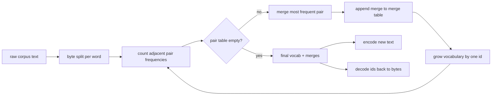
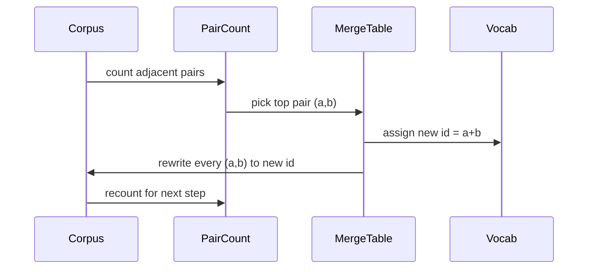

# 从零实现 BPE 分词器

> 字节进来，ids 出去，ids 再回到相同字节。构建每个现代文本模型仍然起步于此的 tokenizer。

**Type:** Build
**Languages:** Python
**Prerequisites:** Phase 04 lessons, Phase 07 transformer lessons
**Time:** ~90 minutes

## 学习目标
- 通过反复合并最频繁的相邻 symbol pair，从 raw text corpus 训练 Byte-Pair Encoding vocabulary。
- 实现确定性 merge table，并把它应用到新文本上，产出 subword ids 流。
- 将任意 UTF-8 输入 round-trip 到 ids 并返回，且没有信息损失。
- 保留并保护 special tokens，`<|endoftext|>`、`<|pad|>`，让它们在训练和解码中存活。
- 理解为什么 byte-level alphabet 是通用 tokenizer 的正确底座。

## 框架

语言模型从不直接看文本。它看整数。从字符串到整数列表再返回的映射就是 tokenizer。把这一层做错，训练运行中的每条 loss curve 都在衡量错误的东西。

通用文本模型中占主导地位的 subword tokenizer 家族是 Byte-Pair Encoding。想法很小。从已知 alphabet 开始。找出训练语料中出现最频繁的相邻 symbol pair。把它合并成一个新 symbol。重复直到 vocabulary 达到目标大小。编码新文本时，以相同顺序复用同一份 merge list。

我们会构建 byte-level 变体。alphabet 是 256 个原始字节，不是 Unicode code points。这个选择让 tokenizer 能处理任意 UTF-8 输入，而无需退回 unknown token。

## Pipeline

训练侧和推理侧共享 merge table。这种共享就是契约。如果你在推理时改变 merge 顺序，你就会解码出不同的 ids 流。

## Byte alphabet

前 256 个 ids 保留给原始字节 0x00 到 0xFF。这保证任何输入字符串都能在任何 merge 发生前用 vocabulary 表达。byte block 之后，我们为 special tokens 保留一个小范围。训练 loop 永远不会提议这些 ids 作为 merge targets，因为我们会把它们完全排除在 pretokenized stream 之外。

pretokenizer 在训练看到语料前，按空白和标点边界切分 corpus。如果没有这个切分，BPE merge step 会愉快地学到跨越 word boundaries 的 merges，vocabulary 会被常见整句短语填满。有了这个切分，merges 会留在 word 内部，结果能泛化。

## 训练 loop

每个训练 step 中，loop 做三件事。它遍历 corpus 中每个 word，统计当前 symbols 中每个相邻 pair 出现的次数，并按 word 本身出现次数加权。它选择 count 最高的 pair。它把这个 pair 的每次出现重写为单个新 symbol，新 symbol 的 id 是 vocabulary 中下一个空位。然后记录这次 merge。

每个 step 的成本与表示为 symbol sequences 列表的 corpus 大小线性相关。对于百万级 words 和目标一万个 ids 的 vocabulary，loop 会在数秒内完成，因为 merges 落地后 symbol sequences 会缩短。

## 编码新文本

推理不调用 merge counter。它按学习到的顺序应用 merge table。对于一个新 word，encoder 从 byte split 开始。它扫描当前 sequence，寻找 rank 最低的 merge，也就是最早学到且适用的 merge。执行该 merge。再次扫描。当 table 中没有 merge 适用于当前 sequence 时，loop 结束。

按 rank 排序这个性质，让编码既确定，又能在相同输入上匹配训练行为。最早学到的 merge 位于 table 顶部，会最先应用。如果两个 merge 都能应用在同一位置，rank 更低的获胜。

## Special tokens

Special tokens 是 byte stream 永远无法生成的 ids。我们手动保留它们。本课两个就足够。

- `<|endoftext|>` 在预训练期间分隔文档。它告诉模型“新文档从这里开始，不要让前一个文档的上下文泄漏进来”。
- `<|pad|>` 填充短序列，让 batch 可以成为矩形 tensor。loss mask 会在训练中隐藏它。

encoder 接受一个 flag，允许输入中出现 special tokens。flag 关闭时，字符串 `<|endoftext|>` 和 `<|pad|>` 会被 tokenized 为拼写它们的字节。flag 打开时，字面字符串会映射到其保留 ids，并且不受任何 merge 影响。

## Round-trip 保证

编码再解码必须准确返回输入 bytes。decoder 按顺序拼接每个 id 的 byte expansion。由于每个 id 要么是原始 byte，要么是两个先前已知 ids 的拼接，递归 expansion 总会终止于原始 bytes。然后解码返回这些 bytes 拼出的 UTF-8 string。

本课测试套件会在一条未见句子、一条带 Unicode emoji 的句子，以及一条包含字面 `<|endoftext|>` token 的句子上检查这个性质。

## 本课不做什么

它不构建大型生产 tokenizer 风格的 regex-driven pretokenizer。这里的 pretokenizer 是一个很小的 whitespace 和 punctuation split。它足以在小训练语料上产出合理 merges，并且与课程链其余部分的契约保持不变。下一课会把 tokenizer 当作黑箱，并在它上面构建 sliding-window dataset。

它不并行化 pair counter。Python 中对几千个 words 的 corpus 循环会远远不到一秒。对于更大语料，显然的做法是按 word 并行统计 pairs，然后 reduce。

## 如何阅读代码

`main.py` 定义四个对象。`BPETokenizer` 持有 vocabulary、merge table 和 special-token table。`train` 是训练 loop。`encode` 是推理路径。`decode` 是 byte 拼接。底部 demo 在内置 corpus 上训练一个小 tokenizer，编码一条 held-out sentence，把 ids 解码回来，并打印两者。`code/tests/test_bpe.py` 中的测试固定 round-trip 性质、special-token reservation 和 merge ordering。

运行 demo。然后把 demo 中的目标 vocabulary size 从 300 改为 600，观察 held-out sentence 的 encoded length 如何下降。那条曲线就是 BPE compression curve。
