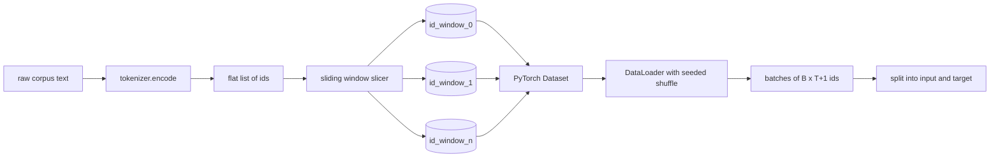
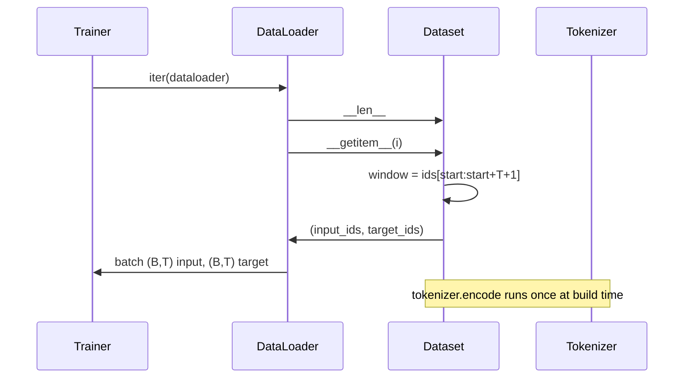

# 带 Sliding Window 的 Tokenized Dataset

> 预训练运行是从 token ids 到 gradients 的函数。本课构建把 ids 喂进去的传送带。

**Type:** Build
**Languages:** Python
**Prerequisites:** Phase 04 lessons, Phase 07 transformer lessons, Lesson 30 of this phase
**Time:** ~90 minutes

## 学习目标
- 通过调用一次 tokenizer，把 raw corpus 转换为 token ids 流。
- 用可配置 overlap stride 把 id stream 切成固定长度 windows。
- 构建 PyTorch Dataset，为 next-token prediction 返回 input 和 target tensors。
- 用每个 epoch 固定 seed 的确定性 shuffle，把 dataset 包进 DataLoader。
- 理解 stride、redundancy 和有效 dataset size 之间的取舍。

## 框架

预训练运行一次读取一个 batch 的 token ids 并更新模型。每个 batch 的形状由训练契约固定。对于 causal language model，batch 持有 `(B, T)` input ids 和 `(B, T)` target ids，其中 target 是 input 左移一位。data pipeline 的工作，是从可能有数 GB raw text 的 corpus 中，按需、确定性、可复现地产出这个契约。

本课构建这条 pipeline。上一课的 tokenizer 把文本变成一个长而扁平的 ids 列表。sliding window 把这个列表切成训练 examples。自定义 Dataset 把 examples 暴露为 tensors。DataLoader 对它们 batching，并用已知 seed shuffle。

## 形状契约

causal LM 消费形状为 `(B, T)` 的 ids，其中 `B` 是 batch size，`T` 是 context length。位置 `t` 的 target 是位置 `t+1` 的 input。这意味着每个训练 example 覆盖 `T+1` 个 raw ids。window stride 控制连续 examples 之间存在多少 overlap。

slicer 永远不会跨越 corpus 边界。如果最后一个 window 没有足够 ids 填满 `T+1` 个位置，slicer 会丢弃它。用 `<|pad|>` 填充尾部也是有效选择，但它会让 loss mask 更复杂。本课选择丢弃。

## 为什么使用 sliding window

预训练 corpus 是一条很长的 ids 流。如果模型只看到不重叠 windows，每个训练 example 都会教它相同的 `T` 边界。调整 stride 会移动这些边界，让模型看到更多样的 predict-next-token tasks。

stride 为 `T` 会产生不重叠 windows。stride 为 `T // 2` 会产生百分之五十 overlap，并让有效 dataset 翻倍。stride 为 `1` 会产生最大 overlap，并让 dataset 增加 `T` 倍。成本是每个 epoch 更多 compute。收益是更多边界多样性。大多数预训练运行使用等于 context length 的 stride，因为 corpus 本身已经远大于模型在一个 epoch 中能跑完的规模，所以边界多样性的论点较弱。

## Dataset class

PyTorch Dataset 有两个必需方法。`__len__` 返回 examples 数量。`__getitem__` 返回一条 example，作为一对 tensors。我们的 Dataset 存储 encoded id stream 和 stride。索引它时即时计算 window 起点，因此无论 stride 产生多少 examples，内存成本都是 id stream 的一份副本。

shift-by-one 发生在 `__getitem__` 内部。Dataset 返回 `(input, target)`，其中 `input = window[:-1]`，`target = window[1:]`。两者都是 PyTorch long tensors。训练 loop 把它们当作 ground truth。

## 确定性 shuffle

带 `shuffle=True` 的 DataLoader 会从 PyTorch random generator 读取。通过传入每个 epoch 显式 seed 的 `torch.Generator`，我们可以在每次重启运行时得到相同 shuffle。当你想比较两个只差一个 hyperparameter 的运行时，这个性质很重要。没有 seed，两个运行看到的数据顺序不同，loss curves 会因为与改动无关的原因发散。

本课的 seed contract 很简单。`epoch_seed = base_seed + epoch_index`。base seed 在构造时传入。epoch index 由 trainer 在每个 epoch 顶部递增。使用相同 base seed 重新运行，总会在每个 epoch 看到相同顺序。

## Batch sampler

PyTorch 中默认 sampler 会以均匀随机方式选择 indices，不放回。这正是预训练想要的。对小 dataset 做 finetuning 时契约也相同。DataLoader 通过调用 `__getitem__` `B` 次并 stack 结果来组装 batch。由于每个 example 都由构造保证长度相同，不需要 padding logic。

本课为了简单保留 `num_workers=0`。在生产运行中，workers 会并行化 `__getitem__` 调用。对我们的 pipeline 来说，这基本是 no-op，因为工作只是内存 tensor 的 slice，但同一个 Dataset API 能干净支持 workers。

## 计算 examples

对于长度为 `N` 的 id stream、context length `T` 和 stride `S`，examples 数量是 `max(0, 1 + (N - (T + 1)) // S)`。本课把这个计算作为 Dataset 上的 static method 暴露出来，让 trainer 无需迭代就能计算每个 epoch 的 total steps。

## 本课不做什么

它不从磁盘 stream。corpus 会完整编码进内存，并作为单个 tensor 保存。对于几百万 ids 的 corpus，这远低于一百 MB，并且是本课正确的形状。disk streaming 是一个独立关注点，可以通过替换 storage 接入，但保留 Dataset contract。

它不处理多个 documents。corpus 被视为一个连续 id stream。当 corpus 由多个 documents 构建时，通过插入 `<|endoftext|>` ids 来编码 next-document boundary。模型学习围绕边界进行预测。

## 如何阅读代码

`main.py` 定义两个 classes 和一个 helper。`SlidingWindowDataset` 是 PyTorch Dataset。`make_dataloader` 返回带 seeded generator 的已配置 DataLoader。`_encode_corpus_to_ids` 是一次性的 tokenizer 调用。底部 demo 在进程内构建一个小 tokenizer，编码内置 corpus，构造 dataset 和 dataloader，打印一个 batch，并断言 shape contract。`code/tests/test_dataset.py` 中的测试固定 window count formula、shift-by-one 性质、deterministic shuffle 和 stride trade-off。

运行 demo。然后把 context length 从 16 改成 32，观察每个 epoch 的 examples 数量如何下降。那个数字就是你的 steps-per-epoch budget。
