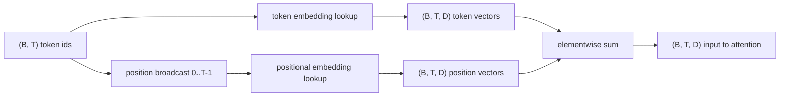
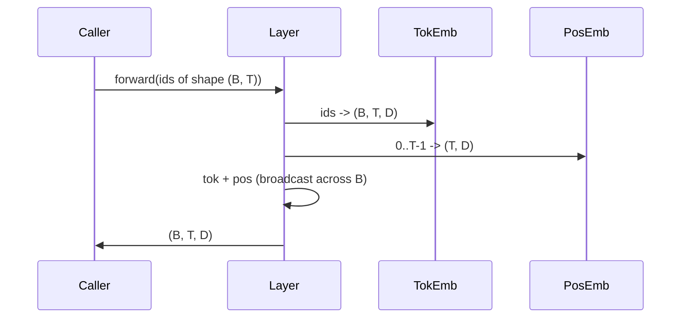

# Token 和 Positional Embeddings

> Ids 是整数。模型想要向量。两张 lookup tables 位于它们之间，而 positional one 的选择会塑造模型能学到什么。

**Type:** Build
**Languages:** Python
**Prerequisites:** Phase 04 lessons, Phase 07 transformer lessons, Lessons 30 and 31 of this phase
**Time:** ~90 minutes

## 学习目标
- 构建 token-embedding lookup table，把 vocabulary ids 映射到 dense vectors。
- 构建按 position 索引的 learned positional-embedding lookup table。
- 构建按 position 索引、没有参数的固定 sinusoidal positional embedding。
- 把 token 和 positional embeddings 组合成 transformer block 的单一输入。
- 对比 learned 和 sinusoidal embeddings 在 length generalization 和 parameter count 上的差异。

## 框架

模型第一次接触 token id，是在 token-embedding matrix 中做一次 row lookup。该矩阵每个 vocabulary id 一行，每个 model dimension 一列。lookup 返回一个 vector，模型其余部分把它视为该 id 的含义。Backprop 会更新 forward pass 中使用到的行。训练过程中，这些行的几何结构会学习在方向中编码相似性。

Token ids 本身没有顺序。模型需要第二个信号，告诉它位置一不同于位置十七。这个信号的两个主流选择是 learned positional embedding，一张第二 lookup table，每个 position 一行，以及固定 sinusoidal positional embedding，一个没有参数的数学公式。选择会带来后果。learned table 是参数，并且受限于模型训练时的最大 context length。理论上 sinusoidal table 没有参数，公式能扩展到任意 position，但本课的 `SinusoidalPositionalEmbedding` 会在 `max_context_length` 处预计算固定 table，并且它的 `forward` 超过该边界会 raise；因此这里两个 modules 都强制执行最大 context length。即使 table 足够大、可以索引，模型在超过训练长度后仍可能表现困难。

本课构建两者，并把它们和 token embedding 组合成下一课 attention block 的单一输入。

## 形状契约

embedding stage 的输入是形状为 `(B, T)` 的一批 token ids。输出是形状为 `(B, T, D)` 的 tensor，其中 `D` 是 model dimension。每个 batch element 都有相同 context length `T`。每个 position 都有相同 vector dimension `D`。



组合方式是 sum，不是 concatenation。求和让 `D` 在网络中保持不变，并让模型能按每个 feature 决定每层中 token meaning 还是 position 占主导。

## Token embedding matrix

token embedding 是形状为 `(V, D)` 的 parameter tensor，其中 `V` 是 vocabulary size。PyTorch 以 `nn.Embedding(V, D)` 暴露它。初始化时，entries 从一个小 Gaussian 中抽取；对 transformer-scale models，传统上 mean 为零，standard deviation 约为 `0.02`。确切 init 不如跨运行保持一致重要。

forward pass 是单次 indexing operation。PyTorch 通过 gather rows，把 `(B, T)` int64 ids 映射到 `(B, T, D)` floats。backward pass 只会把 gradients 累积到 forward pass 中触碰过的行。两行如果从未出现在 batch 中，那一步收到的 gradient 为零。

一个微妙细节。token embedding 和模型末端的 output projection 经常共享 weights，称为 weight tying。发生这种情况时，每次 backward pass 都会通过 output side 触碰 embedding 的每一行。本课把两者作为独立 modules 暴露，但同一个 matrix 在完整模型中可以扮演两个角色。

## Learned positional embedding

learned positional embedding 是第二个 `nn.Embedding`，形状为 `(max_context_length, D)`。lookup 由 position id `0, 1, 2, ..., T-1` 索引。forward pass 会把该 position vector 广播到 batch dimension。

learned table 的缺点是，如果模型只训练到 position `T-1`，它就不能查询 position `T`。那一行不存在。使用这种方案的生产 decoder-only models 会把最大 context length 烘焙进 architecture，并拒绝处理更长输入。

## Sinusoidal positional embedding

sinusoidal positional embedding 是从 position 到 vector 的函数。Position `p` 和 feature `i` 产生

```python
angle = p / (10000 ** (2 * (i // 2) / D))
emb[p, 2k]     = sin(angle)
emb[p, 2k + 1] = cos(angle)
```

该函数没有参数。每个 position 都有唯一 vector。wavelength 在 feature dimensions 上按几何方式变化，因此较低 dimensions 编码粗位置，较高 dimensions 编码细位置。

由 `sin` 和 `cos` 的共同选择带来的性质是，position `p + k` 的 vector 是 position `p` 的 vector 的线性函数。这给 attention layer 学习 relative-position offsets 提供了一条简单路径。模型不需要单独参数来表达“向后看五个 tokens”。

本课在构造时一次性计算完整 sinusoidal table，并在 forward time 索引它。

## 组合

输入 pipeline 按顺序做三件事。读取 token ids。查找 token vectors。加上 positional vectors。返回求和结果。



sum step 中的 broadcasting 会沿 batch dimension 复制 `(T, D)` positional tensor。PyTorch 会自动处理，因为 positional tensor 在 unsqueeze 后形状为 `(1, T, D)`。

## 对比分析

本课在相同 inputs 上运行两种 variants，并打印两个 diagnostics。

第一个是 parameter count。learned variant 会在 token embedding 之上额外增加 `max_context_length * D` 个参数。sinusoidal variant 增加零。

第二个是相邻 positions 的 embeddings 之间的 cosine similarity。sinusoidal variant 因为函数连续，具有平滑且可预测的 decay。learned variant 在初始化时接近随机 similarity，因为 rows 是独立抽取的。训练后，learned variant 通常也会发展出类似平滑结构，但它必须从数据中发现这个结构。

## 本课不做什么

它不构建 rotary positional encoding (RoPE) 或 AliBi。它们是生产 transformers 中的现代选择。两者都遵循与这里 embeddings 相同的 shape contract，对形状为 `(B, T, D)` 的 vectors 应用 position-dependent transformation，但它们发生在 attention-projection step，而不是输入处。下一课会构建 attention block，其中一个可选扩展就是在那里把 rotary 折入 query-key projections。

它不训练 embedding。训练需要 loss，loss 需要模型 output，模型 output 需要 attention 和 LM head。那是下一课和再下一课。

## 如何阅读代码

`main.py` 定义三个 modules。`TokenEmbedding` 包装 `nn.Embedding(V, D)`。`LearnedPositionalEmbedding` 包装 `nn.Embedding(L, D)`。`SinusoidalPositionalEmbedding` 预计算 table，并把它暴露为 buffer。`EmbeddingComposer` 把 token embedding 和 positional embedding 绑在一起。底部 demo 打印 shapes、parameter counts 和 neighbour-position similarity diagnostic。`code/tests/test_embeddings.py` 中的测试固定 shape、broadcast behaviour、parameter count 和 sinusoidal formula。

运行 demo。然后把 model dimension `D` 从 64 改为 32，观察 sinusoidal wavelength bands 如何变化。
