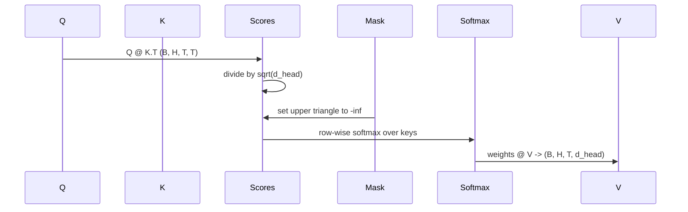

# Multi-Head Self-Attention

> 一个 linear projection，三种 views，H 个并行 heads，一个 mask。这就是模型实际使用的 attention block。

**Type:** Build
**Languages:** Python
**Prerequisites:** Phase 04 lessons, Phase 07 transformer lessons, Lessons 30 through 32 of this phase
**Time:** ~90 minutes

## 学习目标
- 把 batched Query/Key/Value projection 实现为一个 linear layer，并拆分成 H 个 heads。
- 用正确的 normalization 和 dtype handling 计算 scaled dot-product attention。
- 应用 causal mask，阻止某个 position attend 到未来 positions。
- 检查固定输入上的 per-head attention weights，并推理每个 head 看向哪里。
- 在 toy task 上训练一个小 attention block，观察随着 heads 专门化 loss 下降。

## 框架

Attention 是让一个 token 的 representation 从同一 sequence 中其他 tokens 拉取信息的函数。Self-attention 意味着 queries、keys 和 values 全都从同一个 input 派生。Multi-head 意味着 projection 被拆成 H 个并行 attention problems，它们的 outputs 被 concatenated 并 projected back。

高效实现模式是一个 linear layer 从 `D` 投影到 `3 * D`，再切成三个 views，然后 reshape 成 H 个 heads，每个 head 大小为 `D // H`。matmul、softmax 和 weighted sum 都作为 batched tensor operations 发生，因此 heads 会在 accelerator 上并行运行。

本课构建这个 block。它还加入 causal mask，让同一份代码可以作为 decoder-only language model 中的 attention layer。下一课会把这个 block 堆成完整 transformer，再下一课会训练它。

## 形状契约

输入是 `(B, T, D)`。输出是 `(B, T, D)`。mask 是 `(T, T)` 或可 broadcast 到它。block 内部 intermediate tensors 形状为 `(B, H, T, d_head)`，其中 `d_head = D // H`。约束是 `D % H == 0`。

```mermaid
flowchart LR
    A["(B, T, D) input"] --> B[Linear D -> 3D]
    B --> C["split into Q, K, V"]
    C --> D["reshape to (B, H, T, d_head)"]
    D --> E["scores = Q @ K.T / sqrt(d_head)"]
    E --> F[apply causal mask]
    F --> G[softmax over keys]
    G --> H["context = weights @ V"]
    H --> I["reshape to (B, T, D)"]
    I --> J[output Linear D -> D]
    J --> K["(B, T, D) output"]
```

两个 linear layers，QKV projection 和 output projection，是 block 中唯一的参数。mask、softmax、matmuls 和 reshapes 全都没有参数。

## QKV split

朴素实现有三个独立 linear layers，分别用于 Q、K、V。高效实现有一个输出 `3 * D` features 的单个 layer，然后 split 结果。两者在数学上等价，因为分别乘以三个 `(D, D)` weights 的矩阵乘法，正好等于一次乘以由它们堆叠而成的 `(3D, D)` weight 的矩阵乘法。

高效版本更快，因为 accelerator 只发起一次 matmul，而不是三次。它也更容易初始化，因为三个 sub-matrices 位于同一个 parameter tensor 中，可以一起初始化。

## Head reshape

split 后，Q、K、V 都是 `(B, T, D)`。为了把它变成 H 个并行 attention problems，我们 reshape 到 `(B, T, H, d_head)`，再 transpose 到 `(B, H, T, d_head)`。head dimension 现在位于 batch dimension 旁边，因此 PyTorch 会把 per-head attention 视为跨 `B * H` 个独立实例的 batched operation。

d_head dimension 保持在最后，这样 score matmul `Q @ K.transpose(-2, -1)` 会在它上面收缩。结果是 `(B, H, T, T)` 的 per-head attention scores。

## Scaling

scores 在 softmax 前除以 `sqrt(d_head)`。如果没有这个 scaling，dot products 会随着 `d_head` 增长而增长，并把 softmax 推入一种几乎所有质量都落在单个 entry 上、其他 entries 极小的 regime。该 regime 中 gradients 很小，学习会停滞。除以 `sqrt(d_head)` 会让 scores 的 variance 在不同 head sizes 上大致保持恒定。

## Causal mask

decoder-only language model 在预测下一个 token 时，只能基于过去。mask 强制执行这一点。具体来说，在 softmax 前，`(T, T)` score matrix 中对角线上方的每个 entry 都会被替换为 negative infinity。softmax 后，这些 positions 的权重为零。

我们在构造时把 mask 注册为 buffer，让它和模型位于同一 device，并且不属于 gradient graph。mask 覆盖 block 可能看到的最大 context length。forward time 时，我们切取左上角 `(T, T)`。

## Output projection

得到 per-head context vectors `(B, H, T, d_head)` 后，我们 transpose 回 `(B, T, H, d_head)`，reshape 到 `(B, T, D)`，并应用最终的 `(D, D)` linear projection。output projection 让模型混合 heads。没有它，H 个 heads 只能通过后续 layers 重新组合，block 会被人为约束。

## Attention weight inspection

本课在 forward pass 上暴露 `return_weights=True` flag。设置后，block 会在 output 旁返回形状为 `(B, H, T, T)` 的 per-head attention weights。demo 会打印一个短输入上某个 head 的 weights heatmap，让你看到 causal-triangle structure 和 per-position focus。

在训练过的模型中，不同 heads 会学习不同模式。有些 heads attend 到紧邻前一个 token。有些 heads attend 到 sequence 开头。有些 heads 几乎均匀地分散 attention。inspection hook 是这类 interpretability 工作的入口。

## 训练 demo

`main.py` 底部的 demo 把 attention block 接到一个 tiny LM head，并在 repeat task 上训练整个东西。input 的每一行都是一个随机 id 在整个 context 上复制。target 是 input 左移一位，所以模型必须学习下一个 token 和前一个 token 相同。loss 是 cross-entropy。使用 H=4、D=32、T=12，以及 64 的 vocabulary，loss 会在 CPU 上三个 epochs 内从随机水平，约 `log(64) ~ 4.16`，下降到远低于 `1.0`。

demo 的重点不是训练有用模型。重点是确认 gradients 流经 block 的每个部分，并且 heads 在一个答案显然的问题上学到东西。

## 本课不做什么

它不加入 feed-forward block。真实模型中的 transformer layer 是 attention 后接两层 MLP，并在每个部分周围有 residual connection 和 layer norm。下一课会加入这些。

它不实现 rotary 或 AliBi positional encoding。两者都在同一个 block 的 QKV projection step 应用，但它们是独立教学单元。这里构建的 block 兼容两者，只需要在 matmul 前变换 Q 和 K。

它不实现 inference 的 KV cache。跨 forward passes 缓存 keys 和 values，是让 autoregressive decoding 变快的优化。它会改变 K 和 V tensors 的 shape contract，但不改变 Q。它属于 inference 课程。

## 如何阅读代码

`main.py` 定义 `MultiHeadSelfAttention`。class 持有两个 linear layers 和一个注册的 mask buffer。forward pass 执行 project、reshape、score、mask、softmax、weight、reshape，并再次 project。底部 demo 构建一个小模型，用 token 和 positional embeddings 以及 LM head 包住 attention，在 copy task 上训练三个 epochs，并打印 loss curve 和 per-head attention heatmap。`code/tests/test_attention.py` 中的测试固定 shape contract、causality property、softmax property、head-split property 和 gradient flow。

运行 demo。然后把 `n_heads` 从 4 增加到 8，保持 `d_model=32`，因此 `d_head=4`，观察 heatmap 如何变化。
