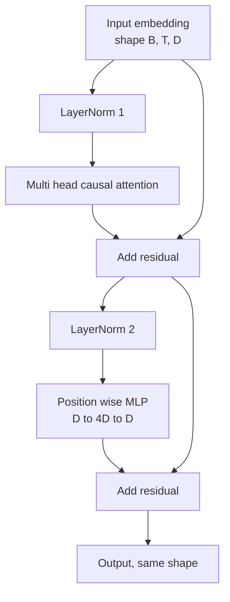
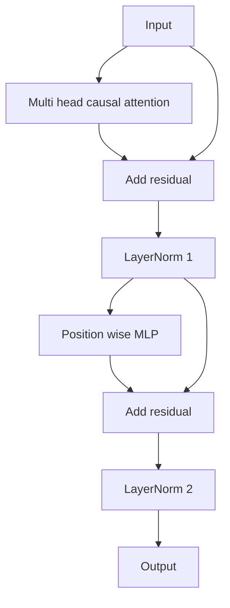

# 从零实现 Transformer Block

> 一个 block 是每个现代 decoder LLM 的基本单元。Layer norm、multi head attention、residual、MLP、residual。pre-LN 变体无需 warmup 也能稳定训练。post-LN 变体是原始论文发布的版本。本课并排构建两者，并展示在常见学习率下，哪一个能撑过 12 layer stack。

**Type:** Build
**Languages:** Python
**Prerequisites:** Phase 19 lessons 30 to 33 (tokenizer, embeddings, attention math, batched data loader)
**Time:** ~90 minutes

## 学习目标

- 用 PyTorch 从四个运动部件构建 transformer block：LayerNorm、multi head causal attention、residual connections、position wise MLP。
- 将 LayerNorm 放入两种配置，pre-LN 和 post-LN，并解释为什么其中一种无需 warmup 也能稳定训练。
- 在 multi head attention 中实现 causal masking，使 token `i` 不能看到 tokens `j > i`。
- 跟踪两种变体在 12 layer stack 中的 gradient flow，并不靠空话解读结果。
- 在下一课组装 124 million parameter GPT 时，把这个 block 作为 drop-in unit 复用。

## 问题

transformer 是一个 block 的重复。block 错一次，重复十二次，你就会发布一个在第一个 epoch 发散的模型，或一个之后一路都需要 warmup hack 的模型。本课中你会看到的两种失败模式并不罕见。学习者第一次天真地堆叠 blocks 时就会出现。一种是 attention layer attend 到未来。另一种是 LayerNorm 被放在无法在深度上驯服 residual signal 的位置。

看清之后，修复是机械的。block 恰好有两条 residual paths 和两个 normalization positions。正确选择位置后，stack 的其余部分只是 bookkeeping。

## 概念

每个 decoder only transformer block 都是一个函数，接收形状为 `(batch, sequence, embedding)` 的 tensor，并返回相同形状的 tensor。内部由两个 sublayers 工作。



这是 pre-LN 变体。LayerNorm 位于 residual branch 内部，在 sublayer 之前。residual connection 会把未归一化 signal 向前携带。

post-LN 变体把 LayerNorm 移到 residual add 之后。



形状完全相同。训练行为不同。使用 post-LN 时，通过 residual path 反向流动的 gradient 必须经过 LayerNorm。在深度十二且 learning rate 为 `3e-4` 时，该 gradient 会缩小得足够快，从而需要 warmup schedule。pre-LN 让 residual path 保持未归一化，所以 gradients 可以干净传播到 embedding layer。GPT-2 及之后采用 pre-LN，原因正在于此。

### Causal multi head attention

attention sublayer 把 input 以三种方式投影成 query、key、value tensors。每个都从 `(B, T, D)` reshape 到 `(B, H, T, D/H)`，其中 `H` 是 head count。Scaled dot product attention 在每个 head 上计算 `softmax(Q K^T / sqrt(d_k))`，把上三角 mask 到 negative infinity，通过 softmax 应用 mask，然后乘以 `V`。Heads 被 concatenated 回单个 `(B, T, D)` tensor，并再次 projection。mask 是让模型 causal 的唯一部分。忘记 mask，你训练的是一个作弊模型。

### MLP

position wise MLP 对每个 token 独立应用同一个两层网络。hidden width 是 embedding width 的四倍，activation 是 GELU，第二个 linear 后接 dropout。MLP 内部没有 tokens 彼此通信。所有 token mixing 都发生在 attention 中。

### Residual connections 做两件事

它们让跨深度的 gradient path 变成加性的，使 gradient norm 在十二层中保持尺度。它们也让每个 block 学习对运行中 representation 的加性更新，而不是完全替换。两个效果都是 block 能扩展的原因。

## Build It

`code/main.py` 实现：

- `class LayerNorm`，带可学习 scale 和 shift、biased eps，逐 token vector 应用。
- `class MultiHeadAttention`，带 `num_heads`、`head_dim = d_model // num_heads`、fused QKV projection、注册 causal mask、attention 和 residual dropout。
- `class FeedForward`，带两个 linear layers、GELU activation、dropout。
- `class TransformerBlock`，带 `pre_ln` flag，可在两种变体之间切换。
- 一个 demo，构建 6 layer pre-LN stack 和 6 layer post-LN stack，使用相同 inputs，并打印 (a) output shape，(b) 一次 backward pass 后 embedding 处的 gradient norm。

运行它：

```bash
python3 code/main.py
```

输出：两个 stacks 上的 shape check，以及并排的 gradient norms。在相同 learning rate 下，pre-LN stack 的 embedding gradient 比 post-LN stack 大一个数量级，这是 pre-LN 无需 warmup 也能训练的经验证据。

## Stack

- `torch` 用于 tensor math、autograd 和 `nn.Module` plumbing。
- 不使用 `transformers`，不使用 pretrained weights。block 从 primitives 实现。

## 野外生产模式

三种模式把教科书 block 变成可发布的东西。

**Fused QKV projection.** 三个独立 linear layers 需要三次 kernel launches 和三次 matmuls。一个宽度为 `3 * d_model` 的 linear layer 在一次 launch 中做相同工作，然后沿最后一个 axis split output。fused path 在每种 accelerator 上都更快，并匹配 GPT-2、LLaMA 和 Mistral 的 reference implementations。

**Registered causal mask buffer.** mask 只依赖最大 context length。在构造时用 `register_buffer` 分配一次，每次 forward pass 切出 active window，并跳过逐调用 allocation。忘记这一点，会让 mask 在长上下文中变成 allocator hot spot。

**Dropout in two places, not three.** Dropout 属于 attention softmax 之后，attention dropout，以及 MLP 第二个 linear 之后，residual dropout。对 residual 本身做 dropout 会破坏让深度处 gradient flow 成立的 additive identity。一些早期实现犯过这个错，并为脆弱训练付出代价。

## Use It

- 本课中的 block 可不加修改地直接插入第 35 课的 GPT assembly。
- pre-LN 变体是每个现代 open weights LLM 使用的版本。post-LN 变体是 2017 年原始 attention 论文使用的版本。了解两者足以阅读你会遇到的任何 decoder architecture。
- 把 GELU 换成 SiLU，你就得到 LLaMA family activation。把 LayerNorm 换成 RMSNorm，你就得到 LLaMA family normalization。同一个骨架。

## 练习

1. 给 block 中每个 linear 添加 `bias=False` flag。现代 open weights LLMs 的 linear layers 没有 biases。测量 12 layer、768 dim model 能省下多少参数。
2. 用手写 RMSNorm 替换 `nn.LayerNorm`，并验证输出形状不变。
3. 添加一个 flag，以 `(B, T, T)` tensor 返回第一个 head 的 attention weights。绘制上三角，确认 softmax 后它为零。
4. 构建一个 sanity check，给两个变体都输入 `(2, 16, 384)` tensor，`H=6`，并断言在 weights 初始化相同且 dropout 设置为零时，forward outputs 不同，例如 `not torch.allclose`。

## 关键术语

| Term | What people say | What it actually means |
|------|-----------------|------------------------|
| Pre-LN | “Pre norm” | LayerNorm 位于 residual branch 内部，在每个 sublayer 之前；residual 携带未归一化 signal |
| Post-LN | “Post norm” | LayerNorm 位于 residual add 之后；这是 2017 年论文发布的版本，并且需要 warmup |
| Causal mask | “Triangle mask” | attention logits 的上三角被设为 negative infinity，使 token i 不能读取 j 大于 i 的 token j |
| Fused QKV | “Combined projection” | 一个宽度为 3D 的 linear，而不是三个宽度为 D 的 linears；一个 kernel，一次 matmul |
| Residual stream | “Skip connection” | 自顶向下流过每个 block 的未归一化 tensor；每个 block 都向它添加内容 |

## 延伸阅读

- Phase 7 lesson 02 (self attention from scratch)，了解这个 block 底层的 attention math。
- Phase 7 lesson 05 (full transformer)，了解同一骨架的 encoder decoder 版本。
- Phase 10 lesson 04 (pre training mini GPT)，了解这个 block 插入的训练流程。
- Phase 19 lesson 35 (this track)，会把十二个这样的 blocks 堆成 GPT model。
