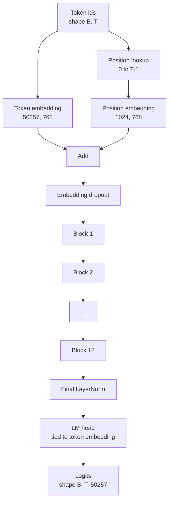
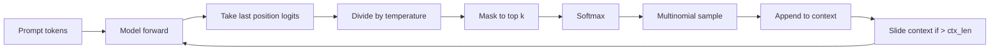

# GPT Model Assembly

> 十二个 blocks 堆叠，一个 token embedding，一个 learned position embedding，一个最终 LayerNorm，以及一个 tied language model head。这就是完整的 124 million parameter GPT model。本课把这些部件组装成一个可工作的 class，统计参数以确认模型匹配 reference 124M 形状，并用 multinomial sampling、temperature 和 top-k 生成文本。

**Type:** Build
**Languages:** Python
**Prerequisites:** Phase 19 lessons 30 to 34
**Time:** ~90 minutes

## 学习目标

- 把第 34 课的 transformer block 组装成完整 GPT model：token embedding、position embedding、N blocks、final LayerNorm、language model head。
- 复现 124 million parameter 配置：vocab 50257、context 1024、embedding 768、十二 heads、十二 layers。
- 把 language model head weights 绑定到 token embedding，并解释为什么在这个规模下它能节省约 38 million 参数。
- 用 multinomial sampling、temperature scaling 和 top-k truncation，从 prompt 生成文本，并用 sliding window 保持 context length。
- 对照 124M 目标测量 parameter count 和 forward pass cost。

## 问题

transformer block 本身什么也做不了。你需要把 token ids 变成 vectors，混入 positional information，让它们通过 stack，再投影回 vocabulary logits。忘记这四步中的任一步，模型要么无法 forward，要么 position information 漂移，要么不能说话。

模型形状也很重要。reference GPT-2 small 在上面的精确配置下是 124 million parameters。这些数字不是魔法。Vocab 50257 乘 embedding 768 是 token table。Position 1024 乘 768 是 position table。十二个 blocks，每个大约 7 million parameters，一共 84 million。最终 head 通过 weight tying 复用 token table。把这些部分相加，你会落在 124 million。如果构建出的模型 parameter count 不匹配 reference，说明你接线错了。

## 概念



Token ids 变成 token vectors。Position ids 变成 position vectors。两者相加并送入 stack。final LayerNorm 是 blocks 外部那个在每个现代变体中都保留下来的部件。LM head 复用 token embedding matrix，这就是 weight tying 的含义。

### Weight tying

token embedding 的形状是 `(vocab, d_model)`。language model head 需要从 `d_model` 投影回 `vocab`。两者互为转置。绑定两者意味着字面上使用同一个 parameter tensor 两次。在 vocab 50257、d_model 768 时，该矩阵有 38 million parameters。不绑定，你要付两次。绑定，你只付一次，而且还会得到稍干净的 gradient signal，因为 embedding 和 head 会一起更新。

### Position embedding 是 learned，不是 sinusoidal

GPT-2 发布时使用 learned position embedding。position table 是形状为 `(1024, 768)` 的一个 parameter tensor。模型在每次 forward 中查找 position 0 到 T-1，并把 lookup 加到 token embedding 上。这是最简单的 position schemes，RoPE、ALiBi、T5 relative bias 是替代方案，也是 124M reference 使用的方案。

### Generation: temperature, top-k, multinomial

Generation 是 autoregressive。每一步，模型会在每个 position 上返回完整 vocabulary 的 logits。你只取最后一个 position，除以 temperature，可选地把 top k 之外的所有 logits mask 为 negative infinity，softmax 得到 probabilities，并从结果分布中 sample 一个 token。



三个 knobs，三种不同行为。Temperature 接近零会塌缩为 greedy。Temperature 一匹配模型自然分布。Top-k 一是 greedy。Top-k 四十过滤长尾。组合很重要；下一课关于训练的内容会用 generation 作为 qualitative eval signal。

## Build It

`code/main.py` 实现：

- `class GPTConfig` dataclass，带 124M 默认值：`vocab_size=50257`、`context_length=1024`、`d_model=768`、`num_heads=12`、`num_layers=12`、`mlp_expansion=4`、`dropout=0.1`、`use_bias=True`、`weight_tying=True`。
- `class GPTModel`，包含 token embedding、position embedding、embedding dropout、十二个 `TransformerBlock`s、final LayerNorm，以及在 flag 设置时与 token embedding 绑定的 `lm_head`。
- `count_parameters` helper，返回唯一 parameter count，因此会尊重 weight tying。
- `generate` function，执行 temperature、top-k、multinomial 和 sliding window context。
- demo 构建模型，在 reference 124M 旁打印 parameter count，并从固定 prompt 生成短序列，展示 pipeline 端到端工作。

运行它：

```bash
python3 code/main.py
```

输出：与 124M reference 并列的 parameter count、来自随机 prompt 的 generated token ids，以及在 tying 打开时 LM head 和 token embedding 共享 storage 的确认。

为了让 demo 快速运行，脚本还会端到端运行一个 tiny config，`d_model=64`、`num_layers=2`，并内联打印 generated token sequence。124M config 会被构建，但只执行 parameter count 和一次 forward pass。

## Stack

- `torch` 用于 tensor math、autograd 和 module plumbing。
- `code/main.py` 在本地重新实现第 34 课的相同 block pattern。

## 野外生产模式

三种模式决定模型只是能跑，还是能发布。

**Initialize the residual projections small.** attention 的 output projection 和 MLP 的第二个 linear 都直接馈入 residual add。用和其他 linear 相同的 standard deviation 初始化它们，会让 residual stream 随深度增长，并把 final LayerNorm 推入 hot regime。对这两个 projections，把 std 按 `1 / sqrt(2 * num_layers)` 缩放；residual stream 会在十二层中保持合理范围。

**Cache the position id tensor, do not recompute.** `torch.arange(T)` 每次 forward 都会分配新内存。在 `__init__` 中为最大 context 分配一次，每次调用切出前 T 个 entries，跳过 allocator 往返。

**Tie weights at parameter level, not just by copying.** 设置 `lm_head.weight = token_embedding.weight` 会共享 tensor；copy 不会。optimizer 需要更新一个 parameter，autograd graph 需要一次 accumulation。如果 copy，head 会偏离 embedding，weight tying 对你没有任何收益。

## Use It

- 本课中的 model class 与下一课训练的 model 是相同形状。
- 把 learned position embedding 换成 RoPE，就得到 LLaMA family，而无需触碰 block 或 head。
- 把 GELU 换成 SiLU，把 LayerNorm 换成 RMSNorm，就得到 LLaMA family 的其余变化。
- generation function 可用于任何 logits source，不只限于本模型。你可以在第 37 课从 pretrained GPT-2 文件拉取 logits，并复用同一个 generation loop。

## 练习

1. 解除 LM head 与 token embedding 的绑定并重新统计参数。验证差值是 50257 乘 768 = 38 million。
2. 用构造时计算的 sinusoidal table 替换 learned position embedding。确认模型仍可 forward，parameter count 下降 786,432。
3. 给 generation 添加 `greedy=True` flag，跳过 sampling 并选择 argmax。确认 sequence 跨运行保持确定性。
4. 添加 `repetition_penalty` knob，在 softmax 前把 prompt 或 generated history 中任意 token 的 logit 除以常量。在固定 prompt 上展示大于一的值会减少 output 中的重复次数。
5. 在 `top_k` 旁边添加 `top_p` (nucleus) sampling。用两行检查 retained tokens 的概率和超过 `top_p`。

## 关键术语

| Term | What people say | What it actually means |
|------|-----------------|------------------------|
| Weight tying | “Tied embeddings” | LM head 和 token embedding 共享同一个 parameter tensor；节省 vocab times d_model 个参数，并匹配 GPT-2 reference |
| Position embedding | “Learned positions” | 一个独立表，形状为 (context length, d_model)，加到 token vectors 上；端到端学习 |
| Sliding window context | “Context cap” | 当 prompt 加 generated tokens 超过 context length 时，丢弃最旧 tokens，使 active window 适配 |
| Top-k sampling | “K truncation” | 保留数值最高的 K 个 logits，把其余 mask 为 negative infinity，并在剩余部分上 softmax |
| Temperature | “Sampling temperature” | 在 softmax 前把 logits 除以 T；T 小于 1 会锐化，T 等于 1 保持自然分布，T 大于 1 会变平 |

## 延伸阅读

- Phase 19 lesson 34，了解本模型堆叠的 block。
- Phase 19 lesson 36，了解用 cross entropy loss 驱动这个模型的 training loop。
- Phase 19 lesson 37，了解如何把 pretrained GPT-2 weights 加载进这个精确 architecture。
- Phase 7 lesson 07 (GPT causal language modeling)，了解 next token prediction 的数学。
- Phase 10 lesson 04 (pre training mini GPT)，了解同一 architecture 上的原始训练流程。
