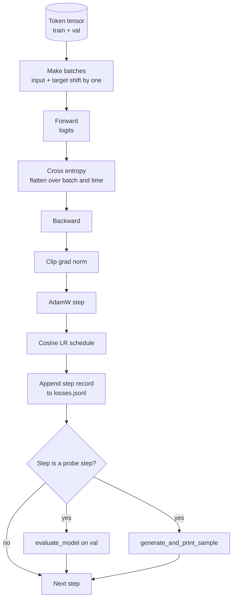

# Training Loop 与 Evaluation

> 不测量的 loop 会撒谎。本课构建驱动 GPT model 的 training loop：带 weight decay split 的 AdamW、warmup 加 cosine learning rate schedule、`calc_loss_batch` helper、held out data 上的 `evaluate_model` pass、每 K 步一次的 `generate_and_print_sample` qualitative probe，以及你之后可以绘图的 JSONL loss log。同一个骨架会训练你以后构建的每个 decoder LLM。

**Type:** Build
**Languages:** Python
**Prerequisites:** Phase 19 lessons 30 to 35
**Time:** ~90 minutes

## 学习目标

- 构建 training loop，用 next token prediction 的正确 input 和 target alignment 计算 cross entropy loss。
- 配置 AdamW，把 weight decay 应用于 weight tensors，而不应用于 LayerNorm 或 bias tensors。
- 实现带 linear warmup 和 cosine decay 的 learning rate schedule，并读取随时间变化的 LR。
- 用 `evaluate_model` 在 held out split 上评估，使 eval loss 可跨运行比较。
- 每 K 步用 `generate_and_print_sample` 生成 qualitative sample，在 loss curve 发现前捕捉 divergence。
- 把 per step loss 持久化到 JSONL，这样你可以重新加载、绘图，并把 training log 作为 deliverable 发布。

## 问题

一个只打印 loss 且不做其他事的 training script 会以三种方式失败。它无法告诉你 loss 是否因为正确原因下降，模型可能只是过拟合 training set，而从未学习。它无法告诉你 divergence 是否正在开始，loss 可能某一步 spike 后恢复，也可能某一步 spike 后崩溃。它无法告诉你模型学到了什么，loss 是标量，而 generated sample 是段落。loop 不测量时，这三种失败都会隐藏。

本课中的 loop 以三种方式测量。每步测 training batch 上的 loss。每 K 步测 held out batch 上的 loss。每 K 步从固定 prompt 生成 continuation。training log 落在 JSONL 中，因此 artifact 是 loop 的证词。

## 概念



两个不明显的部分是 loss alignment 和 AdamW decay split。

### Loss alignment

模型在每个位置预测下一个 token。如果 input batch 是 tokens `[t0, t1, t2, t3]`，target batch 必须是 `[t1, t2, t3, t4]`。Cross entropy 在 flat shape `(batch * seq, vocab)` 上计算，对应 flat target `(batch * seq,)`。忘记 shift，你会把模型训练成预测自己，它会收敛到零 loss，却学不到任何有用东西。

### AdamW decay split

Weight decay 正则化 weight tensors，但不正则化 normalization scales 或 biases。把 decay 放在 LayerNorm scale 上会慢慢把 scale 推向零，并破坏 normalization。把 decay 放在 bias 上数学上无害，但浪费 cycles。标准 split 是：matrix shaped tensors，linear weights、embedding tables，获得 decay；任何看起来像 scale 或 shift 的东西都不获得 decay。

### Warmup plus cosine schedule

Warmup 会在几百步内把 learning rate 从零提升到目标值，让 optimizer state 有时间填充。Cosine decay 会在剩余步骤中把 learning rate 降回接近零，让最终阶段以小 step size 微调 weights。这个组合是 open weights LLM training 中最常见的 schedule，因为它消除了最初一千步和最后一千步中的大部分脆弱时刻。

### Held out evaluation

`evaluate_model` 从 validation split 运行固定数量 batches，累积 loss，除以 batch count，然后返回。没有 gradient。没有 dropout。在相同 seed 和相同 split 下，这个数字跨运行可复现。把 held out loss 与 training loss 并排报告，是发现 overfitting 的方式。

### Qualitative sampling as an early signal

一个 training loss 漂亮下降但 generated samples 全是同一个 token 的模型坏了。一个 loss curve 看起来平坦但 generated samples 逐渐变成 coherent words 的模型正在学习。qualitative probe 比读完整曲线更快，并能捕捉标量遗漏的模式。

## Build It

`code/main.py` 实现：

- `make_batches(token_ids, batch_size, context_length)`，把长 token tensor 切成 input 和 target pairs。
- `calc_loss_batch(model, inputs, targets)`，执行 forward、flatten，并返回标量 cross entropy。
- `evaluate_model(model, val_loader, max_batches)`，在 no grad 下迭代固定数量 validation batches，并返回 mean loss。
- `generate_and_print_sample(model, prompt, max_new_tokens)`，在固定 prompt 上运行第 35 课 generation function 并打印结果。
- `build_param_groups(model, weight_decay)`，产出 two-group AdamW parameter list。
- `cosine_with_warmup(step, warmup_steps, total_steps, max_lr, min_lr)`，返回给定 step 的 LR。
- `train(...)`，运行 loop，持久化 `outputs/losses.jsonl`，并每 `eval_every` steps 打印 eval loss 和 sample。
- demo 在 synthetic data 上训练 tiny model 少量 steps，写 JSONL log，并在 probe points 打印 eval loss 和 sample。demo 在 CPU 上远低于一分钟。

运行它：

```bash
python3 code/main.py
```

输出：per step loss line、每个 probe step 的 eval loss、每个 probe step 的 generated sample，以及最终的 `outputs/losses.jsonl`，你可以对每行用 `json.loads` 加载。

## Stack

- `torch` 用于 autograd、optimizer 和 modules。
- `main.py` 在本地重新实现第 35 课的 `GPTModel` 和 supporting modules。

## 野外生产模式

三种模式把教科书 loop 变成你可以让它跑一整夜的东西。

**Gradient norm clipping is non negotiable.** 坏 batch，异常数据、LR spike、数值边界情况，会产生巨大 gradient，抹掉数小时训练。`backward` 后、`step` 前执行 `torch.nn.utils.clip_grad_norm_(params, max_norm=1.0)`，会让 optimizer 保持在安全范围。clipping value 是自由参数；一是能撑过大多数设置的默认值。

**Resumable JSONL logging, not pickled state.** 以 `{"step": int, "train_loss": float, "lr": float}` 行记录 per step loss 的 JSONL 是持久的：任何崩溃都会留下可读 artifact，你可以 grep，可以用三十行 Python 绘图，也可以通过读取最后一步恢复训练。Pickled state 会绑定生成文件时的精确 module layout，跨 refactor 很脆弱。

**Eval batches drawn from a fixed slice.** validation tokens 在脚本启动时被切成 batches，而不是即时切分。可复现性依赖 eval batches 在每次运行中相同；否则比较两次运行的 eval loss，测到的 batch shuffle 和模型一样多。

## Use It

- 本课中的 loop 是在真实数据上训练 124M model 的同一个骨架。把 synthetic token tensor 换成 `datasets` 风格 loader，loop 不变就能运行。
- JSONL log 是把 training run 变成证据的 deliverable。下一课会用一份 log 对比 freshly trained checkpoint 和 pretrained one。
- qualitative sample probe 是标量 loss 无法替代的兜底检查。

## 练习

1. 添加 `weight_decay_groups()` unit tests，确认 scale 和 bias parameters 进入 no decay group，而 linear 和 embedding weights 进入 decay group。
2. 用小文本文件中的 bytes 替换 synthetic random tokens，让 demo 在可读内容上训练。验证 generated sample 使用文件中出现的 characters。
3. 给 cosine schedule 添加一个 `min_lr` floor，值为 `max_lr` 的 10 percent，并重新绘图。
4. 除 JSONL log 外，每 `eval_every` steps 保存 checkpoint。添加 `resume_from` flag，重新加载 model state 和 optimizer state。
5. 在 loss 旁边记录 per step throughput，tokens per second，并确认它保持在稳定区间。

## 关键术语

| Term | What people say | What it actually means |
|------|-----------------|------------------------|
| Loss alignment | “Shift by one” | Input tokens 位于 positions 0..T-1，target tokens 位于 positions 1..T；cross entropy 在 flattened shapes 上计算 |
| Decay split | “Two groups” | AdamW 接收带 weight decay 的 matrix shaped tensors，以及无 decay 的 scale 或 bias tensors |
| Warmup | “Ramp” | learning rate 在固定步数内从零爬升到目标值，让 optimizer state 可以填充 |
| Eval batches | “Held out batches” | validation token tensor 的固定切片，在脚本启动时切一次，并在每次 probe 中相同使用 |
| Qualitative probe | “Sample print” | 每 K 步从固定 prompt 进行一次短 generation，用来捕捉 loss alone 隐藏的 failure modes |

## 延伸阅读

- Phase 19 lesson 35，了解 loop 驱动的 model。
- Phase 19 lesson 37，了解如何把 pretrained weights 加载进同一个 model。
- Phase 10 lesson 04 (pre training mini GPT)，了解真实数据上的流程。
- Phase 10 lesson 10 (evaluation)，了解 cross entropy loss 之外更广的 eval surface。
