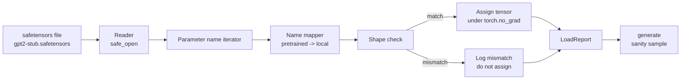

# 加载 Pretrained Weights

> 从零训练一个 124 million parameter model 是预算决策；加载一个已发布 checkpoint 是周二的日常。本课把 pretrained GPT-2 风格 weights 从 safetensors 文件加载到第 35 课的精确 architecture 中，逐块走查 parameter name mapping，并做 sanity generation 证明加载成功。没有网络，没有第三方 loaders，没有不透明魔法。

**Type:** Build
**Languages:** Python
**Prerequisites:** Phase 19 lessons 30 to 36
**Time:** ~90 minutes

## 学习目标

- 用 `safetensors` Python library 读取 safetensors 文件，并检查 tensor names 和 shapes。
- 把每个 pretrained parameter name 映射到第 35 课 GPT model 内部的一个 parameter。
- 处理已发布 GPT-2 weights 与本 track 模型之间不同的两套 name conventions：`wte/wpe/h.N.attn.c_attn/c_proj` 和 `mlp.c_fc/c_proj`，对应本地命名的 `tok_embed/pos_embed/blocks.N.attn.qkv/out_proj` 和 `mlp.fc1/fc2`。
- 在任何 weight assignment 发生前，检测并拒绝 shape mismatch，并给出清晰错误。
- 用已加载 weights 生成短 continuation，并确认 tokens 来自加载后的分布，而不是随机初始化分布。

## 问题

已发布 weights 不是为你的 architecture 打包的。它们携带原始实现使用的 names。pretrained 文件有 `transformer.h.0.attn.c_attn.weight`，形状为 `(2304, 768)`；你的模型期望 `blocks.0.attn.qkv.weight`，形状为 `(2304, 768)`，这是不同 layout convention 下的同一个矩阵，或者你的模型使用 `nn.Linear`，它以转置方式存储矩阵。同一个 parameter 会以三种微妙不同的身份出现，name、shape、byte layout，loader 必须调和三者。

盲目复制的 loader 会把正确 tensor 放错位置，你得到一个生成胡言乱语的模型。shape 不同时拒绝复制但什么都不记录的 loader，会让你猜哪个 tensor 没有落地。本课的 loader 是显式的：每次 assignment 都记录，每个 shape 都检查，一个 `LoadReport` 汇总 hits、misses 和 shape mismatches，让你能读懂发生了什么。

## 概念



name mapper 只是从 string 到 string 的函数。shape check 是一个 if。assignment 发生在 `torch.no_grad()` 内部，因此 autograd 不会跟踪加载。report 保存每个 name 的结果。

### GPT-2 命名约定

已发布 GPT-2 weights 位于如下 names 下：

| Pretrained name | Shape | Meaning |
|-----------------|-------|---------|
| `wte.weight` | (50257, 768) | Token embedding |
| `wpe.weight` | (1024, 768) | Position embedding |
| `h.N.ln_1.weight` | (768,) | LayerNorm 1 scale at block N |
| `h.N.ln_1.bias` | (768,) | LayerNorm 1 shift at block N |
| `h.N.attn.c_attn.weight` | (768, 2304) | Fused QKV linear weight |
| `h.N.attn.c_attn.bias` | (2304,) | Fused QKV linear bias |
| `h.N.attn.c_proj.weight` | (768, 768) | Attention output projection |
| `h.N.attn.c_proj.bias` | (768,) | Attention output projection bias |
| `h.N.ln_2.weight` | (768,) | LayerNorm 2 scale |
| `h.N.ln_2.bias` | (768,) | LayerNorm 2 shift |
| `h.N.mlp.c_fc.weight` | (768, 3072) | MLP fc1 weight |
| `h.N.mlp.c_fc.bias` | (3072,) | MLP fc1 bias |
| `h.N.mlp.c_proj.weight` | (3072, 768) | MLP fc2 weight |
| `h.N.mlp.c_proj.bias` | (768,) | MLP fc2 bias |
| `ln_f.weight` | (768,) | Final LayerNorm scale |
| `ln_f.bias` | (768,) | Final LayerNorm shift |

需要提前计划两个意外。`c_attn`、`c_proj`、`c_fc` linears 的矩阵，相对于 `nn.Linear.weight` 期望的形状，是转置存储的。loader 会在 assignment 时转置。LM head 完全不在文件中；模型依赖与 `wte` 的 weight tying，所以一旦 `wte` 落地，head 就通过 aliasing 设置。

### 本地命名约定

本 track 中的模型使用描述性 names：

| Local name | Meaning |
|------------|---------|
| `tok_embed.weight` | Token embedding |
| `pos_embed.weight` | Position embedding |
| `blocks.N.ln1.scale` | LayerNorm 1 scale at block N |
| `blocks.N.ln1.shift` | LayerNorm 1 shift |
| `blocks.N.attn.qkv.weight` | Fused QKV |
| `blocks.N.attn.qkv.bias` | Fused QKV bias |
| `blocks.N.attn.out_proj.weight` | Attention output projection |
| `blocks.N.attn.out_proj.bias` | Output projection bias |
| `blocks.N.ln2.scale` | LayerNorm 2 scale |
| `blocks.N.ln2.shift` | LayerNorm 2 shift |
| `blocks.N.mlp.fc1.weight` | MLP fc1 |
| `blocks.N.mlp.fc1.bias` | MLP fc1 bias |
| `blocks.N.mlp.fc2.weight` | MLP fc2 |
| `blocks.N.mlp.fc2.bias` | MLP fc2 bias |
| `final_ln.scale` | Final LayerNorm scale |
| `final_ln.shift` | Final LayerNorm shift |

mapping 是固定函数。本课把它作为 dict 提供，loader 会迭代它。

### Stub fixture

真实 GPT-2 weights 有 0.5 GB。demo 不下载它们；第一次运行时，它会生成一个小 safetensors fixture，采用精确 GPT-2 命名约定，并使用适合 12-block model、d_model 为 192 而不是 768 的 shapes。fixture 具有正确结构，能触发 loader 中每条 code path。把 fixture 换成真实文件，loader 无需修改即可工作。

## Build It

`code/main.py` 实现：

- 一个第 35 课 `GPTModel` 的小型副本，使本课自包含。
- `make_pretrained_to_local(num_layers)`，展开 per-layer entries。
- `load_safetensors(model, path)`，迭代 names、映射它们、检查 shape、转置 conv1d-style weights，并在 `torch.no_grad()` 下 assignment。返回 `LoadReport`。
- `make_stub_safetensors(path, cfg)`，生成带精确 pretrained naming convention 的 fixture 文件。
- demo 首次运行时创建 `outputs/gpt2-stub.safetensors`，构建 fresh model，捕获 random init 的一个 generated continuation，加载 stub，再捕获另一个 continuation，打印两者，并验证两者不同，说明加载确实改变了模型。

运行它：

```bash
python3 code/main.py
```

输出：fixture path、per-name load log、`LoadReport` summary、load 前 continuation、load 后 continuation，以及一个故意注入 fixture 的坏 tensor 上的 shape mismatch，从而覆盖失败路径。

## Stack

- `safetensors` 用于 on disk format 和 streaming reader。
- `torch` 用于模型和 assignment math。
- 不使用 `transformers`，不使用 `huggingface_hub`，不做网络调用。

## 野外生产模式

三种模式让 loader 经受住你没有创建的 weights。

**Always validate the file before any assignment.** 打开文件，列出每个 tensor name 及其 dtype 和 shape，运行带 shape checks 的完整 mapping，并且只有在成功后才开始 assignment。半加载模型是静默失败机器。

**Log every assignment with the source name and the destination name.** 当某些东西看起来不对时，log 会告诉你哪个 tensor 落到了哪里；替代方案是读 hexdumps。本课中的 `LoadReport` dataclass 跟踪 `loaded`、`missing`、`unexpected` 和 `shape_mismatch` lists，并在最后打印 summary。

**The LM head is a weight tying alias, not a separate copy.** 加载 `tok_embed` 后设置 `model.lm_head.weight = model.tok_embed.weight` 是 canonical pattern。把 embedding matrix 复制到新的 `lm_head.weight` parameter 会破坏 tying，并悄悄翻倍 parameter count。

## Use It

- loader 适用于任何使用 pretrained naming convention 的 safetensors 文件。真实 GPT-2 文件，small / medium / large / xl，无需代码改动即可工作；只有 model config 不同。
- 一旦你更新 name map，同一模式可扩展到 LLaMA、Mistral、Qwen weights。shape checks 和 report 保持相同。
- load 后 sanity generation 是快速 gate：如果 post-load samples 看起来像 pre-load samples，说明加载没有改变模型，也就意味着 mapping 静默漏掉了每个 tensor。

## 练习

1. 给 loader 添加 `dtype` argument，在 assignment 期间把每个 tensor cast 到目标 dtype，`bfloat16`、`float16`、`float32`。确认 `float32` model 可以 downcast 到 `bfloat16` 并仍能生成。
2. 添加 `expected_layers` argument，拒绝加载 `h.N` indices 与模型 `num_layers` 不匹配的 checkpoint。
3. 把 loader 接入第 35 课 generation function，产出两个并排 samples：一个来自 random init，一个来自 loaded fixture。
4. 添加 export path：用 pretrained naming convention 把当前 model state 写进新的 safetensors 文件。round trip loader，并确认 report 有零 shape mismatches。
5. 扩展 `NAME_MAP` 以处理 LLaMA naming convention，无 biases、RMSNorm、fused qkv layout，并在你生成的 stub LLaMA fixture 上重新运行 loader。

## 关键术语

| Term | What people say | What it actually means |
|------|-----------------|------------------------|
| Name map | “Key remapping” | 从 pretrained tensor names 到 local parameter names 的函数；通常是 literal dict，其中每个 layer index 都通过 loop 展开一组 entries |
| Shape mismatch | “Bad shape” | pretrained tensor 存在于 mapped name 下，但它的 dimensions 与 local parameter 不一致；loader 拒绝 assignment 并记录 pair |
| Transpose-on-load | “Conv1d layout” | 已发布 GPT-2 以 nn.Linear 期望值的转置形式存储 attention 和 MLP projections；loader 在 assignment 时转置 |
| Weight tying alias | “Shared LM head” | 设置 model.lm_head.weight = model.tok_embed.weight，让 head 和 embedding 共享 storage；因为这一点，head 不在文件中 |
| Load report | “Coverage summary” | 一个小 dataclass，跟踪 loaded、missing、unexpected 和 shape_mismatch lists；打印它就是判断加载是否成功的方式 |

## 延伸阅读

- Phase 19 lesson 35，了解接收 weights 的 architecture。
- Phase 19 lesson 36，了解产生相同形状 checkpoint 的 training loop。
- Phase 10 lesson 11 (quantization)，了解当内存紧张时如何处理 loaded weights。
- Phase 10 lesson 13 (building a complete LLM pipeline)，了解围绕 load 和 inference 的完整生命周期。
