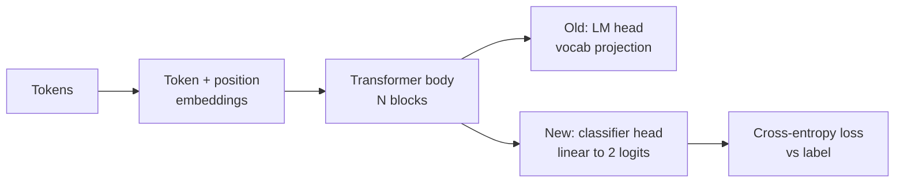
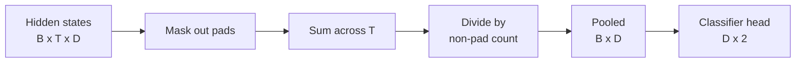
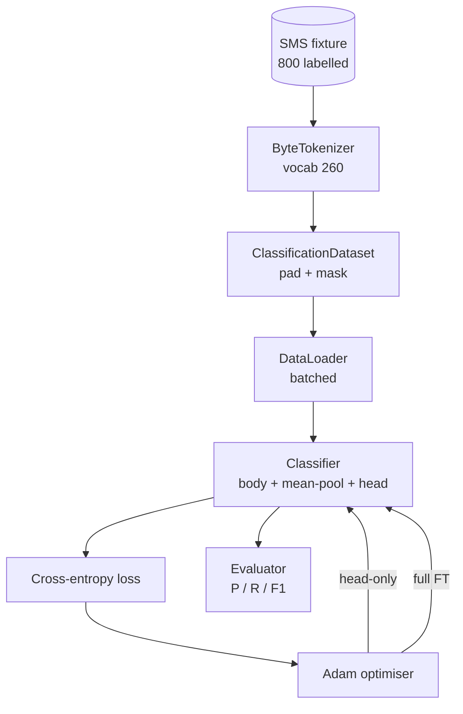

# 综合实战第 38 课：通过 Head Swap 做分类器微调

> Track B 的第一个综合实战。pretrained language model 是一叠 self-attention blocks，末尾接一个 token-prediction head。当你想做 spam vs ham 时，head 错了，但 body 基本是对的。本课撕掉 head，把一个二分类 linear layer 粘到 pooled representation 上，并用两种方式训练 classifier：只训练 final-layer，以及 full fine-tuning。eval 是 held-out split 上的 precision、recall 和 F1。你会学到每种策略带来什么、代价是什么。

**Type:** Build
**Languages:** Python (torch, numpy)
**Prerequisites:** Phase 19 lessons 30-37 (NLP LLM track: tokenizer, embedding table, attention block, transformer body, pre-training loop, checkpointing, generation, perplexity)
**Time:** ~90 minutes

## 学习目标

- 在不重新初始化 body 的情况下，用 classification head 替换 language-model head。
- 实现两种 training regimes：frozen body，也就是 head-only，以及 full fine-tuning，并共用一个 training loop。
- 构建 tokenizer-aware data pipeline，执行 padding、mask padding，并 pool attention output。
- 从 raw logits 计算 precision、recall、F1 和 confusion matrix。
- 理解 parameter count、training time 和 head-room 之间的取舍。

## 问题

你在通用 corpus 上预训练了一个小 transformer。output head 把最后 hidden state 投影到 1000-token vocabulary。现在你有 800 条标记为 spam 或 ham 的 SMS messages，并想要一个 binary classifier。存在三个选项。

错误选项是在 800 个 examples 上从零训练 fresh classifier。pretrained model 的 body 已经编码了有用结构：word identity、position、简单 co-occurrence。扔掉它会浪费构建它的 compute。

两个正确选项是 head swap 且冻结 body，以及 head swap 且让 body 可训练。Head-only training 很快，几乎不耗内存，并且在这么少的数据上很少 overfit。Full fine-tuning 更慢，在小数据上可能 overfit，但当 downstream domain 偏离 pretraining corpus 时能达到更高 accuracy。

本课构建两者，让你在同一个 fixture 上比较它们。

## 概念

模型是一个函数 `f_theta(tokens) -> hidden_states`。head 是一个函数 `g_phi(hidden) -> logits`。换 head 意味着保留 `theta` 并替换 `g_phi`。body 的参数是昂贵部分。head 只是一个 linear layer。

两个可训练 parameter sets 很重要：

- `theta`，也就是 body：每个 attention block 数以万计的 weights。
- `phi`，也就是 head：`hidden_dim * num_classes` 个 weights 加一个 bias。

在 head-only training 中，你对 `phi` 计算 gradients，并对 `theta` 归零。PyTorch 允许你通过在 body parameters 上设置 `requires_grad=False` 做到这一点。optimizer 于是只看到 head，body 保持 frozen。

在 full fine-tuning 中，你让 gradients 反向流经整个 stack。body 的 weights 漂移以适配 classification objective。风险是在小数据上发生 catastrophic forgetting：body 的 pretraining 被 overfitting noise 冲掉。

## Pooling 问题

classifier 需要每个 sequence 一个 vector，而不是每个 token 一个 vector。三种常见选择：

- **Mean pool**：跨 sequence 平均 hidden states，并按 attention mask 加权。
- **CLS pool**：前置一个 special token，并只使用它的 output。这是 BERT 的做法。
- **Last-token pool**：使用最后一个非 padding token。这是 GPT-class classifiers 的做法。

本课使用带显式 attention-mask weighting 的 mean pooling。它最简单，能在不同 sequence lengths 上给出稳定信号，并且不需要预训练 CLS token。

## 数据

`code/main.py` 中确定性生成八百条 SMS messages，平衡为 400 spam 和 400 ham。generator 使用固定 seed，选择 templates 并替换 slot fillers，发出长度在 5 到 25 tokens 之间的 messages。真实 datasets 有这个 fixture 没有的噪声。fixture 的重点是可复现性。

数据按 80/20 切分：640 train，160 test。切分是 stratified，因此 test set 保持 50/50 平衡。带已知平衡的 held-out set 让 precision 和 recall 成为诚实数字。

## Metrics

Binary classification 中 class 1 是 positive class，也就是 spam。计数为：

- `TP`：预测为 spam，实际是 spam。
- `FP`：预测为 spam，实际是 ham。
- `FN`：预测为 ham，实际是 spam。
- `TN`：预测为 ham，实际是 ham。

三个头部 metrics：

- `precision = TP / (TP + FP)`。被标记为 spam 的 messages 中，有多少比例实际是 spam？
- `recall = TP / (TP + FN)`。实际 spam 中，有多少比例被模型标记？
- `F1 = 2 * P * R / (P + R)`。两者的 harmonic mean。

confusion matrix 会把四个 counts 打印成 2x2 grid。demo 会对两种 training regimes 都把它写到 stdout。

## 架构

body 是一个故意做小的 transformer：vocab 260、hidden 64、4 heads、2 blocks、max sequence 32。它足够小，可以在 CPU 上九十秒内把两种 regimes 都训练到收敛。它在本课中并非 pretrained；相反，`pretrain_quick` helper 会在同一个 fixture 的文本上做五个 epochs 的 LM training，给 body 一个非平凡起点。这让课程保持自包含。

## 你将构建什么

实现是一个 `main.py` 加一个 test module，`code/tests/test_main.py`。

1. `ByteTokenizer`：把 bytes 映射到 ids，保留一个 pad id。
2. `Block`：带 multi-head attention 和 feed-forward layer 的 transformer block。Pre-norm。
3. `LMBody`：token + position embeddings，加上一叠 blocks。返回 hidden states。
4. `MeanPool`：对 sequence axis 做 mask-weighted average。
5. `Classifier`：body、pool、linear head。两种 regimes 共用同一个 body instance。
6. `freeze_body` 和 `unfreeze_body`：切换 body parameters 上的 `requires_grad`。
7. `train_classifier`：一个共享 loop。接受 model 和 optimizer，optimizer 根据可训练 parameter group 配置。
8. `evaluate`：运行 test set，并返回 `Metrics(precision, recall, f1, confusion)`。
9. `run_demo`：短暂预训练 body，然后训练并评估 head-only，再做 full，打印两份 reports，并以零退出。

## 为什么比较重要

head-only regime 通常训练更快，underfit 也更优雅。在这个 fixture 上，head-only 训练二十个 epochs 后，你通常会看到 precision 接近 0.9，recall 接近 0.85。Full fine-tuning 花费大约三倍时间，并且根据 random seed，在两边几个点内落地。

本课不选赢家。它教你读取数字和成本。在 800 examples 和 tiny body 上，head-only 是正确选择。在 80,000 examples 和更大 body 上，full fine-tuning 开始值得。你从本课带走的契约是 API：同一个 `train_classifier` function 处理两者，而 toggle 是一次调用。

## Stretch goals

- 添加第三种 regime，只解冻最后一个 block。这有时称为 partial fine-tuning。它成本低于 full FT，学到的东西多于 head-only。
- 添加 learning-rate scheduler。head 上使用 cosine schedule，并在 body 上使用更小的 constant rate，是常见生产设置。
- 用 learned attention pool 替换 mean pooling：一个带单个 learned query 的小 attention layer。这在更长 sequences 上经常胜过 mean pool。

实现给了你 hooks。测试固定契约。数字由你继续推进。
