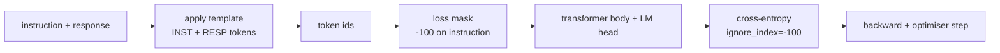
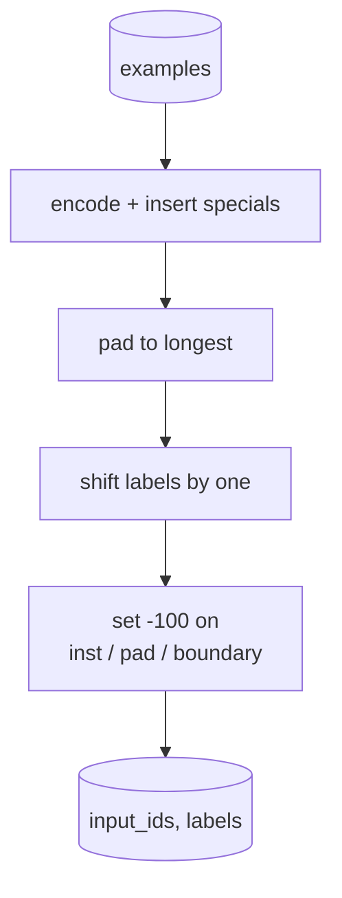
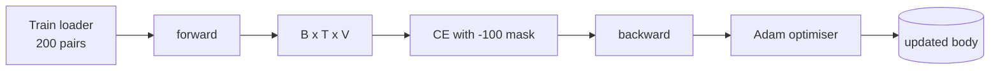

# 综合实战第 39 课：通过监督微调做指令调优

> pretrained base model 可以延续序列，但不能遵循指令。supervised fine-tuning 是修复这一点的最小改动：把 instruction 和 desired response 的成对 examples 喂给模型，并训练 body 预测 response tokens。技巧是你只希望 loss 计算 response，而不是 instruction。本课构建一个 Alpaca-style SFT loop，使用 custom collate function 以 `ignore_index=-100` mask instruction tokens，在 200 个 instruction-response pairs 上训练，并用 exact-match 在 held-out split 上评估。

**Type:** Build
**Languages:** Python (torch, numpy)
**Prerequisites:** Phase 19 lessons 30-37 (NLP LLM track: tokenizer, embedding table, attention block, transformer body, pre-training loop, checkpointing, generation, perplexity)
**Time:** ~90 minutes

## 学习目标

- 把成对 instruction-response data 格式化为带显式 boundary tokens 的单一 causal sequence。
- 构建 collate function，mask instruction tokens，使 cross-entropy 只计算 response tokens。
- 在 SFT objective 下训练 tiny transformer body，并观察 eval metric 变化。
- 实现尊重 response-start boundary 的 greedy generation 和 temperature-sampled generation。
- 在 generated completions 上计算 held-out exact-match。

## 问题

在 next-token prediction 上训练出的 base model 不知道什么是 instruction。给它字符串 `"What is the capital of France?"`，它会继续这个问题，或编造一个新句子。模型有语言，但没有格式契约。

SFT contract 是一个字符串 template。每个训练 example 变成一个带三个区域的 sequence：

```text
<INST> What is the capital of France? <RESP> The capital of France is Paris.
```

boundary tokens 是训练时保留的 special tokens。模型学习到 `<RESP>` 之后的一切是 response，而 response 才会被评分。base model 的 next-token objective 仍然适用；它只是训练在每个 example 都有这种形状的 corpus 上。

但这里有个陷阱。如果把整个 sequence 喂给 vanilla cross-entropy loss，你也在训练模型预测 instruction tokens。instruction 是已给定的。你希望这些 positions 上 gradient 为零。修复方式是 mask。

## 概念



`ignore_index` 是 `torch.nn.functional.cross_entropy` 的一个特性。任何 target position 等于 `ignore_index`，都会贡献零 loss 和零 gradient。PyTorch 约定值是 `-100`。collate function 为每个 example 构建两个 tensors：`input_ids`，完整 sequence，以及 `labels`，它是 `input_ids` 的副本，但 instruction positions 被覆盖为 `-100`。

模型在 forward pass 中看到整个 sequence；attention 可以 attend 到 instruction。loss 只计算 response tokens。这正是你想要的：condition on the instruction，predict the response。

## 数据

`main.py` 中确定性生成两百个 instruction-response pairs。它们覆盖六种 task types：

- factual single-shot，X 的首都
- arithmetic
- list extraction
- one-sentence summary
- code，print、sort
- definition

每个 task 都有 templated instruction 和 deterministic response。这故意很简单。Exact-match 很脆弱，本课使用的 fixture 中正确答案是一个特定字符串。真实 SFT datasets 需要 fuzzy metrics；原则相同。

切分为 160 train，40 test。test set 覆盖全部六种 task types，因此可以报告 per-category exact-match。

## Tokenisation and Padding

tokeniser 是 byte-level，带三个保留 specials：

- `INST_ID = 256`：标记 instruction region 的开始。
- `RESP_ID = 257`：标记 instruction 和 response 之间的边界。
- `PAD_ID = 258`：用于 variable-length batches 的 padding。

sequence 是 `[INST] inst_bytes [RESP] resp_bytes [PAD]*`。collate function：

1. Tokenises each example.
2. Pads every example in the batch to the longest sequence in the batch.
3. Builds `labels` = `input_ids` shifted by one (causal LM target), with:
   - instruction region replaced by `-100`.
   - padding region replaced by `-100`.
   - `RESP_ID` boundary position itself replaced by `-100` (you do not train the model to predict the boundary token; it predicts what follows).



shift 是标准 causal trick：`input_ids` 的位置 `i` 预测位置 `i+1`，所以 `labels[i] = input_ids[i+1]`，input 会丢弃最终位置，target 会丢弃第一个位置。mask 在 shift 之后应用，才能落到正确 positions 上。

## Training



loop 是标准 PyTorch SFT loop。Adam、learning rate 大约 3e-4 到 1e-3，在这个 fixture 上十到二十个 epochs，没有 scheduler。模型足够小，hidden 96、2 blocks、max length 64，可以在 CPU 上两分钟内训练到收敛。

每五个 epochs，loop 会在 held-out set 上运行一个 tiny eval pass，并打印 exact-match。看到 exact-match 从 epoch one 的 0.0 移动到 epoch fifteen 附近的 0.85，是本课的回报：你能同时看到模型学习格式和答案。

## Generation

eval time 时，模型获得 instruction prefix `[INST] inst_bytes [RESP]`，并生成 tokens，直到：

- sequence 达到 `max_len`，或
- 模型发出 special stop heuristic：两个连续句末 bytes，`.`、`!`、`?`。

本课提供 greedy decoding 加一个可选 temperature sampler。Exact-match 使用 greedy，因为 temperature 会让 metric 变成随机。真实系统经常 sample，然后用 fuzzy 方式 judge；那条 pipeline 是第 41 课。

## Exact-Match Evaluation

Exact-match 是最严格的文本 metric。predicted response string 会被规范化，lowercase、strip whitespace、collapse double spaces，并与同样规范化后的 reference response 对比。每个 example 的 metric 是 1 或 0。aggregate 是 mean。

真实 SFT pipelines 会用 token-level F1，第 41 课，和 judge model 补充 exact-match。Exact-match 仍然有用，因为它无歧义；如果它说 0.7，就表示正好 70 percent 的 test instructions 逐字符产生了 gold response。

## 你将构建什么

实现是一个 `main.py` 加 tests。

1. `InstructionTokenizer`：带 reserved specials 的 byte-level encoder。编码 instruction prefix 或完整 pair。
2. `make_dataset`：用固定 seed 生成跨六种 task types 的 200 pairs。
3. `SFTDataset`：每个 example 返回 `(input_ids, labels)`，已经准备好 mask。
4. `sft_collate`：dynamic padding，构建 batch tensor，在 instruction 和 pad positions 上设置 `-100`。
5. `TinyGPT`：transformer body 加 tied 或 untied LM head。
6. `train_sft`：SFT loop，带 per-epoch eval hooks。
7. `generate`：从 prefix 进行 causal decode，可 greedy 或 sampled，带 stop heuristic。
8. `exact_match`：normalized string comparison，返回 `[0, 1]` 中的 float。
9. `run_demo`：构建 data，训练二十个 epochs，评估，打印 per-category breakdown，并在成功时以零退出。

## 为什么 mask 重要

没有 mask，loss 会把 instruction tokens 当作 targets。模型学习预测 instruction。这是不同 objective，会从两方面产生更差模型。第一，model capacity 被浪费用来重建用户总会提供的输入。第二，在大多数 batches 中，instruction tokens 多于 response tokens，因此 response loss 在 gradient sum 中更小；optimizer 在你关心部分上的 effective learning rate 低于你的预期。mask 不是 polish；它就是 objective。

## Stretch goals

- 添加 learning-rate warmup 后接 cosine decay。SFT 对 LR 比 pretraining 更敏感。
- 添加 per-token loss logging，并绘制训练中的 loss curve。注意 early epochs 由 template tokens，`<RESP>`、common prefixes，主导，而 later epochs 由真实 answer tokens 主导。
- 把 eval 扩展到 BLEU-1 或 chrF。Exact-match 会低估产生同义改写但答案相同的模型。
- 添加带 multi-turn formatting 的 chat template，并在包含 follow-ups 的 fixture 上训练。

实现给了你 format contract、mask 和 loop。从 base model 到 instruction follower 的 objective 变化，只是一个 collate function。
