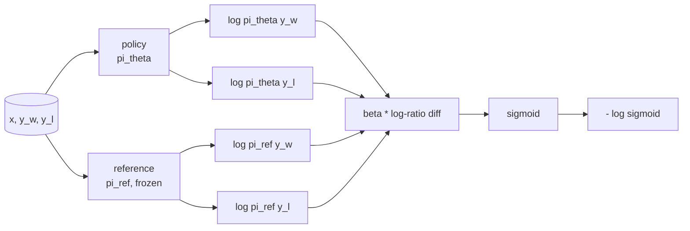
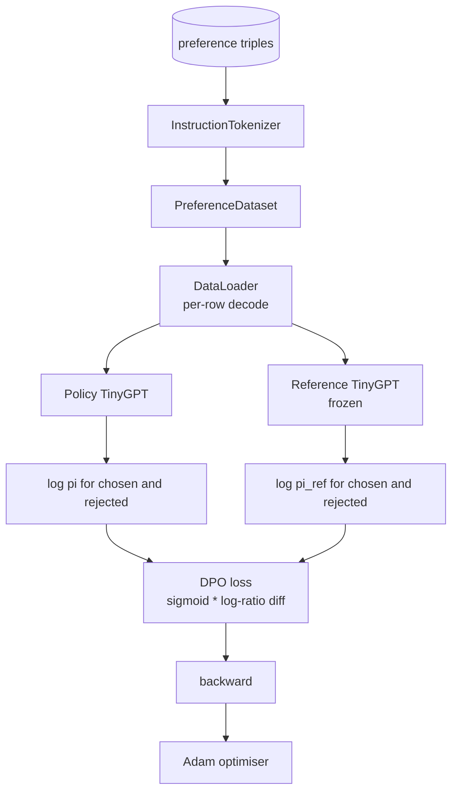

# 综合实战第 40 课：从零实现 Direct Preference Optimization

> Reward models 和 PPO 是经典 RLHF stack。DPO 把这套 stack 折叠成一个单一 supervised loss，直接让 policy 拟合 preference pairs。本课从 reward-difference identity 推导 DPO loss，提供一个可工作的 reference model 加 policy model，计算 per-token log-probabilities，并在 chosen 和 rejected completions 的 preference fixture 上训练 tiny transformer。测试固定 loss math 和 gradient direction，让你知道实现匹配论文。

**Type:** Build
**Languages:** Python (torch, numpy)
**Prerequisites:** Phase 19 lessons 30-37 (NLP LLM track: tokenizer, embedding table, attention block, transformer body, pre-training loop, checkpointing, generation, perplexity)
**Time:** ~90 minutes

## 学习目标

- 把 DPO loss 推导为 scaled log-ratio difference 上的 sigmoid，并把它连接到 implicit reward。
- 构建 reference model + policy model 对，其中 reference frozen，policy trainable。
- 在两个模型下计算 sequence-level log-probabilities，并 mask prompt tokens。
- 在 `(prompt, chosen, rejected)` triples 上训练 policy，并观察 chosen log-prob 相对 rejected 上升。
- 用测试固定 loss math、gradient sign 和 reference invariance 的行为。

## 问题

你有一个 SFT model。它会遵循指令，但 outputs 不均匀；一些 completions 清晰，一些啰嗦或错误。你还有一个小的 preference pairs 数据集：对同一个 prompt，人类把一个 completion 标为 chosen，另一个标为 rejected。

经典 RLHF 答案是两阶段 pipeline。在 preferences 上训练 reward model。用 PPO 根据 reward 优化 policy。这可行但昂贵：PPO 期间内存中有两个模型，需要 KL control 让 policy 接近 reference，reward model 脆弱时会 reward hacking。

DPO 用一个单一 supervised loss 替代两个阶段。reward model 从不显式存在。policy 直接在 preference pairs 上训练，并带有朝向 SFT reference 的显式 KL penalty。在 Bradley-Terry preference model 下具有相同最优解，但代码少得多。

## 概念

从 Bradley-Terry model 开始。给定 prompt `x` 和两个 completions，`y_w` chosen 与 `y_l` rejected，人类偏好 `y_w` 的概率是

```text
P(y_w > y_l | x) = sigmoid( r(x, y_w) - r(x, y_l) )
```

其中 `r` 是某个 latent reward function。RLHF 先从 preferences 拟合 `r`，再训练 policy `pi`，用 KL anchor 最大化 `r`：

```text
max_pi   E_{x, y~pi} [ r(x, y) ] - beta * KL(pi || pi_ref)
```

DPO 推导观察到，该 objective 下的最优 policy `pi*` 可以用 `r` 写成闭式形式：

```text
pi*(y | x) = (1/Z(x)) * pi_ref(y | x) * exp( r(x, y) / beta )
```

对 `r` 重排：

```text
r(x, y) = beta * ( log pi*(y | x) - log pi_ref(y | x) ) + beta * log Z(x)
```

`log Z(x)` 项对 `y_w` 和 `y_l` 相同，它依赖 `x` 而不是 `y`，所以计算 preference difference 时会抵消：

```text
r(x, y_w) - r(x, y_l) = beta * ( log pi_theta(y_w|x) - log pi_ref(y_w|x)
                                - log pi_theta(y_l|x) + log pi_ref(y_l|x) )
```

代入 Bradley-Terry sigmoid，并对 preference pairs 取 negative log likelihood：

```text
L_DPO(theta) = - E_{(x, y_w, y_l)} [
  log sigmoid( beta * ( log pi_theta(y_w|x) - log pi_ref(y_w|x)
                       - log pi_theta(y_l|x) + log pi_ref(y_l|x) ) )
]
```

这就是 loss。它是每个 example 单个 scalar 上的 sigmoid，由四个 log-probabilities 计算。不需要单独 reward model。不需要 PPO。loss 中没有 KL term；KL constraint 被烘焙进 closed-form derivation。



## Gradient 的符号

任何 training run 前都有一个有用 sanity check。对 `log pi_theta(y_w | x)` 求 gradient：

```text
d L_DPO / d log pi_theta(y_w | x) = - beta * (1 - sigmoid(z))
```

其中 `z` 是 sigmoid 的 argument。它对所有 `z` 都为负，这意味着：提高 policy 对 chosen completion 的 log-probability 会降低 loss。对称地，对 `log pi_theta(y_l | x)` 的 gradient 为正：提高 rejected log-probability 会提高 loss。训练会把 chosen 推高，把 rejected 压低。reference 是 frozen；它不会移动。

## 数据

本课提供十二个 preference triples。每个是 `(prompt, chosen, rejected)`。chosen completion 短而精确。rejected 啰嗦、偏题或错误。pairs 覆盖第 39 课相同的 task families，capital、arithmetic、list，因此从 SFT base 开始的 policy 有合理起点。

fixture 故意很小。生产中 DPO 用数万 pairs；这里的重点是 loss math 和 loop 可以在 tiny dataset 上端到端运行，并且 chosen-versus-rejected log-prob gap 会明显增长。

## Reference Invariance

DPO 实现必须谨慎处理 reference model。reference 是冻结在原地的 SFT model。三个性质必须成立：

- reference parameters 永远不接收 gradients。
- reference log-probabilities 在 epochs 之间永远不变。
- policy 从与 reference 相同的 weights 开始。（最优 `theta` 是 reference 加 learned update；把 policy 初始化为 reference 的副本是定义良好的起点。）

实现通过以下方式强制这些性质：

- 在 forward passes 中用 `torch.no_grad()` 包裹 reference。
- 在每个 reference parameter 上设置 `requires_grad=False`。
- reference 构建后，通过 `policy.load_state_dict(reference.state_dict())` 构造 policy。

## 架构



模型与第 39 课使用的 TinyGPT 相同，decoder-only、causal、byte tokeniser。reference 和 policy 共享 architecture；policy 的 weights 在训练中从 reference 漂移，而 reference 保持固定。

## 你将构建什么

实现是一个 `main.py` 加 tests。

1. `InstructionTokenizer`：带 `INST` 和 `RESP` specials 的 byte tokeniser。形状与第 39 课相同。
2. `TinyGPT`：decoder-only transformer。形状与第 39 课相同，因此即使跳过了 39，本课也自包含。
3. `make_preferences`：返回十二个 `(prompt, chosen, rejected)` triples。
4. `sequence_log_prob`：给定 model、prompt prefix 和 completion，返回 completion 上 next-token log-probabilities 的总和，不包含 prompt-position contribution。
5. `dpo_loss`：接收四个 log-probabilities 和 `beta`，返回 per-example loss tensor 和用于 logging 的 implicit reward delta。
6. `train_dpo`：per-epoch loop，在 policy 和 reference 下计算 chosen 与 rejected log-probs，应用 loss，并执行 Adam step。
7. `evaluate_margins`：返回任意时刻 policy 下 mean chosen-rejected log-probability margin。
8. `run_demo`：从一个小 warm-up pretrain 构建 reference 和 policy，复制 weights，训练三十步，打印 per-step loss 和 margin，并在成功时以零退出。

## 为什么 DPO 有效

DPO 在 Bradley-Terry preference model 下与 RLHF 数学等价，只差 reward 的参数化。implicit reward `r(x, y) = beta * (log pi(y|x) - log pi_ref(y|x))` 可以从 preferences 中识别到一个关于 `x` 的函数，而该函数会在差值中抵消。closed-form policy 让你跳过显式 reward model。KL constraint 被结构性地强制执行：`pi` 相对 `pi_ref` 的任何偏离都会让 log-ratio 更大，而 sigmoid 会饱和，当 policy 移动太远时会抑制 gradient。reference 是你的安全网。

## Stretch goals

- 给 log-probability sum 添加 length normalisation：除以 completion length。Length bias 是已知 DPO failure mode，模型会偏好较短 completions，因为它们的 log-probabilities 在绝对值上更大。
- 添加 loss 的 IPO variant：用 `(z - 1)^2` 替换 sigmoid + log。比较 fixture 上的 convergence。
- 添加 label-smoothing 参数，在硬 chosen-rejected label 和 uniform 0.5 之间插值。
- 用更小、更便宜的 model 替换 reference，类似 knowledge distillation flavour。

实现给了你 loss、reference invariance 和 training loop。数学才是本课。代码让数学具体化。
