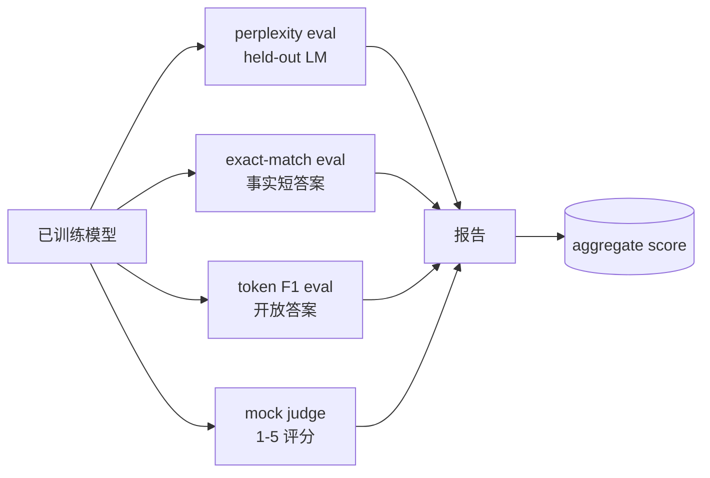
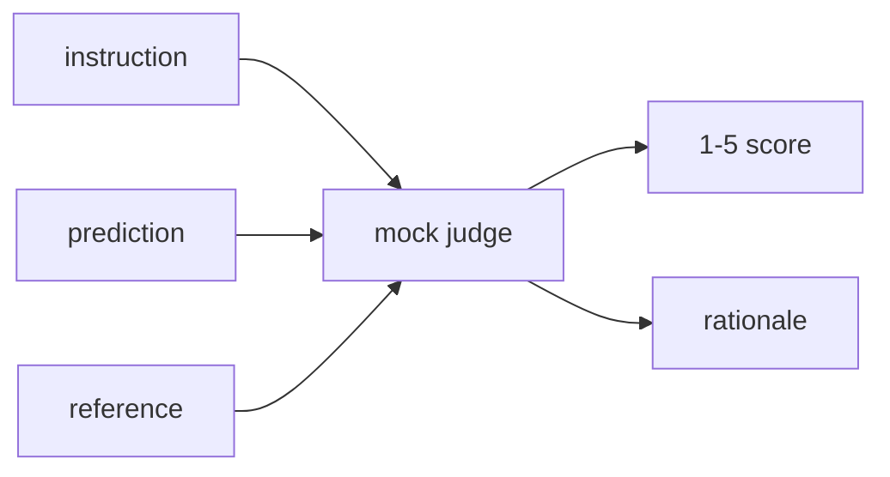
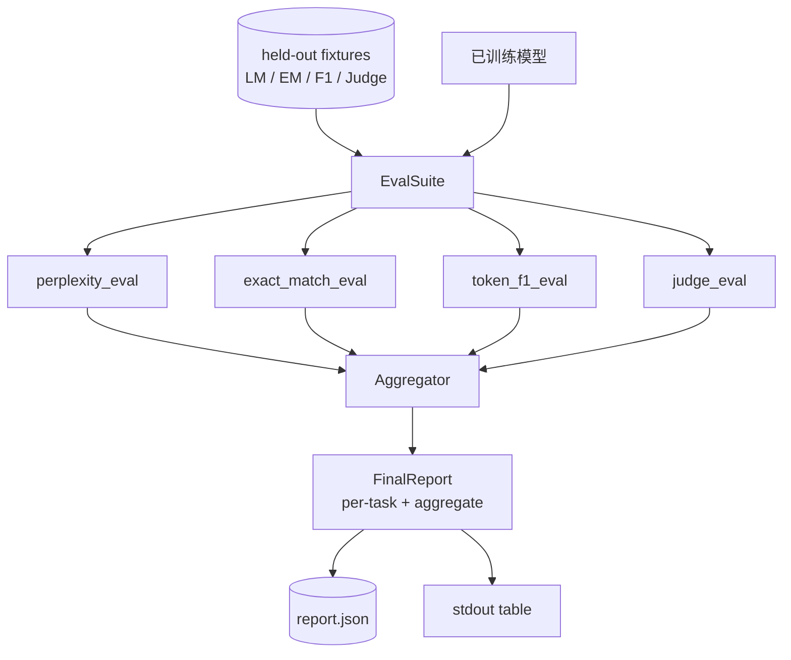

# 综合实战第 41 课：完整评估流水线

> 训练是可以用 loss 曲线监控的部分。评估是你必须亲自设计的部分。本课构建一条统一 eval pipeline：接收任意训练好的语言模型，在它上面运行四类不同评估，把结果汇总成按任务拆分的报告，并提供一个本地 mock LLM-as-judge，让循环在无网络环境下也能运行。四类评估覆盖每个可交付模型都需要的维度：语言建模，也就是 perplexity；短答案正确性，也就是 exact-match；开放答案相似度，也就是 token F1；以及定性评分，也就是 judge。

**Type:** Build
**Languages:** Python (torch, numpy)
**Prerequisites:** Phase 19 lessons 30-37 (NLP LLM track: tokenizer, embedding table, attention block, transformer body, pre-training loop, checkpointing, generation, perplexity)
**Time:** ~90 minutes

## Learning Objectives

- 在 tiny transformer 上用 masked-token 计数计算 held-out perplexity。
- 对短事实提示运行 exact-match eval。
- 在预测字符串和参考字符串之间用规范化计算 token-level F1。
- 构建本地 mock LLM-as-judge，用 1-5 分评价模型输出。
- 把四类 eval 汇总成单个加权报告，并给出按任务拆分的结果。

## The Problem

单一指标永远描述不了一个语言模型。Perplexity 说明模型拟合语言分布的程度，但不说明它是否会回答问题。Exact-match 说明模型是否输出了黄金字符串，但会惩罚正确的改写。Token F1 宽容改写，却会被错误内容里的词面重叠骗过。LLM-as-judge 能覆盖定性维度，但昂贵且带随机性。

你真正想要的 pipeline 同时包含这四者。每个 eval 覆盖其他指标漏掉的一个维度。每个 eval 跑在为该指标整理过的不同 held-out 数据子集上。最终报告把每个任务的数字和 aggregate 并排展示，让评审能一眼看出模型正在做哪些取舍。

本课在一个文件里从头到尾构建这条 pipeline。

## The Concept

每个 eval 都是从 `(model, dataset) -> EvalResult` 的函数。结果携带 metric value、供检查的逐样本细节，以及用于 aggregate 的名称。pipeline 通过配置组合它们，配置决定运行哪些 eval 以及如何加权。

## Perplexity, properly counted

Perplexity 是 `exp(mean negative log-likelihood per token)`。实现有两个陷阱：

- 平均值必须按真实 token 位置计算，而不是按 batch * sequence 计算。Padding token 必须从分母排除，否则 perplexity 会显得比真实情况更好。
- 模型预测下一个 token，所以位置 `i` 的 logits 预测位置 `i+1` 的 token。这里的 off-by-one 错误不会立刻报错，loss 仍然能训练，但指标会失去意义。

eval 会在每个 batch 中对非 pad 位置累加 `-log p(token)`，同时记录 token count，最后再相除。这样比对每个 batch 的 perplexity 求平均更安全，因为后者会低估短序列权重，也更符合教材定义。

## Exact-match, with normalisation

harness 在比较前会规范化 prediction 和 reference：

- 转小写。
- 去掉首尾空白。
- 把内部连续空白折叠成一个空格。
- 如果两边只差末尾终止标点，就去掉末尾的 `.`, `!`, `?`。

规范化让 exact-match 在实践中可用。模型说 `"Paris"` 是对的，说 `"Paris."` 也是对的，说 `"  paris  "` 也对。该指标仍然要求规范化后的答案是同一个字符串。

## Token F1, the right way

Token F1 是基于 bag-of-tokens 计算的 precision 和 recall 的调和平均。步骤：

1. 规范化 prediction 和 reference，规则与 exact-match 相同。
2. 拆成 token 列表，使用 whitespace tokenisation。
3. 计算 multiset intersection。
4. Precision = `intersection_count / len(pred_tokens)`。Recall = `intersection_count / len(ref_tokens)`。F1 = 调和平均。

如果 prediction 和 reference 都为空，F1 为 1，表示 vacuous match。如果只有一边为空，F1 为 0。这个模式与 SQuAD evaluation reference 一致，也能在改写场景下产出稳定数字。

## Local Mock LLM-as-Judge

真实 judge 是 API 后面的 frontier model。本课的 judge 必须离线运行。mock judge 是一个确定性 scorer，接收 instruction、模型 prediction 和 reference，返回 `{1, 2, 3, 4, 5}` 中的分数和一行 rationale。评分规则明确：

- 如果规范化 prediction 等于规范化 reference，给 5。
- 如果 prediction 和 reference 的 token F1 至少为 0.8，给 4。
- 如果 token F1 位于 `[0.5, 0.8)`，给 3。
- 如果 token F1 位于 `[0.2, 0.5)`，给 2。
- 否则给 1。

这不是真正的 judge，但接口是对的。以后只需替换一个函数就能接入真实模型，pipeline 不需要关心。

## Aggregation

aggregate 是归一化 eval score 的加权平均。每个 eval 都报告 `[0, 1]` 中的数字：

- Perplexity：用 `1 / (1 + log(perplexity))` 归一化。perplexity 为 1 映射到 1，无穷大映射到 0。
- Exact-match：已经在 `[0, 1]` 中。
- Token F1：已经在 `[0, 1]` 中。
- Judge：除以 5。

权重可配置。默认组合是 0.2 perplexity、0.3 exact-match、0.3 token F1、0.2 judge。权重选择是产品决策，本课暴露这个旋钮方便你实验。

## Architecture

`EvalSuite` 是一个很薄的 orchestrator。每个单独 eval 都是 free function，接收 `(model, tokenizer, dataset, config)` 并返回 `EvalResult`。`Aggregator` 收集结果并产出最终报告。demo 会打印表格并写一份 JSON，供下游 CI 读取。

## What you will build

实现是一个 `main.py` 加测试。

1. `TinyGPT`：与第 38-40 课相同的 decoder-only 架构，放在这里让本课独立运行。
2. `InstructionTokenizer`：带 INST / RESP / PAD special 的 byte tokeniser。
3. 四个 fixtures：LM corpus、EM set、F1 set、judge set。每类 20 个样本，确定性生成。
4. `perplexity_eval`：返回带 perplexity value 和 per-token loss histogram 的 `EvalResult`。
5. `exact_match_eval`：返回 mean EM 和逐样本 records。
6. `token_f1_eval`：返回 mean token F1 和逐样本 records。
7. `mock_judge` 和 `judge_eval`：逐样本 score 和 rationale，以及整个集合的 mean score。
8. `Aggregator.normalise`：每个 eval 的归一化规则。
9. `Aggregator.aggregate`：加权平均和组装好的 report。
10. `run_demo`：短暂训练一个 tiny model，运行四个 eval，打印 report table，写 JSON，并在成功时以 0 退出。

## Reading the report

报告有三层。最上层是 aggregate score。下面是四个 per-eval 数字。再下面是用于诊断的逐样本 breakdown。失败的 CI run 通常只需要 aggregate，但追查 regression 的评审需要逐样本 breakdown，看到模型在哪些输入上错了。

JSON dump 使用稳定 key，方便 CI dashboard 跨版本画趋势线。pretty-printed table 是给训练结束后盯着终端的人看的。

## Stretch goals

- 加一个 calibration eval：模型的 softmax probabilities 是否匹配 accuracy？按 confidence 分桶，并报告每桶 empirical accuracy。
- 加一个 robustness eval：给每个样本标注 perturbation，比如 typo、paraphrase、distractor，并报告每类扰动的指标下降。
- 用 HTTP 后面的真实模型替换 mock judge。函数签名不变。
- 加 per-task weight learning：不要固定权重，而是根据模型偏好排序拟合权重。

实现会给你四类 eval、aggregator 和 report。真实 evaluation pipeline 会在其上叠加更多维度，但模式不变：每个 eval 一个函数，一个 aggregator，一个 report。
