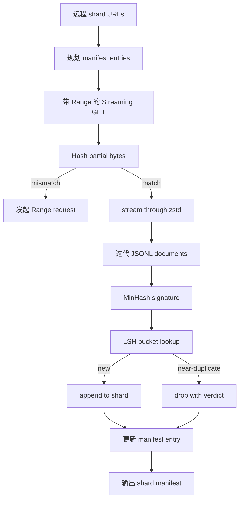

# Large Corpus Downloader

> 训练语言模型早在第一次 forward pass 之前就开始了。语料必须落盘、解压、去重、可寻址，并且在网络到 4 percent 掉线之前就设计好 resume 方案。本课构建一个 streaming downloader：拉取压缩 shard，用 Zstandard 边下载边解压，用 MinHash 加 locality-sensitive hashing 给近重复内容打指纹，并写出后续 pipeline 可以信任的 shard manifest。

**Type:** Build
**Languages:** Python
**Prerequisites:** Phase 19 lessons 30-37
**Time:** ~90 minutes

## Learning Objectives

- 用 `urllib` 流式读取远程 shards，并用 `zstandard` 解压，不把整个文件缓冲到内存。
- 通过对已验证 byte offset 发起 HTTP `Range` 请求来恢复部分下载。
- 为每篇文档构建 MinHash signature，并用 LSH 分桶，让近重复文档发生碰撞。
- 输出 shard manifest，包含 content hash、byte size、document count 和 dedup verdict。

## The Problem

第一次在 200 GB 语料上训练时，网络在 percent 41 掉线，脚本带着 `urllib` exception 退出。第二次在 percent 78 掉线。到 percent 99 时，你已经把循环重写了三次。从第一分钟就要为两个失败设计：partial-download resume 和 duplicate document removal。两者都有成熟解法，也常被跳过，因为 pipeline 一开始只是一个后来长出牙齿的 `requests.get` 一行代码。

Resume 是 HTTP 问题。server 必须支持 `Range`，client 必须把 verified offset 记录到磁盘，verified offset 必须能在进程死亡后保留。如果 offset 和文件哪怕差一个 byte，恢复下载就会写入垃圾，语料会以只有 tokenization 阶段才显现的方式损坏。

Deduplication 是 signature 问题。Exact-hash dedup 抓不到近重复：同一篇 Wikipedia 文章带三个不同 boilerplate footer，同一个代码文件换了 license header，同一篇博客每条链接多了 tracking parameter。MinHash 加 LSH 可以用次线性成本抓住这些重复。成本是每篇文档一个 signature 和每个 signature 一次 bucket lookup。

## The Concept



### Streaming with `urllib`

标准库 `urllib.request.urlopen` 返回 file-like object。把它包进 `zstandard.ZstdDecompressor().stream_reader`，bytes 就会从网络经 decompressor 流入 document iterator，不会把压缩 shard 或解压后的 shard 整体放进内存。唯一的内存成本是 line buffer、当前文档的 MinHash signature 和 LSH index。

### Resume with `Range`

downloader 为每个 shard 写两个文件：shard 本身和 `.partial.json` checkpoint。checkpoint 记录 `verified_bytes`、`expected_size`、`sha256_prefix`，也就是前 `verified_bytes` 个 bytes 的 hash，以及 source URL。启动时 downloader 读取 checkpoint，对磁盘上的 bytes 重新计算 `sha256_prefix`，只有匹配才 resume。如果 hash 错误，就丢弃 partial 并从 byte zero 重新下载。因为 verified bytes 会被检查而不是被假设，所以 silent corruption 不可能通过。

### MinHash plus LSH

MinHash 用固定空间估计两个集合的 Jaccard similarity。对文档来说，集合是文本的 shingles，也就是 overlapping n-grams。signature 是 `k` 个最小 hash 值，每个来自一个独立 hash function。Jaccard similarity 为 `s` 的两篇文档，在 signature 任意单个分量上相等的概率为 `s`。

LSH 接着把 `k` 个分量分成 `b` 个 bands，每个 band 有 `r` 行，其中 `k = b * r`。两篇文档至少在一个 band 碰撞的概率是 `1 - (1 - s^r)^b`，它会在你用 `(b, r)` 调好的 `s` 附近形成明显阈值。典型 corpus dedup 的阈值是 `s = 0.8`，LSH 文献常用 `k = 128`、`b = 32`、`r = 4` 达到这个效果。

### Shard manifest as a contract

downloader 唯一的持久输出是 manifest。manifest 对每个 shard 保存 URL、解压后的 byte count、document count、dedup 后的 unique document count，以及最终 shard file 的 sha256。下游 tokenization 读取 manifest，而不是读取目录列表。如果 shard 缺失或 sha256 错误，manifest 会让下一阶段拒绝启动。manifest 是“数据已下载”和“数据已下载且可验证”之间的分界线。

## Build It

`code/main.py` 实现：

- `ShardPlanner`：读取 shard URL 列表并生成 planned manifest entries。
- `StreamingDownloader`：打开带可选 `Range` 的 `urllib` stream，写入临时文件，在每个 chunk 更新 `.partial.json` checkpoint，并在 resume 时验证 sha256 prefix。
- `ZstdDocIterator`：把 file-like stream 包进 `zstandard.ZstdDecompressor`，每行产出一篇文档。
- `MinHasher`：用固定 hash seeds 为字符串生成 `k` 分量 signature。
- `LSHIndex`：按 band 给 signatures 分桶并报告 collisions。
- `Dedup`：组合 hasher 和 index，为每篇文档标注 `keep` 或 `near_duplicate`，并带上匹配的 shard id。
- `ManifestWriter`：收集 per-shard stats 并写出 `manifest.json`。

文件底部的 demo 会在磁盘构建一个小的 synthetic corpus，用 `zstandard` 压缩，通过 `file://` URL 下载、去重，并打印 manifest。

Run it:

```bash
python3 code/main.py
```

脚本以 0 退出并打印 manifest summary。

## Production Patterns

四个模式能把本课扩展到真实语料。

**Checkpoint before write.** `.partial.json` 必须在 bytes 追加到 shard 之前 `fsync`。否则断电会反转顺序：shard bytes 已在磁盘上，checkpoint 没有它们，下次 resume 以为 verified bytes 更少，重复的 suffix bytes 会损坏文件。先 checkpoint，再 write。这与 write-ahead log 是同一纪律。

**Sharded LSH index.** 200 GB 规模下，全语料一个 LSH index 放不进 RAM。按 first band hash 分区 LSH index，把分区存到磁盘，只查询新 signature 会进入的分区。成本是每篇文档多一次磁盘读取；收益是 LSH index 不再是硬内存上限。

**Tombstone, not delete.** 被丢弃的 duplicates 会在 manifest 中记录 verdict `near_duplicate` 和它碰撞到的 keeper shard id。删除会丢掉 duplicate 和 keeper 之间的链接。Tombstone 保留 audit trail，也允许下游 pass 以后改变 threshold。

**Per-shard sha256 in the manifest, plus a manifest sha256.** manifest 本身也获得 content hash。下游阶段先验证 manifest hash，再信任 per-shard entries。否则 manifest 就是 silent attack surface：攻击者只要能编辑一个文件，就能损坏整条 pipeline。

## Use It

Production patterns:

- **Resume on every CI run.** CI runners 是 ephemeral。downloader 必须假设每次 run 都是 fresh disk，并从 cache 或 remote 恢复。`--cache-dir` 是一级 flag。
- **Dedup before tokenization.** Tokenization 昂贵。在同一篇文档上跑两次，是为了同一条 loss curve 支付两倍成本。Dedup 在 tokenization 上游，不在下游。
- **Manifest as merge gate.** training run 从 pinned commit 读取 manifest sha256。新 dataset version 需要新的 manifest commit。代码和数据之间的连接是 git，不是传说。

## Ship It

`outputs/skill-corpus-downloader.md` 在真实项目中会描述哪些 URL 输入 downloader、checkpoint directory 如何布局、dedup 使用什么 shingle width 和 `(k, b, r)` triple，以及 manifest 在版本控制中的位置。本课交付 engine。

## Exercises

1. 添加 `--shingle-width` flag，测量 width 3、5、9 下 dedup verdict 如何变化。为默认值辩护。
2. 通过 sniff magic bytes 在 zstd 旁边添加 gzip 支持。downloader 不应要求调用方指定 codec。
3. 添加 `--resume-only` 模式，如果找不到 checkpoint 就拒绝开始 fresh download。这在 CI 中能防止某次 run 意外重新拉取 200 GB。
4. 把 LSH index 移到 shelf 或 sqlite 文件，测量吞吐量与 in-memory variant 的差异。
5. 启动时添加 manifest sha256 check。如果磁盘上的 manifest 与 `manifest.lock` 中的 hash 不一致，downloader 应 fail closed。

## Key Terms

| Term | What people say | What it actually means |
|------|-----------------|------------------------|
| Shard | “一个文件” | 带自身 sha256 的语料自包含切片，是 resume 和 dedup 的单位 |
| MinHash signature | “指纹” | 一个集合的 `k` 分量 sketch，每个分量是对集合应用一个独立 hash 后的最小值 |
| LSH band | “Bucket” | 一组 `r` 个 signature 分量，作为碰撞检测的单个 bucket key |
| Verified bytes | “Resume offset” | 磁盘上 sha256 prefix 与 checkpoint 匹配的 bytes，是唯一安全的 resume offset |
| Manifest | “索引” | downloader 产物的唯一持久记录，包含 content hashes |

## Further Reading

- [RFC 7233](https://datatracker.ietf.org/doc/html/rfc7233)：HTTP Range requests，也就是 resume protocol。
- [Zstandard format specification](https://datatracker.ietf.org/doc/html/rfc8478)：让 streaming decompression 安全的 frame format。
- [MinHash](https://en.wikipedia.org/wiki/MinHash)：本课使用的 signature family。
- [Locality-sensitive hashing](https://en.wikipedia.org/wiki/Locality-sensitive_hashing)：dedup threshold 背后的 banding scheme。
- Phase 19 · 43：downloader 输入的 HDF5 tokenized corpus。
- Phase 19 · 44：在该 corpus 上训练的 cosine schedule。
- Phase 19 · 45：消费该 schedule 的 AMP loop。
