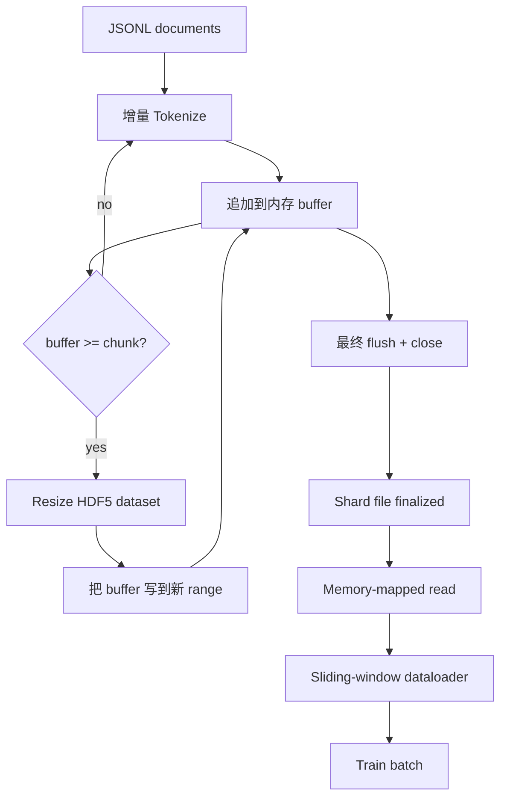

# HDF5 Tokenized Corpus

> 下载后的语料必须落到 trainer 能以 line speed 流式读取的布局里。磁盘上的 JSONL 扛不住 16 个 dataloader workers。带 resizable、chunked integer dataset 的 HDF5 可以。本课构建 streaming tokenization 到可变长 HDF5 dataset、跨多个文件的 sharded write、训练时的 memory-mapped read，以及能按正确 packing 产出定长序列的 sliding-window dataloader。

**Type:** Build
**Languages:** Python
**Prerequisites:** Phase 19 lessons 30-37
**Time:** ~90 minutes

## Learning Objectives

- 以确定性 chunking 把 documents 流式写入 resizable HDF5 integer dataset。
- 把写入分片到多个 HDF5 文件，让失败有边界并支持并行。
- 通过 HDF5 的 page-cache-backed chunked layout 读回 tokens，让 dataloader 只在 batch time 复制到 batch buffers。
- 实现 sliding-window dataloader，用明确 packing 规则输出定长 training sequences。

## The Problem

现代 language-model training run 会在几十个 workers 上以每秒数十万 samples 的速度读 tokens。磁盘上的 JSONL 遇到第一次 cold-cache page fault 就会倒下：JSON parser 慢，document boundaries 不可寻址，跳到 “sample 4,217,884” 需要扫描文件。即使 Parquet 压缩好，也不适合这里，因为 trainer 不想要 columns；它想要带 O(1) random access 的 flat token stream。

HDF5 适合，因为它提供 chunked、resizable、integer-only dataset，读取时对 page cache 友好。trainer 请求 `tokens[3,200,000 : 3,200,8192]`，HDF5 就把请求的 hyperslab 从 page cache 复制到新分配的 NumPy array。成本是每个 worker 一个打开的 file handle 和一个 chunk 大小的 page-cache footprint，这相比解码 JSONL 的成本可以忽略。

构建问题在于写入侧必须诚实。Resizable datasets 很容易误用：逐文档写会把 HDF5 文件碎片化到不可用；一次 resize 写入所有文档，进程死亡会丢掉整个 shard。正确纪律是 buffer-then-extend，让 buffer size 匹配 chunk size，并用 sharded write 把 workload 拆到多个文件，这样 crash 至多丢一个 shard。

## The Concept



### Resizable HDF5 done right

Token dataset 用 `maxshape=(None,)` 和固定 `chunks=(chunk_size,)` 创建。写入时把 tokens 缓存在长度为 `chunk_size` 的 NumPy array 中。buffer 满时，dataset 精确扩大 `chunk_size`，然后把 buffer 写入新 range。shard 结束时，把残余 buffer 写入最后一个 partial range。除最后一次外，每次写入都是 contiguous 且 chunk-aligned；最后一次由 shard 的 HDF5 attributes 中记录的 `token_count` 告诉 reader 在哪里截断。

### Sharded write

单个 HDF5 文件是 single point of failure。pipeline 并行写 shards：Phase 19 lesson 42 的每个 input shard 生成一个 HDF5 output shard。`shards.json` index 对每个 shard 记录 file path、token count、document count，以及 tokens 的 sha256。trainer 读取 `shards.json` 来计算 global offsets 并验证语料。

### Memory-mapped read

训练时，每个 worker 以 `swmr=True` 模式打开自己负责的 HDF5 文件，并请求 `tokens[start:stop]`。一旦 chunk 变热，HDF5 的 chunk layout 会让它成为 page-cache-backed read。worker 永远不会 materialise 整个文件：slice 被复制进 dataloader 的 batch buffer，随后 dataloader 在 batch time 再复制到 pinned-memory training tensor。hot path 每次 chunk transition 只有一个 syscall，其余都是 RAM access。

### Sliding-window dataloader

Dataloader 是唯一知道 training-sequence length 的阶段。它在 global token stream 中选一个随机 start index，读取 `window_size + 1` 个 tokens，然后返回 `(input, target) = (tokens[:-1], tokens[1:])`。不强制 document boundaries：window 可以跨两个 documents，中间有显式 `boundary_token_id`，让模型学会使用 separator。这是标准 packing 规则，也是初学者常忘的规则，结果得到一个 8 percent 是 boundary tokens、92 percent 是自然文本的语料。

## Build It

`code/main.py` 实现：

- `Tokenizer`：byte-level deterministic tokenizer，足够 demo 使用。接口是 `encode(text) -> list[int]` 和 `vocab_size`。
- `HDF5ShardWriter`：打开 resizable integer dataset，按 chunk size 缓存 tokens，以固定 strides resize 和写入，close 时把 `token_count` 和 `sha256` 记录为 HDF5 attributes。
- `ShardedTokenizationPipeline`：迭代输入 documents，把它们路由到 writer，并输出 `shards.json` index。
- `MmapTokenStore`：打开 shard files 做 memory-mapped reads，计算 global offsets，并暴露单个 `get_slice(start, stop)` API。
- `SlidingWindowDataloader`：从 global stream 选随机 windows，并产出 `(input_ids, target_ids)` NumPy arrays。

文件底部 demo 构建 tiny in-memory corpus，tokenize 成两个 shards，通过 memory map 打开，运行 dataloader 10 个 batches，并打印每个 batch 的 shape 和 checksum。

Run it:

```bash
python3 code/main.py
```

脚本以 0 退出并打印 batch checksums。

## Production Patterns

四个模式把本课扩展到真实 training run。

**Chunk size equals the typical read.** trainer 每个 sample 读取 `window_size + 1` tokens。把 HDF5 chunk 设置成 `window_size` 的倍数，读取就与 page cache 对齐。不匹配的 chunks 会让吞吐减半，因为每个 sample 触碰两个 chunks。

**Token count in attributes, not in the dataset.** dataset 的尾部 slice 可能未填满，因为 chunk size 不整除 document boundary。把真实 `token_count` 存成 dataset 上的 HDF5 attribute，让 reader 在该值处截断。否则 reader 会走到末尾的 zero-padded tokens，模型会学着预测 zero。

**Sharded sha256 with parallel verification.** 每个 shard 都有自己的 token bytes sha256。trainer 可以在训练开始前并行验证所有 shards。错误 sha256 会让 run 早失败，而不是在 epoch three 十六小时后失败。

**`swmr=True` on both sides, with `libver="latest"` on the writer.** Single-Writer-Multiple-Reader 模式要求 writer 用 `libver="latest"` 打开，先创建所有 dataset，再设置 `file.swmr_mode = True`。之后 writer 每次 resize 后必须调用 `dataset.flush()`，这样用 `swmr=True` 打开的 reader workers 才能看到一致数据。跳过 `libver="latest"` 或在 structural changes 后才启用 SWMR，是 “file is locked” 失败的常见来源。

## Use It

Production patterns:

- **One HDF5 per source shard.** downloader，lesson 42，每个 URL 输出一个 shard；tokenization，本课，每个 source shard 输出一个 HDF5。1:1 映射让 resume 和 partial-failure recovery 很简单。
- **Boundary token id.** boundary token 是 tokenizer vocab 的一部分，也是 dataloader 唯一注入的 token。如果模型应该忽略它，training loss 会 mask boundary token；否则模型学会把它作为 sequence separator。
- **`shards.json` as the source of truth.** 添加新 shard 意味着写 HDF5、计算 sha256、追加 entry。trainer 启动时只读一次该文件，永远不碰 directory listing。

## Ship It

`outputs/skill-hdf5-tokenized-corpus.md` 在真实项目中会描述哪个 tokenizer 输入 pipeline、什么 chunk size 匹配 trainer window、`shards.json` 在版本控制中的位置，以及 dataloader workers 如何跨文件分片。本课交付 engine。

## Exercises

1. 给 HDF5 writer 添加 `--compression gzip` flag，并测量 demo corpus 上的吞吐成本。为默认值辩护。
2. 给 sliding-window dataloader 添加 deterministic seed，验证相同 seed 的两次 run 产出相同 batches。
3. 添加 `--validate` 模式，读取每个 shard，重新计算其 tokens 的 sha256，并与 `shards.json` 比较。CI 应在训练开始前运行它。
4. 比较 chunk size 等于、等于一半、等于两倍 window size 时的 dataloader throughput。报告 page-cache effect。
5. 添加 `--max-document-tokens` flag，在写入时截断超长文档。为它相对 read time 决策的取舍辩护。

## Key Terms

| Term | What people say | What it actually means |
|------|-----------------|------------------------|
| Resizable dataset | “Append-only” | 带 `maxshape=(None,)` 的 HDF5 dataset，通过 chunk-sized stride 的 `resize` 调用增长 |
| Chunked layout | “HDF5 如何存储” | 固定大小的磁盘 pages，kernel 可 memory-map，dataloader 可连续读取 |
| `swmr` mode | “Read-while-write” | Single-Writer-Multiple-Reader 模式，让 dataloader workers 安全共享文件 |
| Shard index | “shards.json” | 所有 token shards 的持久 index，包含 offsets 和 content hashes |
| Sliding window | “Training sample” | global token stream 的定长切片，trainer 将其与 shift-by-one target 配对 |

## Further Reading

- [HDF5 chunking documentation](https://docs.hdfgroup.org/hdf5/v1_14/)：本课使用的 chunked、resizable dataset layout。
- [h5py user guide](https://docs.h5py.org/en/stable/)：HDF5 的 Python bindings。
- [NumPy memory mapping](https://numpy.org/doc/stable/reference/generated/numpy.memmap.html)：HDF5 通过 h5py 暴露出的 read-side primitive。
- Phase 19 · 42：输出会被本课 tokenized 的 downloader。
- Phase 19 · 44：消费该 dataloader 的 cosine schedule。
- Phase 19 · 45：包住 training step 的 AMP loop。
