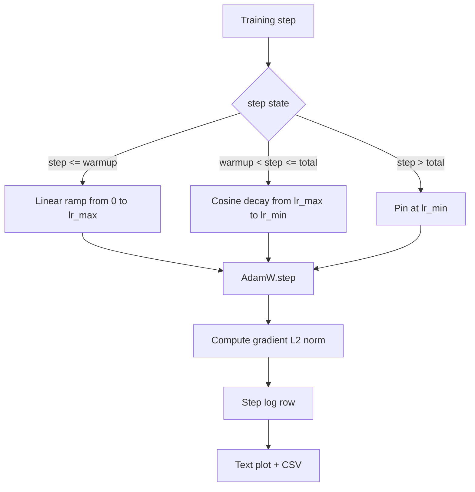

# Cosine LR with Linear Warmup

> 学习率调度是仅次于 loss function 的第二重要决策。带 cosine decay 和 linear warmup 的 AdamW 是现代语言模型训练默认选择，因为它让模型在脆弱的最初一千次更新里看到较小的有效步长，随后升到配置的峰值，再平滑衰减回接近零。本课构建这个 schedule，按训练步数绘制曲线，把 gradient norms 与 schedule 一起记录，并证明 schedule 遵守 warmup、peak 和 decay 边界。

**Type:** Build
**Languages:** Python
**Prerequisites:** Phase 19 lessons 30-37
**Time:** ~90 minutes

## Learning Objectives

- 实现接入 cosine learning-rate schedule 与 linear warmup 的 AdamW optimizer。
- 在任意 step 精确计算 schedule 值，避免跨 run 的 floating-point drift。
- 把 gradient L2 norm 与 learning rate 并排记录，使训练健康状态可观测。
- 把 schedule 渲染成肉眼可读的 text plot，以及任何工具都能消费的 CSV。

## The Problem

最初一千次训练更新最吵。模型权重仍接近初始化。optimizer 的 running second-moment estimate 尚未稳定。gradient norm 大且嘈杂。如果这些更新期间 learning rate 已在峰值，模型要么直接发散，要么落入永远逃不出的 loss plateau。两个众所周知的修复是 gradient clipping，也就是 Phase 19 lesson 45 的主题，以及从小值开始并逐步升高的 learning-rate schedule。

cosine-with-warmup schedule 有三个区域。从 step zero 到 `warmup_steps`，learning rate 线性从零升到配置峰值 `lr_max`。从 `warmup_steps` 到 `total_steps`，learning rate 走余弦曲线的上半段，从 `lr_max` 衰减到 `lr_min`。超过 `total_steps` 后 learning rate 固定在 `lr_min`，这样配置错误、跑过头的 trainer 不会悄悄离开 schedule。

构建难点是 schedules 很容易 off by one。这个 off-by-one 会在六小时训练后表现为模型开始 overfit 那一刻 learning rate 高或低了 1 percent；除非在边界处穷尽测试，否则看不见。

## The Concept



### Warmup formula

对 `step` in `[0, warmup_steps]` 且 `warmup_steps > 0`，learning rate 是 `lr_max * step / warmup_steps`。退化的 `warmup_steps = 0` 被视为 “no warmup”：schedule 在 step zero 直接从 `lr_max` 开始，并立刻进入 cosine decay。一些 test harness 会传入 `warmup_steps = 0`，检查 schedule 仍能产出可用曲线。

### Cosine formula

对 `step` in `(warmup_steps, total_steps]`，learning rate 是 `lr_min + 0.5 * (lr_max - lr_min) * (1 + cos(pi * progress))`，其中 `progress = (step - warmup_steps) / max(1, total_steps - warmup_steps)`。在 `step = warmup_steps`，cosine 为 `cos(0) = 1`，得到 `lr_max`，精确匹配 warmup endpoint。在 `step = total_steps`，cosine 为 `cos(pi) = -1`，得到 `lr_min`，精确匹配 decay endpoint。

两个端点连续不是偶然。这正是 schedule 被实现为 `step` 上的单个函数，而不是三个粘起来的函数的原因。粘起来的 schedule 在第一次修改 `lr_max` 时就会丢掉一个边界。

### Floor after total steps

对 `step > total_steps`，learning rate 保持 `lr_min`。契约明确：schedule 不报错、不外推；它固定在 floor，让 trainer 记录 warning。需要延长训练的 trainer 应修改 schedule 的 `total_steps`，而不是修改 loop。

### Gradient norm logging alongside the rate

schedule 是训练健康的一半，gradient norm 是另一半。training loop 每步同时记录两者。发散的 training run 会先出现 gradient norm spike，然后 loss 才动；调好的 warmup 会让 norm 随 rate 近似线性上升；过激的 peak 会表现为 warmup 后 norm 仍然很高。磁盘上的数据集是 `step, lr, grad_l2_norm, loss`。CSV 是唯一持久记录。

## Build It

`code/main.py` 实现：

- `CosineWithWarmup`：一个无状态函数 `lr(step) -> float`，定义在配置好的 schedule 上。
- `TrainState`：把 model、`AdamW` optimizer 和 schedule 包成一个 step function。
- `TrainState.step`：运行一次 forward、一次 backward，记录 gradient L2 norm，并把 `lr(step)` 应用到 optimizer。
- `plot_schedule_ascii`：把 schedule 渲染为肉眼可读的 text plot。
- `write_schedule_csv`：按每个 step 输出 learning rate 行。

文件底部 demo 构建一个 tiny `nn.Linear` model，在固定 input batch 上训练 20 steps，并打印每步 learning rate、gradient norm 和 loss。schedule 也会被渲染成 text plot 用于视觉 sanity check。

Run it:

```bash
python3 code/main.py
```

脚本以 0 退出，并打印逐步 training log 和 schedule plot。

## Production Patterns

四个模式把 schedule 提升为生产 artifact。

**Schedule lives in a config, not in code.** trainer 从提交到 git 的 YAML 或 JSON config 读取 `warmup_steps`、`total_steps`、`lr_max`、`lr_min`。schedule 可复现，因为 config 是 content-addressed；schedule 可审计，因为 config 是 PR diff 的一部分。

**Step counter is monotonic and decoupled from epochs.** dataset 被 sharded 或 dataloader 重启时，一些框架会混淆 step 和 epoch。schedule 从 trainer checkpoint 读取 `global_step`，而不是本地 counter。resumed run 能继续在正确 schedule 位置，因为 step counter 是持久轴。

**Schedule plot in the run directory.** 每个 training run 都把 `outputs/lr_schedule.png`，本课中是 text plot，写入 run directory。评审扫一眼目录即可 sanity-check schedule，无需重跑任何东西。这能在 PR time 抓住 misconfigured-schedule 类 bug。

**Log row schema is fixed.** `step, lr, grad_l2_norm, loss`，顺序固定。下游 notebook 或 dashboard 读取该 schema；不 bump version 就重命名 column，会让现有 dashboard 全部失效。

## Use It

Production patterns:

- **Sweep peak before sweeping anything else.** `lr_max` 是最敏感旋钮。先在小模型上 sweep；最优 `lr_max` 与模型大小弱相关，所以 small-model sweep 是强先验。
- **Warmup is a fraction of total steps, not an absolute count.** 200-million-step run 用 2,000 warmup steps 几乎立刻到 peak；20,000-step run 用同样数量则 warmup 10 percent。把 warmup 配成比例，典型 1-3 percent，让 schedule 随训练时长缩放。
- **`lr_min` is non-zero on purpose.** 取 `lr_max` 10 percent 的 floor 会让 optimizer 在长尾中继续学习。`lr_min = 0` 的 schedule 会给出图上很好看的 training curve，但模型实际上还没训练完。

## Ship It

`outputs/skill-cosine-warmup.md` 在真实项目中会说明哪个 config 承载 schedule、global counter 从 trainer 的哪个 step 读取，以及哪次 `lr_max` sweep 产出了部署值。本课交付 engine。

## Exercises

1. 添加 schedule 的 inverse-square-root variant，并在 200-step toy training run 上比较。哪条曲线产出更低 final loss？
2. 添加 `--restart` flag，在 `total_steps / 2` 处加入第二次 warmup。说明 warm restarts 在 toy run 上改善还是伤害。
3. 添加一个 unit test 验证 schedule 连续：对 `[0, total_steps]` 中每个 step，差值 `|lr(step+1) - lr(step)|` 被 `lr_max / warmup_steps` 限定。
4. 把 schedule 接入 `torch.optim.lr_scheduler.LambdaLR`，让它与 framework code 组合。本课使用 plain step function；wrapper 改变了什么？
5. 添加 `--plot-png` flag，通过 `matplotlib` 写真实 plot。说明本课 text plot 或 PNG 哪个更适合 CI runs 默认值。

## Key Terms

| Term | What people say | What it actually means |
|------|-----------------|------------------------|
| Warmup | “Slow start” | 在前 `warmup_steps` 次更新里，从零到 `lr_max` 的 linear ramp |
| Cosine decay | “Smooth drop” | 在剩余 steps 上，从 `lr_max` 到 `lr_min` 的上半余弦曲线 |
| Floor | “After training” | 超过 `total_steps` 后 schedule 固定的 `lr_min` 值 |
| Gradient norm | “L2 of grads” | 拼接后的 gradient vector 的 Euclidean norm，每步记录 |
| Global step | “Schedule axis” | 可跨 restart 存活并驱动 schedule 的单调 step counter |

## Further Reading

- [Loshchilov and Hutter, SGDR: Stochastic Gradient Descent with Warm Restarts (arXiv 1608.03983)](https://arxiv.org/abs/1608.03983)：cosine schedule 的 reference paper。
- [Loshchilov and Hutter, Decoupled Weight Decay Regularization (arXiv 1711.05101)](https://arxiv.org/abs/1711.05101)：AdamW 的 reference paper。
- [PyTorch torch.optim.lr_scheduler](https://docs.pytorch.org/docs/stable/optim.html#how-to-adjust-learning-rate)：step functions 如何与 framework schedulers 组合。
- Phase 19 · 42：该 schedule 消费的 downloader corpus。
- Phase 19 · 43：与该 schedule 共同演化的 dataloader。
- Phase 19 · 45：gradient clipping 和 AMP，loop 的下一层。
